# 向上写 12- THM 螺栓

> 原文：<https://infosecwriteups.com/write-up-12-thm-bolt-604ac90b7ba8?source=collection_archive---------0----------------------->

## 学习使用远程代码执行来利用易受攻击的 CMS(内容管理系统)

《闪电狗》这部动画电影的主角

## 使用远程代码执行利用 CMS

这篇文章基于 TryHackMe 平台上的房间“Bolt”。这是一个初学者级别的房间，CMS 版本中的一个漏洞被利用来获得目标机器上的根用户访问权限。

## 先决条件

推荐以下的知识来解决这个棘手的挑战 [**工具**](https://medium.com/@anon_7/write-up-07-tryhackme-toolsrus-6dfd8448e868) 非常好用，可以在解决任务的时候搜索。

1.  Nmap
2.  Searchsploit
3.  利用数据库
4.  Metasploit
5.  [基本 Linux 命令](https://medium.com/bugbountywriteup/write-up-10-tryhackme-linux-challenges-74408715ece4)

> 我强烈建议你们先试着自己解决这些任务，如果你遇到困难，你可以参考这篇文章。

## [入门](https://medium.com/@anon_7/getting-started-with-tryhackme-52f2cc7eb9aa)

导航到 THM 上的房间“ [**螺栓**](https://tryhackme.com/room/bolt) ”。部署机器并使用 OpenVPN 连接到 THM 网络。在终端上使用 ifconfig 命令检查 tun0 或 tun1 接口，确认您已连接到 THM 网络

## 黑进机器

让我们对目标机器运行一次 Nmap 扫描，看看哪些端口是打开的，哪些类型的服务正在这些端口上运行

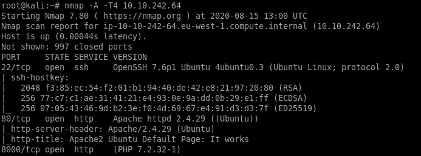

对目标计算机进行 Nmap 扫描

正如我们从上面的 Nmap 扫描中看到的，三个端口当前是打开的。让我们逐一探讨这些问题。我们看到一个 web 服务器在端口 80 上运行。导航到目标机器 IP，我们看到下面的页面。我们在这一页上没有发现什么有趣的东西。

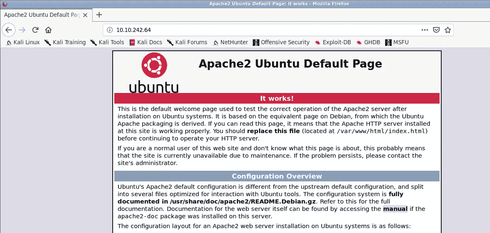

在端口 80 上运行的 web 服务器

让我们试试端口 8000，因为它也运行某种 web 应用程序

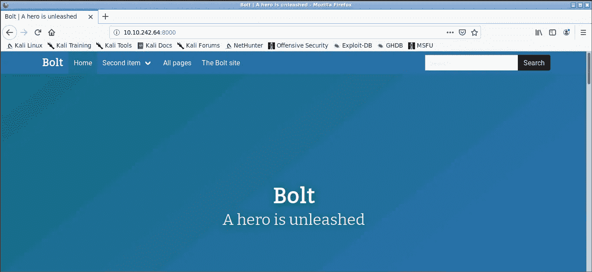

螺栓 CMS

从上面的截图中，我们可以看到一个 CMS 正在端口 8000 上运行。让我们探索一下，导航到不同的选项卡，看看我们是否能找到一些有趣的东西。所以我们找到了一个在即将到来的任务中可能有用的用户名。

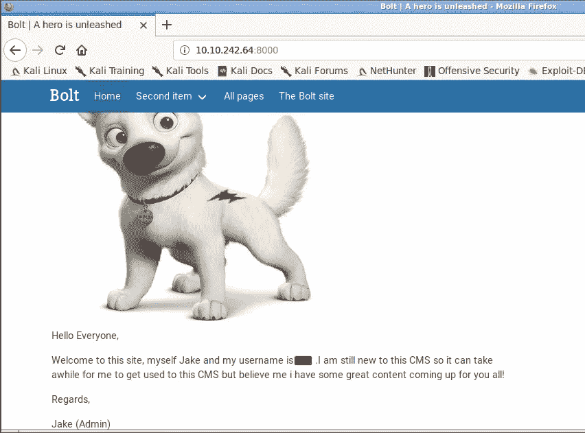

找到用户名

再往前走一点，我们找到了密码。说真的吗杰克？？？在网站上张贴密码的人。杰克最终可能会因此丢掉工作。不管怎样，让我们继续前进

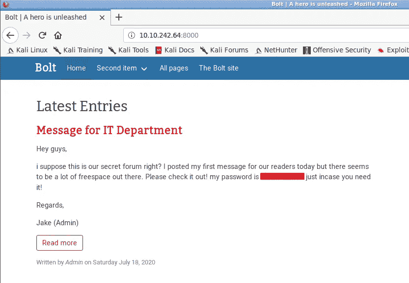

找到密码

我们需要找到螺栓 cms 版本，以便我们可以找到一个漏洞相关的漏洞版本。为此我打算使用谷歌，搜索 bolt cms 门户我找到了一个链接，在那里我可以得到登录门户。所有你需要做的是追加“bolt”一词与你的目标 IP 和端口，如下所示。我们会得到一个博尔特 cms 登录页面。记得我们找到了用户名和密码，这是由杰克不小心张贴在网站上，我们将使用这些凭据登录

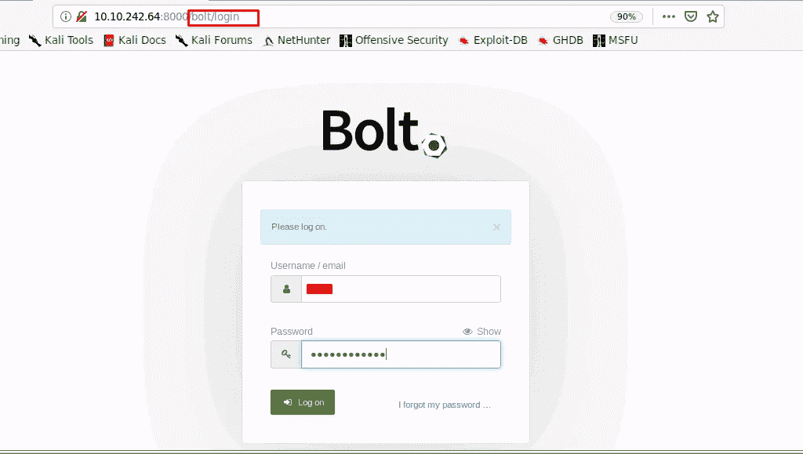

BOLT CMS 登录门户

只要我们输入凭据，我们欢迎与下面看到的页面。在这里，我们可以找到 CMS 版本在页面的左下方

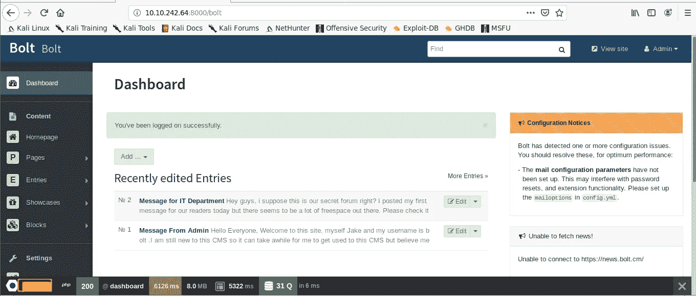

已登录 Bolt CMS

接下来，我们需要为 Bolt CMS 的前一个版本找到 EDB(漏洞利用-数据库 ID)。您可以使用搜索利用或利用数据库来找出答案。

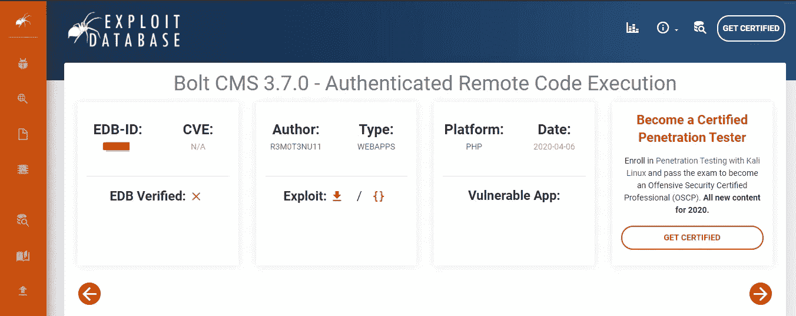

EDB–Bolt CMS 3 . 7 . 0 的 ID

是时候利用我们刚刚发现的 BOLT cms 的当前版本了。为此，我们将使用 Metasploit。启动 Metasploit 并搜索 bolt。正如我们在下面所看到的，一个与 BOLT 认证的 RCE 相关的漏洞是可用的。通过输入命令 use 1 选择此漏洞利用。

> 注意:如果你在 Metasploit 中没有看到这个漏洞，你需要更新它

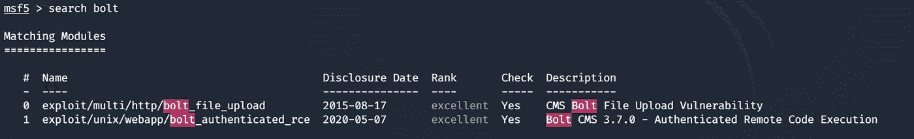

发现 Bolt CMS 漏洞

您需要设置目标计算机 IP 地址、端口编号、用户名、密码和本地主机 IP 地址等参数，如下所示

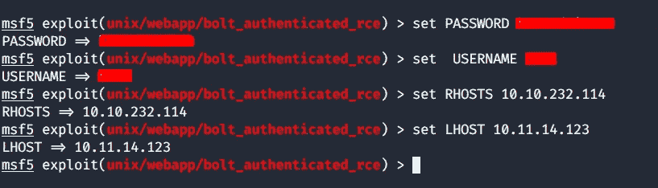

设置利用漏洞的参数

成功设置所有必需参数后。利用**跑**或**剥削**执行剥削。一段时间后，您将可以访问目标计算机，如下所示。输入命令 id 以检查您的权限级别，如下所示，我们已获得以 root 用户身份访问目标计算机的权限。

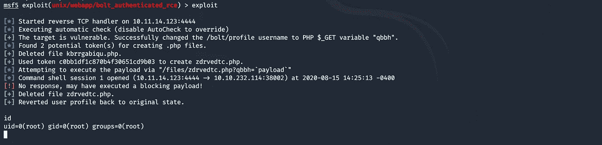

外壳弹出，获得根访问权限

> 注:如果第一次尝试失败，也不要沮丧。试着多次运行它。检查您的 THM 网络，刷新连接，然后尝试再次运行该漏洞利用

现在我们有了对目标机器的根访问权，让我们来找到我们的标志。导航到主目录，我们发现我们的标志如下所示。

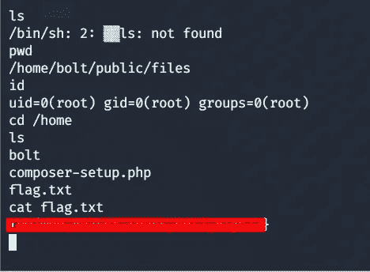

找到标志

我们的挑战任务到此结束。我希望这篇文章对你们有所帮助。有关更多的开发技术和工具，您可以在[导航到这里](https://medium.com/bugbountywriteup/write-up-04-tryhackme-blue-e3e58268ca22)

## 关于我

我是一个网络安全爱好者，正在攻读信息安全硕士学位，并试图进入一个全职的网络安全职业。你可以在这里继续进行更多的总结和演练