# 推荐:通过加密绕过认证 oracle @ PortSwigger Academy

> 原文：<https://infosecwriteups.com/write-up-authentication-bypass-via-encryption-oracle-portswigger-academy-4b4e363347b9?source=collection_archive---------8----------------------->

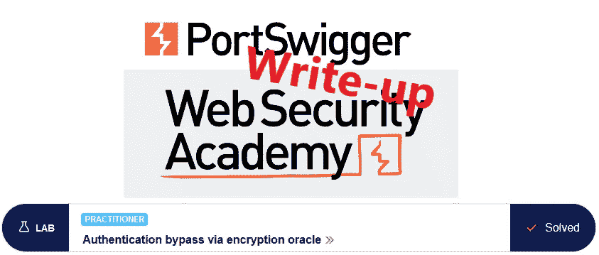

这篇关于通过加密 oracle 绕过实验室*认证的文章是我为 [PortSwigger 的 Web 安全学院](https://portswigger.net/web-security)准备的演练系列的一部分。*

**学习路径**:服务器端主题→业务逻辑漏洞

 [## 实验室:通过加密绕过身份验证 oracle | Web Security Academy

### 本实验室包含一个逻辑缺陷，该缺陷向用户暴露了一个加密 oracle。为了解决实验室，利用这个漏洞获得…

portswigger.net](https://portswigger.net/web-security/logic-flaws/examples/lab-logic-flaws-authentication-bypass-via-encryption-oracle) 

Python 脚本: [script.py](https://github.com/frank-leitner/portswigger-websecurity-academy/blob/main/05_business_logic_vulnerabilities/Authentication_bypass_via_encryption_oracle/script.py)

# 实验室描述

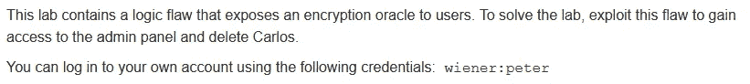

# 步伐

通常，第一步是分析实验室应用程序的功能。在这个实验室中，它是一个博客网站。

## 发表评论

这种分析的一部分是发表评论。我摆弄一些参数，混合有效和无效的电子邮件和网站内容。

网站参数通过客户端 javascript 进行检查，这可以绕过，但不会导致任何有趣的事情。

对于电子邮件参数，情况就不同了:

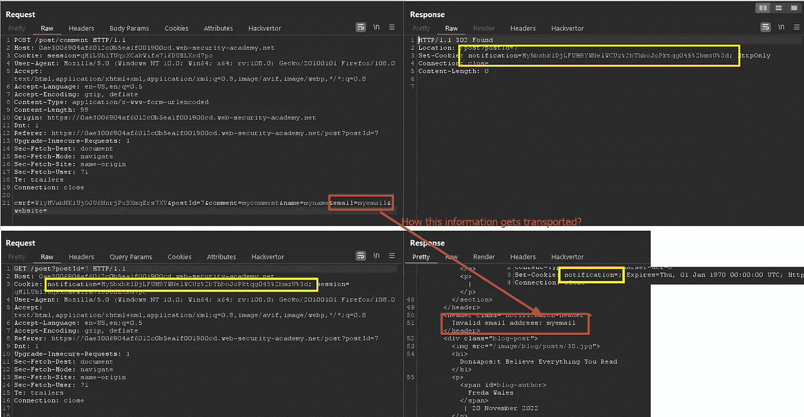

用无效地址发布评论会导致相应的错误消息。有趣的是，错误并没有显示在对`POST`请求的即时响应中。

`POST`导致一个重定向，该重定向又包含错误消息，该错误消息在其响应中包含我的参数。因为这是一个独立的请求，所以需要传输该信息。响应设置了一个名为`notification`的 cookie，看起来像这辆运输车辆。它在第二个请求中也是未设置的。

cookie 的内容看起来是 URL 和 base64 编码的，但是简单的解码不会产生任何清晰的内容。

我暂时把它放在一边，继续分析。

## 登录

公共区域没有显示任何其他有趣的内容，所以我使用提供的凭证登录。

登录表单提供了保持登录的选项。如果设置了该选项，则会设置一个`stay-logged-in` cookie:

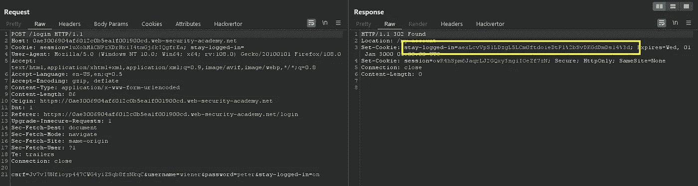

关于这个 cookie，一个引人注目的细节是它的内容与上面的`notification` cookie 非常相似。这两者看起来都是 URL 和 base64 编码的，但是看不出任何清晰的内容。

## 复制 cookie 内容

在我发表评论的过程中，我猜想`notification` cookie 包含了错误信息，该错误信息在第二个响应中被转换为错误消息。那么，如果我使用`stay-logged-in` cookie 的内容会发生什么呢？

只有一个办法可以知道。我从我的评论尝试发送第二个请求，打嗝重复，并用我的`stay-logged-in` cookie 的内容替换`notification` cookie 的内容:

它显示了两件有趣的事情:

*   这两种 cookies 受到相同的保护
*   `stay-logged-in` cookie 包含用户信息和一个看起来像时间戳的数字，在我的例子中是几分钟前的，对应于我的登录时间

为了模拟管理员，我需要获得加密字符串`administrator:1671277761824`来为管理用户伪造一个`stay-logged-in` cookie。

## 理论化

我在电子邮件字段中放入的任何内容都将像`stay-logged-in` cookie 一样被加密。不幸的是，服务器在它前面添加了一个描述性的错误信息，在本例中，`Invalid email` address:`。

如果我找到了避免这种情况或者从`notification` cookie 中去除这条消息的方法，我就可以为任何用户伪造一个`stay-logged-in` cookie，包括`administrator`。

我注意到加密的`stay-logged-in` cookie 的长度与`email`参数的长度没有直接关系。在 urldecoding 之后，cookie 的长度为 44 字节，而不管电子邮件是`myEmail`还是仅仅是`my`。这表明使用了分组密码。

一个好的加密密码将确保明文和密文之间没有可观察到的关系。明文稍有变化，密文就会有显著变化。这被称为[扩散](https://en.wikipedia.org/wiki/Confusion_and_diffusion)，通过使用一些随机初始化向量(IV)在(体面的)分组密码中很常见。

这里使用的密码似乎没有这个属性。在这两种情况下，明文和密文都以相同的字符开始。不同的字符之后似乎不会影响第一部分:

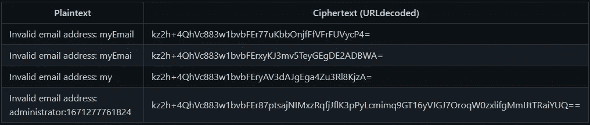

为了更好地理解该结构，我需要对该字符串进行 base64 解码，并查看十六进制表示:

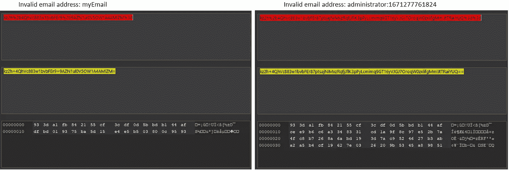

两件事显而易见:

*   该密码使用 16 字节的块大小。基于以上图像，32 字节也是可能的。不过这很不寻常，仅使用`administrator`作为电子邮件参数显示使用了三行，并确认 16 字节为块大小。
*   在每个块内，发生一些扩散。第二个块的每个字节都不同，而错误消息的最后 7 个字节是静态的。

我删除了完整的第一个代码块并重新编码，首先是 base64——然后是 urlencoding:

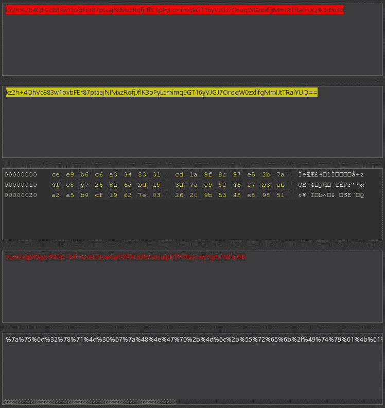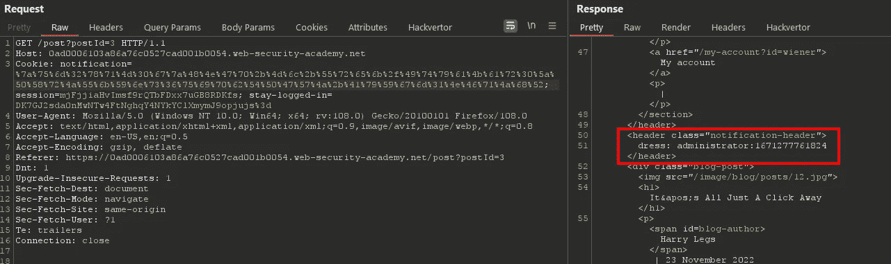

结果令人满意，字符串的前 16 个字节丢失，解密成功。

## 纠正填充

到现在为止，我知道我可以删除一整块密文，而不会对后面的块产生负面影响。第二个块中有 7 个字节的错误消息:`dress:` 。我不能简单地从第二个块中删除这 7 个字节，因为这违反了块的完整性:

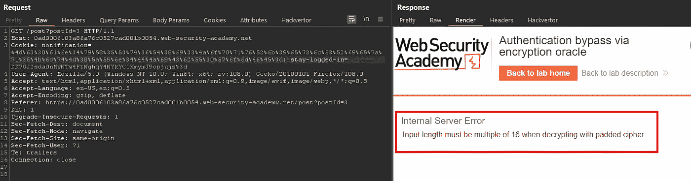

但是，如果我在我想要的明文前面再添加 9 个字节，那么它将完全填满第二个 16 字节块，我的明文将从第三个块的开头开始。

我将`123456789administrator:1671277761824`作为电子邮件发送到我在打嗝中继器中的加密方法:

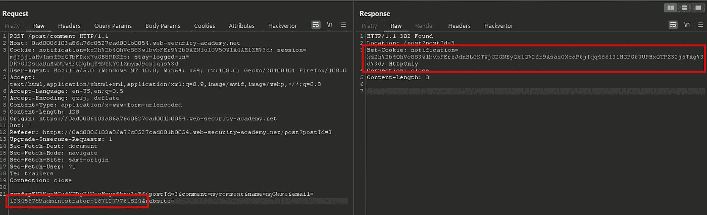

我将 cookie valid 发送给解码器，对其进行 URL 和 base64 解码，并删除十六进制表示的前两个块(32 字节):

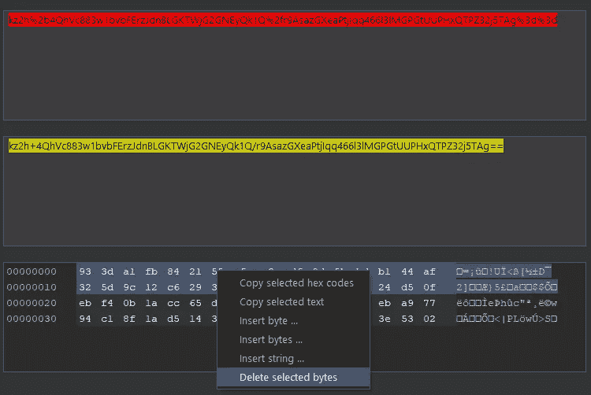

结果我再次重新编码，并在我的解密器中使用了`notification` cookie 的内容:

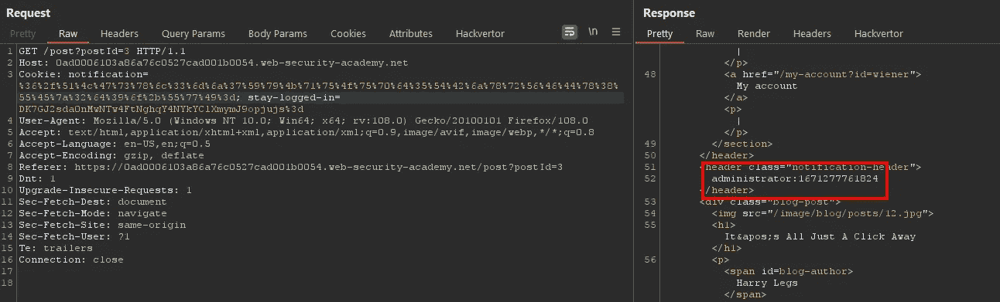

它解密成我想要的字符串。

## 以管理员身份登录

我使用 cookie 编辑器更改浏览器中的`stay-logged-in` cookie:

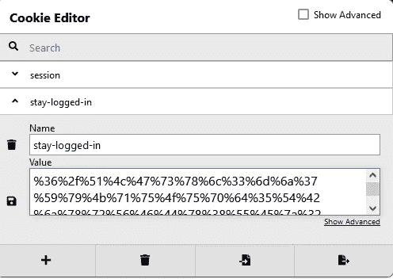

该会话似乎也包含用户信息，并且优先于`stay-logged-in` cookie。我完全删除了会话 cookie 并刷新了页面:

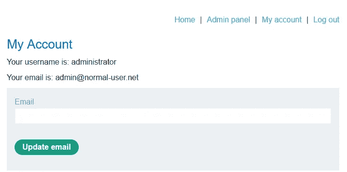

我转到`Admin panel`删除用户`carlos`，实验室更新为

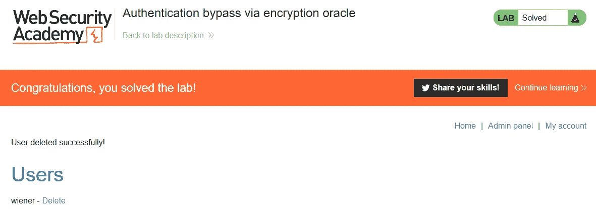

*最初发表于*[*https://github.com*](https://github.com/frank-leitner/portswigger-websecurity-academy/tree/main/05_business_logic_vulnerabilities/Authentication_bypass_via_encryption_oracle)*。*

`[New to Medium? Become a Medium member to access all stories on the platform and support me at no extra cost for you!](https://medium.com/@frank.leitner/membership)`

## 来自 Infosec 的报道:Infosec 每天都有很多内容，很难跟上。[加入我们的每周简讯](https://weekly.infosecwriteups.com/)以 5 篇文章、4 条线索、3 个视频、2 个 GitHub Repos 和工具以及 1 个工作提醒的形式免费获取所有最新的 Infosec 趋势！