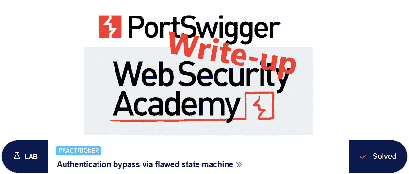
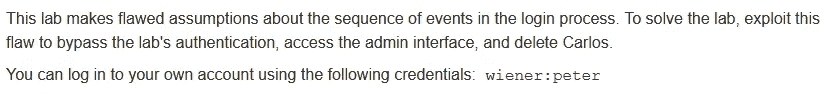
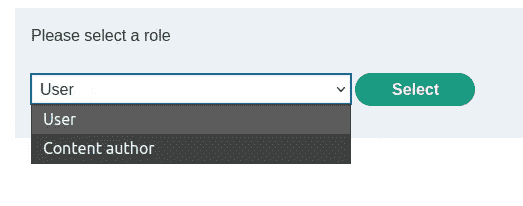
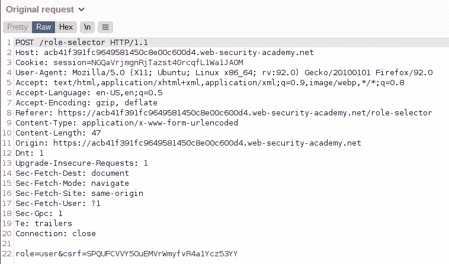
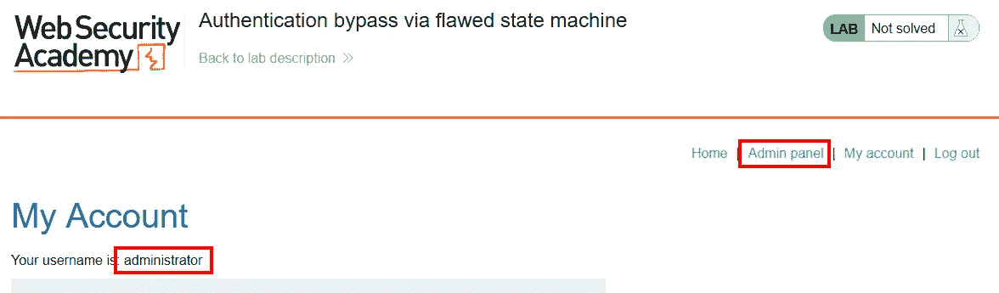
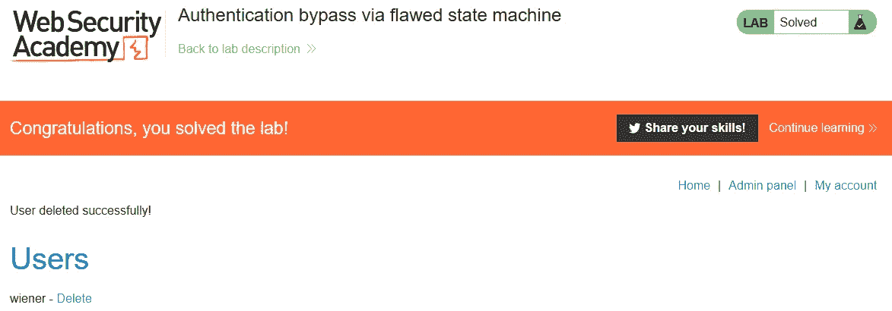

# 书面陈述:通过有缺陷的状态机@ PortSwigger Academy 绕过身份验证

> 原文：<https://infosecwriteups.com/write-up-authentication-bypass-via-flawed-state-machine-portswigger-academy-e7448edeeb3d?source=collection_archive---------6----------------------->

这篇关于通过有缺陷的状态机绕过实验室*认证的文章是我为 [PortSwigger 的 Web 安全学院](https://portswigger.net/web-security)所做的系列演练的一部分。*

**学习路径**:服务器端主题→业务逻辑漏洞

 [## 实验室:通过有缺陷的状态机绕过认证|网络安全学院

### 练习利用现实目标的弱点。记录你从学徒到专家的进步。看哪里…

portswigger.net](https://portswigger.net/web-security/logic-flaws/examples/lab-logic-flaws-authentication-bypass-via-flawed-state-machine) 

Python 脚本: [script.py](https://github.com/frank-leitner/portswigger-websecurity-academy/blob/main/05_business_logic_vulnerabilities/Authentication_bypass_via_flawed_state_machine/script.py)

# 实验室描述

# 步伐

通常，第一步是分析实验室应用程序的功能。在这个实验室中，它是一个商店网站。环顾四周，我用提供的凭证登录。

立即引起注意的是，登录是一个两阶段的过程。提供用户名和密码后，我可以选择我想登录的角色:

这样的选择确实有意义。它允许拥有更高权限的用户在不需要权限时限制他们的权限。这既减少了日常活动中的攻击面，也降低了犯愚蠢和昂贵错误的风险。至少，如果处理得当的话。为此建立两个专用帐户既容易又不容易出错。

我选择`user`并查看 Burp 代理中的`/role-selector`请求:

# 尝试 1:调整角色

第二个登录阶段包含用户角色。页面上列出了可供我选择的角色。我不知道在邮寄这张表格的过程中是否会进行另一次检查。

如果我将角色更改为“admin”或“administrator ”,会发生什么情况？当然不知道角色名字，但值得一试。

不幸的是，这不会导致任何事情，既不会出错也不会有更多的特权。这表明在处理该帖子时，它会根据允许的角色进行验证，并默认为非管理员角色。

# 尝试 2:放弃请求

说到缺省，如果第二个完整的请求被丢弃会发生什么？常识表明，如果在第二阶段完成之前发出任何请求，会话就会被丢弃。很容易发现。

使用 Burp 代理，我用`wiener:peter`登录，但是将`GET`请求完全丢弃给`/role-selector`。之后，我手动浏览到`/my-account`，看到应用拒绝常识，默认为 admin:

现在，我只需进入管理面板，使用链接删除用户`carlos`。连同删除操作的确认消息，实验室更新为:

*最初发表于*[T5【https://github.com】](https://github.com/frank-leitner/portswigger-websecurity-academy/tree/main/05_business_logic_vulnerabilities/Authentication_bypass_via_flawed_state_machine)*。*

`[New to Medium? Become a Medium member to access all stories on the platform and support me at no extra cost for you!](https://medium.com/@frank.leitner/membership)`

## 来自 Infosec 的报道:Infosec 每天都有很多内容，很难跟上。[加入我们的每周简讯](https://weekly.infosecwriteups.com/)以 5 篇文章、4 个线程、3 个视频、2 个 GitHub Repos 和工具以及 1 个工作提醒的形式免费获取所有最新的 Infosec 趋势！