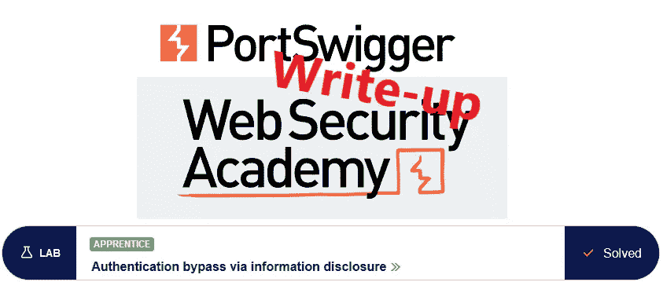
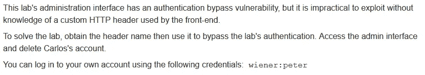
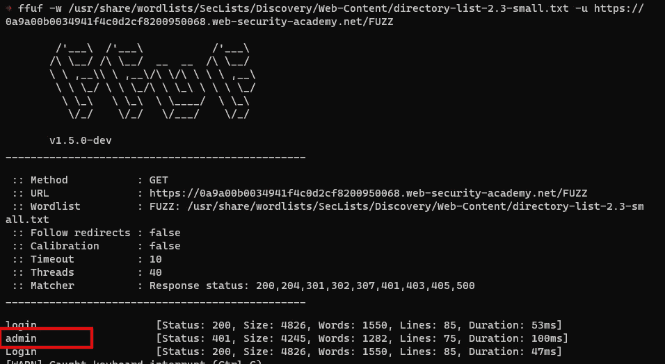
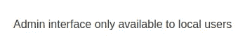
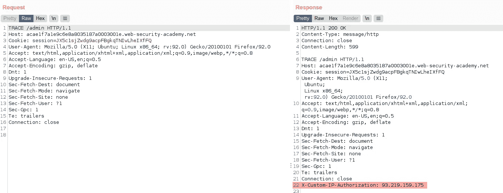
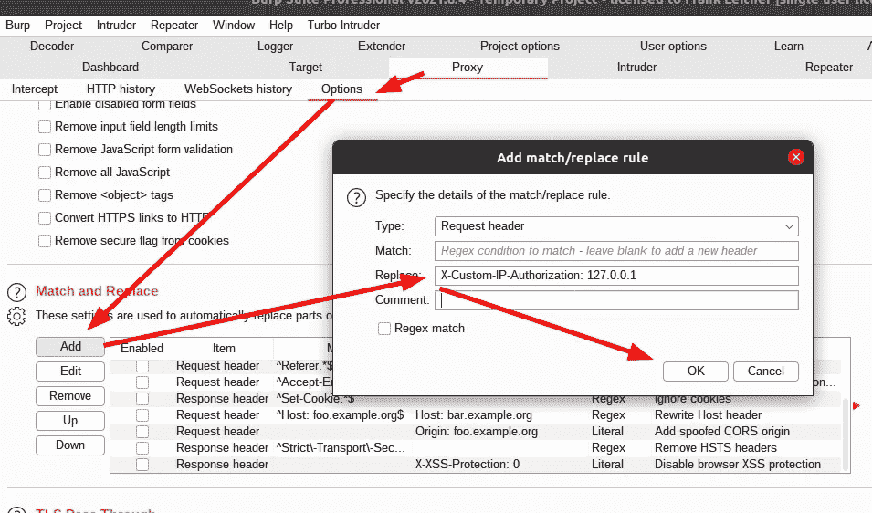
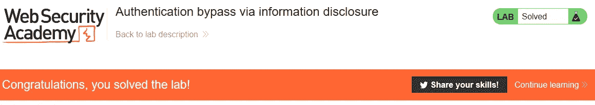

# 推荐:通过信息披露绕过认证@ PortSwigger Academy

> 原文：<https://infosecwriteups.com/write-up-authentication-bypass-via-information-disclosure-portswigger-academy-f3998ded54e?source=collection_archive---------1----------------------->

这篇关于通过信息披露绕过实验室*认证*的文章是我为 [PortSwigger 的 Web 安全学院](https://portswigger.net/web-security)所做的系列演练的一部分。

**学习路径**:服务器端主题→信息披露

 [## 实验室:通过信息披露绕过身份认证|网络安全学院

### 练习利用现实目标的弱点。记录你从学徒到专家的进步。看哪里…

portswigger.net](https://portswigger.net/web-security/information-disclosure/exploiting/lab-infoleak-authentication-bypass) 

Python 脚本: [script.py](https://github.com/frank-leitner/portswigger-websecurity-academy/blob/main/06_information_disclosure/Authentication_bypass_via_information_disclosure/script.py)

# 实验室描述

# 步伐

# 分析

lab 应用程序是一个商店网站，里面有非常有趣的产品。像往常一样，第一步是检查网站。

浏览了一下并用已知的凭证登录后，没有什么有趣的东西出现。该检查打嗝时的请求了。那里也没什么有趣的东西。

在之前的一些实验中，管理端点位于`/admin`下。但是为了避免使用这些知识，我可以使用多种内容发现方法。Burp Professional 附带了这样的功能，并且一些好的免费工具也允许内容发现。

我在这里使用的是 [ffuf](https://github.com/ffuf/ffuf) 和 [SecLists](https://github.com/danielmiessler/SecLists) 提供的大词表:

# 访问端点

我访问这个页面是为了收到这条消息:

没有给出更多信息。

将原始 IP 传播到 web 服务器的一种常见方式(在代理或负载平衡场景中使用)是`X-Forwarded-For`报头。然而，这在这里是行不通的(而且实验室的描述表明它是一个定制的头)。

两个 HTTP 动词可以用来获得附加信息，`OPTIONS`和`TRACE`。后者产生了一个有趣的结果:

# 提供自定义标题

现在我知道了标题，访问管理界面就变得容易了。我需要确保每个请求都发送了自定义标题，所以我添加了一个`Match and Replace`规则，总是将这个新标题添加到请求中。

我使用`127.0.0.1`作为内容来欺骗应用程序，让它相信请求来自`localhost`。

现在只需在浏览器中重新加载页面，访问管理面板并删除用户`carlos`即可解决实验问题:

*原载于【https://github.com】**。***

*`[New to Medium? Become a Medium member to access all stories on the platform and support me at no extra cost for you!](https://medium.com/@frank.leitner/membership)`*

## *来自 Infosec 的报道:Infosec 每天都有很多内容，很难跟上。[加入我们的每周简讯](https://weekly.infosecwriteups.com/)以 5 篇文章、4 个线程、3 个视频、2 个 GitHub Repos 和工具以及 1 个工作提醒的形式免费获取所有最新的 Infosec 趋势！*