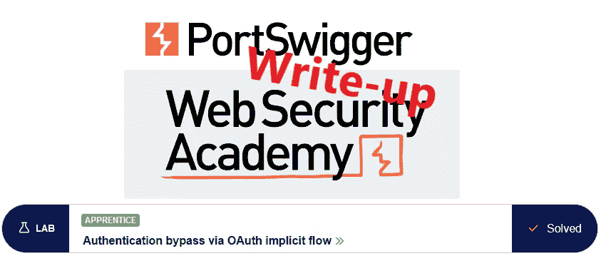
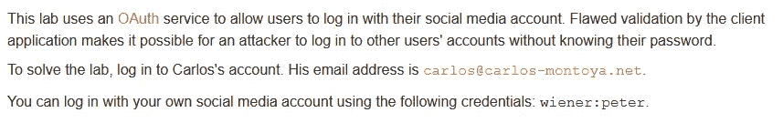
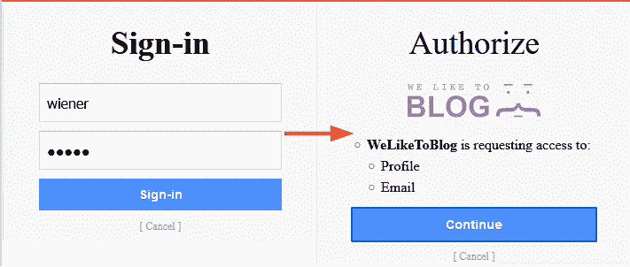
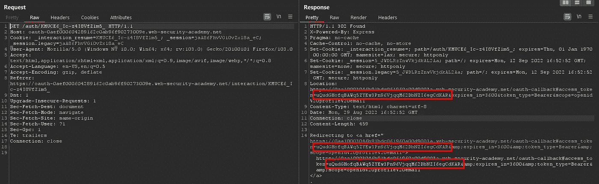
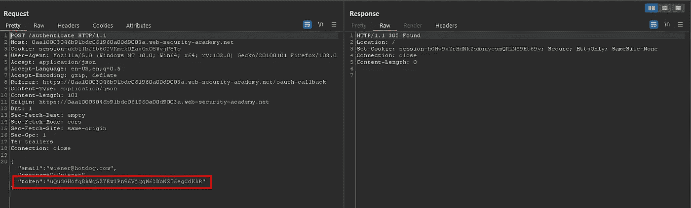
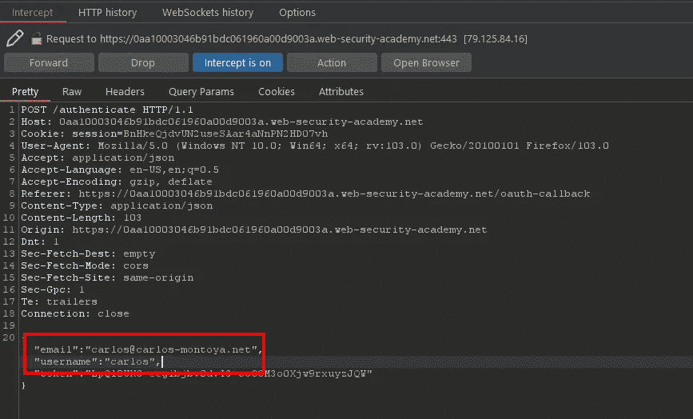
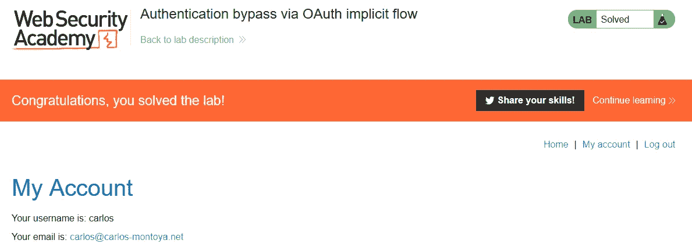

# 推荐:通过 OAuth 隐式流@ PortSwigger Academy 绕过身份验证

> 原文：<https://infosecwriteups.com/write-up-authentication-bypass-via-oauth-implicit-flow-portswigger-academy-c98b841d3d3d?source=collection_archive---------2----------------------->

这篇关于通过 OAuth 隐式流绕过实验室*认证的文章是我在 [PortSwigger 的 Web 安全学院](https://portswigger.net/web-security)的演练系列的一部分。*

**学习路径**:高级主题→ OAuth 认证

 [## 实验室:通过 OAuth 隐式流绕过身份验证|网络安全学院

### 本实验使用 OAuth 服务来允许用户使用其社交媒体帐户登录。有缺陷的验证由…

portswigger.net](https://portswigger.net/web-security/oauth/lab-oauth-authentication-bypass-via-oauth-implicit-flow) 

Python 脚本: [script.py](https://github.com/frank-leitner/portswigger-websecurity-academy/blob/main/22_OAuth_authentication/Authentication_bypass_via_OAuth_implicit_flow/script.py)

# 实验室描述

# 步伐

通常，第一步是分析实验室应用程序的功能。在这个实验室中，它是一个博客系统。

该描述提到了认证功能的访问控制中的一个缺陷，所以我使用已知的凭证`wiener`登录。

登录是通过外部身份提供者完成的。第一步，我登录，第二步，我授权目标应用程序接收我的一些数据:

一旦我点击`Continue`，我就登录到实验室应用程序。

# 该理论

登录后，我在 Burp 代理的历史中检查登录特性的请求/响应活动。

实验室名称已经暗示了 OAuth 的隐式流程。这种方法是不安全的，因为它通过客户端路由安全信息，如果不包含针对操纵的对策，我就可以操纵它。

身份提供者向我发送身份验证令牌，我的客户端使用该令牌向目标应用程序进行身份验证:

如果令牌中没有关于我的用户名的信息，那么使用我的令牌并替换用户名和电子邮件就足以冒充我的受害者。

甚至在 OAuth 2.0 的[原始 RFC](https://datatracker.ietf.org/doc/html/rfc6749#section-1.3.2) 中也提到了安全问题。不幸的是，以一种相当模糊的方式:

> *应权衡便利性和安全影响*

这种措辞不够令人沮丧，所以在最新的草案中，措辞更加强烈和直接:

> *为了避免这些问题，客户不应使用隐性授权[…]*

只有时间会证明这是否足够…

# 恶意负载

我退出应用程序，在 Burp 代理中激活 intercept，然后重新登录。一旦身份验证令牌被拦截，我就更改用户名和电子邮件给我的受害者。

这样，我登录的令牌值将用于受害者的帐户，至少在令牌不包含任何用户名和/或电子邮件信息的情况下是如此:

身份验证请求的操作

我转发请求并关闭拦截。完成所有重定向后，应用程序更新为

*原载于【https://github.com】**。***

*`[New to Medium? Become a Medium member to access all stories on the platform and support me at no extra cost for you!](https://medium.com/@frank.leitner/membership)`*

**来自 Infosec 的报道:每天 Infosec 上都会出现很多难以跟上的内容。* [***加入我们的每周简讯***](https://weekly.infosecwriteups.com/) *以 5 篇文章、4 个线程、3 个视频、2 个 Github Repos 和工具以及 1 个工作提醒的形式免费获取所有最新的 Infosec 趋势！**