# 上书:基础服务器端模板注入(代码上下文)@ PortSwigger Academy

> 原文：<https://infosecwriteups.com/write-up-basic-server-side-template-injection-code-context-portswigger-academy-910a3720c26d?source=collection_archive---------6----------------------->

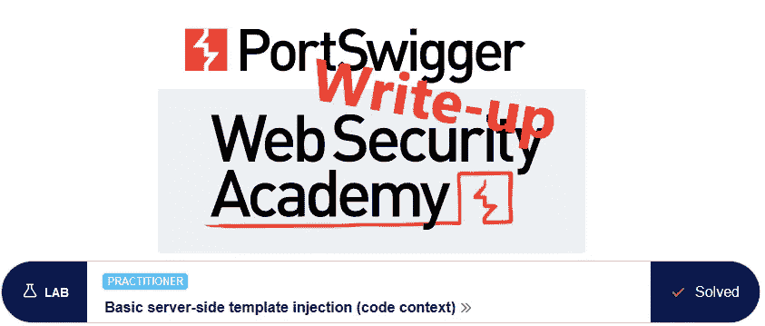

这篇关于实验室*基本服务器端模板注入(代码上下文)*的文章是我为 [PortSwigger 的 Web 安全学院](https://portswigger.net/web-security)所做的系列演练的一部分。

**学习路径**:高级主题→服务器端模板注入

 [## 实验室:基本服务器端模板注入(代码上下文)|网络安全学院

### 练习利用现实目标的弱点。记录你从学徒到专家的进步。看哪里…

portswigger.net](https://portswigger.net/web-security/server-side-template-injection/exploiting/lab-server-side-template-injection-basic-code-context) 

Python 脚本: [script.py](https://github.com/frank-leitner/portswigger-websecurity-academy/blob/main/18_server_side_template_injection/Basic_server-side_template_injection_(code_context)/script.py)

# 实验室描述

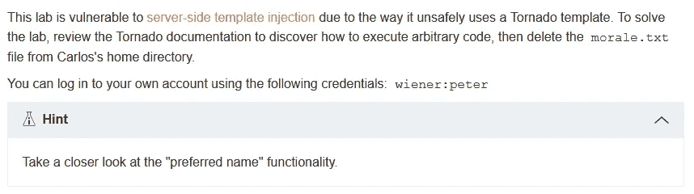

# 步伐

# 分析

通常，第一步是分析实验室应用程序的功能。在这个实验室中，它是一个向我提供凭据的博客网站。

公共页面没有显示任何有趣的内容。当我发表评论时，它会以匿名形式出现，但它似乎不包含我想要的内容。

我继续以`wiener`的身份登录。在我的帐户页面上，我可以更改我的电子邮件并设置一个首选名称。我猜它会在博客上发布内容时用作用户名:

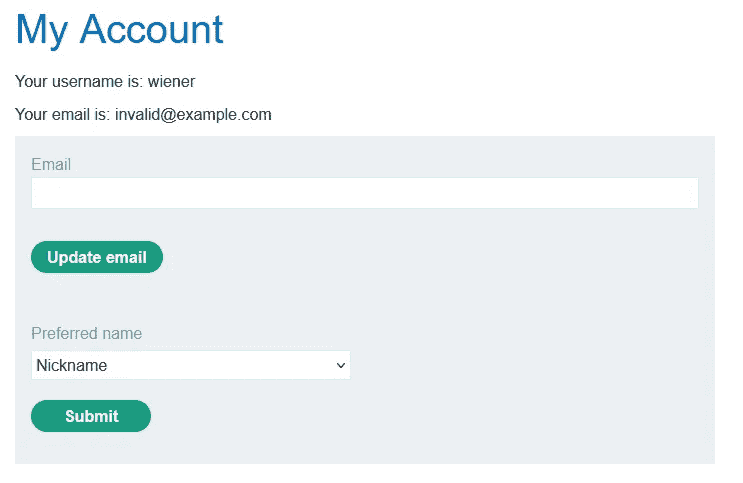

更改电子邮件地址不会带来任何实质性的东西。更改`preferred name`确实会更改发布的评论的名称:

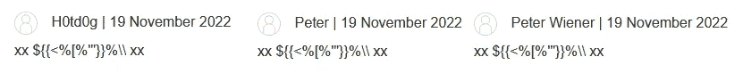

更有趣的是在更改首选名称时发送的请求:

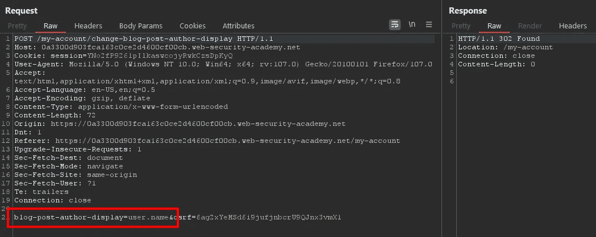

name 参数的值似乎包含了对某个数据结构的引用:`user.name`，或者，对于其他选项，`user.nickname`和`user.first_name`。

一种安全的方法是将客户端提供的值用作查找表中的普通索引，而不是直接使用它。然而，通常情况并非如此。应用了或多或少的净化的输入用于实际逻辑中，可能会造成混乱。

# 该理论

实验室描述提到了 tornado 模板，所以我查看了它的[文档](https://www.tornadoweb.org/en/stable/template.html)。在里面，我找到了一些基本信息:

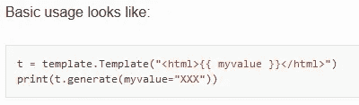

首先，我现在假设关于来自`POST`请求的 name 值的两件事:

1.  它要么根本没有消毒，要么消毒不充分
2.  它直接用在生成 HTML 注释的模板中

如果这些假设为真，那么我将能够通过用`}}`终止模板值并使用`{{own_expression`添加一些自己的表达式来注入自己的代码。关闭`}}`已经到位，所以我不提供他们。

我通过将 POST 请求发送到 Burp Repeater 中，并将显示名称更改为`user.name}}{{2*3`来测试我是否可以调用一个数学运算:

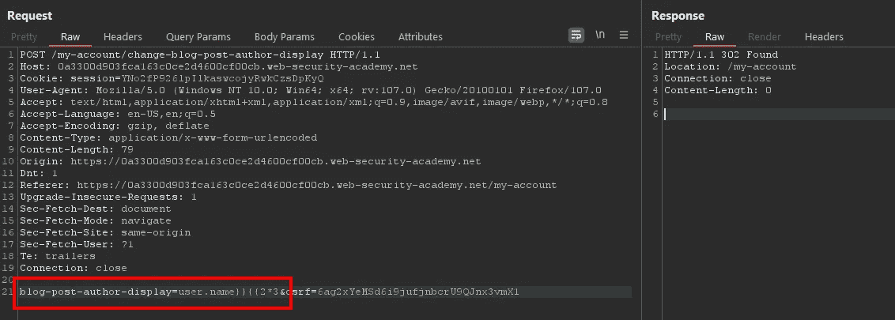

请求通过后，我用我的评论重新加载博客页面。现在的内容是

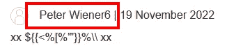

这证实了我可以将表达式注入到模板中。

# 恶意负载

根据文档，`{{own_expression}}`语法只能用于表达式。所以为了包含我自己的代码，比如导入，我需要使用``语法。

我使用上面的数学注入，并在两个表达式之间添加了一个代码块:`user.name}}{{2*3`。这样，它保持语法有效，但在中间执行我的任意代码:

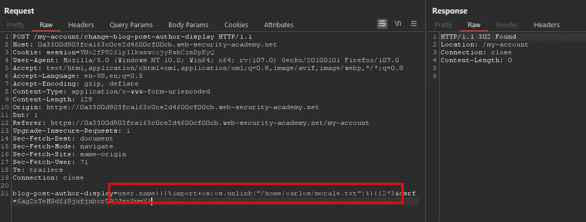

我将评论页面和实验室更新重新加载到

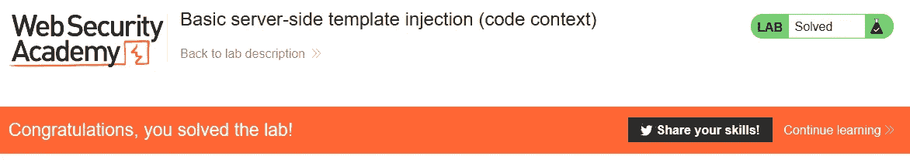

**注意**:如果你在那个页面上发布了多个评论，你仍然可以解决这个实验，但是会收到这个错误:

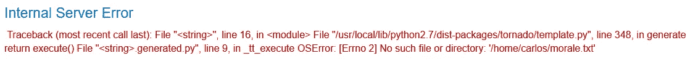

这是意料之中的。第一个注释的 HTML 生成会删除文件，当处理下一个注释时会出错。

*原载于*[*https://github.com*](https://github.com/frank-leitner/portswigger-websecurity-academy/tree/main/18_server_side_template_injection/Basic_server-side_template_injection_%28code_context%29)*。*

`[New to Medium? Become a Medium member to access all stories on the platform and support me at no extra cost for you!](https://medium.com/@frank.leitner/membership)`

## 来自 Infosec 的报道:Infosec 每天都有很多内容，很难跟上。[加入我们的每周简讯](https://weekly.infosecwriteups.com/)以 5 篇文章、4 个线程、3 个视频、2 个 GitHub Repos 和工具以及 1 个工作提醒的形式免费获取所有最新的 Infosec 趋势！