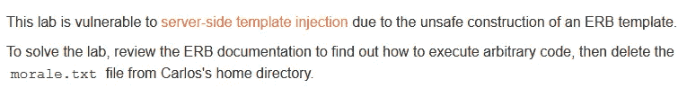
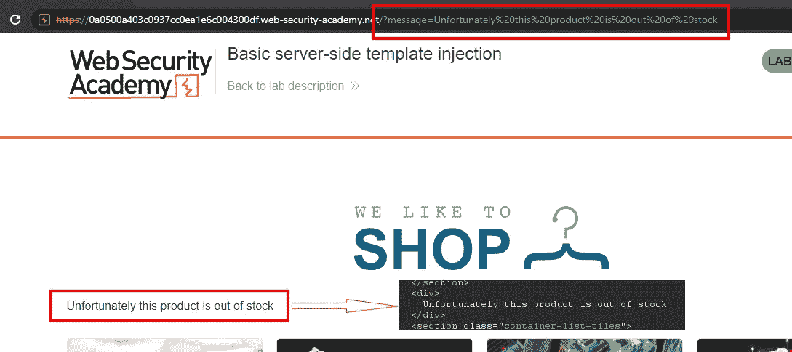
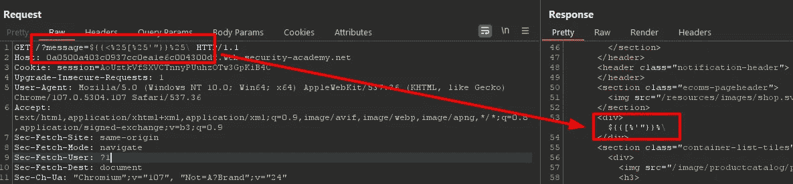
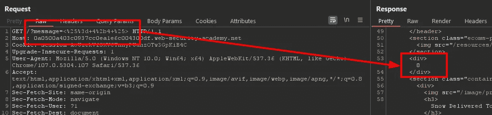
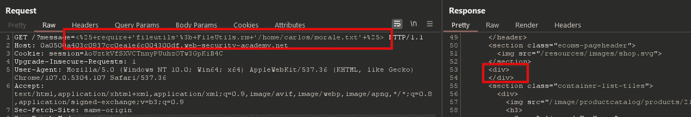

# 撰写:基本服务器端模板注入@ PortSwigger Academy

> 原文：<https://infosecwriteups.com/write-up-basic-server-side-template-injection-portswigger-academy-8e74931c6bd7?source=collection_archive---------5----------------------->

这篇关于实验室*基本服务器端模板注入*的文章是我为 [PortSwigger 的 Web 安全学院](https://portswigger.net/web-security)所做的系列演练的一部分。

**学习路径**:高级主题→服务器端模板注入

 [## 实验室:基本服务器端模板注入|网络安全学院

### 练习利用现实目标的弱点。记录你从学徒到专家的进步。看哪里…

portswigger.net](https://portswigger.net/web-security/server-side-template-injection/exploiting/lab-server-side-template-injection-basic) 

Python 脚本: [script.py](https://github.com/frank-leitner/portswigger-websecurity-academy/blob/main/18_server_side_template_injection/Basic_server-side_template_injection/script.py)

# 实验室描述

# 步伐

## 分析

通常，第一步是分析实验室应用程序的功能。在这个实验室中，它是一个商店网站。

我没有任何凭证，也没有任何登录功能。因此，该漏洞在公共页面上。我浏览了一下，检查了应用程序对 URL 参数的使用。

对于产品细节，`productID`是通过 URL 传递的，应用程序使用它来加载适当的信息。

对于一种产品，我收到了缺货通知。页面上的链接包含普通的`productID`参数。应用程序似乎在检查服务器端的可用性。如果产品缺货，服务器会重定向到主页面，并将相应的消息作为 URL 参数。浏览器随后会请求此页面:

响应包含嵌入在`div`标签中的消息。

## 寻找漏洞

我不知道是否对消息文本进行了任何清理。但是作为 URL 参数的完整消息文本的存在值得仔细观察。

为了执行各种测试，我向打嗝中继器发送了`/?message=`请求。

作为第一项检查，我测试了一条包含各种 urlencoded 特殊字符的消息，这些字符经常在模板`${{<%[%'"}}%\`中使用:

结果显示字符`<%`不包含在响应中。这可能是由于某些清理或服务器上的某些逻辑(如模板引擎)对其进行了评估。

实验室描述引用了 ERB 模板，所以我去查看了 Ruby 模板的文档。

文档说明`<%`和`%>`分别被用作模板表达式的开始和结束。这与我上面的发现一致。

表达式可以用语法`<%= Ruby expression %>`来计算，所以我尝试执行一个简单的数学运算:

响应包含数学结果，而不是消息文本。这表明我可以在服务器上执行任意 ERB 表达式。

## 恶意负载

根据 ERB 的文档，任意的 ruby 代码都可以被`<% Ruby code -- inline with output %>`执行。

我继续搜索文档，直到找到合适的方法来删除文件。

现在我有了制造恶意载荷所需的所有信息。fileutils 模块不是直接可用的，所以我需要先要求它:`<% require 'fileutils'; FileUtils.rm '/home/carlos/morale.txt' %>`

该请求不会导致任何错误。`div`为空，但这是意料之中的，因为`FileUtils.rm`没有返回任何东西。在浏览器中刷新实验室应用程序显示实验室已解决:

# 如何避免这一缺陷

通过在 URL 中不包含消息文本，而是使用 ID 和包含消息的服务器端查找表，可以避免这些问题中的大部分(与任意文本消息相比，清理已知的 ID 格式要容易得多)。

*最初发表于*[*https://github.com*](https://github.com/frank-leitner/portswigger-websecurity-academy/tree/main/18_server_side_template_injection/Basic_server-side_template_injection)*。*

`[New to Medium? Become a Medium member to access all stories on the platform and support me at no extra cost for you!](https://medium.com/@frank.leitner/membership)`

## 来自 Infosec 的报道:Infosec 每天都有很多内容，很难跟上。[加入我们的每周简讯](https://weekly.infosecwriteups.com/)以 5 篇文章、4 个线程、3 个视频、2 个 GitHub Repos 和工具以及 1 个工作提醒的形式免费获取所有最新的 Infosec 趋势！