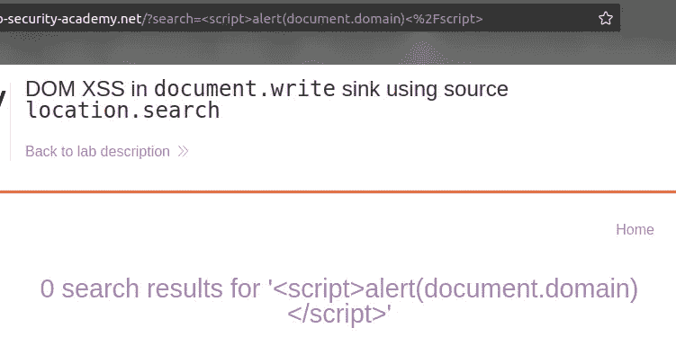
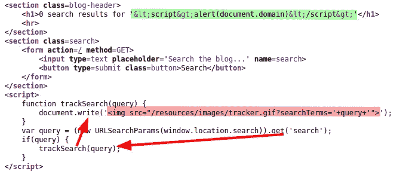
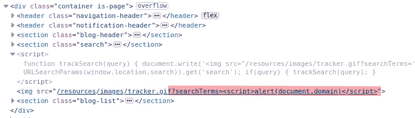
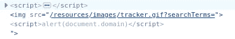
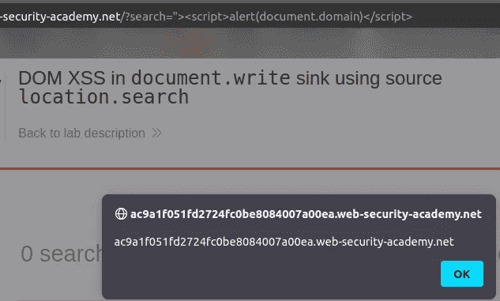
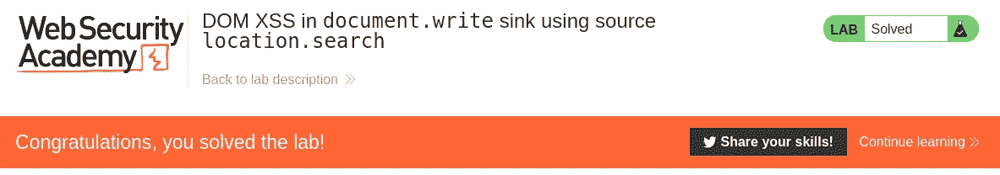
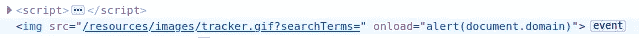

# 特写:文档中的 DOM XSS。使用源位置编写接收器。搜索@ PortSwigger Academy

> 原文：<https://infosecwriteups.com/write-up-dom-xss-in-document-write-sink-using-source-location-search-portswigger-academy-c8e270203773?source=collection_archive---------2----------------------->

这篇关于 document . write sink using source location . search 中的实验室 *DOM XSS 的文章*是我为 [PortSwigger 的 Web 安全学院](https://portswigger.net/web-security)编写的演练系列的一部分。

**学习路径**:客户端主题→跨站点脚本

 [## 实验室:文档中的 DOM XSS。使用源位置编写接收器。搜索|网络安全学院

### 练习利用现实目标的弱点。记录你从学徒到专家的进步。看哪里…

portswigger.net](https://portswigger.net/web-security/cross-site-scripting/dom-based/lab-document-write-sink) 

Python 脚本: [script.py](https://github.com/frank-leitner/portswigger-websecurity-academy/blob/main/11_cross_site_scripting_XSS/DOM_XSS_in_document.write_sink_using_source_location.search/script.py)

# 实验室描述

# 步伐

实验室应用程序是一个具有搜索功能的博客网站。执行搜索后，搜索词将包含在结果页面中。

一个简单的 XSS 尝试失败了:

查看页面源代码，显示的搜索词编码正确。然而，它也显示了 javascript 将搜索词从 URL 中取出，并将其写入 img-tag 以进行某种类型的跟踪:

使用浏览器工具，我可以检查生成的 HTML。可以看出，我的搜索词是在没有任何明显保护措施的情况下嵌入的:

当然，脚本标签在这里是在一个字符串中，所以它们是无害的。但是，如果我可以通过注入双引号来终止字符串，那么我就可以自由地操纵结果 HTML。

# 恶意负载

注入`">`会产生下面的 HTML:

可以看到，我关闭了 src-string 和 img-tag，随后是触发警告框的有效 JavaScript 代码。原始内容的剩余部分`">`显示为纯文本，在此不做干涉:

同时，实验室更新到

# 供选择的

同样的结果可以通过注入`" onload="alert(document.domain)`来实现，它向`img`标签添加了一个属性，并产生了这个 HTML:

*原载于*[*https://github.com*](https://github.com/frank-leitner/portswigger-websecurity-academy/tree/main/11_cross_site_scripting_XSS/DOM_XSS_in_document.write_sink_using_source_location.search)*。*

`[New to Medium? Become a Medium member to access all stories on the platform and support me at no extra cost for you!](https://medium.com/@frank.leitner/membership)`

## 来自 Infosec 的报道:Infosec 每天都有很多内容，很难跟上。[加入我们的每周简讯](https://weekly.infosecwriteups.com/)以 5 篇文章、4 条线索、3 个视频、2 个 GitHub Repos 和工具以及 1 个工作提醒的形式免费获取所有最新的 Infosec 趋势！