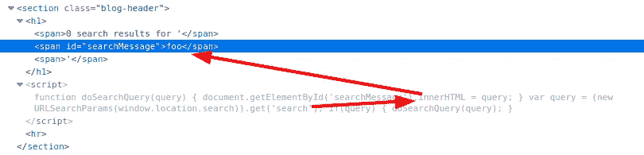
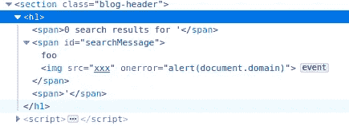

# 特写:使用源位置的 innerHTML 接收器中的 DOM XSS

> 原文：<https://infosecwriteups.com/write-up-dom-xss-in-innerhtml-sink-using-source-location-search-portswigger-academy-94c6691f89b0?source=collection_archive---------4----------------------->

这篇使用 source location.search 为 innerHTML sink 中的实验室 *DOM XSS 撰写的文章*是我为 [PortSwigger 的 Web 安全学院](https://portswigger.net/web-security)撰写的系列演练的一部分。

**学习路径**:客户端主题→跨站点脚本

 [## 实验室:在 innerHTML 接收器中使用源位置的 DOM XSS

### 练习利用现实目标的弱点。记录你从学徒到专家的进步。看哪里…

portswigger.net](https://portswigger.net/web-security/cross-site-scripting/dom-based/lab-innerhtml-sink) 

Python 脚本: [script.py](https://github.com/frank-leitner/portswigger-websecurity-academy/blob/main/11_cross_site_scripting_XSS/DOM_XSS_in_innerHTML_sink_using_source_location.search/script.py)

# 实验室描述

# 步伐

实验室应用程序是一个具有搜索功能的博客网站。搜索词包含在结果页面中。

这不是在服务器端执行的，而是通过使用客户端 JavaScript 执行的:

如果提供了`search`参数，那么`span`元素的`innerHTML`将动态改变。通过使用`foo`作为搜索参数来插入 JavaScript，结果如下:

在页面呈现期间，图像无法加载。这又会引发 JavaScript“警报”框，确认 XSS 漏洞，并将实验室更新为

*原载于*[*https://github.com*](https://github.com/frank-leitner/portswigger-websecurity-academy/tree/main/11_cross_site_scripting_XSS/DOM_XSS_in_innerHTML_sink_using_source_location.search)*。*

`[New to Medium? Become a Medium member to access all stories on the platform and support me at no extra cost for you!](https://medium.com/@frank.leitner/membership)`

## 来自 Infosec 的报道:Infosec 每天都有很多内容，很难跟上。[加入我们的每周简讯](https://weekly.infosecwriteups.com/)以 5 篇文章、4 个线程、3 个视频、2 个 GitHub Repos 和工具以及 1 个工作提醒的形式免费获取所有最新的 Infosec 趋势！