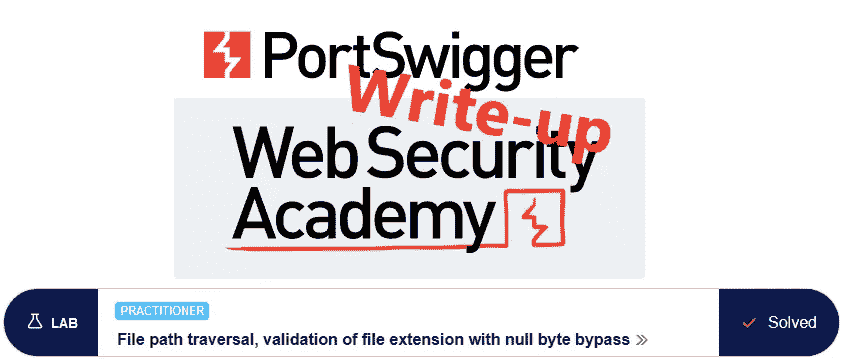
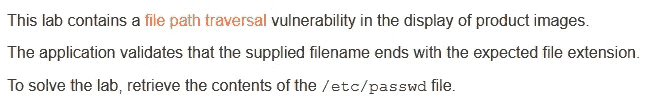
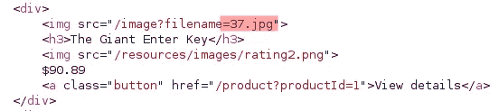
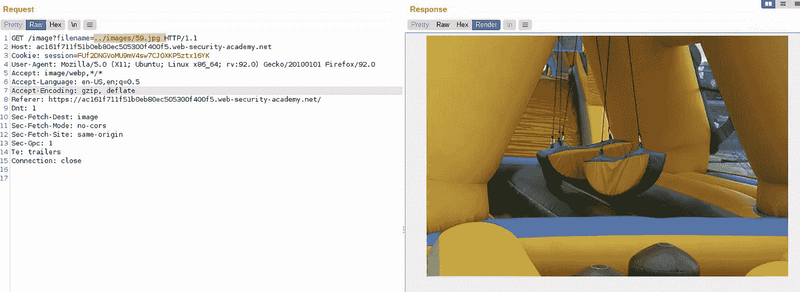
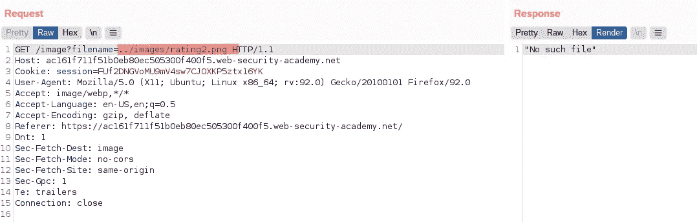
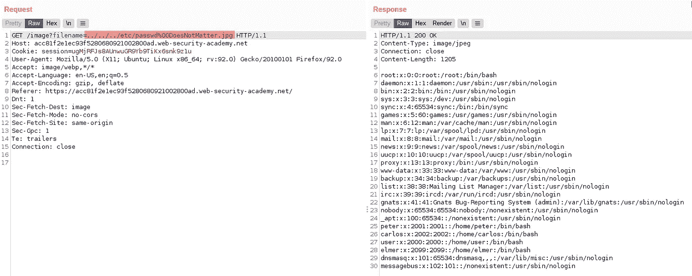

# 向上写:文件路径遍历，用空字节旁路验证文件扩展名

> 原文：<https://infosecwriteups.com/write-up-file-path-traversal-validation-of-file-extension-with-null-byte-bypass-portswigger-801300e13799?source=collection_archive---------1----------------------->

这篇关于实验室*文件路径遍历、带空字节旁路的文件扩展名验证*的文章是我为 [PortSwigger 的 Web 安全学院](https://portswigger.net/web-security)编写的演练系列的一部分。

**学习路径**:服务器端主题→目录遍历

 [## 实验:文件路径遍历，绕过空字节验证文件扩展名|网络安全学院

### 练习利用现实目标的弱点。记录你从学徒到专家的进步。看哪里…

portswigger.net](https://portswigger.net/web-security/file-path-traversal/lab-validate-file-extension-null-byte-bypass) 

Python 脚本: [script.py](https://github.com/frank-leitner/portswigger-websecurity-academy/blob/main/03-directory_traversal/File_path_traversal%2C_validation_of_file_extension_with_null_byte_bypass/script.py)

# 实验室描述

# 步伐

第一步照例是网站的分析。与前面的路径遍历实验一样，这是一个商店网站。该页面再次将产品图像作为文件名引用，这表明可能存在路径遍历漏洞。这里，文件名作为基本文件名提供:

图像文件由文件名引用

下面的评级图使用的是`images`目录。猜测产品图像可能在同一目录中，尝试路径遍历序列是否可行:

测试文件名中的路径遍历顺序

事实上，我可以退出并返回到图像目录。现在对`rating2.png`文件进行同样的尝试:

尝试请求具有不同扩展名的另一个图像

此请求未提供图像。虽然我当然无法知道这两个`images`目录实际上是相同的，但是它给出了文件扩展名被检查的指示(忽略我因为实验室名称而知道的事实)。

这种检查可以通过简单地比较文件名的最后 4 个字符和字符串文字`.jpg`来完成。任何类型的字符串比较都容易受到一个古老问题的影响:字符串的空终止。

# 一些背景

许多像操作系统这样的低级软件都是用 c 语言编写的。在 c 语言中，字符串被定义为后跟一个空字节(二进制中全零的完整字节，或 URLencoding 中的%00)的字符序列。没有办法检查字符串的长度，只能遍历它，直到找到一个空字节。

只要在保留内存区域内找到空字节，就可以找到字符串的长度。例如，如果在 10 个字符的范围内，内容是`ABCD%00`，那么字符串是长度为 4 的`ABCD`。考虑到空字节，使用的内存量总是比可用长度多一个字节。

这导致了大量的错误和漏洞。如果开发人员没有考虑这一额外的字节，它可能会导致读取或写入保留的空间，从而导致各种不良后果，如应用程序崩溃(最好的情况)或任意代码执行(对攻击者来说最好的情况)。

许多低级功能仍然基于 C，所以在找到第一个空字节时终止一个字符串。如果系统的所有组件都同意相同的行为，这不会造成问题(除了无效终止的固有问题之外)。

但是如果组件不同地对待字符串，那么这种不同的行为就可以被利用。

例如，许多更现代的语言有专门的字符串类型，既不要求也不使用空终止。在本例中，我想访问一个文件，因此在某个时候，请求将从应用程序传递到操作系统

# 恶意负载

我需要构建一个满足这些要求的字符串:

*   在应用程序中成功完成文件名检查，在这种情况下以`.jpg`结束
*   包含一个空字节，因此操作系统不会处理完整的文件名
*   结果文件名必须引用`/etc/passwd`

上面我已经建立了基本的路径遍历是可能的。因此，满足要求的有效文件名应该是`../../../etc/passwd%00DoesNotMatter.jpg`

所以我在打嗝时捕捉到一个图像请求，并将其发送给中继器。如果您在 HTTP 历史记录中没有看到它，请检查图像是否在过滤器栏中被过滤掉(默认情况下是隐藏的):

使用空字节绕过路径遍历保护的恶意请求

此时，实验页面更新为

*原载于*[*https://github.com*](https://github.com/frank-leitner/portswigger-websecurity-academy/tree/main/03-directory_traversal/File_path_traversal%2C_validation_of_file_extension_with_null_byte_bypass)*。*

`[New to Medium? Become a Medium member to access all stories on the platform and support me at no extra cost for you!](https://medium.com/@frank.leitner/membership)`

## 来自 Infosec 的报道:Infosec 每天都有很多内容，很难跟上。[加入我们的每周简讯](https://weekly.infosecwriteups.com/)以 5 篇文章、4 条线索、3 个视频、2 个 Github Repos 和工具以及 1 个工作提醒的形式免费获取所有最新的 Infosec 趋势！