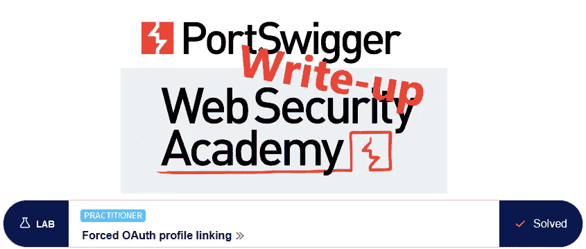
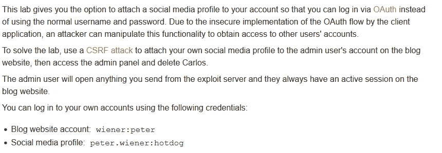
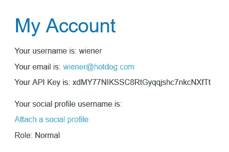
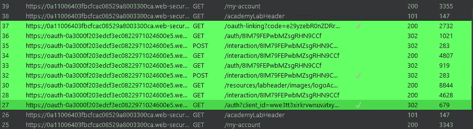
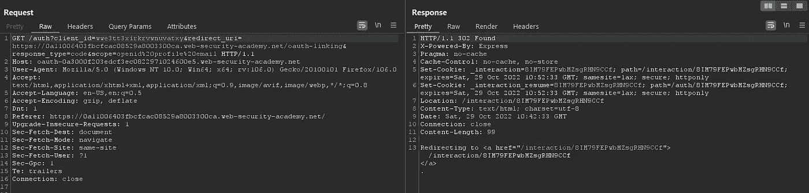
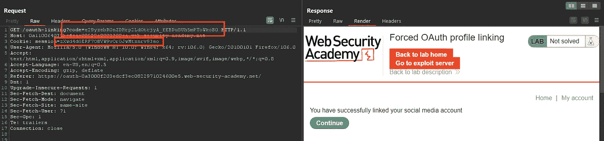
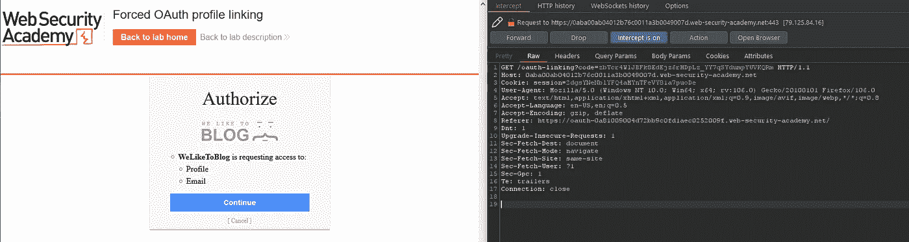
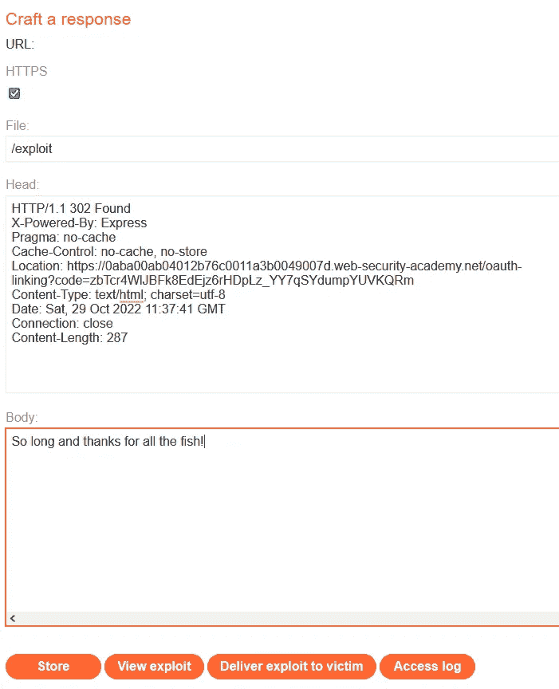
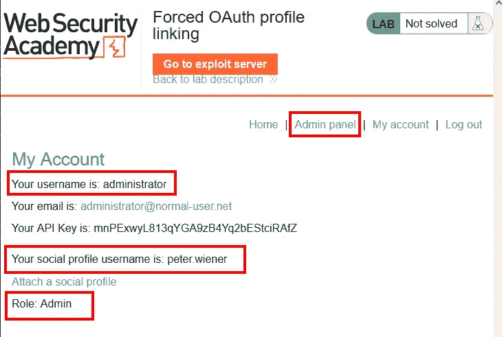
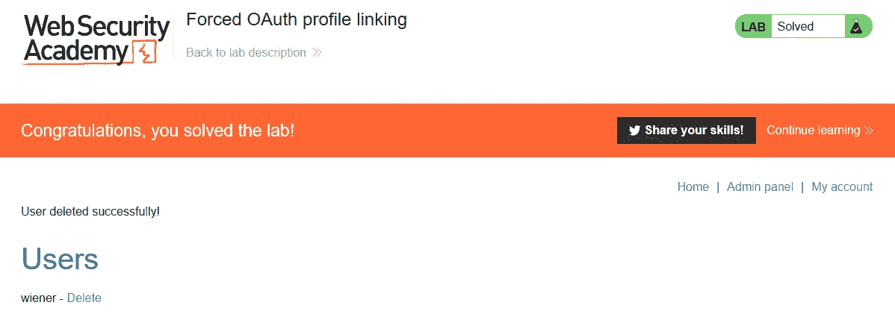

# 向上写:强制 OAuth 配置文件链接@ PortSwigger Academy

> 原文：<https://infosecwriteups.com/write-up-forced-oauth-profile-linking-portswigger-academy-2ce996700c9c?source=collection_archive---------1----------------------->

这篇关于实验室*强制 OAuth 配置文件链接*的文章是我为 [PortSwigger 的网络安全学院](https://portswigger.net/web-security)所做的系列演练的一部分。

**学习路径**:高级主题→ OAuth 认证

 [## 实验室:强制 OAuth 配置文件链接|网络安全学院

### 在本实验中，您可以选择将社交媒体配置文件附加到您的帐户，以便您可以通过 OAuth 登录…

portswigger.net](https://portswigger.net/web-security/oauth/lab-oauth-forced-oauth-profile-linking) 

Python 脚本: [script.py](https://github.com/frank-leitner/portswigger-websecurity-academy/blob/main/22_OAuth_authentication/Forced_OAuth_profile_linking/script.py)

# 实验室描述

# 步伐

通常，第一步是分析实验室应用程序的功能。在这个实验室中，它是一个博客系统。我还可以访问一个漏洞服务器，该服务器可以托管一个网页，我可以将该网页发送给受害者。

该应用程序允许我将一个社交媒体档案链接到我的帐户。之后，我可以用它来代替我的凭证登录。

因此，我这样做是为了分析链接帐户所涉及的流量:

链接过程的所有请求

请求#27 启动链接过程

值得注意的是，这个请求似乎不包含任何标识符，应用程序可以通过这个标识符来验证 oauth 提供者收到的响应是由当时登录的用户触发的。

请求#37 完成帐户链接

果然，一旦我的浏览器和 OAuth 提供者之间的所有请求都完成了，对 OAuth 客户机(博客应用程序)的请求就包含了 OAuth 提供者提供的代码以及我的会话 cookie。

# 该理论

我现在知道我的应用程序登录和 OAuth 提供者之间的链接是在链接过程的最后一次重定向时完成的。

根据请求历史，我假设 OAuth 访问与后一个请求时登录的帐户相关联。

我假设我可以从自己的帐户启动 OAuth 链接，但是将最终请求返回给应用程序。然后，我在漏洞服务器上创建一个包含最终重定向的页面，并将其发送给受害者。

我的 OAuth 帐户应该链接到应用程序的管理员帐户。

# 恶意负载

由于我的 OAuth 帐户已经链接到了`wiener`的帐户，我等待实验室应用程序超时继续。

我通过开始链接我的 OAuth 帐户来发起攻击。然后，我将最后一个请求返回给应用程序:

该请求是由 OAuth 提供者重定向回应用程序引起的。我转到 HTTP 历史记录，复制响应并将其作为页面粘贴到我的漏洞服务器上。

重要的部分是启动重定向的`Location`头，所以我去掉了一些杂波，尤其是 cookies:

我将漏洞发送给受害者，并希望管理员检查该页面。

为了确定我是否成功，我注销了应用程序，并使用 OAuth 提供者登录。

幸运的是，管理员遵守了实验室说明并检查了所有页面。我的帐户页面现在显示我的社交媒体帐户链接到博客应用程序的管理员帐户:

一旦我访问管理面板并删除用户`carlos`，实验室将更新为

*最初发表于***。**

*`[New to Medium? Become a Medium member to access all stories on the platform and support me at no extra cost for you!](https://medium.com/@frank.leitner/membership)`*

## *来自 Infosec 的报道:Infosec 每天都有很多内容，很难跟上。[加入我们的每周简讯](https://weekly.infosecwriteups.com/)以 5 篇文章、4 个线程、3 个视频、2 个 GitHub Repos 和工具以及 1 个工作提醒的形式免费获取所有最新的 Infosec 趋势！*