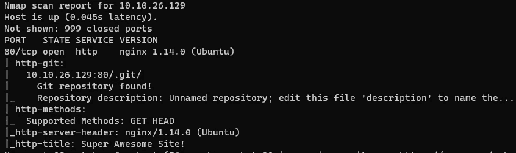
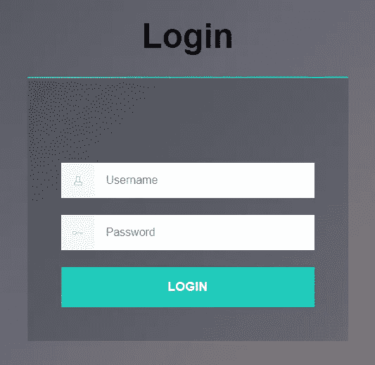
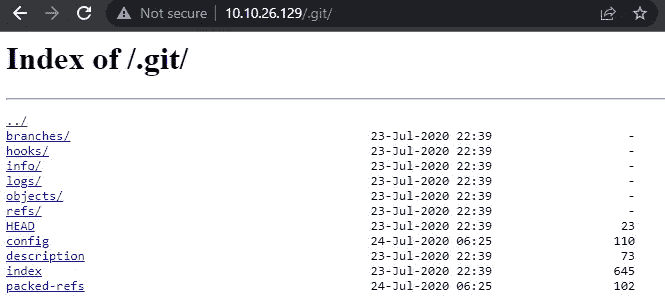
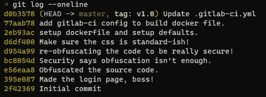
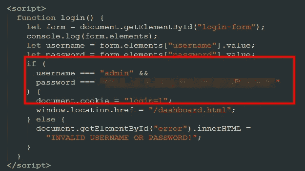

# 特写:Git hacks @ TryHackMe

> 原文：<https://infosecwriteups.com/write-up-git-happens-tryhackme-408a111e880f?source=collection_archive---------1----------------------->


[https://www.pexels.com/photo/11035539/](https://www.pexels.com/photo/man-love-people-woman-11035539/)

这篇关于房间*Git hackme*的文章是我为 [TryHackMe](https://tryhackme.com) 撰写的系列文章的一部分。

[](https://tryhackme.com/room/githappens) [## TryHackMe | Git 发生

### 老板要我做一个原型，所以就在这里！我们甚至使用了一种叫做“版本控制”的东西，使得…

tryhackme.com](https://tryhackme.com/room/githappens) 

房型:免费
难度:简单

# 基本枚举

我从 nmap 扫描开始实验，寻找机器上开放的端口。

```
nmap -nv -Pn -sC -sV -O -T4 -oA nmap 10.10.26.129
```

我使用的选项如下:

*   -n
    无 DNS 解析
    在实验室中没有意义，速度变慢
*   -v
    Verbose
    一找到打开的端口就打印出来
*   -Pn
    没有 ping 扫描
    在实验室中，我假设目标在线
*   -sC
    使用默认的脚本集
    注意:这包括一些侵入式扫描，在 CTF 盒上这没问题，在现实世界中使用`--script=safe`更好
*   -sV
    版本检测
    尝试枚举找到的服务的版本
*   -O
    操作系统检测
    -T4
    使用激进计时
    另一个选项在 CTF 环境中很好，但在现实世界中可能会导致问题
*   -oA
    输出所有格式
    我希望存储所有格式:nmap、xml 和 grepable

注意:这包括一些侵入性的扫描，在 CTF 盒子上这很好，在现实世界中使用`--script=safe`更好

如果没有指定端口的任何参数，nmap 会扫描 1000 个最常见的端口。如果你想了解更多，看看文件`/usr` /share/nmap/nmap-services `。

结果显示只有一个端口打开，即端口 80 上的 web 服务器。更有趣的是，脚本`http-git`显示在 web 根目录中有一个 git 存储库:



nmap 脚本 http-git 揭示了 web 根目录上的 git 存储库

网页只是一个登录屏幕:



它还包含一些混淆的 JavaScript，我现在忽略了。Nmap 显示，web 根似乎是一个更有价值的 git 存储库。

# 获取存储库

首先，我通过在浏览器中打开目录来验证它确实是一个 git 存储库:



下一步是下载完整的存储库。目录列表已打开，所以我可以使用可靠的`wget`来完成这项工作:

```
wget --mirror [http://10.10.26.129/.git/](http://10.10.26.129/.git/)
```

有了本地存储库，我现在可以使用普通的 git 工具进行进一步的研究。首先，我查看存储库中的提交(底部是最早的):



显示有趣提交的 git 日志

三条提交消息引人注目:

*   d954a99 重新混淆代码，以真正安全！
*   bc8054d 安全部门说混淆是不够的。
*   e56eaa8 混淆了源代码

这三个提交中的第一个试图隐藏一些东西，后一个似乎以安全的名义改进了这种隐藏。我想到了页面上令人讨厌的混乱的 JavaScript 块…

# 载入史册

我想看看第一次隐藏提交之前的提交，这使得登录页面:

我签出该提交以查看该时间点的文件。我的本地工作副本有一些不一致，所以我使用`--force`来忽略它们。

```
git checkout 395e087 --force
```



旧版本的文件泄露了密码

我提交密码，房间就解决了。

*原载于【https://github.com】[](https://github.com/frank-leitner/tryhackme/tree/main/Git_Happens)**。***

**来自 Infosec 的报道:每天 Infosec 上都会出现很多难以跟上的内容。* [***加入我们的每周简讯***](https://weekly.infosecwriteups.com/) *以 5 篇文章、4 个线程、3 个视频、2 个 Github Repos 和工具以及 1 个工作提醒的形式免费获取所有最新的 Infosec 趋势！**