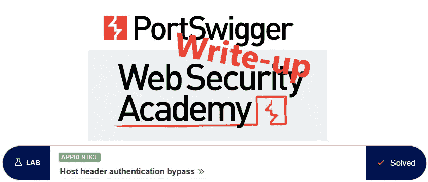
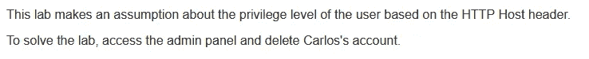
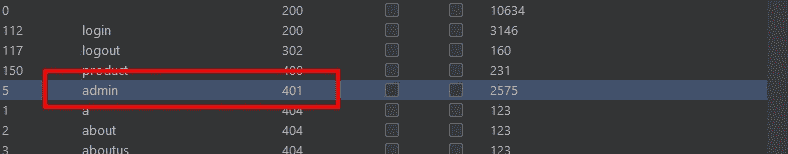
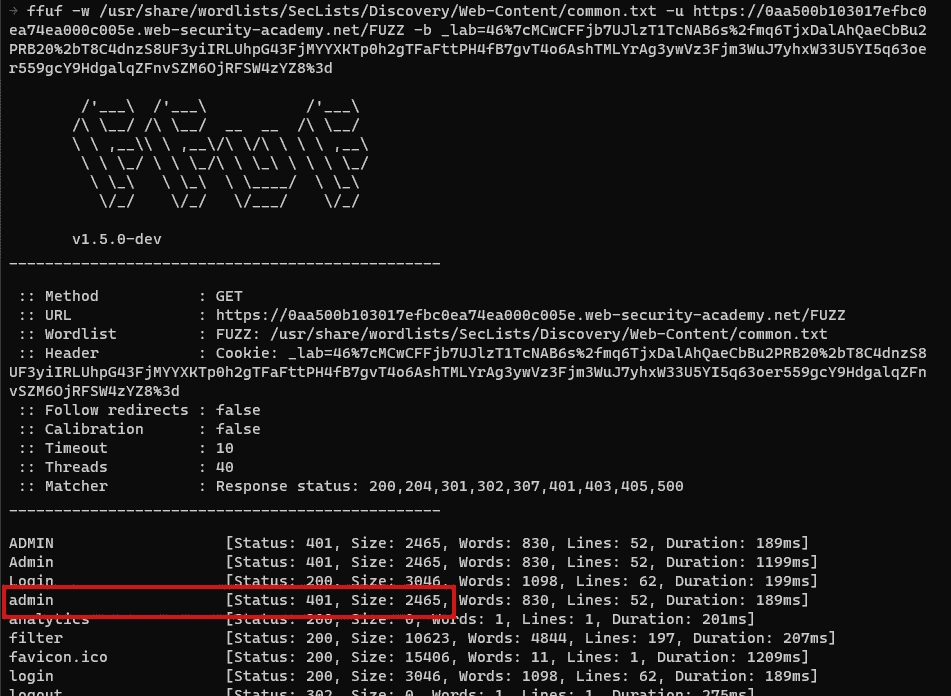
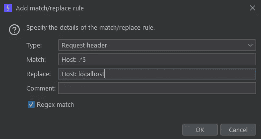
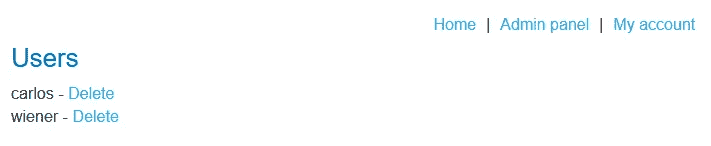
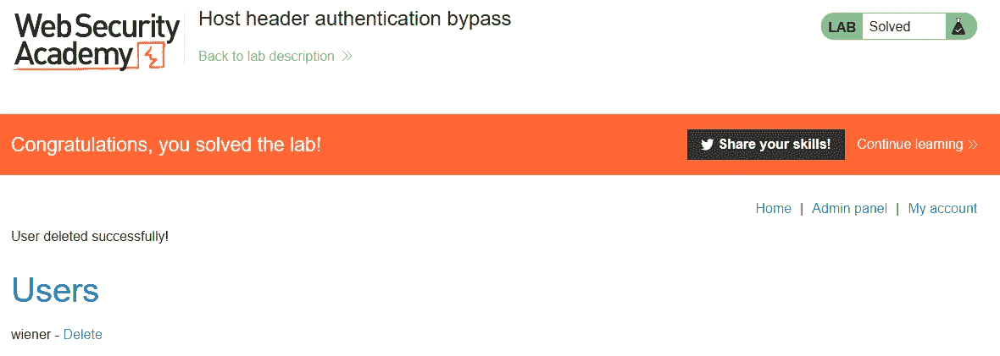

# 推荐:主机标头身份验证绕过@ PortSwigger Academy

> 原文：<https://infosecwriteups.com/write-up-host-header-authentication-bypass-portswigger-academy-30bee8fbf05c?source=collection_archive---------4----------------------->

这篇关于实验室*主机头认证旁路*的文章是我为 [PortSwigger 的 Web 安全学院](https://portswigger.net/web-security)所做的演练系列的一部分。

**学习路径**:高级主题→ HTTP 主机头攻击

 [## 实验室:主机标头身份验证旁路|网络安全学院

### 本实验根据 HTTP 主机报头假设用户的权限级别。要解决实验室…

portswigger.net](https://portswigger.net/web-security/host-header/exploiting/lab-host-header-authentication-bypass) 

Python 脚本: [script.py](https://github.com/frank-leitner/portswigger-websecurity-academy/blob/main/20_HTTP_host_header_attacks/Host_header_authentication_bypass/script.py)

# 实验室描述

# 步伐

通常，第一步是分析实验室应用程序的功能。在这个实验室中，它是一个商店网站。

描述声明访问经过身份验证的功能。不幸的是，没有提供已知的良好凭证，所以我无法分析正常的认证流量。

一个快速的发现，或者一个不错的猜测，在`/admin`显示一个受保护的页面，我缺乏对它的访问权限:

发现打嗝入侵者

这里值得注意的是，这只显示有效的`_lab` cookie，所以当使用像`ffuf`这样的 fuzzer 时，它必须包含在请求中:

使用 ffuf 发现

# 该理论

web 应用程序猜测访问者来自哪里的一种方法是使用`Host`头。普通浏览器总是保持它与连接的目标同步，所以不可能将请求发送到一个主机，但在主机头中有另一个值。

如果开发人员依赖于此，可能会导致漏洞。如果一个页面应该只对本地连接可用，那么最简单的方法就是在`Host`头中过滤`localhost`或`127.0.0.1`，毕竟，对这些目标的请求只能来自同一台机器。

幸运的是，Burp 不是一个普通的浏览器，它允许请求目标和`Host`头之间的分离。

我向`/admin`发送请求，让它打饱嗝，并尝试对 localhost 进行一些修改。

果然，当使用`localhost`作为`Host`表头时，请求成功:

应用程序依赖于 Host: localhost 仅由本地浏览器发送这一事实

# 恶意负载

为了提高可用性，我添加了一个规则，在代理选项中总是用 localhost 替换 host 头:

我重新加载页面，用户管理页面等待着我:

点击链接删除`carlos`后，实验室更新为

*最初发表于*[T5【https://github.com】](https://github.com/frank-leitner/portswigger-websecurity-academy/tree/main/20_HTTP_host_header_attacks/Host_header_authentication_bypass)*。*

`[New to Medium? Become a Medium member to access all stories on the platform and support me at no extra cost for you!](https://medium.com/@frank.leitner/membership)`

*来自 Infosec 的报道:Infosec 上每天都会出现很多难以跟上的内容。* [***加入我们的每周简讯***](https://weekly.infosecwriteups.com/) *以 5 篇文章、4 个线程、3 个视频、2 个 Github Repos 和工具以及 1 个工作提醒的形式免费获取所有最新的 Infosec 趋势！*