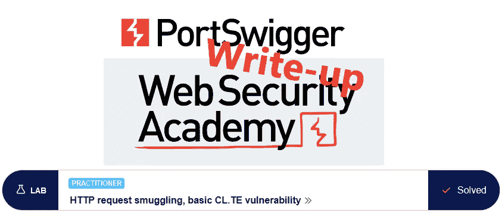
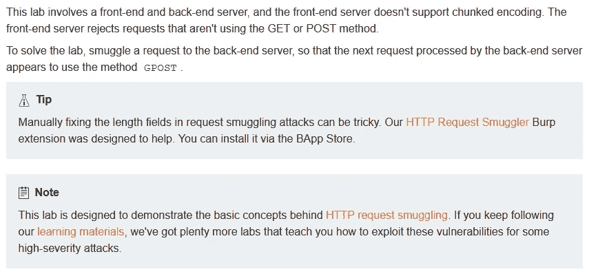
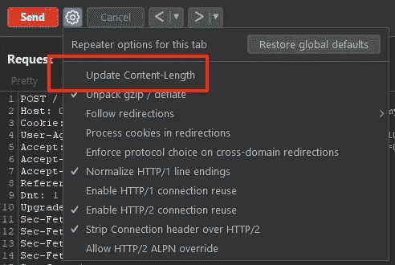
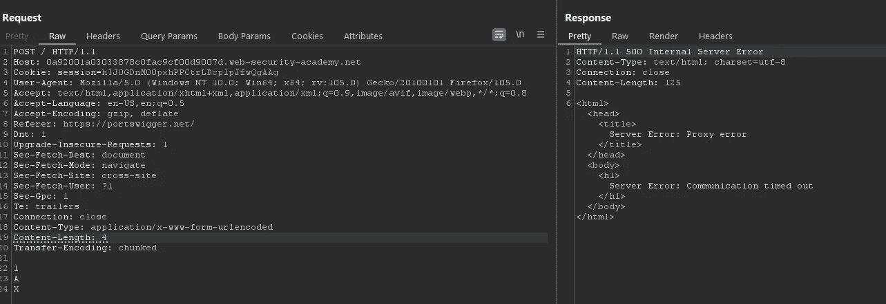
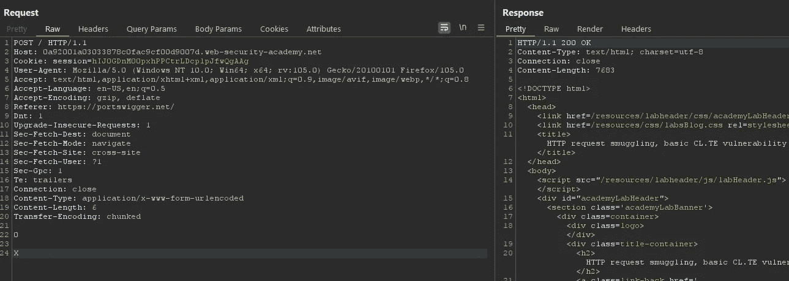
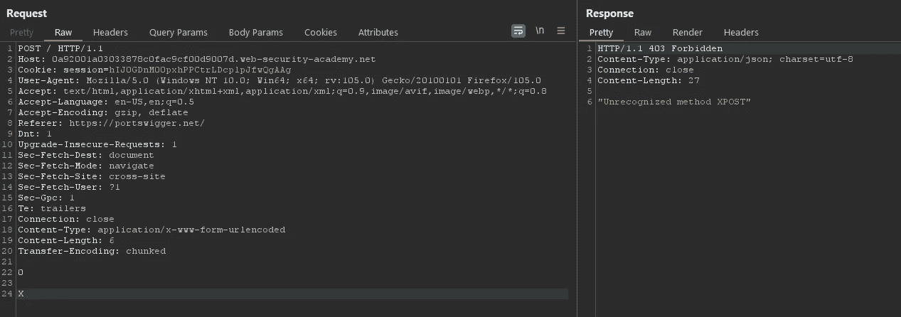
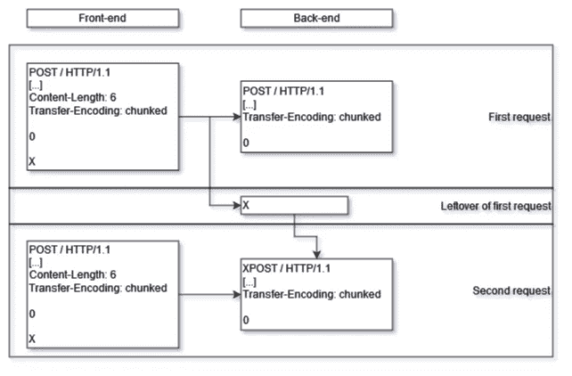
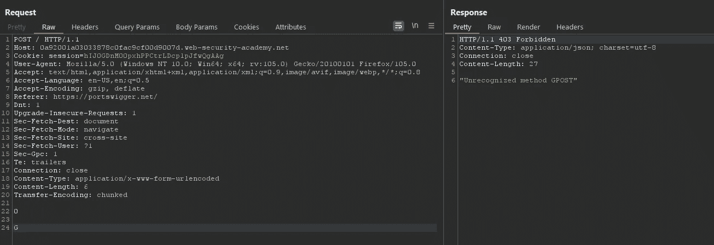
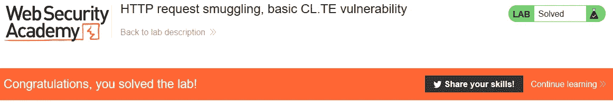
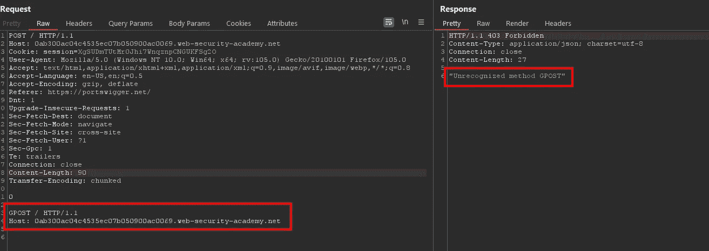

# 上书:HTTP 请求走私，基本 CL。TE 漏洞@ PortSwigger 学院

> 原文：<https://infosecwriteups.com/write-up-http-request-smuggling-basic-cl-te-vulnerability-portswigger-academy-5acbbc040c74?source=collection_archive---------0----------------------->

本文为 lab *HTTP 请求走私，基础 CL。TE 漏洞*是我为 [PortSwigger 的 Web 安全学院](https://portswigger.net/web-security)所做的演练系列的一部分。

**学习路径**:高级主题→ HTTP 请求走私

 [## 实验室:HTTP 请求走私，基本 CL。TE 漏洞|网络安全学院

### 练习利用现实目标的弱点。记录你从学徒到专家的进步。看哪里…

portswigger.net](https://portswigger.net/web-security/request-smuggling/lab-basic-cl-te) 

# 实验室描述

# 步伐

通常，第一步是分析实验室应用程序的功能，这是一个博客应用程序。然而，在这种情况下，漏洞存在于服务器本身。

# 该理论

根据实验室的描述，该实验室包含多台服务器，它们在 HTTP 请求的解析方式上存在分歧。

虽然前端服务器只允许`GET`和`POST`请求，后端服务器支持自定义的`GPOST`动词。

第一个尝试是找出两个服务器是否在头`Content-Length`和`Transfer-Encoding`的解释上达成一致。根据定义，如果两个接头都存在，则`Transfer-Encoding`应优先。

如果我可以创建一个请求，前端服务器将其解释为两个不同的请求，那么它将向后端服务器发送两个不同的请求。

# 尝试新事物

我向打嗝中继器发送了一个请求。一个`GET`请求不能包含主体数据，所以我将动词改为`POST`。

第一个测试是检查前端服务器是否使用`Content-Length`，而后端服务器是否使用`Transfer-Encoding`。

为此，我需要防止打嗝自动为我更新`Content-Length`标题:

我现在可以创建一个包含不一致信息的请求。如果服务器容易受到这种类型的攻击，那么前端服务器将基于`Content-Length`的值在`A`之后终止请求。

后端服务器收到请求后，将等待更多的块，从而导致延迟。果然，我在发送请求后收到一个超时消息:

在这个测试中，当后端服务器等待剩余的内容时，前端服务器将消息剪短。

我可以通过使前端服务器发送比后端服务器期望的更多的内容来逆转这一点。额外的字符将被添加到下一个请求的前面。

对于下一个请求，我重新激活自动重新计算`Content-Length`。我需要发送请求两次，第一次将产生正常的响应，而第二次可能会显示后端服务器最终接收到的内容:

第二个响应证明嵌入在第一个请求中的`X`被添加到了第二个请求的前面，形成了一个无效的`XPOST`请求:

# 恶意负载

现在我知道我可以发送请求，在下一个请求的开头添加任意字符。对于这个实验，我需要发送一个`GPOST`请求，所以我必须对我的测试请求做一个小小的修改。同样，我必须发送两次请求:

此时，实验室更新为

# 另一途径

我也可以偷偷提出第二个完整的请求。在正文中，我用一个长度为零的块终止消息，然后用一个`GPOST`请求跟进。发送两次后，我再次收到`GPOST`方法错误:

这种方法的缺点是请求和响应不同步，每个后续请求都可能收到前一个请求的响应。

*最初发表于*[*https://github.com*](https://github.com/frank-leitner/portswigger-websecurity-academy/tree/main/21_HTTP_request_smuggling/HTTP_request_smuggling%2C_basic_CL.TE_vulnerability)*。*

`[New to Medium? Become a Medium member to access all stories and support me!](https://medium.com/@frank.leitner/membership)`

## 来自 Infosec 的报道:Infosec 每天都有很多内容，很难跟上。[加入我们的每周简讯](https://weekly.infosecwriteups.com/)以 5 篇文章、4 个线程、3 个视频、2 个 GitHub Repos 和工具以及 1 个工作提醒的形式免费获取所有最新的 Infosec 趋势！