# 向上写:无限金钱逻辑缺陷@波特斯威格学院

> 原文：<https://infosecwriteups.com/write-up-infinite-money-logic-flaw-portswigger-academy-5b6182f42f57?source=collection_archive---------1----------------------->

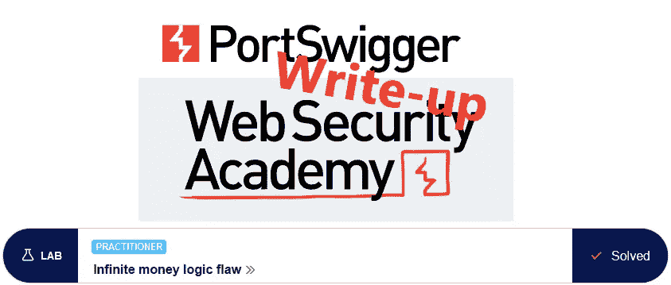

这篇关于实验室*无限金钱逻辑缺陷*的文章是我为 [PortSwigger 的网络安全学院](https://portswigger.net/web-security)所做的系列演练的一部分。

**学习路径**:服务器端主题→业务逻辑漏洞

 [## 实验室:无限金钱逻辑缺陷|网络安全学院

### 这个实验室的采购流程存在逻辑缺陷。为了解决实验室，利用这一缺陷购买一个“轻量级 l33t…

portswigger.net](https://portswigger.net/web-security/logic-flaws/examples/lab-logic-flaws-infinite-money) 

Python 脚本: [script.py](https://github.com/frank-leitner/portswigger-websecurity-academy/blob/main/05_business_logic_vulnerabilities/Infinite_money_logic_flaw/script.py)

# 实验室描述

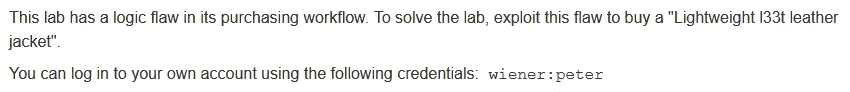

# 步伐

通常，第一步是分析实验室应用程序的功能。在这个实验室中，它是一个从其他实验室中知名的商店网站。我的目标是买一件我已经有几千件的夹克。我首先浏览一下页面，用我已知的凭证登录。

商店本身看起来非常熟悉，但我的帐户页面有一个新功能—我可以使用礼品卡。此外，实验室还提供我的电子邮件。

礼品卡可以花 10 美元购买。

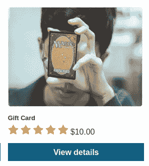

要了解这是如何工作的，只需购买一个:

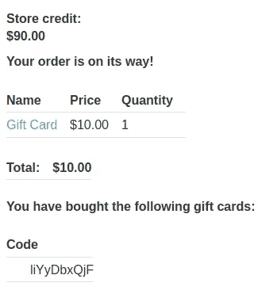

与此同时，我收到了一封电子邮件，也包含了购物卡代码:

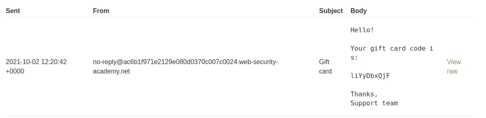

在“我的帐户”网站上，我可以申请礼品卡，将我的商店信用恢复到 100 美元。不幸的是，我不能再次申请购物卡。礼品卡代码也不能用作结账页面上的优惠券。

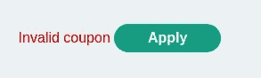

在检查 Burp 中的请求时，没有出现任何明显的可疑之处。

# 订阅时事通讯

与页面交互的另一个选项是时事通讯。我订阅看看有没有什么有趣的奖励:

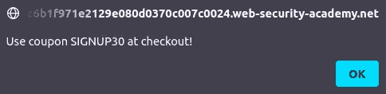

这是 30%的折扣。这让我想到……礼品卡上注明了 10 美元的统一价格，我可以在这上面应用 30%吗？(毕竟，我在现实生活中认识的所有商店都明确将礼品卡排除在折扣之外)

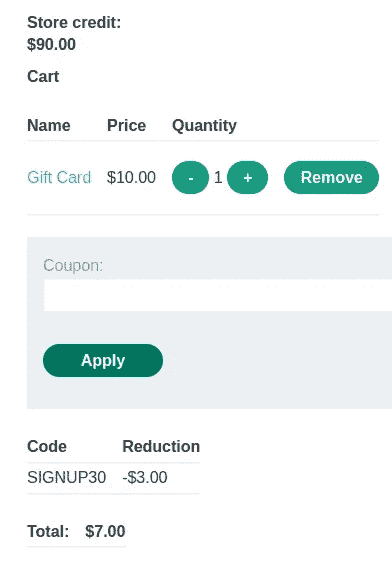

至少可以应用，所以我买。代码生成并应用到我的帐户后，商店信用总额显示比以前高 3 美元:

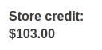

所以我可以花 7 美元购买一张面值 10 美元的礼品卡。

# 购买礼品卡

我有 103 美元的商店信用，我可以购买 14 张购物卡，每张产生 3 美元的利润，总共 42 美元

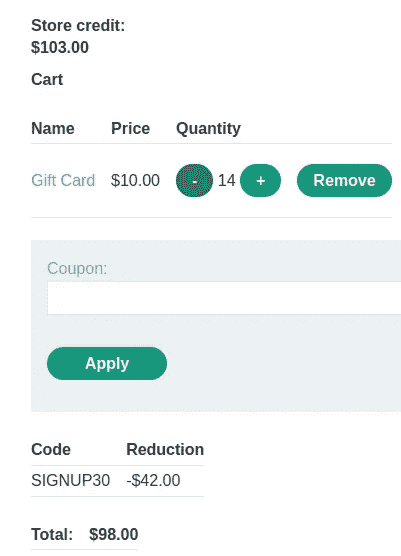

为了获得购买皮夹克所需的 1234 美元，我需要兑换 412 张购物卡。这不是我想手动做的，即使它可能会少一点(< 300)，如果我对夹克本身也应用 30%的优惠券。

# 创建宏

第一件事是为宏选择适当的请求。

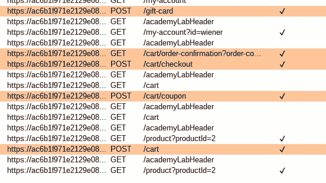

到`/cart`的 POST 不包含 csrf-token，但是到`/cart/coupon`的 POST 包含。所以我将第一个请求修改为`/cart`，重定向到`CART`，这样就可以提取下一个请求的 csrf-token。

在宏的第一次测试中，礼品卡的兑换失败了，因为我忘记了将礼品卡代码从以前的请求中取出来

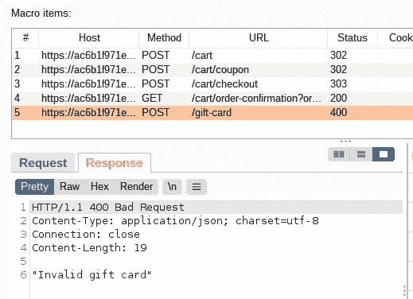

因此，在网站上手动赎回代码以获取 my $3，然后更改宏以获取之前请求的值:

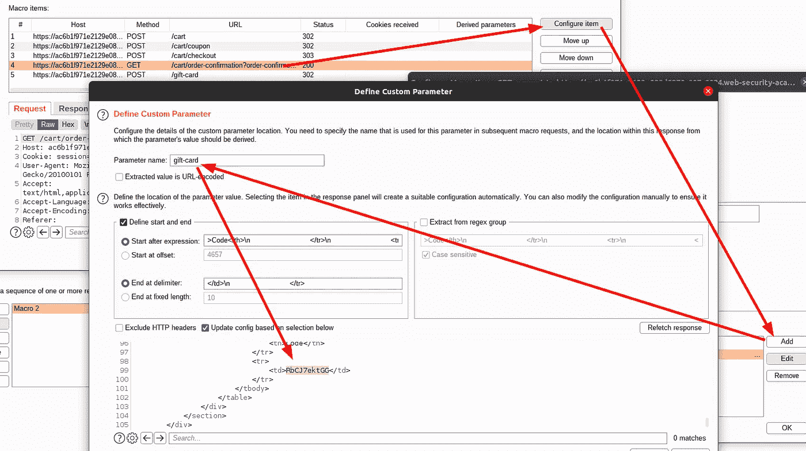

并且兑换礼品卡的请求需要被更新以实际使用该值:

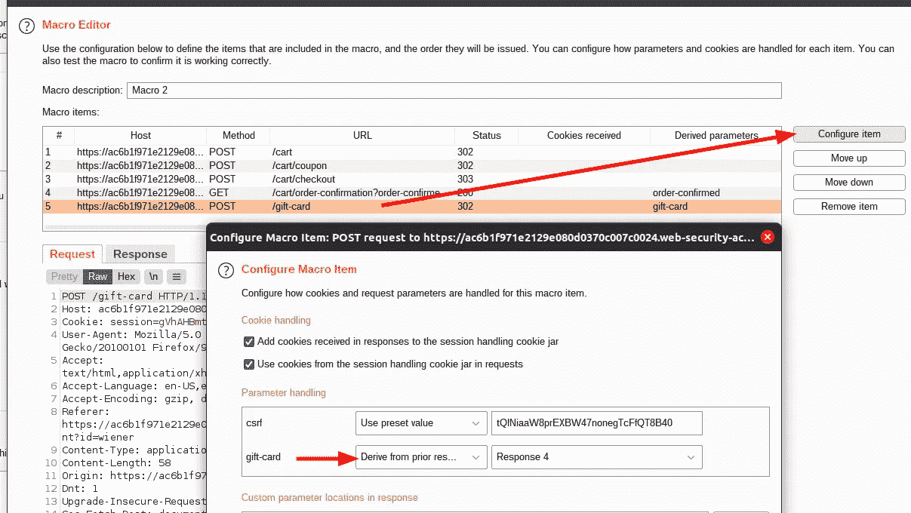

现在再次测试

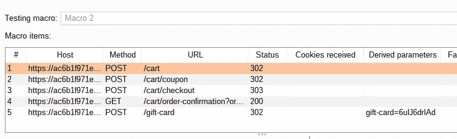

# 自动化 it

现在宏测试成功，参数自动获取，礼品卡应用。所以我创建了一个会话规则，为每个请求运行这个宏:

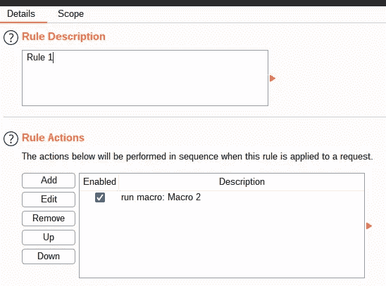

并向`/my-account`发送一个简单的请求，让入侵者打嗝。我清除了所有的有效载荷位置，并为空有效载荷增加了一个位置。在测试过程中，我已经获得了所需的 412 张礼品卡中的一部分，但是仍然使用这个数字作为生成的有效负载的数量。

此外，请求必须按顺序进行，所以我使用一个只有一个并发请求的资源池:

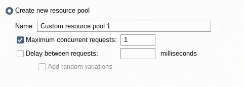

*   攻击类型:**狙击**
*   有效载荷:空有效载荷，412 次

当攻击运行时，刷新浏览器中的帐户页面显示商店信用稳步增加。所以让它运行一段时间…

完成后，推车看起来更好，我可以订购。我不知道为什么我没有在这里使用折扣代码，这样可以节省很多电话。

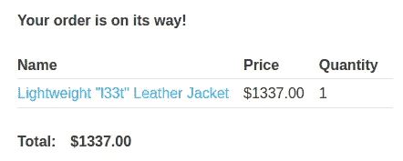

同时，实验室更新到

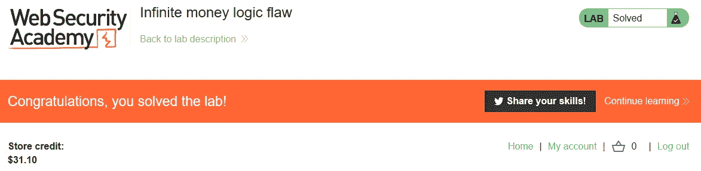

*最初发表于*[*https://github.com*](https://github.com/frank-leitner/portswigger-websecurity-academy/tree/main/05_business_logic_vulnerabilities/Infinite_money_logic_flaw)*。*

`[New to Medium? Become a Medium member to access all stories on the platform and support me at no extra cost for you!](https://medium.com/@frank.leitner/membership)`

## 来自 Infosec 的报道:Infosec 每天都有很多内容，很难跟上。[加入我们的每周简讯](https://weekly.infosecwriteups.com/)以 5 篇文章、4 个线程、3 个视频、2 个 GitHub Repos 和工具以及 1 个工作提醒的形式免费获取所有最新的 Infosec 趋势！