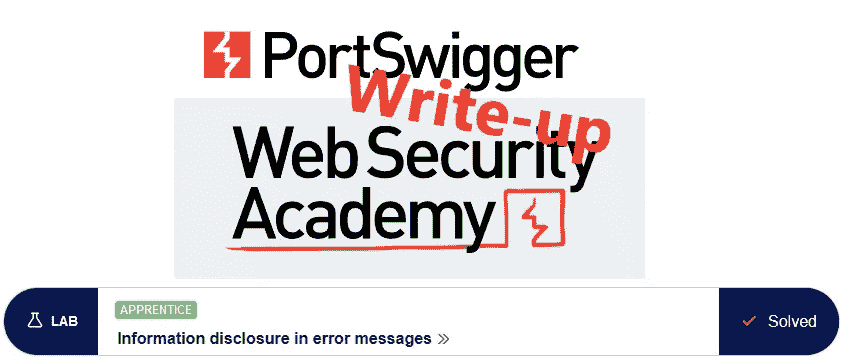
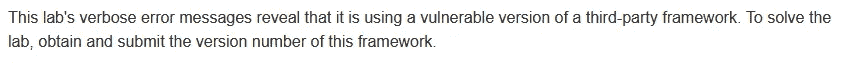
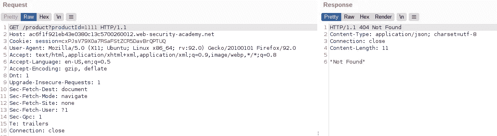
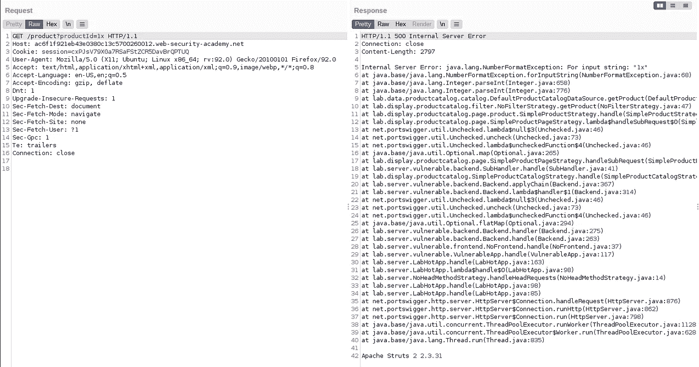

# 举报信:错误消息中的信息泄露@ PortSwigger Academy

> 原文：<https://infosecwriteups.com/write-up-information-disclosure-in-error-messages-portswigger-academy-b85f73054fa9?source=collection_archive---------4----------------------->

这篇关于实验室*错误消息*中的信息披露的文章是我在 [PortSwigger 的网络安全学院](https://portswigger.net/web-security)的演练系列的一部分。

**学习路径**:服务器端主题→信息披露

 [## 实验室:错误消息中的信息泄露|网络安全学院

### 练习利用现实目标的弱点。记录你从学徒到专家的进步。看哪里…

portswigger.net](https://portswigger.net/web-security/information-disclosure/exploiting/lab-infoleak-in-error-messages) 

Python 脚本: [script.py](https://github.com/frank-leitner/portswigger-websecurity-academy/blob/main/06_information_disclosure/Information_disclosure_in_error_messages/script.py)

# 实验室描述

# 步伐

实验室应用程序是一个网上商店。一些框架，主要是旧的框架，在 HTML 源代码中添加了注释，提供了有用的信息。

然而，在这种情况下，页面的 HTML 源代码没有显示任何感兴趣的内容。

浏览一下，没有太多的选项可以提供输入。事实上，在查看产品详情时，只有`productId`参数是明显的。

当我修改它时会发生什么？

# 修改参数

首先，我尝试使用一个不存在的 productId:

使用无效的产品 id 进行测试

应用程序委婉地告诉我，它没有找到任何东西。所以用参数的某个非数字值重试一次:

使用非数字 productId 进行测试

应用程序没有很好地处理这个错误，并暴露了完整的异常，包括 Apache Struts 2 的易受攻击版本。

提交解决方案后，实验室更新到

*原载于*[*https://github.com*](https://github.com/frank-leitner/portswigger-websecurity-academy/tree/main/06_information_disclosure/Information_disclosure_in_error_messages)*。*

`[New to Medium? Become a Medium member to access all stories on the platform and support me at no extra cost for you!](https://medium.com/@frank.leitner/membership)`

## 来自 Infosec 的报道:Infosec 每天都有很多内容，很难跟上。[加入我们的每周简讯](https://weekly.infosecwriteups.com/)以 5 篇文章、4 个线程、3 个视频、2 个 GitHub Repos 和工具以及 1 个工作提醒的形式免费获取所有最新的 Infosec 趋势！