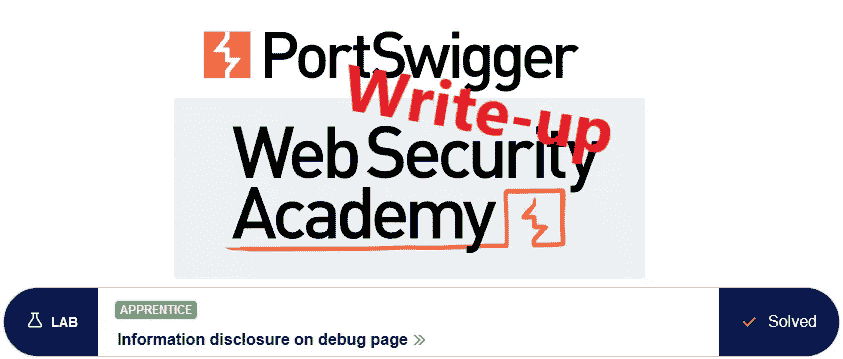
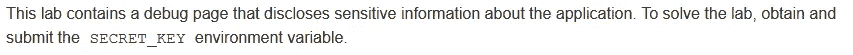
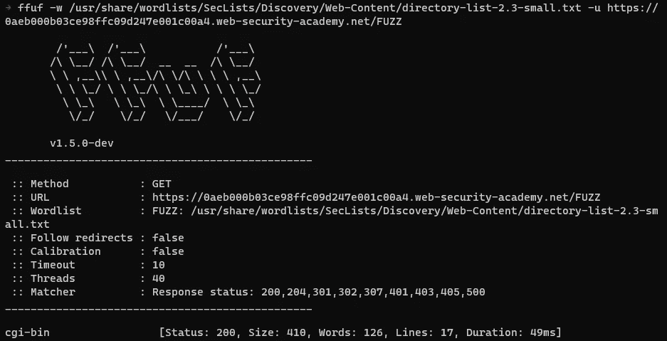
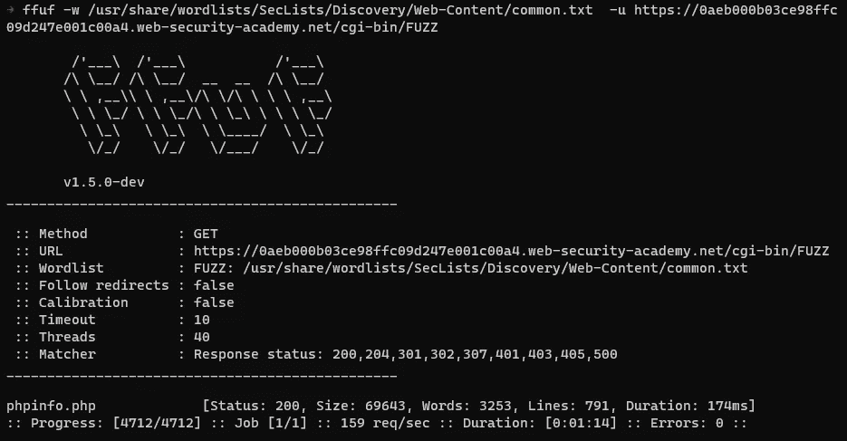
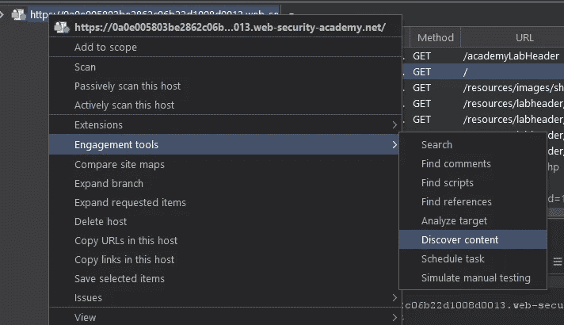
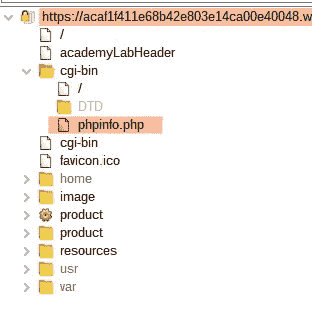
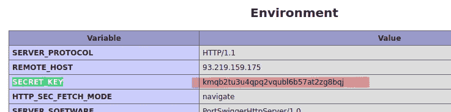
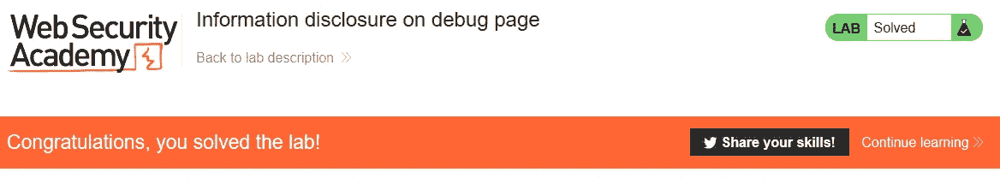

# 写:调试页面@ PortSwigger Academy 上的信息披露

> 原文：<https://infosecwriteups.com/write-up-information-disclosure-on-debug-page-portswigger-academy-84fa667af24c?source=collection_archive---------0----------------------->



这篇关于实验室*在调试页面*上披露信息的文章是我为 [PortSwigger 的网络安全学院](https://portswigger.net/web-security)所做的系列演练的一部分。

**学习路径**:服务器端主题→信息披露

[](https://portswigger.net/web-security/information-disclosure/exploiting/lab-infoleak-on-debug-page) [## 实验室:调试页面上的信息披露|网络安全学院

### 练习利用现实目标的弱点。记录你从学徒到专家的进步。看哪里…

portswigger.net](https://portswigger.net/web-security/information-disclosure/exploiting/lab-infoleak-on-debug-page) 

Python 脚本: [script.py](https://github.com/frank-leitner/portswigger-websecurity-academy/blob/main/06_information_disclosure/Information_disclosure_on_debug_page/script.py)

# 实验室描述



# 步伐

实验室应用程序是一个商店网站，它已经在其他实验室中广为人知。看这一页没有发现任何有趣的东西。

下面，我展示了使用商业 Burp Professional 和 Burp 之外的免费工具来查找目标文件。

# 使用免费工具

当我试图避免使用 Burp Professional 的功能时，有几个好的免费工具允许内容发现。我在这里使用的是 [ffuf](https://github.com/ffuf/ffuf) 和 [SecLists](https://github.com/danielmiessler/SecLists) 提供的伟大词表。

首先，我使用

```
ffuf -w /usr/share/wordlists/SecLists/Discovery/Web-Content/directory-list-2.3-small.txt -u https://0aeb000b03ce98ffc09d247e001c00a4.web-security-academy.net/FUZZ
```



我现在可以在这个目录中搜索常用文件

```
ffuf -w /usr/share/wordlists/SecLists/Discovery/Web-Content/common.txt -u https://0aeb000b03ce98ffc09d247e001c00a4.web-security-academy.net/cgi-bin/FUZZ
```



# 使用专业打嗝

有了 Burp 内容发现功能，查找文件就变得同样简单。



我使用默认选项并开始运行发现。Burp 快速显示站点地图中的`phpinfo.php`文件:



# 寻找秘密

我在浏览器中打开这个文件，滚动浏览内容，很快找到了答案:



提交解决方案后，实验室更新到



*原载于*[*https://github.com*](https://github.com/frank-leitner/portswigger-websecurity-academy/tree/main/06_information_disclosure/Information_disclosure_on_debug_page)*。*

`[New to Medium? Become a Medium member to access all stories on the platform and support me at no extra cost for you!](https://medium.com/@frank.leitner/membership)`

## 来自 Infosec 的报道:Infosec 每天都有很多内容，很难跟上。[加入我们的每周简讯](https://weekly.infosecwriteups.com/)以 5 篇文章、4 条线索、3 个视频、2 个 GitHub Repos 和工具以及 1 个工作提醒的形式免费获取所有最新的 Infosec 趋势！