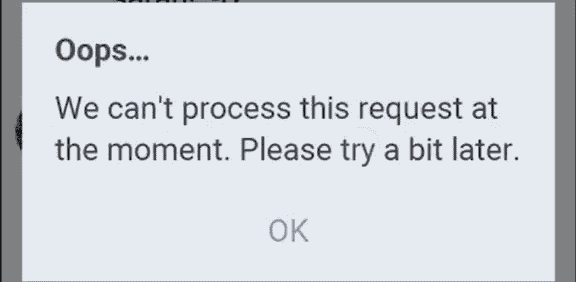
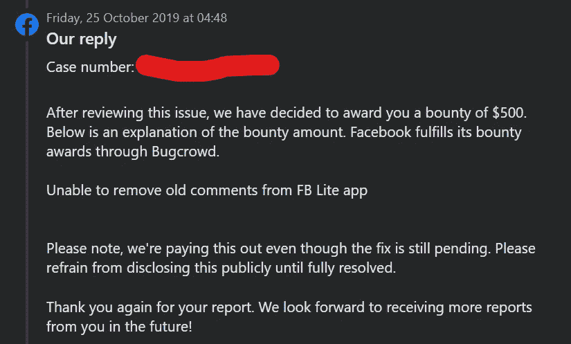

# FB Lite 应用上不可删除的评论|我通过观察发现的一个简单 FB Lite bug 的故事(奖金:500 美元)

> 原文：<https://infosecwriteups.com/write-up-irremovable-comments-on-fb-lite-app-a-story-of-a-simple-fb-lite-bug-that-i-found-just-125aaa826dd8?source=collection_archive---------0----------------------->

大家好，我又是舒巴姆·巴玛雷。在这篇文章中，我将告诉你我如何发现一个简单的 FB Lite 错误，该错误限制了 FB Lite 应用程序用户在特定情况下删除评论。这是一个容易的发现，因为它是通过观察发现的。(就像我之前在[发现的 5000 美元](https://medium.com/@theshubh77/write-up-missing-rate-limiting-how-i-was-able-to-add-any-unowned-phone-number-to-my-fb-account-fe4d7e67cf10)，我可以添加任何无主电话号码到我的脸书账户。)

所以不浪费时间，让我们开始吧！👉

===

**描述:**

仅供参考，让我澄清一下，当我报告这个问题时，脸书(现在的 Meta)过去也考虑过那些用户无法通过 FB Lite 应用程序执行某些操作，但可以通过其他平台如脸书 Web、Android/iOS 的脸书等执行的错误。这是因为低带宽和低存储的用户无法使用上面提到的其他平台。

我不知道脸书是否还接受这些类型的 bug，因为我现在不找 bug 了。请在评论区确认你最近是否因为同样的 bug 获得了赏金。

===

**故事:**

**第一章:**还记得我报道这期的时候，是 8 月 1 日，一个阴雨绵绵的下午。午饭后，我躺在床上，用 FB Lite 应用程序浏览我在脸书的旧帖子。突然，我看到了我的一个旧帖子，在上面我用同一个词评论了两次。所以我试图删除这条评论，但应用程序显示了一个错误，说“我们目前无法处理这个请求。请稍后再试！”

我试图删除我的其他评论，但它们也没有被删除。在那之后，我试着删除其他人对我的旧帖子的评论，但它抛出了同样的错误。我想这是因为我还没有更新 FB Lite 应用程序，所以我很快更新了它，并试图再次删除那些评论。但是，我还是不能删除它们。

对我来说，这是一个突然发现的时刻，因为这是意料之外的事情。我很快录制了一个演示这个 bug 的视频 PoC，并将其报告给了脸书。

**第二章:**当天，脸书回复并要求补充帖子 ID、FB Lite 版本、设备信息等信息。因为他们无法重现这一问题。

因此，我创建了一个测试帖子，将其 ID 发送给团队，并对其进行评论，然后试图删除该评论。但是这次评论被成功删除了。假设我报告的 bug 只是一个误报，我感到很难过。现在我试图删除旧的评论，这次它抛出同样的错误。

很奇怪。我做了进一步测试，发现只有 2013 年或之前的旧评论会受到这个问题的影响。将这些附加信息添加到报告中，经过一些后续工作，团队能够重现此问题。

===

**时间线:**

> 2019 年 8 月 1 日:报告已发送
> 
> 2019 年 8 月 1 日:脸书要求的附加信息
> 
> 2019 年 8 月 2 日—2019 年 8 月 16 日:跟进
> 
> 2019 年 8 月 23 日:审判
> 
> 2019 年 10 月 25 日:奖励 500 美元奖金

> 2020 年 2 月 7 日:完全修复

===

**外卖:**

1.  在浏览某个东西的时候(即使你没有心情去找 bug)，总是要观察某个东西是否按预期工作。
2.  如果你是脸书臭虫赏金的新手，那么这些类型的 FB Lite 臭虫对你来说是唾手可得的。只要观察，运用你的逻辑，抓住它们。
3.  一些错误可能是特定于时间和帐户的

===

感谢您的阅读！敬请关注我的下一篇文章，别忘了关注我的 [**【脸书】**](http://facebook.com/theshubh77)[**Twitter**](http://twitter.com/theshubh77)[**LinkedIn、**](https://linkedin.com/in/theshubh77) 和**[**insta gram**](http://instagram.com/theshubh77)**。😊****

**===**

## **来自 Infosec 的报道:Infosec 每天都有很多内容，很难跟上。[加入我们的每周简讯](https://weekly.infosecwriteups.com/)以 5 篇文章、4 个线程、3 个视频、2 个 GitHub Repos 和工具以及 1 个工作提醒的形式免费获取所有最新的 Infosec 趋势！**