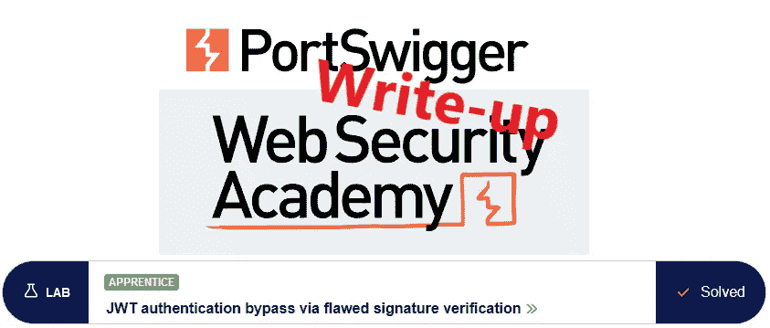
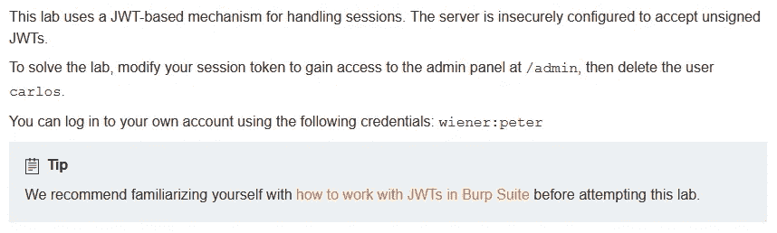
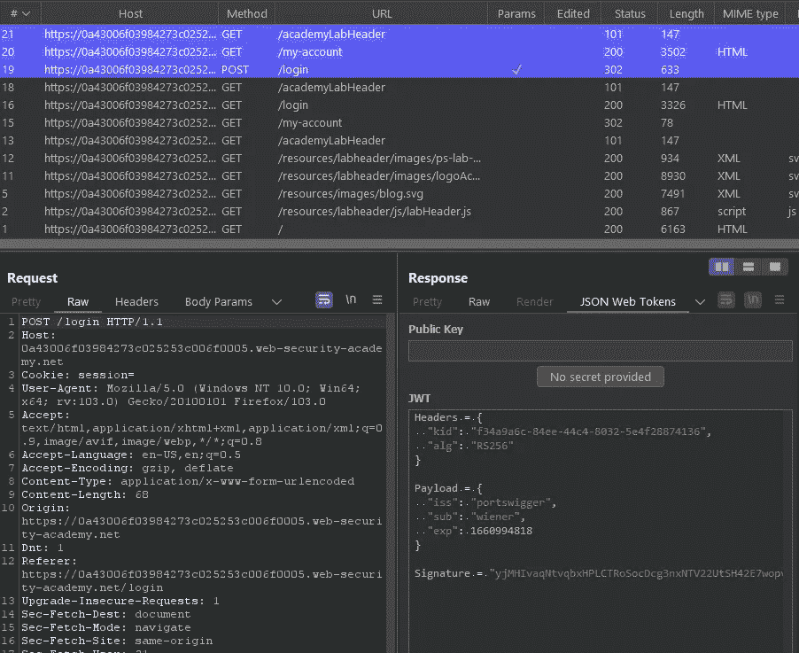
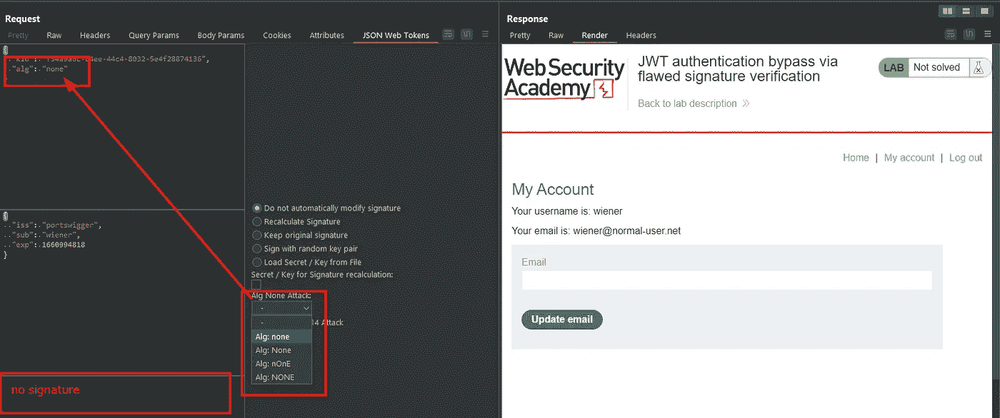
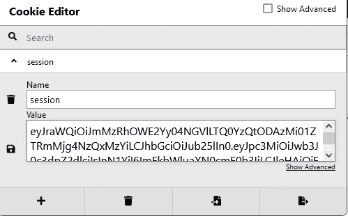
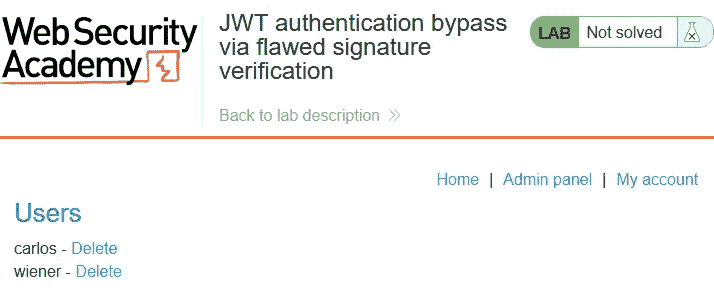
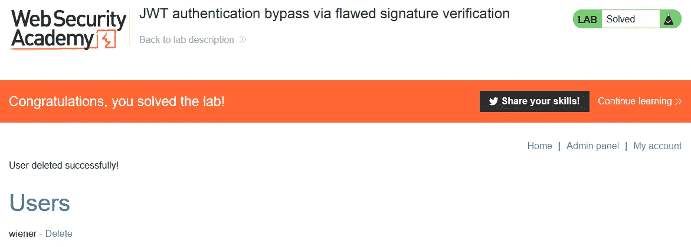

# 报道:通过有缺陷的签名验证绕过 JWT 认证

> 原文：<https://infosecwriteups.com/write-up-jwt-authentication-bypass-via-flawed-signature-verification-portswigger-academy-2107eddec3b7?source=collection_archive---------0----------------------->

这篇关于实验室*通过有缺陷的签名验证绕过 JWT 认证*的文章是我为 [PortSwigger 的 Web 安全学院](https://portswigger.net/web-security)准备的演练系列的一部分。

**学习路径**:高级主题→ JWT 攻击

 [## 实验室:通过有缺陷的签名验证绕过 JWT 认证|网络安全学院

### 练习利用现实目标的弱点。记录你从学徒到专家的进步。看哪里…

portswigger.net](https://portswigger.net/web-security/jwt/lab-jwt-authentication-bypass-via-flawed-signature-verification) 

Python 脚本: [script.py](https://github.com/frank-leitner/portswigger-websecurity-academy/blob/main/23_JWT_attacks/JWT_authentication_bypass_via_flawed_signature_verification/script.py)

# 实验室描述

# 步伐

实验室应用程序处理 jwt。我使用扩展`JSON Web Tokens (JWT4B)`来避免一直手动解码和编码 jwt。

# 分析

通常，第一步是分析实验室应用程序的功能。在本实验中，这是一个博客页面。

实验室描述提到了经过认证的功能，所以我使用`wiener`的凭证登录。马上，Burp Proxy 通知我响应包含一个 JWT:

JWT 在对我登录的响应中显示

当我试图以用户`wiener`的身份访问`/admin`页面时，我收到消息`Admin interface only available if logged in as an administrator`。

# 该理论

JWT 在这里并没有展示出什么与众不同的东西:

*   有效载荷包含我的用户名。
*   该令牌受 RS256 签名保护。

因为我没有私钥，所以如果我操作这个令牌，我就不能创建有效的签名。

但是，有两个问题可能指向严重的漏洞:

*   网站信任令牌中指定的算法吗？
*   网站验证签名了吗？

这些漏洞中的任何一个都将允许我创建任意有效的令牌。由于回答这些问题很琐碎，所以首先要测试。

# 检查空算法

jwt 签名的一种可能的算法是`null`算法。它基本上说明了令牌来自可信的来源，并且不需要签名验证。

在处理不受信任的客户端输入时，这可能是一个安全问题。web 应用程序必须在验证此类输入的过程中始终执行算法，而忽略令牌中提供的算法。

为了测试它，我将请求发送到`/my-account`页面以打嗝中继器，并将算法更改为`none`。在 JWT 中，签名组件为空。

具有空算法的 JWT 仍然提供对认证内容的访问

对该请求的响应导致我的普通帐户页面。这确认了后端信任并使用令牌中提供的算法来提供对经过身份验证的内容的访问。

# 恶意请求

为了滥用这一点，我修改了浏览器中的 cookie。我把我的用户名改成`administrator`，算法改成‘无’，重新编码前两部分，去掉签名部分。

现在，我重新加载帐户页面并转到`Admin panel`:

管理功能现已可用

在我点击删除用户`carlos`的链接后，实验室更新为

*原载于*[*https://github.com*](https://github.com/frank-leitner/portswigger-websecurity-academy/tree/main/23_JWT_attacks/JWT_authentication_bypass_via_flawed_signature_verification)*。*

`[New to Medium? Become a Medium member to access all stories on the platform and support me at no extra cost for you!](https://medium.com/@frank.leitner/membership)`

*来自 Infosec 的报道:Infosec 上每天都会出现很多难以跟上的内容。* [***加入我们的每周简讯***](https://weekly.infosecwriteups.com/) *以 5 篇文章、4 个线程、3 个视频、2 个 Github Repos 和工具以及 1 个工作提醒的形式免费获取所有最新的 Infosec 趋势！*