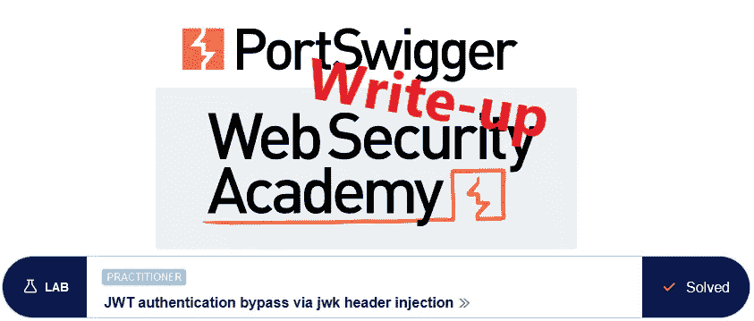
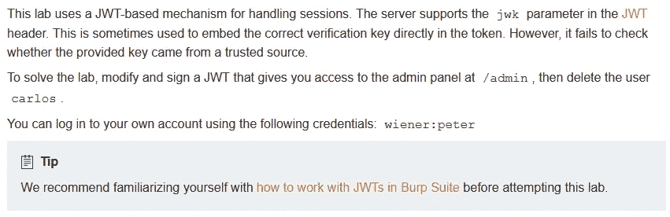
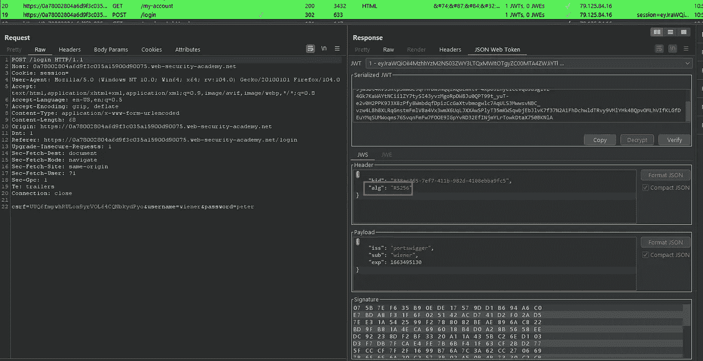
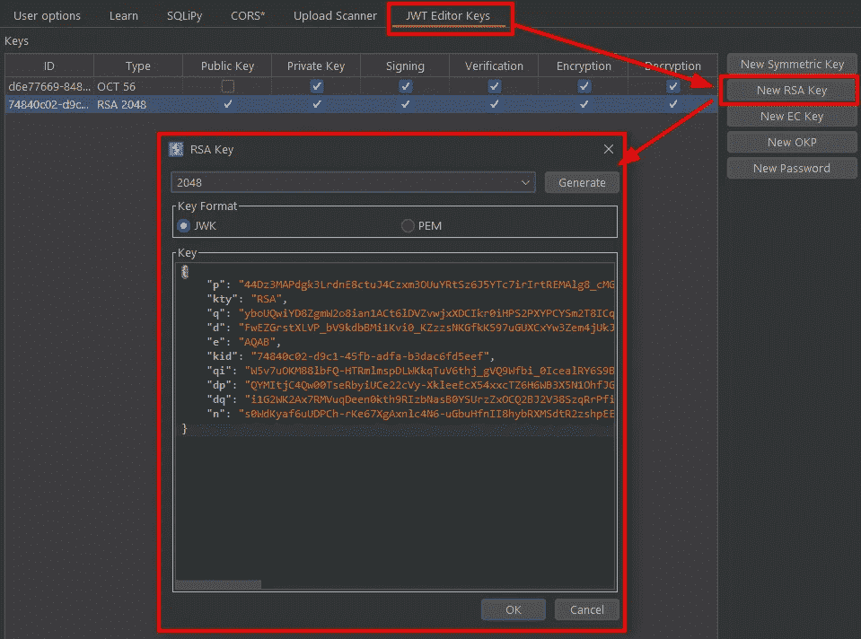
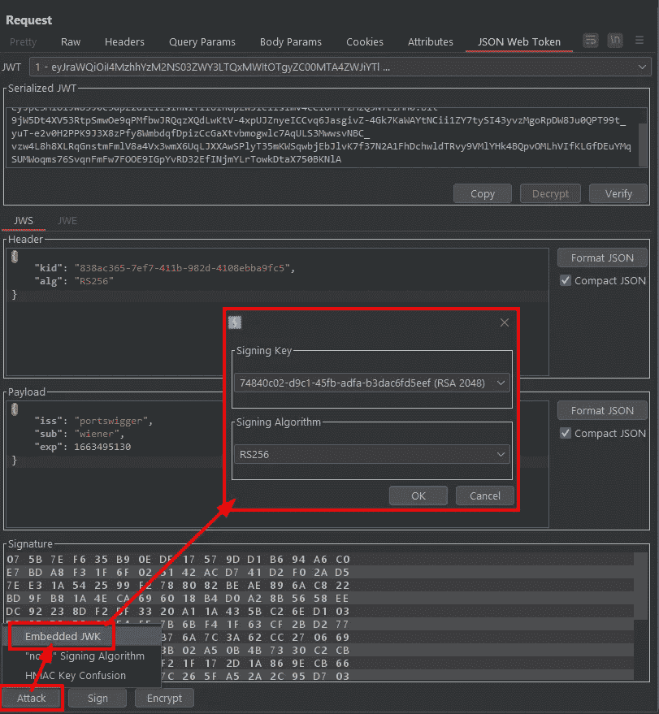
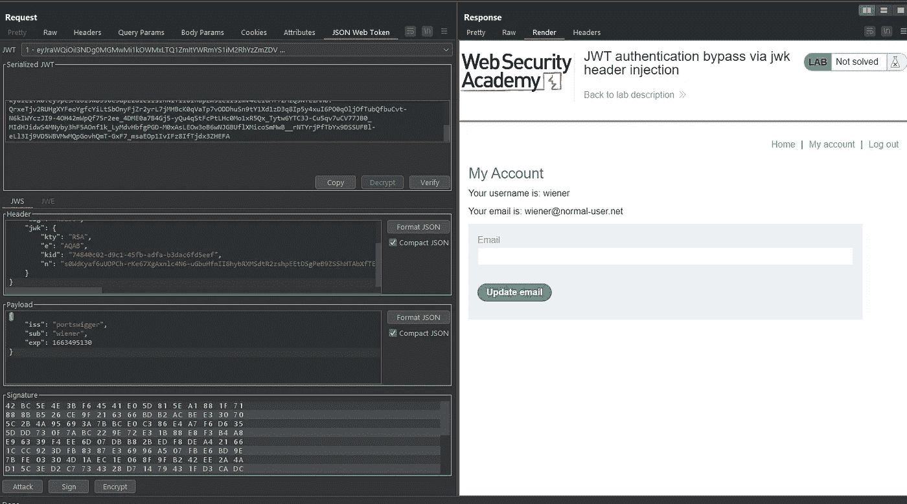
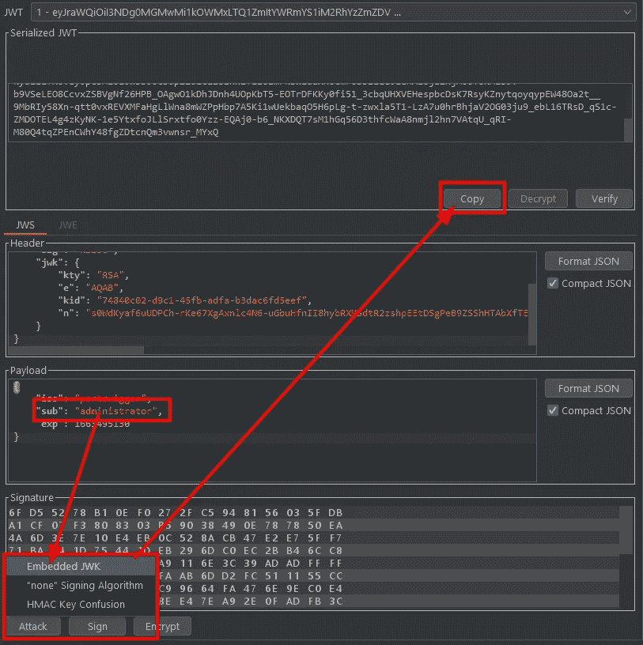
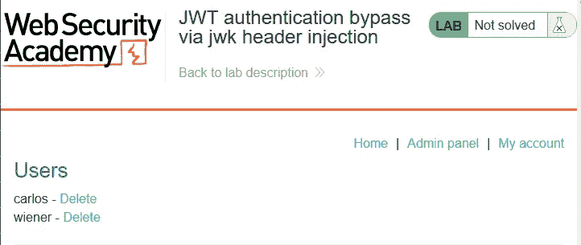
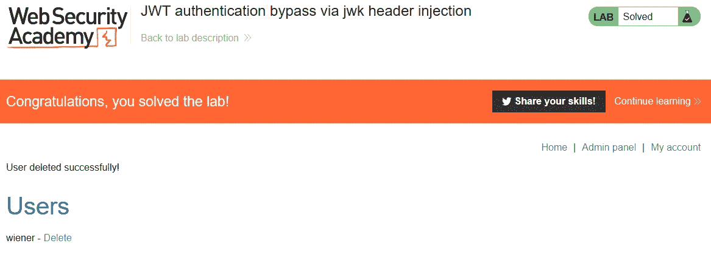

# 报道:通过 jwk 头注入@ PortSwigger Academy 绕过 JWT 认证

> 原文：<https://infosecwriteups.com/write-up-jwt-authentication-bypass-via-jwk-header-injection-portswigger-academy-a08975256e8c?source=collection_archive---------1----------------------->

这篇关于实验室*通过 jwk 头注入*绕过 JWT 认证的文章是我在 [PortSwigger 的 Web 安全学院](https://portswigger.net/web-security)的演练系列的一部分。

**学习路径**:高级主题→ JWT 攻击

 [## 实验室:通过 jwk 报头注入绕过 JWT 认证|网络安全学院

### 练习利用现实目标的弱点。记录你从学徒到专家的进步。看哪里…

portswigger.net](https://portswigger.net/web-security/jwt/lab-jwt-authentication-bypass-via-jwk-header-injection) 

Python 脚本: [script.py](https://github.com/frank-leitner/portswigger-websecurity-academy/blob/main/23_JWT_attacks/JWT_authentication_bypass_via_jwk_header_injection/script.py)

# 实验室描述

# 步伐

通常，第一步是分析实验室应用程序的功能。在这个实验室里，它是一个博客平台。为了帮助这个实验，我使用了扩展 *JWT 编辑器*(可以在 *BApp 商店*找到或者作为独立版本在 [github](https://github.com/portswigger/jwt-editor) 上找到)

实验室是关于认证功能的。我使用提供的凭证并以`wiener`的身份登录。Burp 将会话 cookie 识别为 JWT，并立即对其进行解码:

# 该理论

服务器使用`RS256`作为令牌的算法。我有多种选择可以遵循

1.  无算法/条形签名
2.  注入我自己的密钥
3.  获取私钥(以及密码，如果受保护的话)

第一个选项最容易测试。理论上，下一步将是检查我是否可以删除签名或将算法更改为 *none* 。然而，这两个问题有专门的实验室，所以我在这里跳过检查。详情请参考我撰写的关于通过有缺陷的签名验证绕过 [JWT 认证](/write-up-jwt-authentication-bypass-via-flawed-signature-verification-portswigger-academy-2107eddec3b7)和通过未验证签名绕过 [JWT 认证](https://systemweakness.com/write-up-jwt-authentication-bypass-via-unverified-signature-portswigger-academy-a890510bff1d)的文章。

第二种选择有两种味道。我可以将算法更改为 HS256 并注入一个密钥，或者保留该算法并注入一个 RSA 密钥。尽可能少地改变总是最好的，所以尝试注入 RSA 密钥只改变一个变量。我也不知道后端是使用令牌中提供的算法还是执行 RS256。

选项(3)不太可能，也是最困难的，所以我现在跳过这一点，直到所有其他方法都失败。

我现在在 *JWT 编辑器密钥库*中生成一个新的 *RSA 密钥*:

生成新的 RSA 密钥对

在 Burp 代理中，我将请求发送到`/my-account`中继器并选择`Attack -> Embedd JWK`选项。我选择刚刚生成的 RSA 签名密钥:

嵌入 JWK 并用它签名

点击`OK`后，签名自动更新。如果请求包含无效的或者没有 JWT 作为会话 cookie，应用程序重定向到`/login`页面。

我发送请求，响应包含我的帐户页面，确认后端的签名验证使用了我在 JWT 报头中注入的 RSA 公钥信息。

后端使用注入的公钥接受我自己的签名

# 恶意负载

我将令牌的`sub`值更改为`administrator`，再次执行`Attack -> Embedd JWK`选项，复制序列化的 JWT 并在浏览器中更新我的会话 cookie(为了操作 cookie，我使用了 [Cookie 编辑器](https://cookie-editor.cgagnier.ca/)):

为管理员生成会话 cookie

现在我刷新`/admin`页面。我看到的不是错误`Admin interface only available if logged in as an administrator`，而是用户管理页面:

点击用户`carlos`的`Delete`链接后，实验室更新为

*原载于 https://github.com***。**

*`[New to Medium? Become a Medium member to access all stories on the platform and support me at no extra cost for you!](https://medium.com/@frank.leitner/membership)`*

## *来自 Infosec 的报道:Infosec 每天都有很多内容，很难跟上。[加入我们的每周简讯](https://weekly.infosecwriteups.com/)以 5 篇文章、4 个线程、3 个视频、2 个 GitHub Repos 和工具以及 1 个工作提醒的形式免费获取所有最新的 Infosec 趋势！*