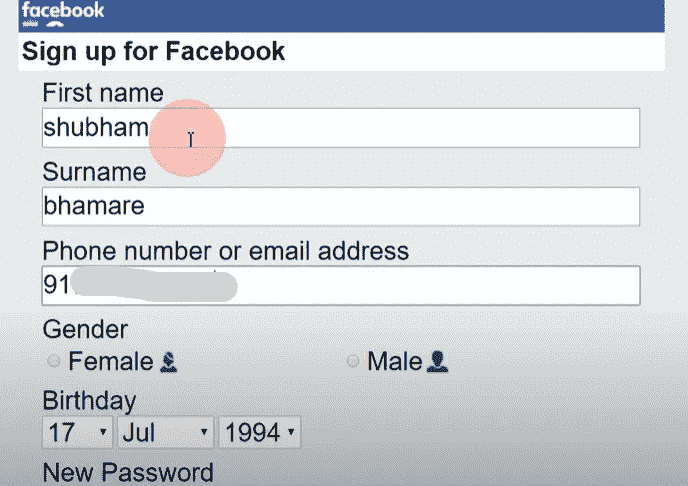
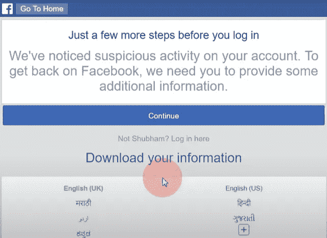
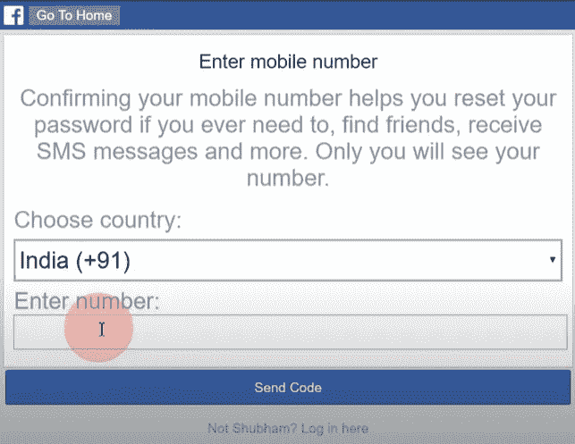
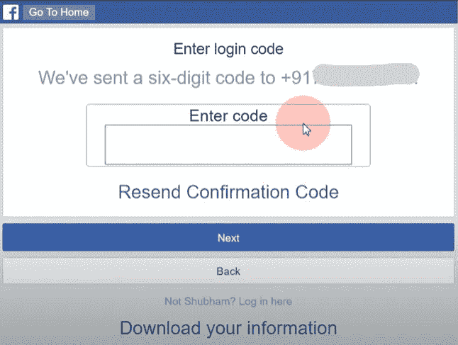
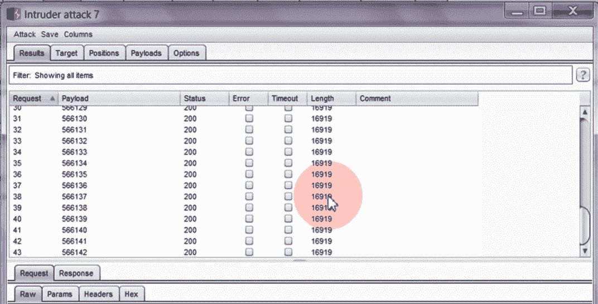
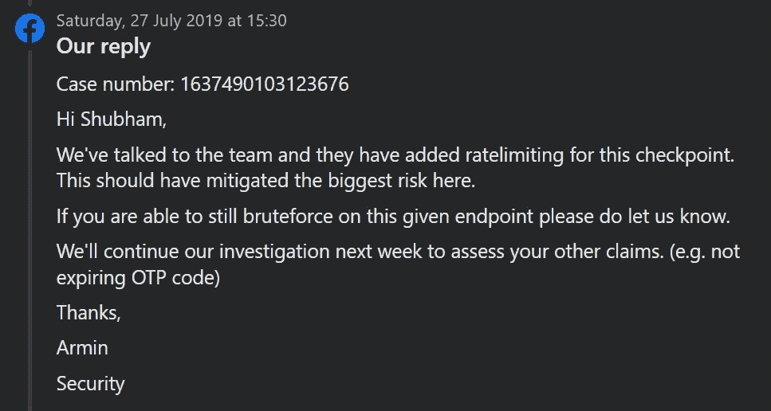
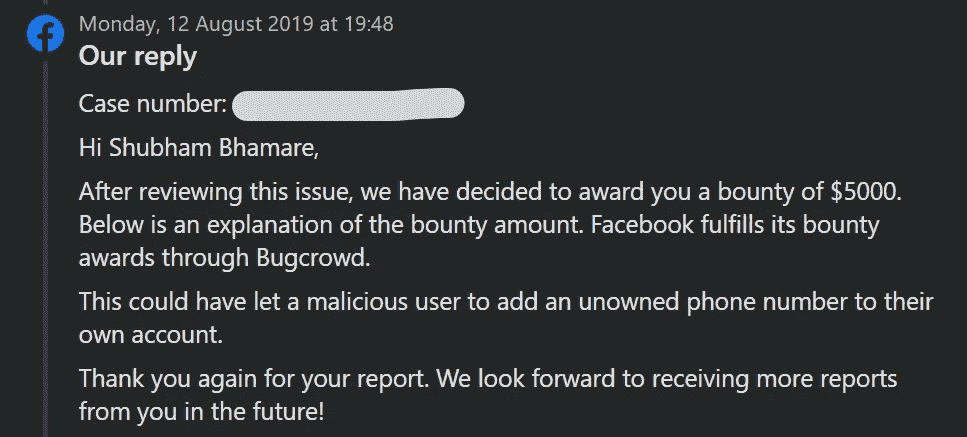

# 缺失限速。我是如何在我的脸书账户中添加任何一个无主电话号码的？(赏金:5000 美元)

> 原文：<https://infosecwriteups.com/write-up-missing-rate-limiting-how-i-was-able-to-add-any-unowned-phone-number-to-my-fb-account-fe4d7e67cf10?source=collection_archive---------0----------------------->

大家好，我又是舒巴姆·巴玛雷。在这篇文章中，我将告诉你我是如何在受害者不知情的情况下，将任何一个无主电话号码添加到我的脸书账户中的。这是一个很容易的发现。

不浪费时间，让我们开始吧！👉

===

**繁殖步骤:**

第一步:使用[d.facebook.com](https://d.facebook.com)子域，用受害者的电话号码创建一个新的脸书账户。

**第二步:**成功创建账户后，做一些可疑的活动(例如，向随机的人发送好友请求，发布多条评论等。)这样，脸书将阻止你做进一步的活动，并显示以下检查点屏幕。

**步骤 3:** 现在，点击继续按钮，完成验证码验证。这样您将被重定向到以下屏幕，在这里您必须输入受害者的相同电话号码(您以前曾使用该号码创建新的脸书帐户)。)

**第 4 步:**输入受害者的电话号码，点击发送代码按钮。您将被重定向到以下屏幕，在这里您必须输入 OTP。

**第五步:**如果你在这里尝试蛮力，你会发现少了限速，这样你就可以确认任何一个无主电话号码。

> **为了测试这个问题，我尝试了 5000+有效载荷，尽管系统没有阻止我，我能够在 5000+请求后确认有效载荷的无主电话号码。**
> 
> 首先，我在脸书的主域上测试了这个问题，但它并不容易受到攻击。所以我在我最喜欢的一个脸书子域****上进行了测试。(然而其他子域即**[**m . Facebook**](https://m.facebook.com)**[**x . Facebook**](https://x.facebook.com)**[**mbasic . Facebook**](https://mbasic.facebook.com)**[**touch . Facebook**](https://touch.facebook.com)**[**iphone . Facebook**](https://iphone.facebook.com))**********

****===****

******背后的故事:******

****2019 年 7 月 17 日(我报道这一问题时)，我没有心情搜索 bug，只是在脸书上浏览一些 meme 页面。那次我想我也应该开一个自己的 meme 页面，赚点被动收入。所以我用我的另一个电话号码创建了一个新的脸书账户。****

****但在一些行动之后，由于电话号码没有被验证，脸书屏蔽了我，并要求我确认我的电话号码。当时我想，为什么我不应该在这里蛮干呢？砰的一声。**💥**我发现限速不见了。****

****===****

******时间线:******

> ****2019 年 7 月 17 日:报告已发送****
> 
> ****2019 年 7 月 22 日:预审****
> 
> ****2019 年 7 月 26 日:审判****
> 
> ****2019 年 7 月 27 日:通过以下消息缓解了问题****

********

> ****2019 年 8 月 1 日:完全修复****
> 
> ****2019 年 8 月 12 日:奖励 5000 美元奖金****

********

****===****

******我试图绕过这个问题的事情:******

****在阅读了[loke sh Kumar](https://lokeshdlk77.medium.com/how-to-rotate-ip-address-for-each-request-in-burp-suite-4e29645ef23e)的这篇关于知识产权轮换的精彩文章后，我试图用同样的技巧绕过这个问题。但我无法绕过它。🥲****

****===****

******外卖:******

1.  ****在浏览某个东西的时候(即使你没有心情去找 bug)，总是要观察某个东西是否按预期工作。****
2.  ****总是试图绕过你的每一个发现的定位。即使你无法绕过它，你也会学到一些新的东西。(以我为例，我学会了如何轮换 IP。)****

****===****

****感谢您的阅读！敬请关注我的下一篇文章，别忘了关注我的 [**【脸书】**](http://facebook.com/theshubh77)[**Twitter**](http://twitter.com/theshubh77)[**LinkedIn、**](https://linkedin.com/in/theshubh77) 和**[**insta gram**](http://instagram.com/theshubh77)**。😊********

****===****

## ****来自 Infosec 的报道:Infosec 每天都有很多内容，很难跟上。[加入我们的每周简讯](https://weekly.infosecwriteups.com/)以 5 篇文章、4 个线程、3 个视频、2 个 GitHub Repos 和工具以及 1 个工作提醒的形式免费获取所有最新的 Infosec 趋势！****