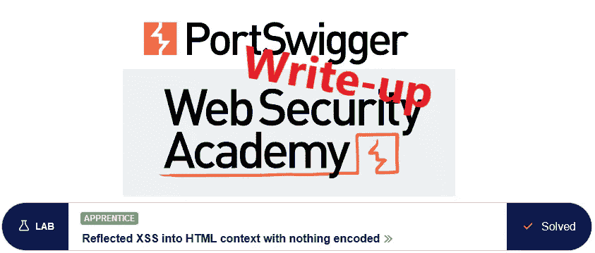
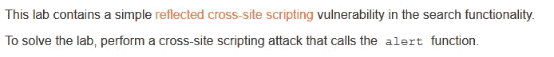
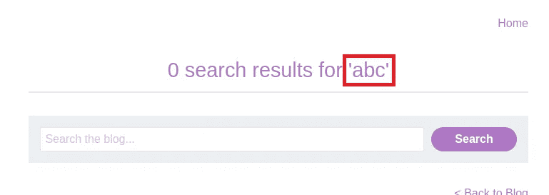
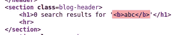
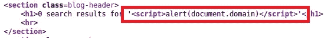
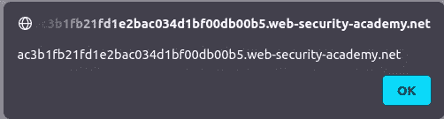

# 报道:将 XSS 反映到 HTML 上下文中，没有任何编码

> 原文：<https://infosecwriteups.com/write-up-reflected-xss-into-html-context-with-nothing-encoded-portswigger-academy-c45e7e53c775?source=collection_archive---------2----------------------->

实验室的这篇文章*将 XSS 反映到 HTML 上下文中，没有任何编码*是我为 [PortSwigger 的网络安全学院](https://portswigger.net/web-security)准备的演练系列的一部分。

**学习路径**:客户端主题→跨站点脚本

 [## 实验室:将 XSS 反射到 HTML 上下文中，没有任何编码|网络安全学院

### 练习利用现实目标的弱点。记录你从学徒到专家的进步。看哪里…

portswigger.net](https://portswigger.net/web-security/cross-site-scripting/reflected/lab-html-context-nothing-encoded) 

Python 脚本: [script.py](https://github.com/frank-leitner/portswigger-websecurity-academy/blob/main/11_cross_site_scripting_XSS/Reflected_XSS_into_HTML_context_with_nothing_encoded/script.py)

# 实验室描述

# 步伐

通常，第一步是分析应用程序。在这种情况下，它是具有搜索功能的博客网站。

搜索术语时，它会反映在结果中:

如果没有正确清理搜索字符串，这种行为可能会导致问题。

我尝试在搜索输入中包含简单的 HTML 标签。这些标签被嵌入到响应的 HTML 源中，没有任何转义:

最简单的 XSS 就是在搜索词中使用`<script>`标签，并希望它们也嵌入到 HTML 中:

果然，这引发了确认域上的 XSS 漏洞的警告框:

同时，实验室更新到

*原载于*[*https://github.com*](https://github.com/frank-leitner/portswigger-websecurity-academy/tree/main/11_cross_site_scripting_XSS/Reflected_XSS_into_HTML_context_with_nothing_encoded)*。*

`[New to Medium? Become a Medium member to access all stories on the platform and support me at no extra cost for you!](https://medium.com/@frank.leitner/membership)`

## 来自 Infosec 的报道:Infosec 每天都有很多内容，很难跟上。[加入我们的每周简讯](https://weekly.infosecwriteups.com/)以 5 篇文章、4 个线程、3 个视频、2 个 GitHub Repos 和工具以及 1 个工作提醒的形式免费获取所有最新的 Infosec 趋势！