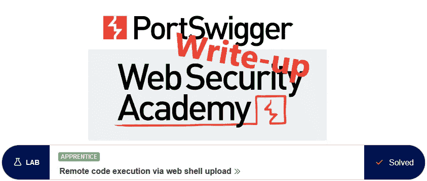
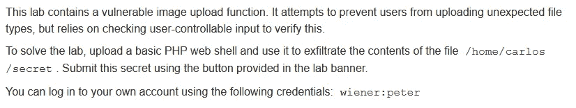
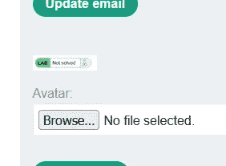
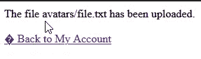
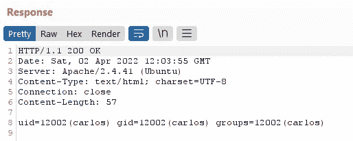
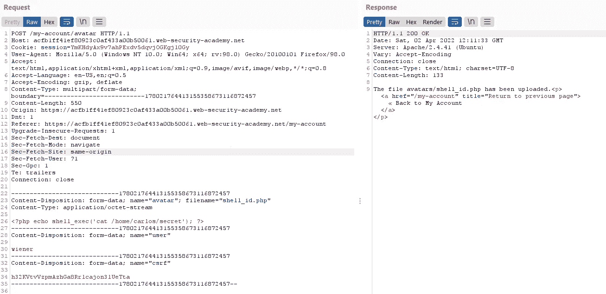
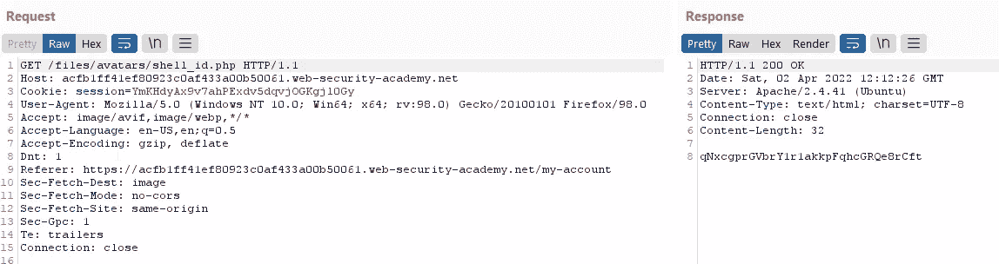
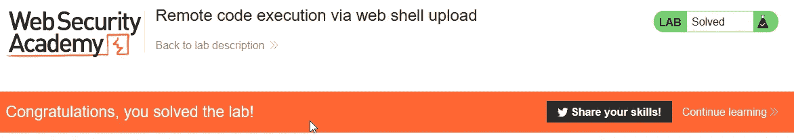

# 推荐:通过 web shell upload @ ports wigger Academy 远程执行代码

> 原文：<https://infosecwriteups.com/write-up-remote-code-execution-via-web-shell-upload-portswigger-academy-5fa00de47229?source=collection_archive---------0----------------------->

这篇关于实验室*通过 web shell 上传远程执行代码*的文章是我为 [PortSwigger 的 web 安全学院](https://portswigger.net/web-security)所做的系列演练的一部分。

**学习路径**:服务器端主题→文件上传漏洞

 [## 实验室:通过 web shell 上传远程执行代码|网络安全学院

### 练习利用现实目标的弱点。记录你从学徒到专家的进步。看哪里…

portswigger.net](https://portswigger.net/web-security/file-upload/lab-file-upload-remote-code-execution-via-web-shell-upload) 

Python 脚本: [script.py](https://github.com/frank-leitner/portswigger-websecurity-academy/blob/main/08_file_upload_vulnerabilities/Remote_code_execution_via_web_shell_upload/script.py)

# 实验室描述

# 步伐

实验室应用程序是一个博客网站。在公共页面上，没有什么有趣的东西出现，我继续用已知的用户帐号`wiener`登录。

在帐户设置中，用户可以设置电子邮件地址以及上传头像图像:

# 找出允许上传的内容

可能有许多验证步骤来检查用户提供的输入是否是恶意的(忽略实验室描述中说没有验证的事实)。常见的验证类型有:

*   文件扩展名
*   内容类型
*   Mime 类型
*   签名(幻数，通常是文件的前几个字节，例如 png 使用`89 50 4E 47 0D 0A 1A 0A`)
*   文件解析/重写

这些可能的验证大多依赖于用户提供的信息。因此，它们不能可靠地用于验证输入。不幸的是，这并没有阻止很多 web 应用程序依赖它们。

作为第一步，我需要找出什么是允许上传的。所以尝试一个简单的文本文件。应用程序确认上传:

页面的 HTML 代码显示图片的 URL 为`/files/avatars/file.txt`。浏览到这个文件显示我的文本文件。如果有任何上传限制，他们是非常宽松的。

在理想的情况下，web 应用程序应该执行一些事情:

1.  理想情况下，通过执行一组非常严格的规则来确保没有代码文件被上传。
2.  防止任何可能漏过并最终出现在头像目录`/files/avatars/`中的代码被执行。

# 上传 web shell

考虑到这是一个学徒级别的实验室，我尝试上传一个简单的 PHP 文件，该文件调用一个 shell 命令:

响应相当清楚，我被允许执行 shell 命令:

RCE 证实

因此，我将原始上传请求发送到 Burp Repeater，并更改命令以输出秘密:

上传了恶意负载

调用该文件将输出秘密文件的内容:

提交信息后，实验室更新到

*原载于【https://github.com】**。***

*`[New to Medium? Become a Medium member to access all stories on the platform and support me at no extra cost for you!](https://medium.com/@frank.leitner/membership)`*

## *来自 Infosec 的报道:Infosec 每天都有很多内容，很难跟上。[加入我们的每周简讯](https://weekly.infosecwriteups.com/)以 5 篇文章、4 个线程、3 个视频、2 个 GitHub Repos 和工具以及 1 个工作提醒的形式免费获取所有最新的 Infosec 趋势！*