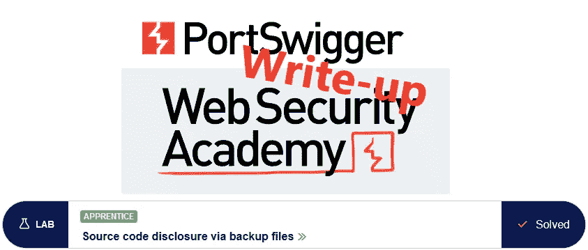
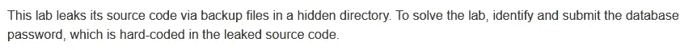
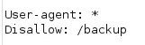
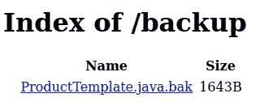
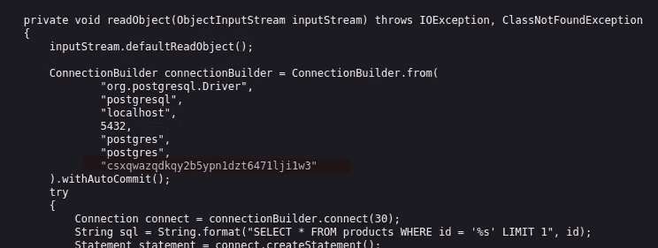
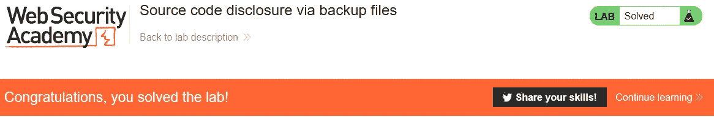

# 特写:通过备份文件@ PortSwigger Academy 公开源代码

> 原文：<https://infosecwriteups.com/write-up-source-code-disclosure-via-backup-files-portswigger-academy-3709812fa111?source=collection_archive---------3----------------------->

这篇通过备份文件披露实验室*源代码的文章是我为 [PortSwigger 的网络安全学院](https://portswigger.net/web-security)所做的系列演练的一部分。*

**学习路径**:服务器端主题→信息披露

 [## 实验室:通过备份文件泄露源代码|网络安全学院

### 这个实验室通过隐藏目录中的备份文件泄露其源代码。要解决实验室问题，请确定并提交…

portswigger.net](https://portswigger.net/web-security/information-disclosure/exploiting/lab-infoleak-via-backup-files) 

Python 脚本: [script.py](https://github.com/frank-leitner/portswigger-websecurity-academy/blob/main/06_information_disclosure/Source_code_disclosure_via_backup_files/script.py)

# 实验室描述

# 步伐

当分析一个网页时，首先要做的一件事就是检查是否存在一个`robots.txt`文件。

它是一个文件，请求搜索引擎爬网程序将网站的某些部分包含在其索引中或从索引中排除。有时，有趣的地点会以这种方式显示出来。

爬虫是服从这些意愿，还是无视这些意愿，就看它自己了。由于文件是纯文本的，这同样适用于任何阅读它的人。

在这种情况下，它直接指向子目录`/backup`(发现它的其他方法可能是像 Burp Content Discovery、gobuster、wfuzz、...)

检查目录显示一些 Java 代码的备份文件:

在代码中，可以找到数据库连接的凭据:

提交解决方案时间后，实验室更新至

*原载于*[*https://github.com*](https://github.com/frank-leitner/portswigger-websecurity-academy/tree/main/06_information_disclosure/Source_code_disclosure_via_backup_files)*。*

`[New to Medium? Become a Medium member to access all stories on the platform and support me at no extra cost for you!](https://medium.com/@frank.leitner/membership)`

## 来自 Infosec 的报道:Infosec 每天都有很多内容，很难跟上。[加入我们的每周简讯](https://weekly.infosecwriteups.com/)以 5 篇文章、4 个线程、3 个视频、2 个 GitHub Repos 和工具以及 1 个工作提醒的形式免费获取所有最新的 Infosec 趋势！