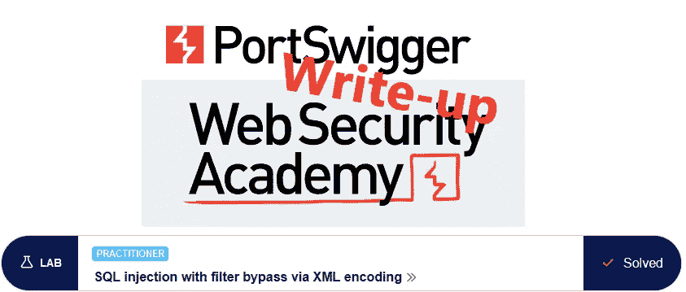
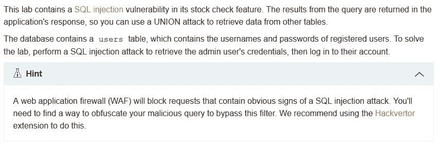
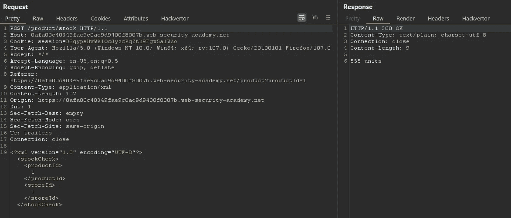
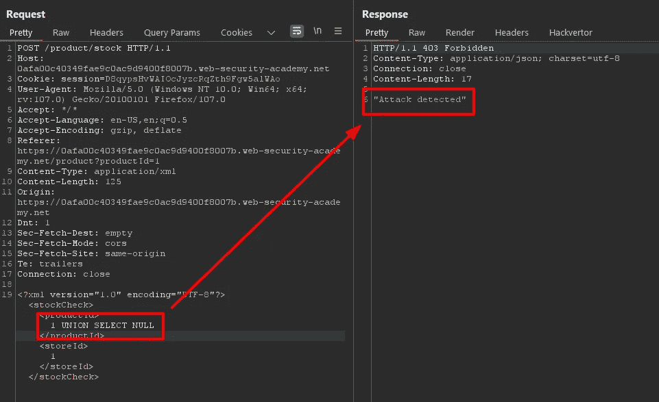
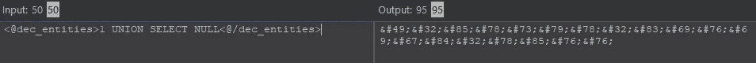
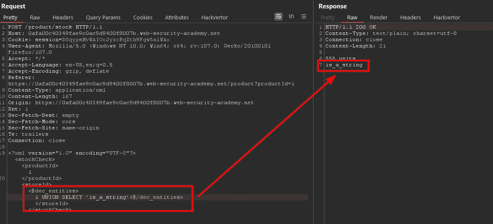
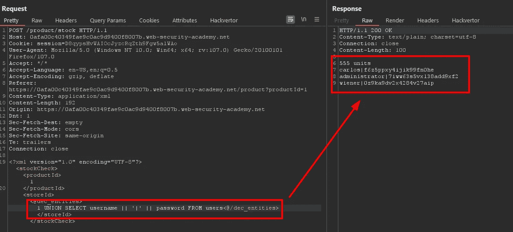
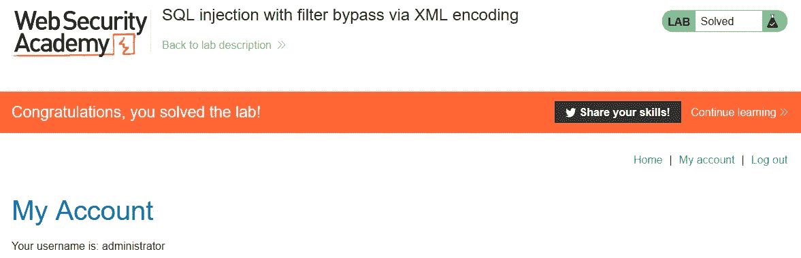

# 特写:通过 XML 编码绕过过滤器的 SQL 注入

> 原文：<https://infosecwriteups.com/write-up-sql-injection-with-filter-bypass-via-xml-encoding-portswigger-academy-977aaeb2b04d?source=collection_archive---------1----------------------->

这篇关于实验室 *SQL 注入通过 XML 编码过滤旁路*的文章是我为 [PortSwigger 的网络安全学院](https://portswigger.net/web-security)所做的一系列演练的一部分。

**学习路径**:服务器端主题→ SQL 注入

 [## 实验室:通过 XML 编码绕过过滤器的 SQL 注入|网络安全学院

### 识别漏洞观察库存检查功能将 productId 和 storeId 发送到应用程序的…

portswigger.net](https://portswigger.net/web-security/sql-injection/lab-sql-injection-with-filter-bypass-via-xml-encoding) 

Python 脚本: [script.py](https://github.com/frank-leitner/portswigger-websecurity-academy/blob/main/01-sqli/SQL_injection_with_filter_bypass_via_XML_encoding/script.py)

# 实验室描述

# 步伐

通常，第一步是分析实验室应用程序的功能。在这个实验室中，它是一个商店网站。正如实验描述中所建议的，我在这个实验中使用了 Burp 扩展 [Hackvertor](https://github.com/portswigger/hackvertor) 。

我可以在几个地方检查每种产品的库存，因此我这样做并在 Burp Proxy 中检查结果:

现在我想看看如果我尝试注入一个基本的 SQL 命令会发生什么。接下来的步骤我分别对参数`productId`和`storeId`执行，因为我不知道使用的 SQL 语句，也不知道这两个参数是否是可注入的。

结果是一样的，至少目前是这样，所以我只展示给`productId`看:

当我收到一个`403 Forbidden`响应时，有某种保护措施来防止这种情况。

# 该理论

根据描述，web 应用防火墙(WAF)已经就位。这种应用程序监控请求并试图发现恶意流量。这些规则可以像黑名单一样简单，包含被禁止的字符或请求。它也可以是一个白名单，只允许某些已知良好的结构通过。或者它们的任意组合。

我的第一个尝试是使用 HTML 编码来找出解码是发生在 WAF 之前还是之后(在本实验中，HTML 编码足以绕过 WAF)。但是由于请求包含 XML 形式的参数，我尝试注入 XML 实体。

有许多解释 XML 实体的网站，例如微软 xaml 文档中的[tutorialspoint.com](https://www.tutorialspoint.com/xml/xml_character_entities.htm)或[。](https://learn.microsoft.com/en-us/dotnet/desktop/xaml-services/xml-character-entities)

我可以用`&#NN;`和`&#xNN;`分别对字符的十进制或十六进制值进行编码。幸运的是， [Hackvertor](https://github.com/portswigger/hackvertor) 扩展两者都有。我从十进制实体开始。

Heckvertor 在其接口中显示实际输出，我可以直接使用 Repeater 中的编码值。然而，使用`<@dec_entities>1 UNION SELECT NULL<@/dec_entities>`比`&#49;&#32;&#85;&#78;&#73;&#79;&#78;&#32;&#83;&#69;&#76;&#69;&#67;&#84;&#32;&#78;&#85;&#76;&#76;`更容易阅读和使用。

在这一点上，`productid`和`storeId`的用法不同于它们的输出。在`productId`中使用 SQL 字符串会显示`0 units`，这表明我绕过了 WAF，但是没有用注入的语句产生有效的结果。

这与`storeId`不同，在那里我在包含注入的`null`结果的输出中接收到一个额外的行。

同时，它确认我有一个输出列，否则 UNION 将是无效的。

# 检查字符串列

下一个问题是我是否可以使用这个列来传输一个字符串值。

在一个像样的应用程序中，股票将存储在一个数值字段中，应用程序添加了 `units`字符串只是为了显示。在这里，前端不这样做，因为我从服务器接收完整的字符串。它可以由后端添加，或者作为完整的字符串存储在数据库中。在后一种情况下，我可以很容易地使用这个列。

我将语句改为输出一个字符串值:

如输出所示，该列确实是一个字符串列。

# 表和列名

下一步是枚举表名和列名，找出用户数据存储的位置。

对于本实验，实验说明包含表名和列名，因此我不必一一列举。在这篇文章中，我将跳过这一部分。如果您对细节感兴趣，有实验室展示如何为 Oracle 和非 Oracle 数据库分别做这件事。

# 恶意负载

我有一个单独的输出列，我需要在其中传输用户名和密码。有一个专门的实验室研究[如何在单个列中检索多个值](https://medium.com/@frank.leitner/write-up-sql-injection-union-attack-retrieving-multiple-values-in-a-single-column-portswigger-7b05df43458b)。

我用一个单独的`|`作为分隔符:`<@dec_entities>1 UNION SELECT username || '|' || password FROM users<@/dec_entities>`将用户名和密码连接在一起。如果用户名或密码包含我的分隔符，我可能需要更改它，特别是如果我稍后在脚本中自动执行它。

幸运的是，所有用户名和密码都是字母数字。

我使用`administrator`的凭证登录，实验室更新到

# 关于 Hackvertor 的结束语

这是我第一次尝试使用 Hackvertor 扩展。直到今天，每当我需要编码字符时，我都会将编码字符串复制到 Burp Repeater 中。当然，在 Repeater 中快速调整字符串是困难和不可能的，大多数时候我在别处编辑字符串并再次将编码版本复制到 Repeater 中。这也意味着，如果编码字符串中包含任何可变内容，则不能使用 Burp Intruder。

现在，我看到了在 Burp 中拥有一个可读性很强且易于修改的字符串，使其在中继器和入侵者中都可用是多么容易。Hackvertor 无疑在我的必备扩展中赢得了一席之地。

*原载于*[*https://github.com*](https://github.com/frank-leitner/portswigger-websecurity-academy/tree/main/01-sqli/SQL_injection_with_filter_bypass_via_XML_encoding)*。*

`[New to Medium? Become a Medium member to access all stories on the platform and support me at no extra cost for you!](https://medium.com/@frank.leitner/membership)`

## 来自 Infosec 的报道:Infosec 每天都有很多内容，很难跟上。[加入我们的每周简讯](https://weekly.infosecwriteups.com/)以 5 篇文章、4 个线程、3 个视频、2 个 GitHub Repos 和工具以及 1 个工作提醒的形式免费获取所有最新的 Infosec 趋势！