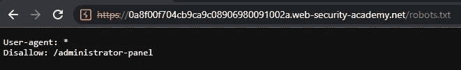
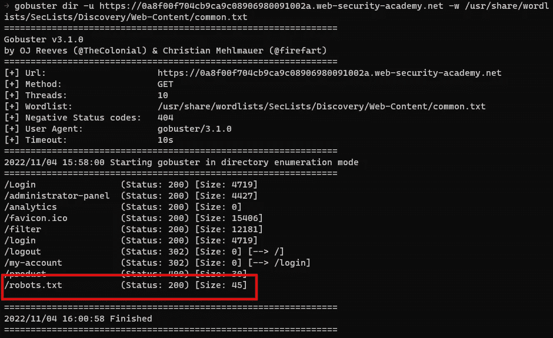
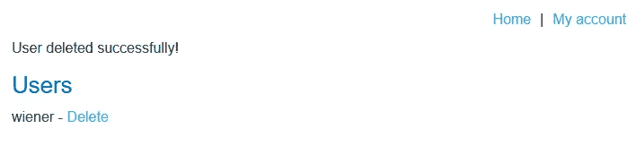

# 报道:未受保护的管理功能@ PortSwigger Academy

> 原文：<https://infosecwriteups.com/write-up-unprotected-admin-functionality-portswigger-academy-d5804e3bb65?source=collection_archive---------2----------------------->

这篇关于实验室*不受保护的管理功能*的文章是我在 [PortSwigger 的网络安全学院](https://portswigger.net/web-security)的演练系列的一部分。

**学习路径**:服务器端主题→访问控制漏洞

 [## 实验室:不受保护的管理功能|网络安全学院

### 这个实验室有一个不受保护的管理面板。通过删除用户 carlos 来解决实验室问题。解决方案去实验室查看…

portswigger.net](https://portswigger.net/web-security/access-control/lab-unprotected-admin-functionality) 

Python 脚本: [script.py](https://github.com/frank-leitner/portswigger-websecurity-academy/blob/main/07_access_control/Unprotected_admin_functionality/script.py)

# 实验室描述

# 步伐

第一步是获得一个商店网站的 web 应用程序的概述。

在网站枚举期间，首先要做的事情之一是检查 robots.txt 文件是否存在。它是一个文件，请求搜索引擎爬网程序将网站的某些部分包含在其索引中或从索引中排除。有时，有趣的地点会以这种方式显示出来。

爬虫是服从这些意愿，还是无视这些意愿，就看它自己了。由于文件是纯文本的，这同样适用于任何阅读它的人。

有很多方法可以检测这个文件的存在和内容。

# 手动浏览

我可以尝试在浏览器中加载该文件，看看它是否存在及其内容:

这可以从命令行快速完成，例如使用 curl:

# 使用工具

在任何合理的单词列表文件中，`robots.txt`文件也包含在内。无论使用何种工作流程，任何攻击者都会立即看到该文件，如本例所示，使用 [gobuster](https://github.com/OJ/gobuster) 和 [SecLists](https://github.com/danielmiessler/SecLists) 中的单词列表:

很多工具都是自动完成的。例如， [Nikto](https://github.com/sullo/nikto) 甚至检查`robots.txt`文件中提到的文件或目录是否存在，并直接在其输出中报告结果:

# 造成伤害

该文件不得用于“保护”任何文件或目录。“不允许”只是友好地请求蜘蛛不要索引这些东西。是否服从这个请求取决于蜘蛛。谷歌公司会，其他公司不会。任何检查文件的人都知道什么是不允许的。

解决实验室问题就像用户`carlos`访问`https://0a8f00f704cb9ca9c08906980091002a.web-security-academy.net/administrator-panel`并点击`Delete`一样简单:

同时，实验室更新到

【https://github.com】最初发表于**。**

*`[New to Medium? Become a Medium member to access all stories on the platform and support me at no extra cost for you!](https://medium.com/@frank.leitner/membership)`*

## *来自 Infosec 的报道:Infosec 每天都有很多内容，很难跟上。[加入我们的每周简讯](https://weekly.infosecwriteups.com/)以 5 篇文章、4 个线程、3 个视频、2 个 GitHub Repos 和工具以及 1 个工作提醒的形式免费获取所有最新的 Infosec 趋势！*