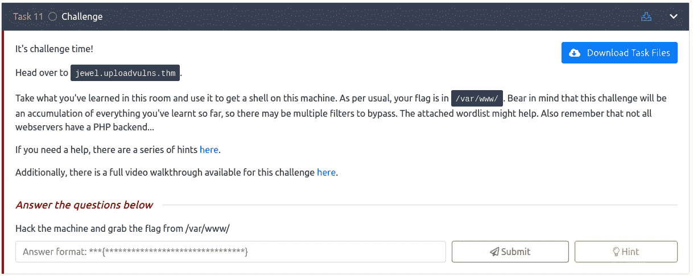
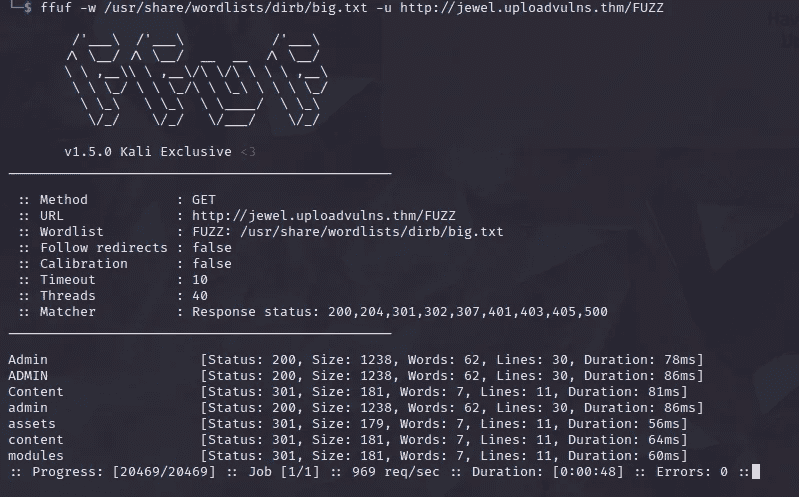
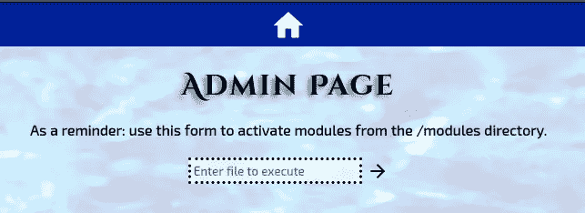
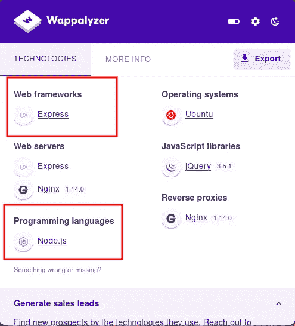
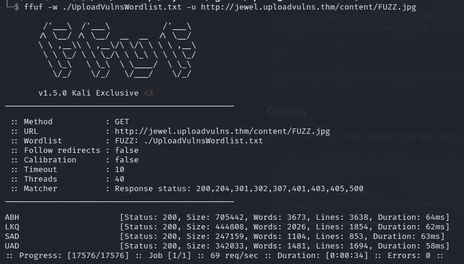
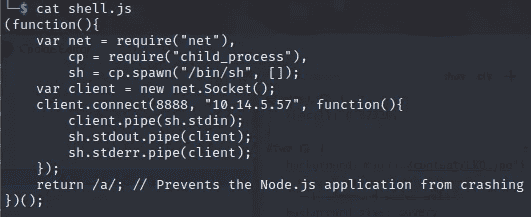
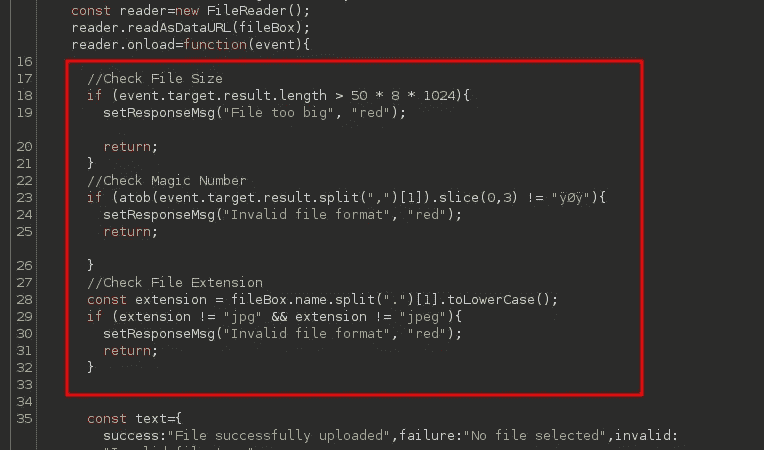
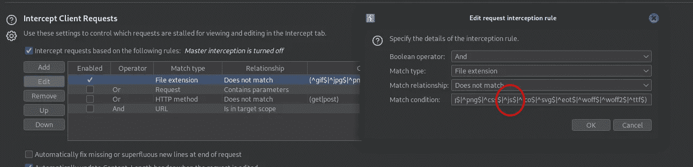
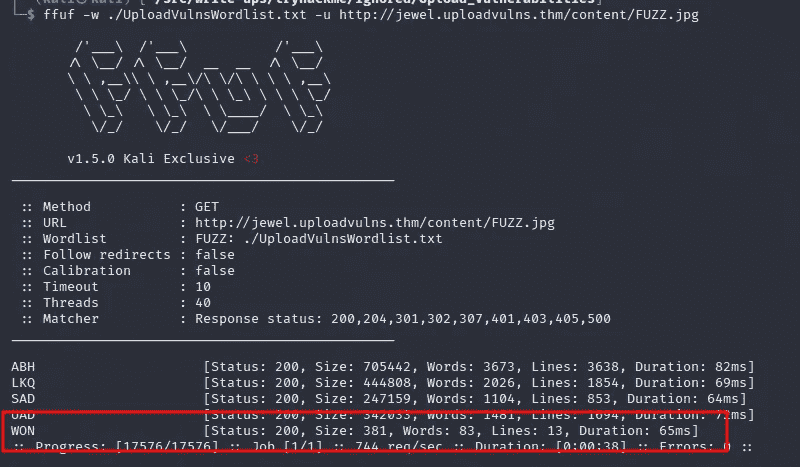
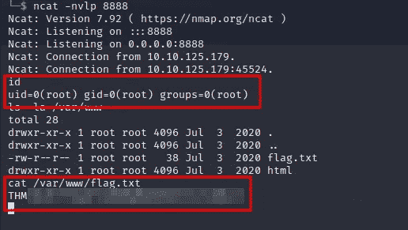

# 报道:上传漏洞@ TryHackMe

> 原文：<https://infosecwriteups.com/write-up-upload-vulnerabilities-tryhackme-32bbaca5686c?source=collection_archive---------2----------------------->


这篇关于房间*上传漏洞*的挑战任务的文章是我为 [TryHackMe](https://tryhackme.com) 所做的走查系列的一部分。

[](https://tryhackme.com/room/uploadvulns) [## 网络安全培训

### TryHackMe 是一个免费的学习网络安全的在线平台，使用动手练习和实验室，通过您的…

tryhackme.com](https://tryhackme.com/room/uploadvulns) 

**房型**:仅限订阅
**难度**:容易

# 实验室描述



# 步伐

该网络应用程序是一个图像的幻灯片集，它也允许上传自己的图像。


# 检测内容

该页面本身并没有揭示任何太有趣的东西。我从模糊化开始，看看能否找到更多内容:

```
ffuf -w /usr/share/wordlists/dirb/big.txt -u [http://jewel.uploadvulns.thm/FUZZ](http://jewel.uploadvulns.thm/FUZZ)
```



果然，找到了更多的目录。快速浏览 CSS 可以看到旋转的背景图片来自于`/content/`目录。`/admin/`目录显示模块可以在这里激活的提示。



其他目录没有显示任何有趣的内容。

# 检测使用的技术

我的下一步是找出页面使用了什么技术，看看它们可能引用什么类型的模块。为此，我用 Wappalyzer 检查了页面:



它显示为运行在`Express`框架上的`node.js`应用程序。

## 在子目录中查找内容

我检查子目录中找到的附加内容。单词列表中的命名模式与图片的命名模式相匹配，所以我也用这个列表检查了`/content/`目录。

```
ffuf -w ./UploadVulnsWordlist.txt -u [http://jewel.uploadvulns.thm/content/FUZZ.jpg](http://jewel.uploadvulns.thm/content/FUZZ.jpg)
```



果然，它找到了用作背景的四幅图像。其他的扫描都没有显示出来。

# 获取反向外壳的脚本

我知道这个应用程序是一个 Node.js 应用程序，所以我从 [PayloadsAllTheThings](https://github.com/swisskyrepo/PayloadsAllTheThings/blob/master/Methodology%20and%20Resources/Reverse%20Shell%20Cheatsheet.md#nodejs) 中得到一个反向 shell，并更改 IP/port 以匹配我的:



## 上传外壳

我试图上传脚本，但它被应用程序阻止。然而，它是由 JavaScript 触发的消息，所以我使用 Burp history 来检查加载的脚本文件。

在`/assets/js/upload.js`中，我找到了罪魁祸首，客户端验证码:



删除有问题的 JavaScript

要拦截 JavaScript 文件，我需要更改代理选项来拦截 JS 文件，因为默认情况下 Burp 代理不会拦截它们:



移除了`^.js$`条件后，我用 Ctrl-F5 重新加载页面，强制进行一次完全刷新。

当`upload.js`请求被拦截时，我指示 Burp 拦截它的响应(请求中的 RMB 并选择`Do Intercept->Response to this request`)并删除上面标记的行。

我尝试重新上传，但还是失败了，这次是通过服务器端的验证。

在理想情况下，服务器应该执行客户机所做的所有验证。毕竟，客户端验证只是为了可用性。安全性只能通过服务器端验证来提供。

然而，我假设这个世界并不理想，服务器会执行其他验证。我将文件扩展名改为`jpg`，并重试上传。这一次，它成功了。

# 查找上传的外壳

我刚刚上传的文件在任何目录中都找不到它的已知名称。我用提供的单词表重新运行了`/contents/`目录的模糊化。

这一次，我在那里找到了一个附加文件:



# 得到一个反壳

在`/admin/`页面上，我可以激活`/modules/`目录中的模块，服务器应该强制它不接受任何其他位置

我刚刚上传的文件位于`/content/`。但是可能没有适当的验证来防止路径遍历。

我在我的机器上用`nc -nvlp 8888`启动一个监听器，并通过它的相对路径`../content/WON.jpg`激活模块

我收到的 shell 显示应用程序以 root 用户身份运行。因此，不需要权限提升，我可以直接获得标志:



*最初发表于*[*https://github.com*](https://github.com/frank-leitner/tryhackme/tree/main/Upload_Vulnerabilities)*。*

*来自 Infosec 的报道:Infosec 上每天都会出现很多难以跟上的内容。* [***加入我们的每周简讯***](https://weekly.infosecwriteups.com/) *以 5 篇文章、4 个线程、3 个视频、2 个 Github Repos 和工具以及 1 个工作提醒的形式免费获取所有最新的 Infosec 趋势！*