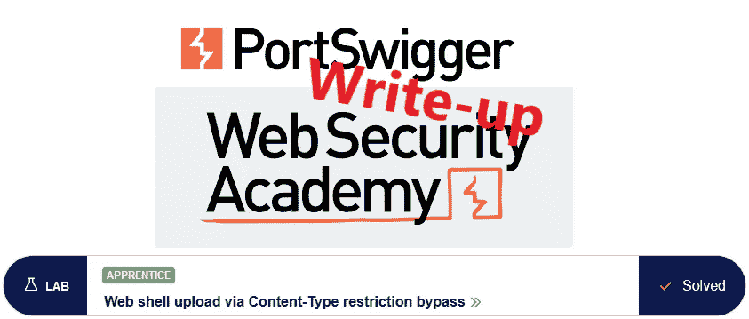
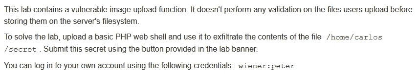
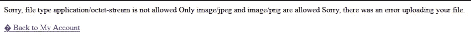
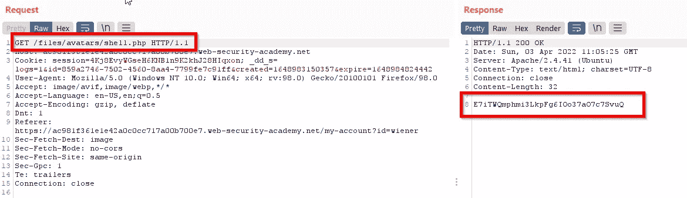
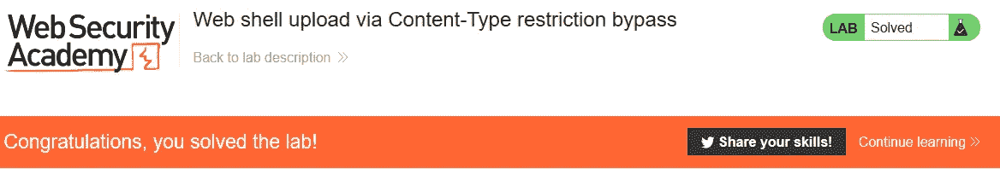

# 推荐:通过内容类型限制旁路@ PortSwigger Academy 进行 Web shell 上传

> 原文：<https://infosecwriteups.com/write-up-web-shell-upload-via-content-type-restriction-bypass-portswigger-academy-839365e13bc?source=collection_archive---------3----------------------->



这篇关于通过内容类型限制旁路的实验室 *Web shell 上传的文章是我在 [PortSwigger 的 Web 安全学院](https://portswigger.net/web-security)的演练系列的一部分。*

**学习路径**:服务器端主题→文件上传漏洞

[](https://portswigger.net/web-security/file-upload/lab-file-upload-web-shell-upload-via-content-type-restriction-bypass) [## 实验室:通过内容类型限制旁路上传 Web shell | Web Security Academy

### 练习利用现实目标的弱点。记录你从学徒到专家的进步。看哪里…

portswigger.net](https://portswigger.net/web-security/file-upload/lab-file-upload-web-shell-upload-via-content-type-restriction-bypass) 

Python 脚本: [script.py](https://github.com/frank-leitner/portswigger-websecurity-academy/blob/main/08_file_upload_vulnerabilities/Web_shell_upload_via_Content-Type_restriction_bypass/script.py)

# 实验室描述



# 步伐

# 第一眼

实验室应用程序是一个博客网站。在公共页面上，没有什么有趣的东西出现，我继续用已知的用户帐号`wiener`登录。

在帐户设置中，我可以为用户设置电子邮件地址和头像图片。

# 找出允许上传的内容

首先，我试着上传[之前实验](https://github.com/frank-leitner/portswigger-websecurity-academy/blob/main/08_file_upload_vulnerabilities/Remote_code_execution_via_web_shell_upload/README.md)的 PHP 脚本。这一次，有一些上传限制，我收到一条错误消息:



然而，错误消息指出了一些细节

1.  第一个失败的检查验证内容类型，这是用户提供的值。
2.  它显示了允许的内容类型的值。

# 修改内容类型

下一步是将请求中的内容类型修改为允许的类型之一。

如果这是执行的唯一检查，我将成功。否则，错误消息可能会再次给出如何继续的指示。

我将上传请求加载到 Repeater 中，并更改内容类型。

响应表示成功。这意味着内容类型验证是应用程序执行的唯一检查:


文件名保持为`shell.php`,以便服务器可以执行它。调用上传的脚本显示秘密数据:



提交秘密后，实验室更新到



*原载于*[*https://github.com*](https://github.com/frank-leitner/portswigger-websecurity-academy/tree/main/08_file_upload_vulnerabilities/Web_shell_upload_via_Content-Type_restriction_bypass)*。*

```
[New to Medium? Become a Medium member to access all stories on the platform and support me at no extra cost for you!](https://medium.com/@frank.leitner/membership)
```

## 来自 Infosec 的报道:Infosec 每天都有很多内容，很难跟上。[加入我们的每周简讯](https://weekly.infosecwriteups.com/)以 5 篇文章、4 条线索、3 个视频、2 个 GitHub Repos 和工具以及 1 个工作提醒的形式免费获取所有最新的 Infosec 趋势！