# 编剧:黑客盒子演练

> 原文：<https://infosecwriteups.com/writer-hackthebox-walkthrough-1ff86b33799a?source=collection_archive---------0----------------------->

## 描述

作者是 HackTheBox 上的另一个好盒子。只需在/etc/hosts 文件中添加 writer.htb，就可以开始了。

> 获得的知识

1.  SMB 枚举
2.  SSH 暴力强制
3.  pspy64
4.  发送邮件的 Python 代码
5.  权限提升

> 端口扫描

在我的端口扫描过程中，我首先使用 [**rustscan**](https://tryhackme.com/room/rustscan) 快速找出开放端口的数量…

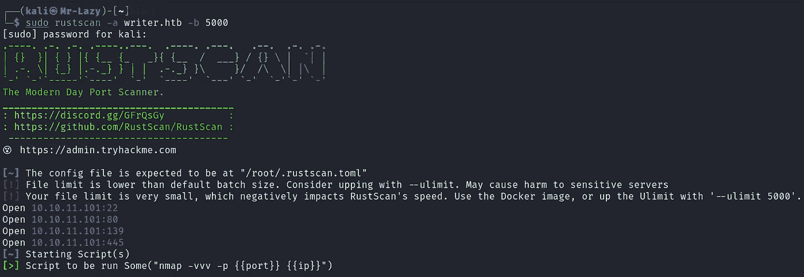

…然后在那些开放的端口上开始详细的 **Nmap** 扫描。这为我节省了扫描时间。

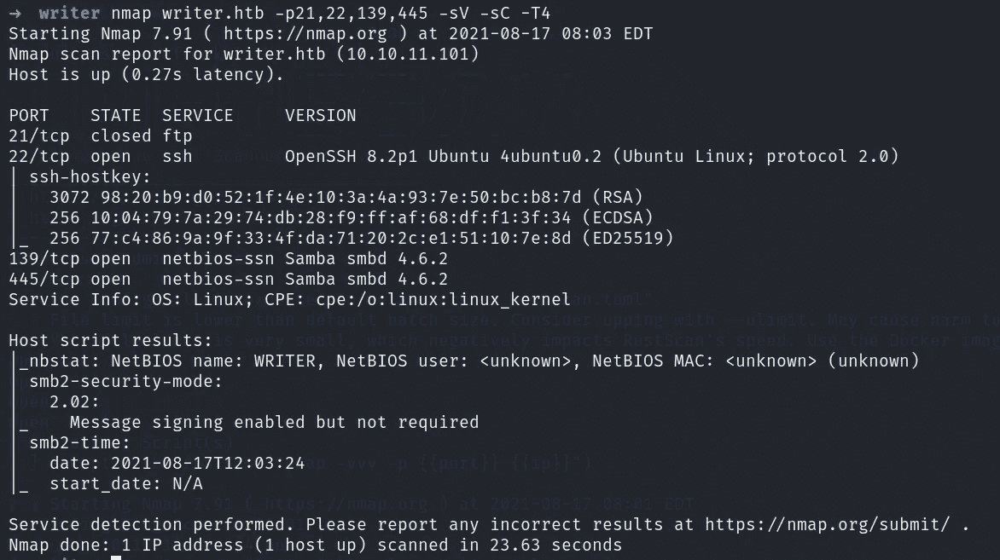

> 网络侦察

所以我们先列举一下 80 端口。索引页如下所示。页面源代码不包含任何有用的内容。

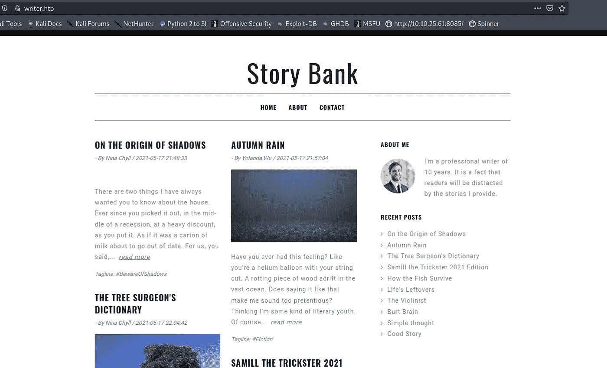

让我们开始对 URL→[http://writer.htb/](http://writer.htb/)进行 **ffuf** 扫描

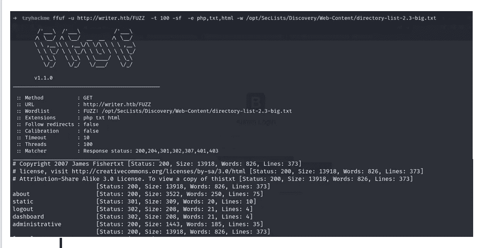

发现了相当多的路径，但是只有/administrative 是有用的。所以我们在 URL→[http://writer.htb/administrative](http://writer.htb/administrative)上有一个登录页面

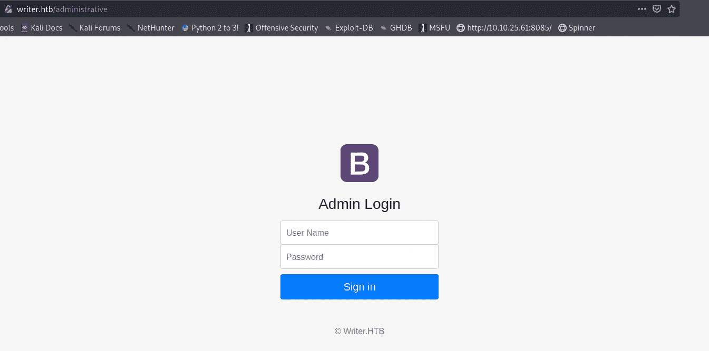

在执行 SQL 注入之前，让我们列举端口 139、445。

> SMB 枚举

让我们尝试使用 smbmap 递归列出共享。

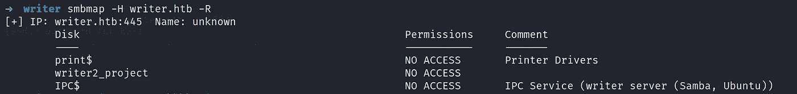

如您所见，没有可用的共享，让我们尝试连接到[**RPC client**](https://infinitelogins.com/2020/06/17/enumerating-smb-for-pentesting/)**。**

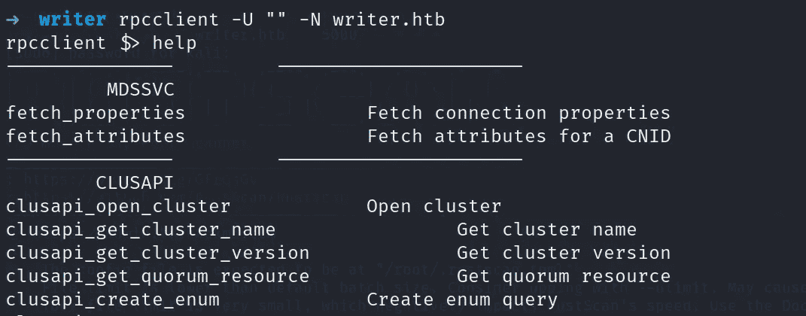

因此，基本上我是在尝试检查是否允许任何空会话认证。好了，我们连接好了，现在我们可以使用帮助选项来检查命令。在这种情况下，我们必须列出是否有用户。使用此 [**链接**](https://bitvijays.github.io/LFF-IPS-P3-Exploitation.html) 了解更多信息。

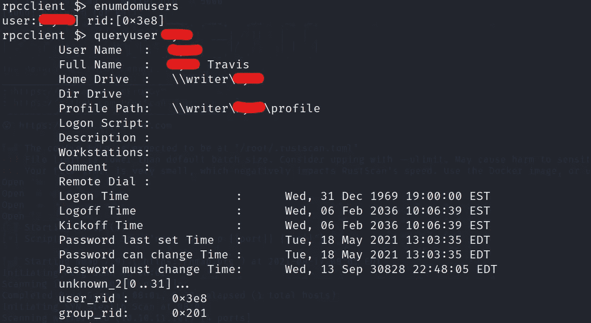

所以我们有了一个潜在用户。

> SSH 暴力强制

使用用户名和一个著名的密码单词列表。

不要失去耐心，等待一段时间…

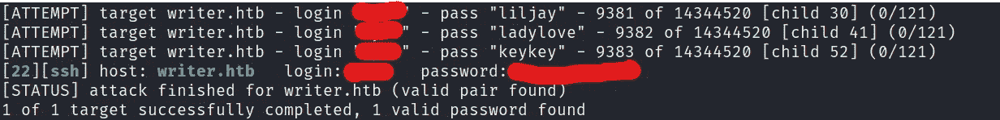

…现在使用凭据登录 ssh 会话。

正如我们在用户的主目录中看到的，我们有 pspy64 用于分析 cron 作业。运行 pspy64 表明我们可以有一个免责声明文件，从发送者发送到接收者。在我们的例子中，发送者是当前用户，但接收者可能是当前用户或其他用户。

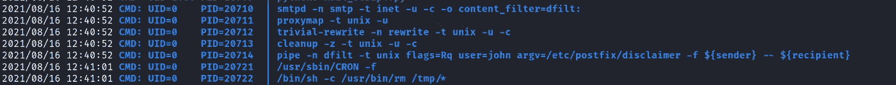

让我们先用**“查找”**命令查找文件。

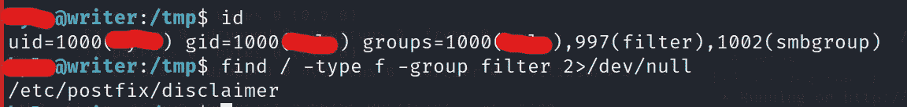

因此，在浏览脚本时，我尝试在脚本中追加反向 shell，但问题是在运行追加的代码之前，有一个 cron 作业被设置为将脚本清除到默认状态。因此，我们必须使用 python 脚本将该文件作为邮件发送。我用的是[***代码***](https://realpython.com/python-send-email/) 根据用途定制。

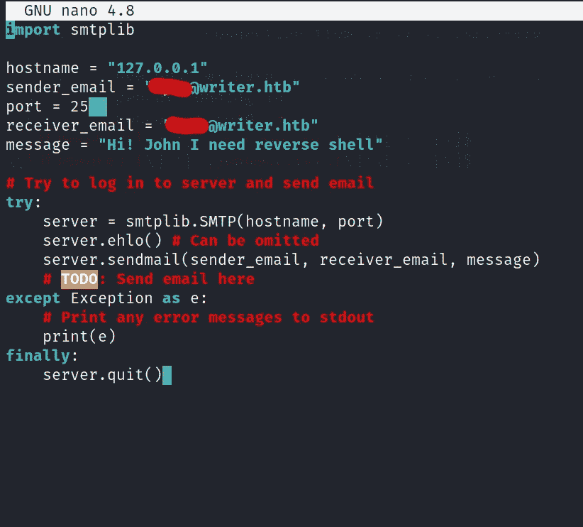

现在，在我们之前找到的文件中添加反向外壳代码，用您的机器 IP 更改 IP，并运行 python 代码。确保在新终端中运行任何 shell 捕获工具。

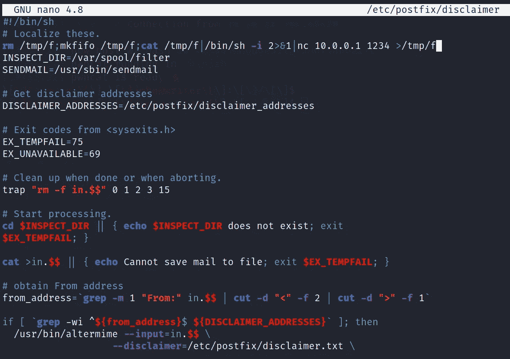

然后，我们为用户 John 创建了一个 shell 会话。仅供参考→我正在使用[***pwn cat***](https://github.com/calebstewart/pwncat)进行反向 shell。

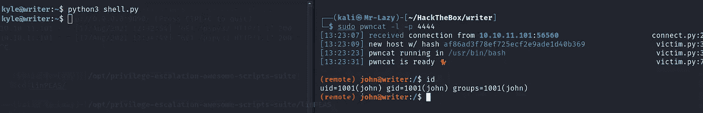

导航到 John 主目录并获取用于 SSH 登录的 id_rsa 密钥。注意:-提供对 id_rsa 文件" **chmod 600 id_rsa** "的权限。使用“**SSH-I id _ RSA John @ writer . htb**”登录用户 John。

因为我们没有约翰的密码，我们不能检查 sudo 许可。我检查了组，我们在“管理”组中有 John。使用**查找**命令获得了该组的目录权限。

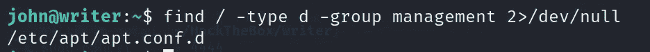

于是，在 google 中搜索了一下通过 apt 进行权限提升的位后，我得到了两个有用的链接:-**[**link 1**](https://lsdsecurity.com/2019/01/linux-privilege-escalation-using-apt-get-apt-dpkg-to-abuse-sudo-nopasswd-misconfiguration/)和 [**Link2**](https://www.hackingarticles.in/linux-for-pentester-apt-privilege-escalation/) **。****

**在撰写本文时，该博客的 link1 已过期，这说明我们必须在/etc/apt/apt.conf.d 路径中创建一个文件，在该路径中，我们可以放置反向 shell，link2 说明如果我们拥有 apt 的 sudo 权限，我们可以升级到 root，但在这种情况下，我们不能。**

**再次运行 pspy64，我观察到 apt-get 作为一个 cronjob 运行。**

**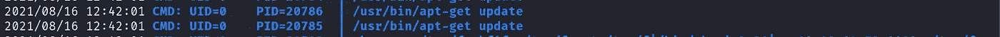**

**如果你没有看到 pspy64，你可以把它从你的机器上转移。所以，为了启动一个本地服务器，我使用了[**updog**](https://github.com/sc0tfree/updog)**工具。请在使用前授予 execute 权限。****

****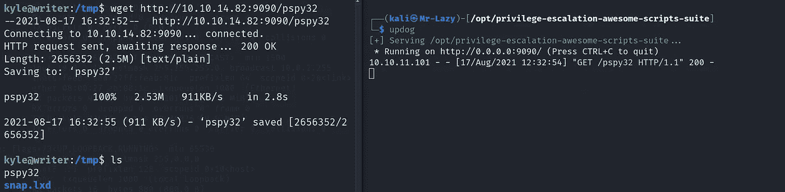****

****因此，要获得一个反向 shell，需要输入这个命令并等待一秒钟。更换 IP 并在新端子中启动 **nc** 或 **pwncat** 进行连接。****

****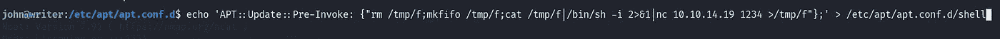****

****然后嘣…..****

****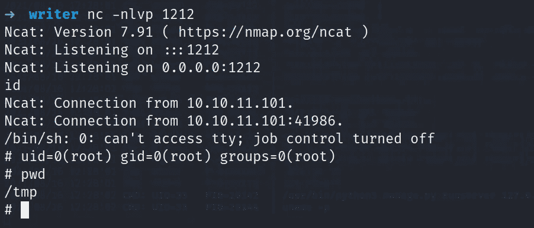****

****去抓取你的 root.txt 文件。****

****如果你愿意，你可以为我的 OSCP 考试捐款👏****

********

# ****在你走之前****

****这是我的另一个黑客机器演练:-****

**** [## 世界末日:黑客盒子演练

### 描述

shubham-singh.medium.com](https://shubham-singh.medium.com/armageddon-hackthebox-walkthrough-6d8e2261a676)  [## 学院:黑客盒子演练

### 描述

shubham-singh.medium.com](https://shubham-singh.medium.com/academy-hackthebox-walkthrough-9102c5d79dee)  [## 懒人先生-概述

### 网络安全爱好者🐱‍💻。拉兹先生有 7 个存储库可用。在 GitHub 上关注他们的代码。

github.com](https://github.com/Mr-Lazzy) 

鼓掌👏如果你喜欢的话。****