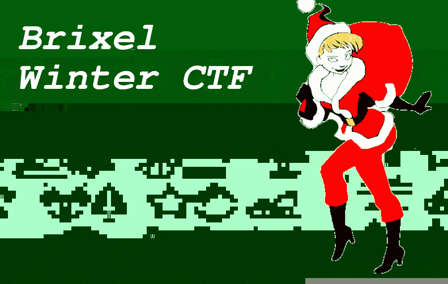
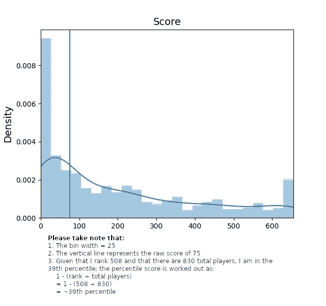
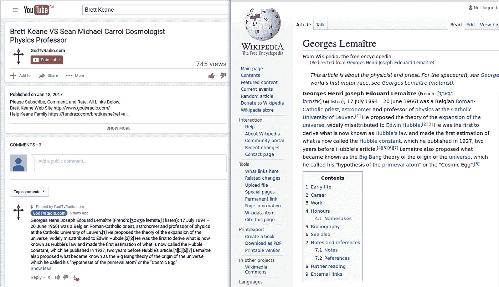
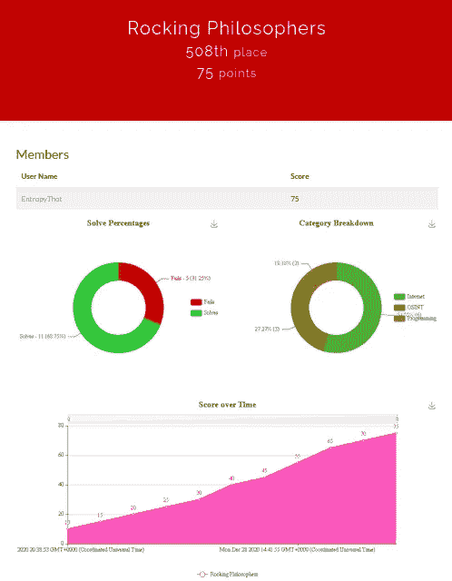

# 写给 Brixel winter capture the flag

> 原文：<https://infosecwriteups.com/writeup-to-the-brixel-winter-capture-the-flag-a1c5062ddfb6?source=collection_archive---------1----------------------->



# 目录一览

1.  介绍
2.  dem 挑战
3.  光荣的提及
4.  最后的想法
5.  承认
6.  尾注

# 介绍

圣诞节后，Brixel 冬季捕捉国旗(2020 年版。)开始了。在这个 CTF 中，参赛者面临 59 个不同的挑战，分为 9 个类别:密码学、互联网、速记、OSINT、辩论学、编程、逆向工程或破解以及旧技术。

我注册成为用户 *EntropyThot* ，并组建了一个由我自己组成的“团队”，名为*摇摆哲学家*。我排在第 39 百分位，原始分数为 75 分(见下表)。我只解决了总共 59 个挑战中的 9 个，但尽管如此，我还是想讨论其中的一些，并荣幸地提到一个有趣的小挑战，我无法解决，但值得一提，因为它可以用来引用两个了不起的 Twitter 用户。



Brixel winter CTF 的原始分数分布(2020 版。).垂直线是我在比赛中的位置(查看记分牌[这里](https://archive.is/hXOk1)，我的结果[这里](https://archive.is/nS1xl)以及用于生成此图的代码[这里](https://github.com/Alekseyyy/ctfs/tree/main/infosec/2020/brixelctf/statistics))。

# dem 挑战

我不会讨论所有我能设计出旗子的挑战，只讨论我觉得最有趣的挑战。如果你感兴趣，我会提供一个 GitHub repo 的链接，在那里我会发布更多的代码和文章。

## 互联网

我从讨论`Browsercheck`挑战开始。挑战指出:

```
I found this weird website, but it will only allow 'ask jeeves crawler' to enter?

Can you get me in?

http://timesink.be/browsercheck/
```

我可以安装一个浏览器插件来改变用户代理，但是老实说，我不想给我的浏览器添加更多的垃圾😋

我解决了以前的 CTF 的一个类似的挑战，我只是改变了我从以前的 CTF 写的脚本来应对这个挑战:

第 17-32 行使用 Python 的`wx`库来呈现 HTML 页面，第 34-40 行使用 Python 的`requests`库在`[http://timesink.be/browsercheck/.](http://timesink.be/browsercheck/)`获取页面。第 37 行是最重要的部分，因为在这里我将`User-Agent`配置为最常见的 Ask Jeeves 代理。

运行程序显示标志:`brixelCTF{askwho?}`

## OSINT

我将要讨论的新挑战叫做`Manhunt.`,它分为七个部分，但我没有全部解决😢我只讨论第一个。

这些挑战表明:

```
My dad is pissed off! He was told by my mother NOT to buy ice cream but he did anyway when she wasn't looking.

Someone posted this picture on the internet and my mother saw it, man, he is in so much trouble!

I want to know WHO posted this picture, let's hunt this guy down!

This flag is not in the usual format, you can enter it with or without the brixelCTF{flag} format, replace spaces with underscores ('_')

This is part of a series, more challenges will be unlocked once you solve this one. While most challenges will be OSINT, some of them may not be.
```

所以我下载了图片([这里](https://raw.githubusercontent.com/Alekseyyy/ctfs/main/2020/brixelctf/challenges/osint/Manhunt1/icecream.jpg))，并且能够用 exiftool 算出名字:

```
**$ exiftool icecream.jpg**
ExifTool Version Number : 10.80
File Name : icecream.jpg
Directory : .
File Size : 322 kB
File Modification Date/Time : 2020:12:27 15:51:56–05:00
File Access Date/Time : 2021:01:06 23:34:14–05:00
File Inode Change Date/Time : 2021:01:06 15:44:32–05:00
File Permissions : rw-rw-r — 
File Type : JPEG
File Type Extension : jpg
MIME Type : image/jpeg
Exif Byte Order : Big-endian (Motorola, MM)
Resolution Unit : inches
Y Cb Cr Positioning : Centered
Exif Version : 0231
Components Configuration : Y, Cb, Cr, -
Flashpix Version : 0100
Owner Name : **Johnny Dorfmeister**
Image Width : 1536
Image Height : 2048
Encoding Process : Baseline DCT, Huffman coding
Bits Per Sample : 8
Color Components : 3
Y Cb Cr Sub Sampling : YCbCr4:4:4 (1 1)
Image Size : 1536x2048
Megapixels : 3.1
```

你可以清楚地看到，这个家伙的名字是*约翰尼·多夫迈斯特*。所以，标志必须是:`brixelCTF{Johnny_Dorfmeister}.`

## 编程；编排

我将讨论我遇到的两个编程挑战。第一个叫做`Are you fast enough?`,上面写着:

```
Can you program something that is fast enough to submit the solution before the time runs out? http://timesink.be/speedy
```

该挑战在页面加载时提供一个随机字符串，最多给你一(1)秒时间将该随机字符串输入文本框并提交。当然，大多数人(包括我自己)无法手动完成，所以我决定让它自动化。

我最初试图使用 Python 的`requests`模块来自动化提交随机字符串的过程，但这并不奏效，因为我必须发出一个请求来获取随机字符串，并发出另一个请求来提交第一个请求获得的字符串。问题是第二个请求将生成一个全新的字符串。

我想我会使用 Python 的`selenium`模块来自动化网络浏览器任务。下面是我想出的派生旗帜的代码:

第 14–18 行配置 web 浏览器(在本例中是 Firefox)。第 21 行和第 22 行获取随机字符串并将其存储在一个名为`the_key`的变量中，第 25 行到第 28 行提交标志，最后，第 31 行到第 33 行打印出标志。

产生的标志是:`brixelCTF{sp33d_d3m0n}`

我做的第二个挑战叫做`Keep walking`，它说:

```
This is a challenge to test your basic programming skills.

Pseudo code:
Set X = 1
Set Y = 1
Set previous answer = 1
answer = X * Y + previous answer + 3

After that => X + 1 and Y + 1 ('answer' becomes 'previous answer') and repeat this till you have X = 525.

The final answer is the value of 'answer' when X = 525\. Fill it in below.

Example:

5 = 1 * 1 + 1 + 3
12 = 2 * 2 + 5 + 3
24 = 3 * 3 + 12 + 3

........................
........................

This flag is not in the usual format, you can enter it with or without the brixelCTF{flag} format
```

这只是一个你能不能把伪代码翻译成真代码的问题。我导出标志的方法是:

说实话，没什么好说的。本次挑战的旗帜是:`brixelCTF{48373851}`

# 光荣的提及

好吧，这是一个很大的失败(对我来说),只是需要提到。`Dadjokes`挑战。我发誓，我马上想到了推特用户 [@rasmansa](http://twitter.com/rasmansa) 和 [@c0nc0rdance](https://twitter.com/c0nc0rdance) 在尝试为这次挑战设计旗帜时，上面写着:

```
Darn! Some idiot scriptkiddy broke my favorite website full of dad jokes! I can't seem to contact the owner to fix the site Can you bring it back and remove the defaced page?

http://timesink.be/dadjokes/
```

好的，所以我试着通过查看损坏页面的源代码来做这件事，这给了我:

```
<!-- Hey bozo! I left your original index file under  index_backup.html so you can see how your site looked before I used my  l33t skillz to deface it. -->
```

然后我找到了`submit.php`,试图通过提交一堆我从@rasmansa 和@c0nc0rdance 上剽窃来的父亲笑话来探究这个问题(你知道，就像布雷特·基恩在他与迈克尔·卡罗尔的“辩论”中剽窃了维基百科的文章一样)，但是毫无进展😭



似乎是合法的

别担心，我没有提交他们的高音手柄或任何识别信息，只是他们的爸爸笑话；-)

# 最后的想法



我的统计:【https://archive.is/nS1xl 

这很有趣。生活阻碍了我们，这太糟糕了😢

解决爸爸笑话挑战和其他问题会很有趣。啊，好吧，总有下一年😉

对于那些想查看 GitHub repo 以获得更多文章、源代码和我用来做这个 CTF 的工具的人来说:

[](https://github.com/Alekseyyy/ctfs/tree/main/infosec/2020/brixelctf) [## Alekseyyy/ctfs

### 这是一次圣诞节夺旗活动，我们有 59 项任务，可以分成 8 个不同的类别。我…

github.com](https://github.com/Alekseyyy/ctfs/tree/main/infosec/2020/brixelctf) 

# 感谢

我要感谢推特用户 [@rasmansa](https://twitter.com/rasmansa) 和 [@c0nc0rdance](https://twitter.com/c0nc0rdance) 成为火爸爸，并证明了最高质量的爸爸笑话激励我尝试(不幸失败)做`Dadjokes`挑战。

我还要为身为 alpha 的 [@krichard1212](https://twitter.com/krichard1212) 、 [@aslikr42069](https://twitter.com/aslikr42069) 、 [@SYSTEMCAWL](https://twitter.com/SYSTEMCAWL) 、[@ chrisiousty、](https://twitter.com/chrisiousity) [@roderickgraham](https://twitter.com/roderickgraham) 和 [@hackerfantastic](https://twitter.com/hackerfantastic) 大声疾呼😃

# 尾注

1.  他们所说的“互联网”指的是对基本网站导航的理解，以及揭示一面旗帜的巧妙网络黑客技术。
2.  开源智能。
3.  这条水平线显示了我在原始分数分布中的位置。