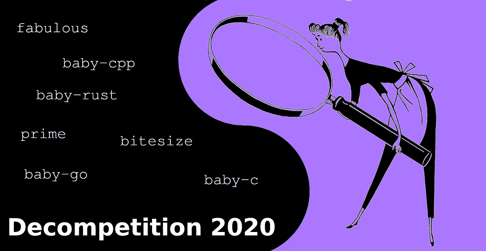
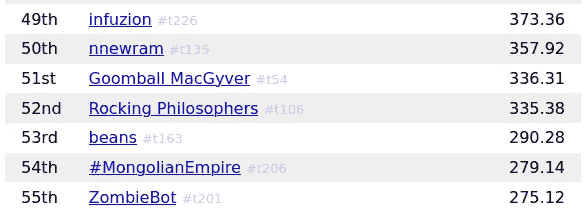
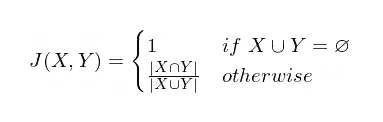
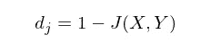
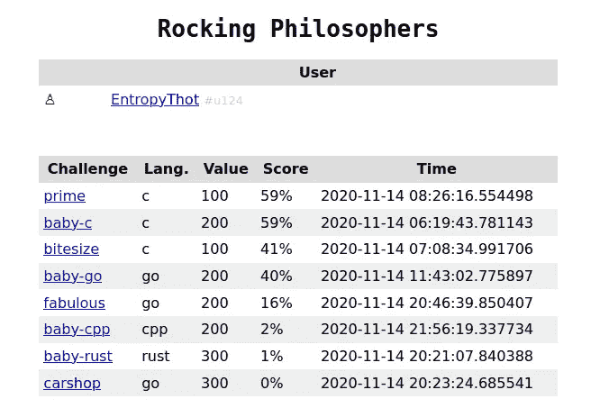

# 写至分解竞争捕获标志

> 原文：<https://infosecwriteups.com/writeup-to-the-decompetition-capture-the-flag-2020-3a3f14887525?source=collection_archive---------1----------------------->



# 目录一览

1.  介绍
2.  准备
3.  dem 挑战
4.  结论
5.  大声喊出来

# 介绍

[去竞争捕捉旗帜](https://decompetition.io/) (2020 版。)号召全球各地的逆向工程师对用 *C* 、 *C++* 、 *Go* 、 *Rust* 和 *Swift* 编写的原生二进制代码进行逆向工程。参赛者的目标是尽可能将编译后的二进制文件重构为原始源代码，CTF 持续了二十四(24)小时。



来源:[https://archive.is/mCFai](https://archive.is/mCFai)

我注册成为用户 EntropyThot，开始了我自己的“团队”,叫做摇摆哲学家——基本上只有我自己😋

我获得了第 52 名(在 277 名参赛者中)。假设我的数学是正确的，那我就是第 77 百分位！

# 准备

我决定在去竞争开始前一周做一点研究和练习，这样我就有希望获得更高的排名。CTF 根据提交的三个标准评分:你的代码通过单元测试的程度(20%的分数)，它与他们编译的可执行文件“相似”的程度(60%的分数)，以及你的代码是否与他们编译的可执行文件相同(另外 20%的分数)。

## 单元测试

我并没有为单元测试做太多的准备。我只是想，我应该在 CTF 期间这样做，主要是因为我将与编译的可执行文件一起工作。我想我应该自动化一个 Python 脚本来运行并与最初编译的可执行文件交互，并让它生成测试用例。

## 对编码语言的信心

Decompetition 在他们的网站上声明，他们将用五种不同的语言编写他们的二进制文件: *C* 、 *C++* 、 *Go* 、 *Rust* 和 *Swift* ，并将被编译成一个 *x86_64* 可执行文件，由各自的编译器专门设计，在运行 *Ubuntu 20.04* 的系统上执行。首先，我将对以下语言的自信程度进行排名，从 1 到 10 分不等:


我对语言的自信程度(越高=越自信)

我过去有过用 C 和 C++编写各种程序的经验，最近我刚刚开始用 Go 和书 *Black Hat Go (2020)* 进行编程，尽管我实际上没有使用 Rust 和 Swift 的经验。我认为我最好的办法是练习一下 C 和 C++，集中精力学习围棋，用 Rust 和 Swift“即兴发挥”。

为了练习，我使用了一个针对 n00bs 的免费编码练习网站，名为 [Edabit](https://edabit.com) ( [我的简介](https://edabit.com/user/PDK3Bb98sENmo5wnT))。如果你是第一次创业，Edabit 是一个很好的资源——不，他们不会付钱给我来推广他们😋

## 代码相似性的量化

Jaccard 指数是一种统计结构，用于计算两个数学集合之间对象的“相似性”和“多样性”。Decompetition 使用 Jaccard 指数来量化两个编译程序的反汇编有多相似。我认为我应该对 Jaccard index 做一些初步的研究，所以我在维基百科上查找并找到了它的条目(特别是在 2020 年 9 月 6 日最后修订的[)。](https://en.wikipedia.org/w/index.php?title=Jaccard_index&oldid=977019056)

给定两个数学集合 ***X*** 和 ***Y*** ，Jaccard 指数 ***J(X，Y)*** 被正式定义为:



Jaccard 索引的一个相关结构是 *Jaccard 距离*。给定两个数学集合 ***X*** 和 ***Y*** ，Jaccard 距离 ***dⱼ(X，Y)*** 正式定义为:



Jaccard 指数是“相似性”的度量，而 Jaccard 距离是“差异性”或“多样性”的度量我从*恶意软件数据科学(2018，ch。5)* 计算两串操作码的 Jaccard 索引:

这个脚本是不完整的，也没有经过适当的测试，所以使用风险自担😖

# dem 挑战

我不想讨论我解决的所有挑战，但我想讨论其中一些挑战和我用来解决它们的策略。

## 最好的

我想讨论的第一个挑战是`prime`二进制。顾名思义，这个小程序在某个数字`n`下生成素数。计算质数的算法有很多，厄拉多塞筛法是最常见的一种:

```
# From the Wikipedia entry on the Sieve of Eratosthenes ([29 Oct., 2020 revision](https://en.wikipedia.org/w/index.php?title=Sieve_of_Eratosthenes&oldid=985992301)), note that this algorithm might not be exactly how it's implemented in the *prime* binary in Decompetition.**algorithm** Sieve of Eratosthenes **is**
    **input**: an integer *n* > 1.
    **output**: all prime numbers from 2 through *n*.

    **let** *A* be an **array of Boolean** values, indexed by **integer**s 2 to *n*,
    initially all **set** to **true**.

    **for** *i* = 2, 3, 4, ..., not exceeding *√n* **do**
        **if** *A*[*i*] **is** **true**
            **for** *j* = *i*2, *i*2+*i*, *i*2+2*i*, *i*2+3*i*, ..., not exceeding *n* **do**
                *A*[*j*] := **false**

    **return** all *i* such that *A*[*i*] **is** **true**.
```

当反转用 *C* 或 *C++* 语言编写的二进制文件时，我简单地使用了 *Ghidra 的*反编译器。这使得重写原始二进制文件变得容易得多；我所要做的就是调整输出，使它在编译的上下文中有意义:

## 极好的

*或者，当数学背景有所帮助时……*

不幸的是，我使用 Ghidra 的反编译器来计算源代码近似值的技术不适用于 Go 或其他语言。我想他们的编译器会生成不同的反汇编模式，这让 Ghidra 的反编译程序感到困惑，所以我必须有点创意。

我采用了黑盒方法来重写`fabulous`二进制文件。我在没有任何参数的情况下运行它，得到了以下输出:

```
**$ ./fabulous**
panic: runtime error: index out of range [1] with length 1goroutine 1 [running]:
main.main()
        /mnt/go/fibl/fibl.go:13 +0x247
```

好吧，看起来它需要一个论点。让我们看看当我输入一个`1`时会发生什么:

```
**$ ./fabulous 1**
1
```

有意思。现在，让我们试一试`fabulous`的数字范围:

```
**$ for x in range {1..10}; do ./fabulous $x | tr '\r\n' ' '; done**
1 1 2 3 5 8 13 21 34 55 89
```

这就是拥有数学背景会有所帮助的地方。我立即注意到这是一个斐波那契数列，并迅速实现了一个 Golang:

## 宝贝去吧

*或者，当编码背景有帮助时……*

和`fabulous`一样，我采用了黑盒方法来逆向工程`baby-go`。我开始运行它时没有任何参数:

```
**$ ./baby-go**
panic: runtime error: index out of range [1] with length 1goroutine 1 [running]:
main.main()
        /mnt/go/fizzbuzz/interview.go:12 +0x275
```

好了，现在让我们引入一个论点:

```
**$ ./baby-go 1**
1
```

现在让我们探索一下这个函数，看看我们是否能找出一个模式:

```
**$ for x in range {1..50}; do ./baby-go $x | tr '\r\n' ' '; done**
Green 1 2 Yellow 4 Blue Yellow 7 8 Yellow Blue 11 Yellow 13 14 Green 16 17 Yellow 19 Blue Yellow 22 23 Yellow Blue 26 Yellow 28 29 Green 31 32 Yellow 34 Blue Yellow 37 38 Yellow Blue 41 Yellow 43 44 Green 46 47 Yellow 49 Blue
```

这也是编码背景派上用场的地方。我注意到这是 FizzBuzz challenge 的一个实现，它被用作淘汰糟糕的程序员的试金石，我立即想到了一个实现:

# 结论



来源:[https://archive.is/H9T2N](https://archive.is/H9T2N)

现在你可能已经发现了，我在重构二进制文件时并没有真正去读它们的反汇编。那是因为我仍然是一个超级 00b，需要很多年的练习才能成为 1337。我没能使用我写的 Jaccard index Python 脚本，但是写它很有趣！

尽管如此，反竞争还是很棒，我迫不及待地想在未来做更多的逆向工程😃

哦，如果你想看 GitHub 项目捕捉旗帜:

[](https://github.com/Alekseyyy/ctfs/tree/main/2020/decompetition) [## Alekseyyy/ctfs

### 此时您不能执行该操作。您已使用另一个标签页或窗口登录。您已在另一个选项卡中注销，或者…

github.com](https://github.com/Alekseyyy/ctfs/tree/main/2020/decompetition) 

# 大声喊出来

[黑客奇人](https://twitter.com/hackerfantastic)和[詹妮弗·阿库里](https://twitter.com/Jennifer_Arcuri)因被点燃 af 电脑 haxx0r 教师，以及推特用户 [@krichard1212](https://twitter.com/krichard1212) 和 [@SYSTEMCAWL](https://twitter.com/SYSTEMCAWL)