# 写一篇关于 FLARE-ON 5 挑战的文章

> 原文：<https://infosecwriteups.com/writeup-to-the-flare-on-5-challenge-c2023718caf7?source=collection_archive---------4----------------------->

## 注:这是 2018 年写回来的一篇文章的编辑转贴；点击可以阅读原文[。](https://archive.is/hdzXz)

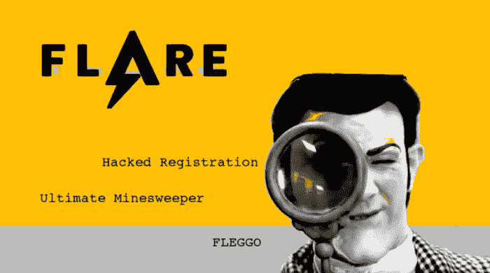

# 内容

1.  介绍
2.  dem 竞赛
3.  收场白
4.  承认

# 介绍

2018 年 8 月 15 日， *FireEye* 推出了他们的第五届年度 FLARE-ON 比赛，参赛者有六周时间来解决一些逆向工程问题。遗憾的是，在总共十二个逆向工程问题中，我只能找出三个标志。至于为什么会这样，我的理由如下:

1.  我不擅长倒车。这是**不可接受的**，我必须停止在互联网上用[愚蠢的东西来杀死脑细胞](https://www.youtube.com/channel/UCug1cL7vmUvYooOjXyHjsxQ)，并开始查阅档案和阅读 RCE 文学(稍后会有更多)。
2.  我是在 9 月 22 日才知道比赛的，那是比赛开始后的第五周。
3.  目前，我正在找工作。我的很多时间都花在了学习证书和做志愿者工作上，这将(有希望)让我在 [helldesk](https://www.urbandictionary.com/define.php?term=Helldesk) 谋得一个职位(总比什么都没有强)。

这只是新手的尸检。我用来为每个给定的问题设计一个标志的方法缺乏技巧和优雅。Nick Harbour 和 FLARE-ON 团队自己对解决方案进行了更加准确和全面的讨论。

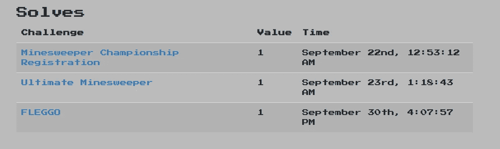

对 n00b 来说还不错😊

# dem 竞赛

## 操纵注册

第一个很简单。我刚刚下载了 7-Zip 存档文件，并提取了`MinesweepChampionshipRegistration.jar`文件。我只是查找了“在线 Java 反编译器”并将 JAR 文件上传到其中，然后得到了`InviteValidator.java`

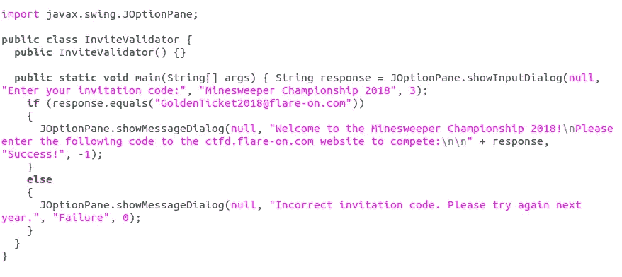

“InviteValidator.java”的内容

我花了大约两秒钟才弄明白这面旗是:`GoldenTicket2018@flare-on.com`

## 终极扫雷舰

我下载了这个挑战的 7-Zip 存档文件，解压后得到一个。名为`UltimateMinesweeper.exe`的. NET 程序集。经过几个小时对不同可能的解决方案的试验，我发现了一种让我得到这面旗帜的技术。

终极扫雷有大约 30 乘 30 的方块，总共有 900 个方块。玩家必须找出所有非地雷的方格。如果一个有地雷的方块被选中，游戏将退出。

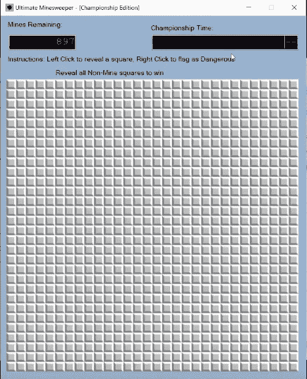

假设有三个非地雷的方格(事实就是如此),并且我的数学是正确的，那么仅仅靠运气选择正确方格的概率是:

不重复抽样

…不可能！😲

终极扫雷舰确实名副其实，从某种意义上说，打败它的唯一方法就是作弊。我在 *dnSpy* 中打开了`UltimateMinesweeper.exe`装配，并提出了一个[类似于组装的](https://en.wikipedia.org/wiki/Kludge)解决方案。我导航到`SquareRevealedCallback`函数，删除了一点当选择一个地雷方块时关闭游戏的代码。

我“编辑掉”的东西

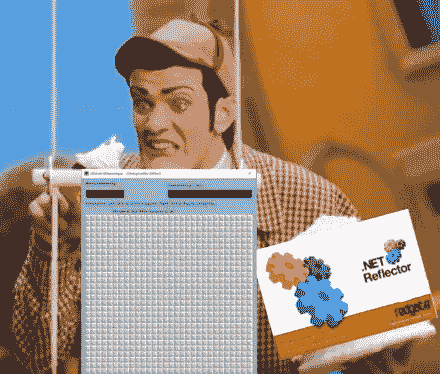

me 打补丁终极扫雷舰 irl-)

然后，我将模块保存到`UltimateMinesweeperHaxxed.exe`，并用笔记本电脑的触摸屏疯狂点击许多方块，最终显示出“非我的”方块，这基本上就是解决方案。

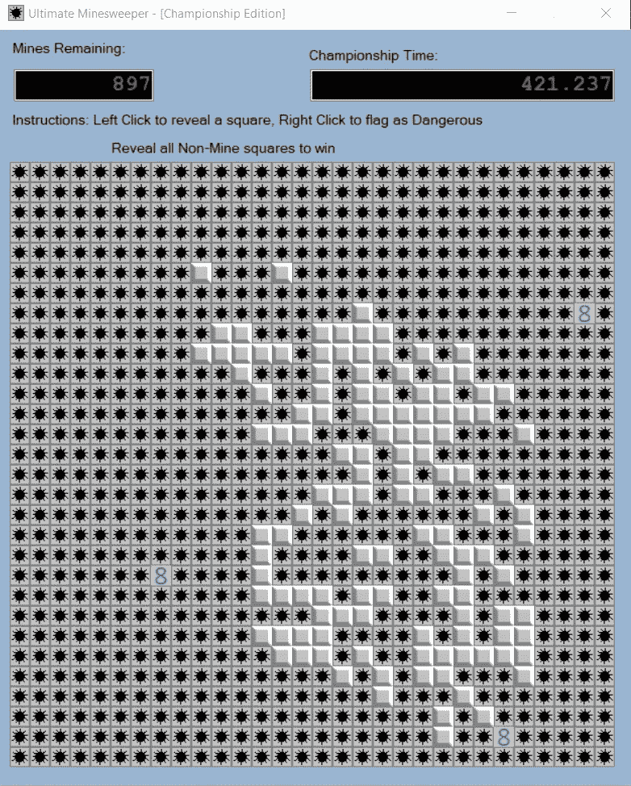

他们称它为“终极扫雷舰”不是白叫的

然后我打开了原来的`UltimateMinesweeper.exe`组件，点击了非矿方格，最后得到了旗子。

嘿，你觉得白人是怎么出人头地的？😉

## 弗莱戈

我下载了`FLEGGO.7z`，并提取了它的内容。`FLEGGO.zip`出来了，所以我把它提取出来，得到了这个:

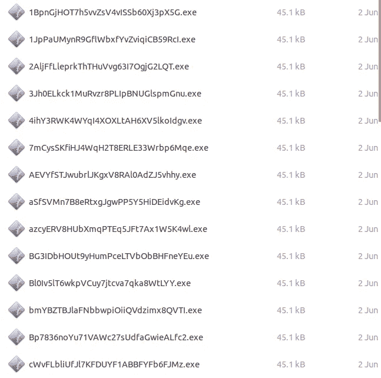

哇，要检查的二进制文件太多了！

我求助于推特用户的智慧，搜索了`#flareon5 FLEGGO`

一位用户在推特上为*NIX shell 写了一行程序

另一个用户在推特上发布了一个目录，列出了图片文件，每张图片的部分文件名都被编辑了。

第三个用户建议竞争者使用 FireEye 的 FLOSS 工具。

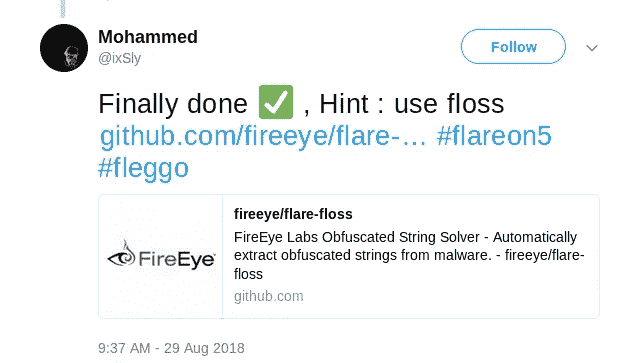

第四个用户建议应该部署一个 OCR 脚本来自动化…一些事情。

最后，第五个 Twitter 用户让我明白了这一切。他们说每张图片都有一个数字，这个数字与运行`wine <exectuable>` *时控制台输出中一个字符的顺序有关。*

就像《终极扫雷》一样，我花了一段时间才想出一个解决方案，最终我找到了。每个可执行文件都要求输入密码，可以通过命令`strings -e l <executable name>`提取密码

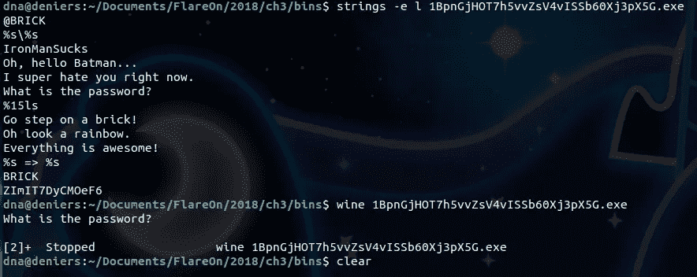

从 FLEGGO 可执行文件中提取“密码”

在所有情况下，密码是终端上输出的最后一个字符串(在这个特殊的例子中，它是`ZImIT7DyCMOeF6`)。然后，我使用 WINE 运行一个可执行文件，这产生了一些控制台输出和下图:

欧亥乐高先生

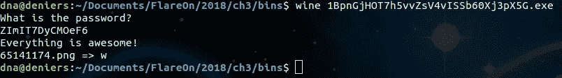

在最后一行，控制台输出将一个字母(在本例中为“w”)与图像相关联。

控制台的最后一行打印图像的文件名，后跟“= >”，再跟一个字母(在本例中是“w”)。在乐高图片上，左上角有一个数字。字母“w”只是旗绳中较大的一部分，数字(这里是七个“7”)表示它的位置。

现在我只需要自动化第一部分。我编写了一个 Python 脚本，用`strings`命令为每个二进制文件提取密码，然后运行相关的二进制文件，输入相关的密码，最后提取图像的裁剪版本。

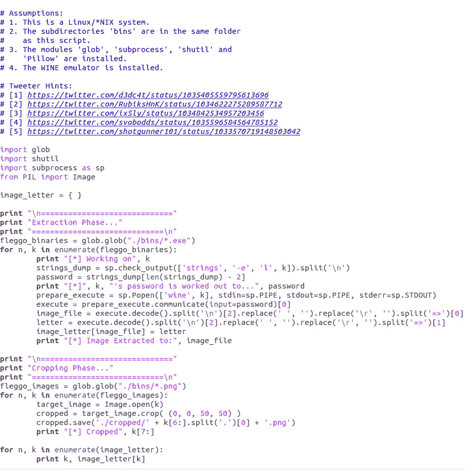

几乎就像 [@th3j35t3r](https://twitter.com/th3j35t3r) 写的这个 XD

有四十九(49)个可执行模块，因此总共提取了四十九个字符和图像。该脚本输出每个图像的文件名及其相关字符。然后我把它们组织成一个电子表格，地点在第一列，字母在第二列。最后，我通过将一个相关的字母放在左上角数字定义的位置，手工将旗帜放在一起，最终得到了旗帜`mor3_awes0m3_th4n_an_awes0me_p0ssum@flare-on.com`

# 收场白

尽管我没有完成所有的挑战，但我乐在其中，这让我进行了批判性的思考。我必须“跳出框框”思考，与标准的 DFIR 和 RCE 技术不同，后者通常需要分析师记录程序的行为。

我等不及明年的锦标赛了！我要翻书，对看到的一切进行逆向工程(遵守版权法)😉)并查看 FLARE-ON 和其他 CTF 档案！

## 进一步阅读

正如我在介绍中提到的，我需要阅读 RCE 文学。这里有一些书，我和其他人可以用来战胜下一个挑战:

*   *逆向:逆向工程的秘密*作者埃尔达德·艾拉姆(ISBN-13:978–0764574818)[https://www . Amazon . com/Reversing-Secrets-Engineering-埃尔达德·艾拉姆/dp/0764574817](https://www.amazon.com/Reversing-Secrets-Engineering-Eldad-Eilam/dp/0764574817)
*   *实用逆向工程:x86、x64、ARM、Windows 内核、逆向工具和混淆*Bruce Dang 著(ISBN-13:978–1118787311)[https://www . Amazon . com/Practical-Reverse-Engineering-Reversing-Obfuscation/DP/1118787315/](https://www.amazon.com/Practical-Reverse-Engineering-Reversing-Obfuscation/dp/1118787315/ref=sr_1_1?s=books&ie=UTF8&qid=1538795139&sr=1-1&keywords=reverse+engineering)
*   *实用恶意软件分析:剖析恶意软件的实践指南第 1 版*作者 Andrew Honig 和 Michael Sikorski(ISBN-13:978–1593272906)[https://www . Amazon . com/Practical-Malware-Analysis-Hands-securing/DP/1593272901/](https://www.amazon.com/Practical-Malware-Analysis-Hands-Dissecting/dp/1593272901/ref=sr_1_4?s=books&ie=UTF8&qid=1538795139&sr=1-4&keywords=reverse+engineering)
*   *《IDA Pro Book:世界上最流行的反汇编程序的非官方指南》第二版*作者 Chris Eagle(ISBN-13:978–1593272890)[https://www . Amazon . com/IDA-Pro-Book-official-Disassembler/DP/1593272898/](https://www.amazon.com/IDA-Pro-Book-Unofficial-Disassembler/dp/1593272898/ref=sr_1_10?s=books&ie=UTF8&qid=1538795139&sr=1-10&keywords=reverse+engineering)
*   *xchg rax，rax 第一版*作者 xorpd(ISBN-13:978–1502958082)[https://www.amazon.com/xchg-rax-xorpd/dp/1502958082/](https://www.amazon.com/xchg-rax-xorpd/dp/1502958082/)
*   *Joshua Saxe 和 Hillary Sanders 的《恶意软件数据科学:攻击检测和归因*(ISBN-13:978–1593278595)[https://www . Amazon . com/Malware-Data-Science-Detection-attribute/DP/1593278594/](https://www.amazon.com/Malware-Data-Science-Detection-Attribution/dp/1593278594/ref=sr_1_1?s=books&ie=UTF8&qid=1538795705&sr=1-1&keywords=malware+data+science)

# 承认

我要感谢前面提到的 Twitter 用户间接帮助我解决了 FLEGGO 挑战。