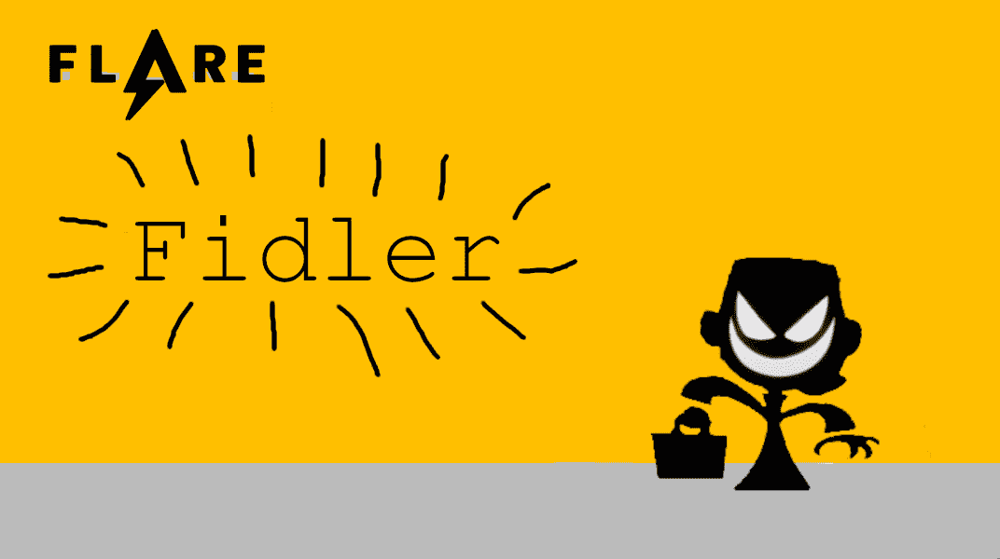
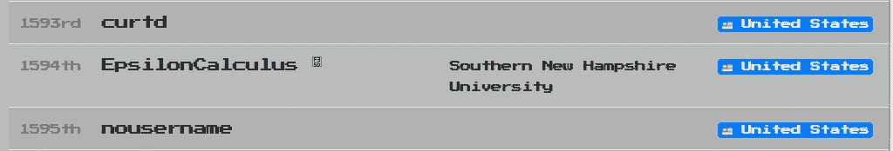
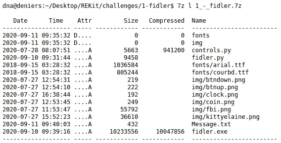
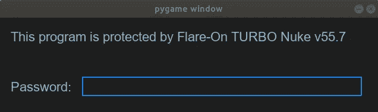
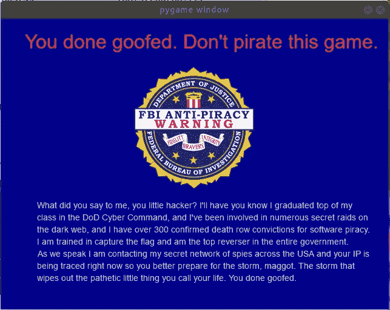
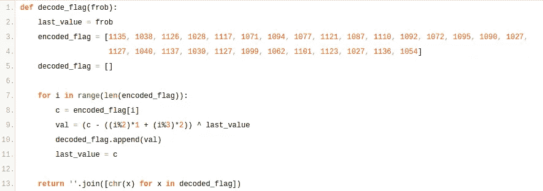
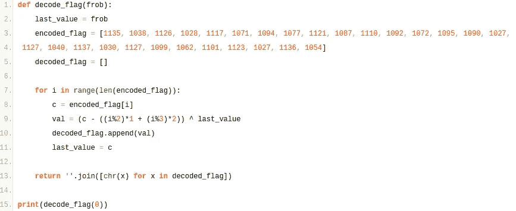

# 撰写关于 FLARE-ON 7 挑战的文章

> 原文：<https://infosecwriteups.com/writeup-to-the-flare-on-7-challenge-47c8d2ef3366?source=collection_archive---------5----------------------->



# 内容

1.  介绍
2.  dat 挑战
3.  结论
4.  承认
5.  尾注

# 介绍

> 欢迎来到第七届闪光挑战赛！这是一个简单的游戏。通过任何必要的手段赢得它，胜利屏幕将显示旗帜。在此处输入旗帜得分，进入下一关。这个挑战是用 Python 编写的，为了您的方便，它作为一个可运行的 EXE 和匹配的源代码分发。如果你愿意，你可以在任何 Python 平台上用 PyGame 直接运行源代码(挑战消息)。

2011 年 8 月 6 日，*[宣布了他们的第七届年度闪光挑战赛](https://www.fireeye.com/blog/threat-research/2020/08/announcing-the-seventh-annual-flare-on-challenge.html)，来自世界各地不同技能水平的逆向工程师被鼓励找出 12 个逆向工程问题的解决方案。我参加了，并且只解决了十二个挑战中的一个(主要是因为我必须做功课，而且我还是一个 [supern00b](https://www.infinitelooper.com/?v=d_DI-5ebxgw&p=n#/185;259) )。*

**

*嘿，对超级 00b 来说还不错😉 [1][2]*

# *dat 挑战*

*这个挑战叫做 *Fidler* ，我从下载 7z 存档并解压文件开始。这是我得到的:*

**

*来源:[https://pastebin.com/wrbrhb3i](https://pastebin.com/wrbrhb3i)*

**fidler.py* 文件看起来很有趣，所以我用 Python(3)运行它，得到了这个:*

**

*试图关上窗户给了我这个有趣的信息:*

**

*爆炸下限*

*关闭互联网联邦储备窗口结束了该计划。因此，我决定查看一下 *fidler.py* 的源代码，发现了这个有趣的函数:*

**

*来源:[https://pastebin.com/KSzRXCup](https://pastebin.com/KSzRXCup)*

*这看起来像一个简单的 XOR 加密方案，所以我想我应该使用一个简单的暴力算法来计算出这个标志。所以我在脚本中添加了一行名为“ *print(decode_flag(0))* ”的代码:*

**

*来源:[https://pastebin.com/8ufXjDjS](https://pastebin.com/8ufXjDjS)*

*我原本打算“探测”这个函数，找出它的行为，然后编写一个暴力解决方案。但是，似乎在运行这段代码后，我得到了以下输出:*

```
*ѯdle_with_kitty@flare-on.com*
```

*我认为，不管出于什么原因，我写的“破解”脚本在第一个字符上出错了，我猜它是一个“I”，给出了一个结果标志:*

```
*idle_with_kitty@flare-on.com*
```

# *最后的想法*

*这很有趣。我推荐你去看看 FireEye 的 Nick Harbour 发布的[解决方案。如果我想赢得明年的闪耀奖，我就必须去读德姆 have 的书，在饼干上练习呻吟😃](https://www.fireeye.com/blog/threat-research/2020/10/flare-on-7-challenge-solutions.html)*

# *承认*

*我要感谢 Twitter 用户 [@krichard1212](https://twitter.com/krichard1212) 和 [@zprytka](https://twitter.com/zprytka) 加入我为解决这些挑战而建立的聊天室，并感谢他们的参与。*

# *尾注*

1.  *FLARE-ON 2020 积分榜截图:[https://archive.is/eN2dE](https://archive.is/eN2dE)*
2.  *注意这张截图是 archive.is 在 2020 年 10 月 25 日拍摄的，截图后记分牌可能有变化*