# 记录-Vulnhub-Kioptrix #5

> 原文：<https://infosecwriteups.com/writeup-vulnhub-kioptrix-5-3ac4bcae9f15?source=collection_archive---------5----------------------->

## 利用易受攻击的 FreeBSD 操作系统机器，通过提升权限来根除它

忍者赛博由[安加拉 Ts](https://dribbble.com/Garagonz)

这篇文章通过利用过时的服务/应用程序来获得机器上的根外壳。在 Vulnhub 上可获得的 [Kioptrix 2014](https://www.vulnhub.com/entry/kioptrix-2014-5,62/) 中使用的目标机器。

## 目标:

1.  查找隐藏目录
2.  利用 web 应用程序服务的过时版本
3.  通过打嗝套装和重放拦截流量，以限制对 URL 路径的访问

## 入门指南

首先下载 Vulnhub 上的 ova 文件。在您的 VMware 或虚拟机器上打开文件。启动你的 Kali-Linux 或 Parrot 发行版来攻击目标机器

## 侦察和扫描阶段

使用 **netdiscover** 来了解我们的目标机器的 IP。由于我们不知道 IP 地址，我们将使用以下命令扫描整个网络范围

> 网络发现-r 192.168.0.0/16

现在我们有了目标 IP，如下图所示

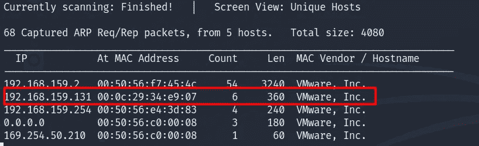

通过 netdiscover 发现的目标计算机 IP

现在我们有了目标机器的 IP 地址，让我们进行一次 Nmap 扫描，找出目标机器上正在运行什么服务

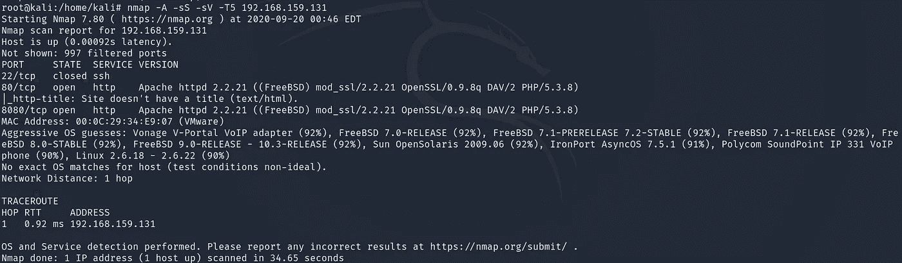

Nmap 扫描

根据上面的扫描，以下两个端口是打开的

1.  端口 80
2.  端口 8080

## 列举

两个端口都运行 Apache httpd 2.2.21 服务器。让我们深入研究一下，使用 URL 中的这些端口导航到目标机器的 IP 地址

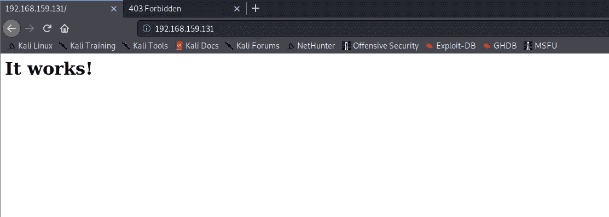

使用端口 80 的目标机器

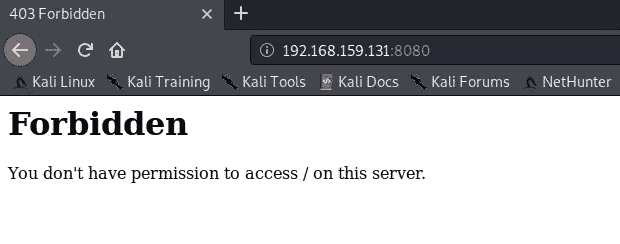

使用端口 8080 的目标机器

如上所述，我们没有发现什么有趣的东西。让我们检查一下页面源代码，看看是否能找到我们感兴趣的内容

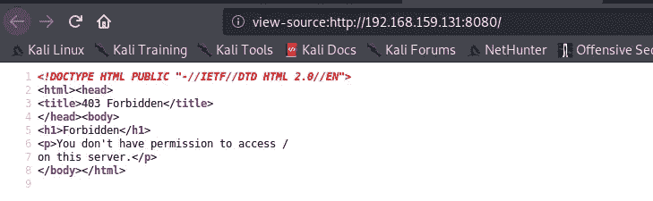

在端口 8080 上寻呼源目标机器

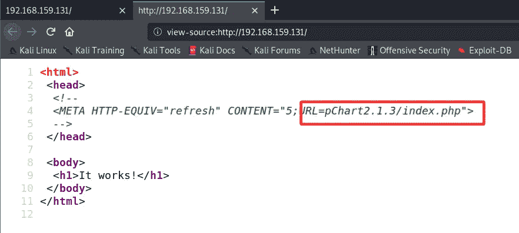

使用端口 80 的目标机器的页面源

如上所述，我们通过使用端口 80 检查目标机器的页面源找到了一个 URL 路径。让我们导航到上面找到的路径

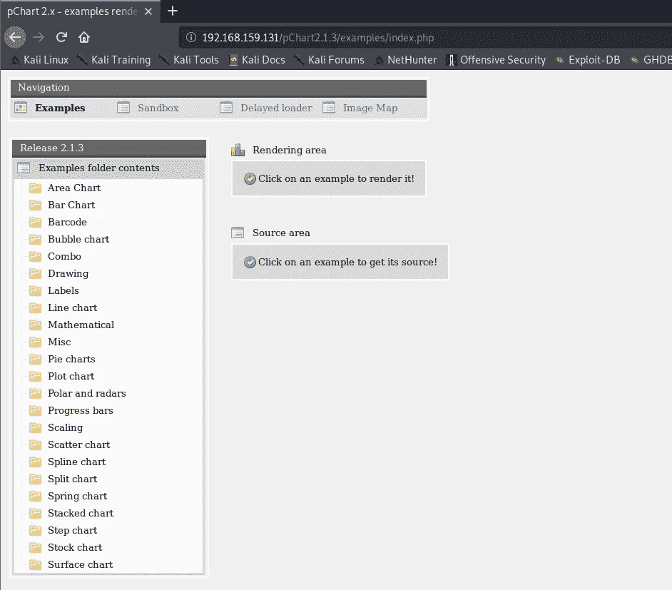

目标机器的隐藏 URL

我们看到了刚刚找到的 URL 的上述输出。

通过研究 pchart，我们发现它是一个面向对象的 PHP 图表库。我们在漏洞数据库上发现 pchart2.1.3 的漏洞。我们发现有两种类型的利用，一种是目录遍历，另一种是跨站脚本。

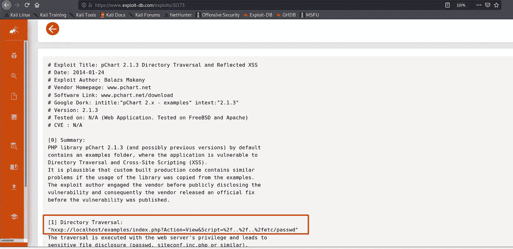

Pchart2.1.3 漏洞利用\

让我们使用 URL 进行目录遍历利用。我们看到目录 **etc/passwd** 的如下输出

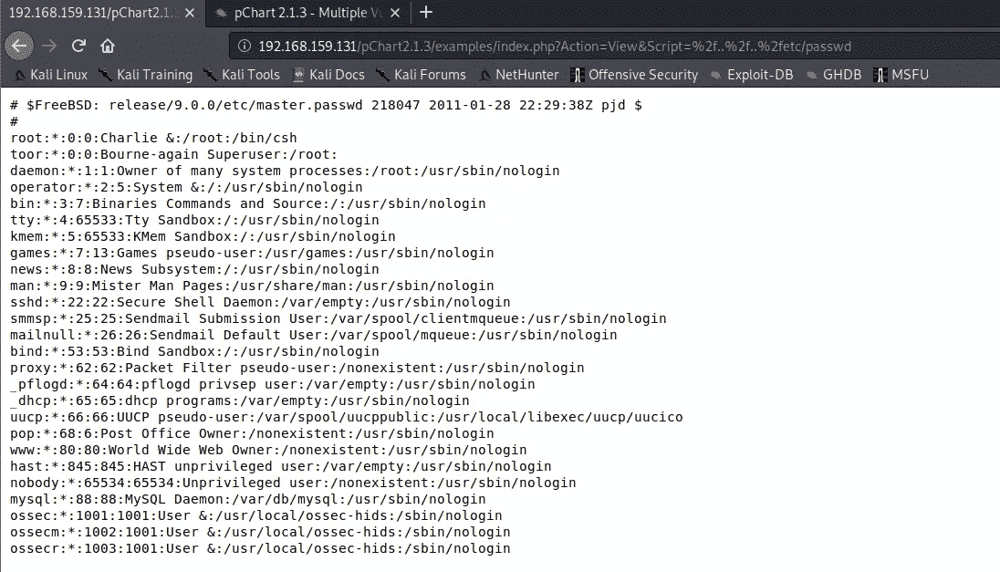

输出 etc/密码

从我们的 Nmap 扫描中我们知道，目标机器正在使用一个开放的 FreeBSD Linux 服务器，让我们检查配置文件以获得对端口 8080 内容的受限访问。对于这项检查，请仔细检查配置文件。将我们之前使用的 URL 追加到下面。由于 apache 的版本是 2.2.1，我们将使用 open FreeBSD 文档中指出的 apache22

> **/usr/local/etc/Apache 22/httpd . conf**

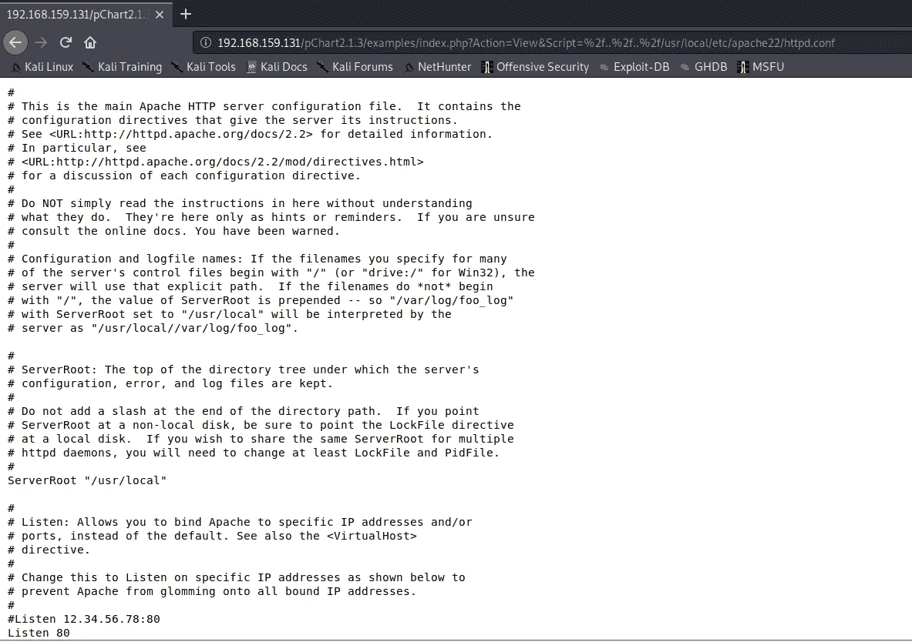

开放 FreeBSD 的配置文件

在上面的配置文件中滚动一点，我们发现有一个文档根目录的路径，可以被特定版本的 Mozilla 浏览器访问。因为我运行的是 Mozilla 的第 5 版，所以没有显示目录。

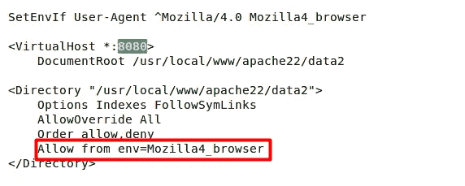

端口 8080 的路径

我们将使用 Burp Suite 拦截请求，并更改 Mozilla 浏览器的版本以查看 URL 路径。

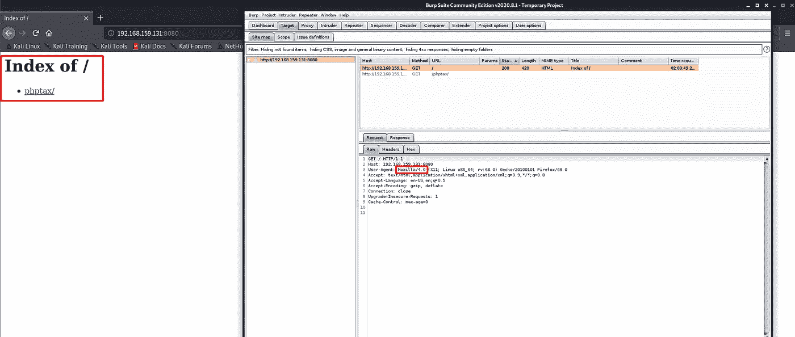

打嗝拦截

一旦我们将版本 **Mozilla 更改为 4** ，我们就会看到一个目录 **phptax/** 。进一步拦截请求，我们能够找到 URL 路径的全貌

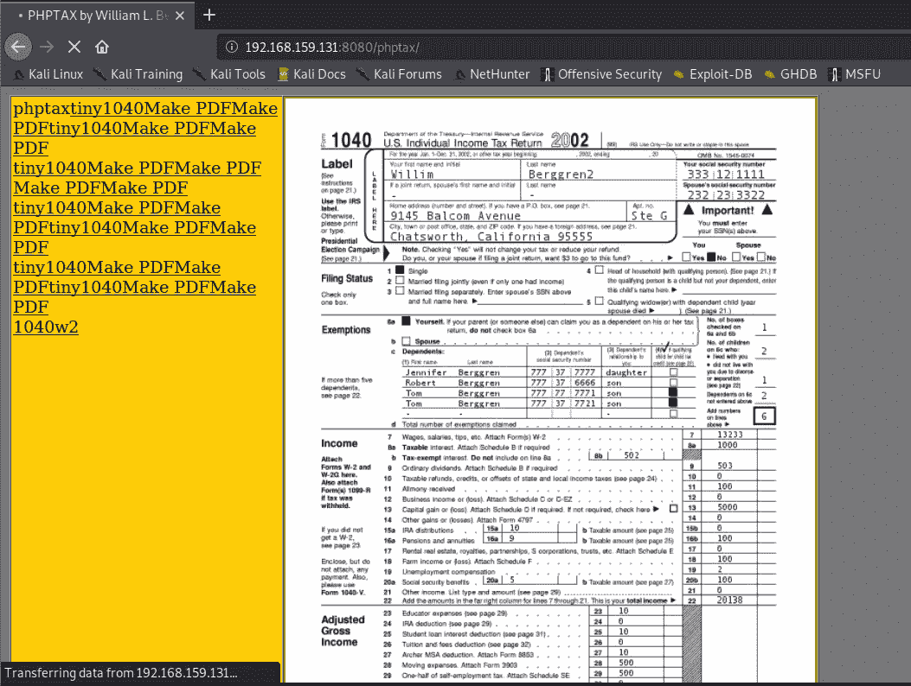

Phptax

看来我们找到了一份税务文件。进一步研究 phptax，我们知道它是一个所得税报告生成器，容易受到 RCE(远程代码执行)的攻击

使用 searchploit 或 Metasploit 可以发现该漏洞。

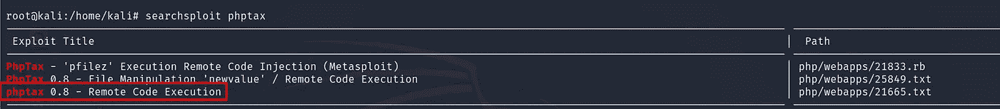

使用 searchsploit 攻击 phptax

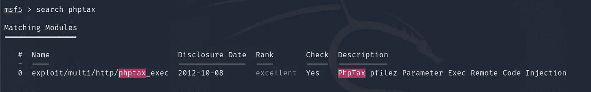

使用 Metasploit 利用 Phptax

## 获得访问权限

现在让我们利用 phptax 漏洞。设置所需的参数并利用

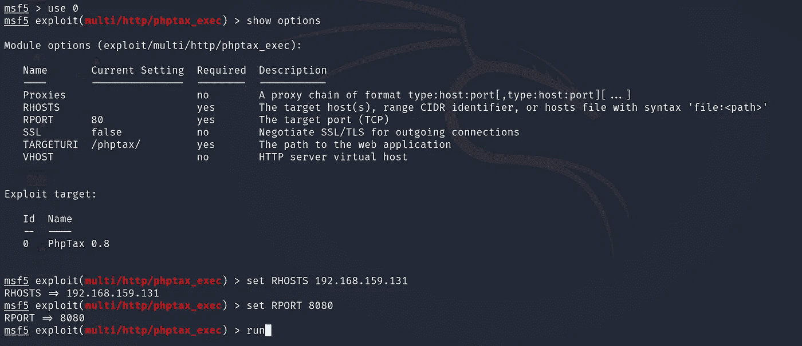

设置所需的参数

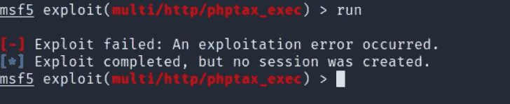

利用错误

Ooops 我们得到了一个错误，而执行利用。别担心，我们有这个。Metasploit 的新版本(即版本 5)没有为我们的案例选择有效载荷。因此，我们需要手动选择有效载荷，如下所示

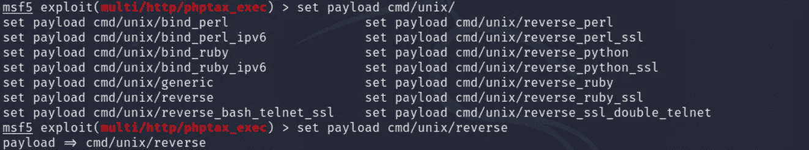

手动设置有效负载

一旦我们手动设置了有效载荷，我们就可以开始了。希望这个漏洞能成功运行

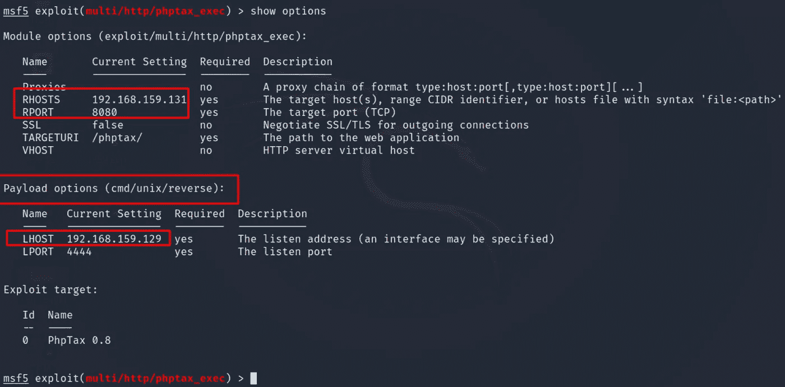

所有参数设置

所以我们的利用是成功的，我们可以获得外壳访问。与 shell 交互的命令有些不同，因为它是一个开放的 FreeBSD 操作系统。我们可以看到，我们获得了外壳，但我们还没有扎根。我们需要提升我们的权限来获得根用户访问权限

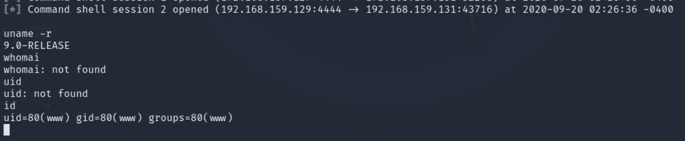

炮弹爆炸了

## 权限提升

FreeBSD 9.0 版存在与权限提升相关的漏洞。你可以利用任何漏洞

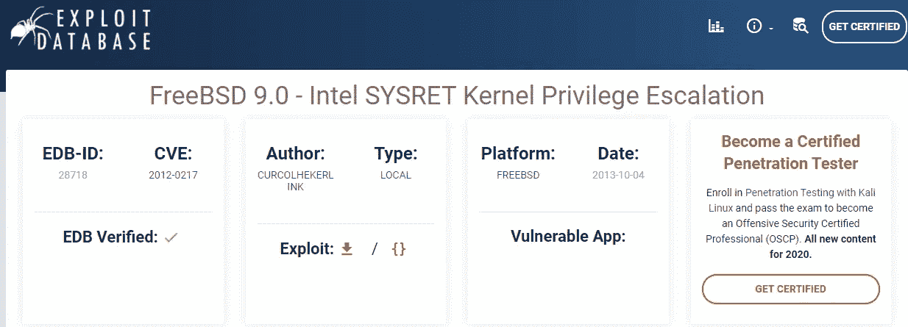

权限提升

我们的目标机器能够使用 netcat。因此，让我们使用 netcat 将这个漏洞利用代码转移到我们的目标机器上。端口 1234 用于侦听传入的连接

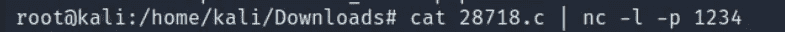

本地主机上的 netcat 连接

现在我们需要连接回我们的本地机器

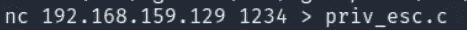

目标机器上的 Netcat

如下图所示，我们可以看到漏洞有效载荷已经成功传输。更改文件的权限。编译代码并运行漏洞

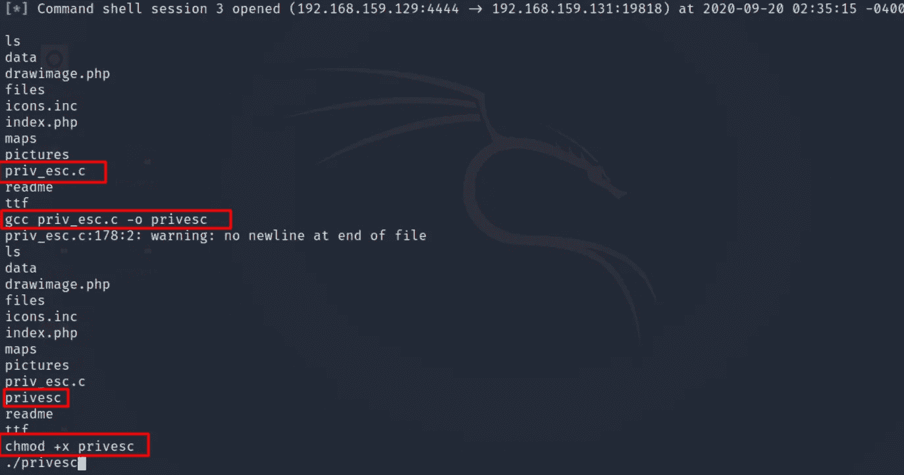

利用在目标机器上传输的代码

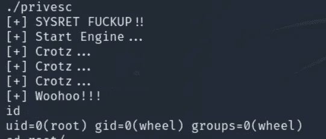

特权升级

因此，利用是成功的，我们已经根的目标机器，并已升级的特权

我希望你喜欢这个演练。快乐黑客；)

# 关于我

我是一名网络安全爱好者，正在攻读信息安全硕士学位，并试图进入全职网络安全职业生涯。你可以点击这里阅读更多的报道和演练