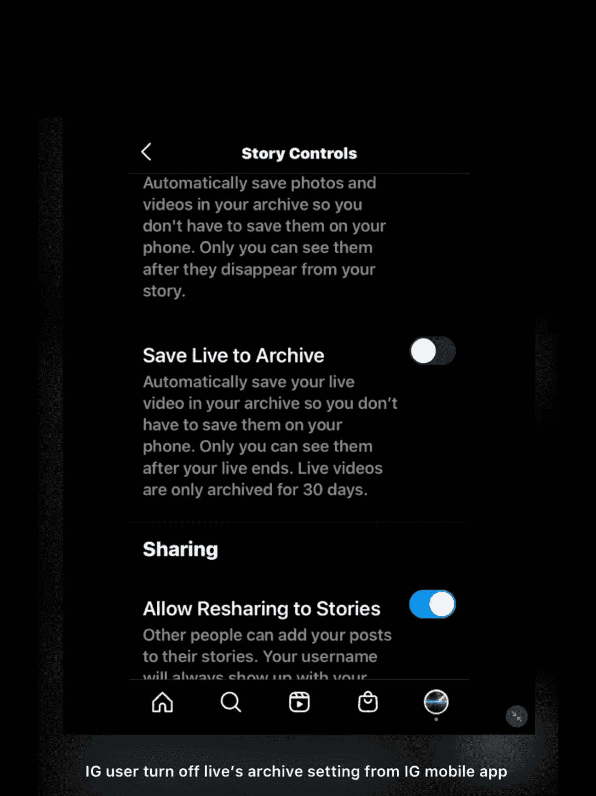
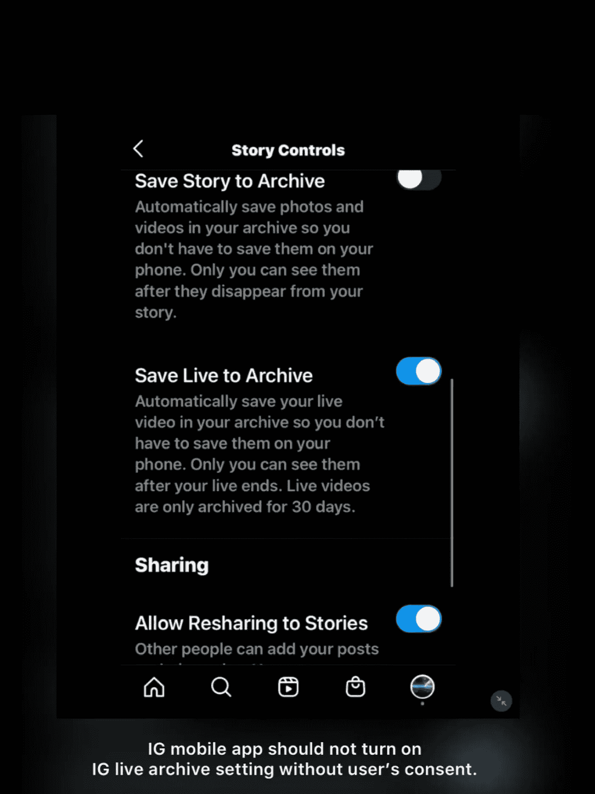
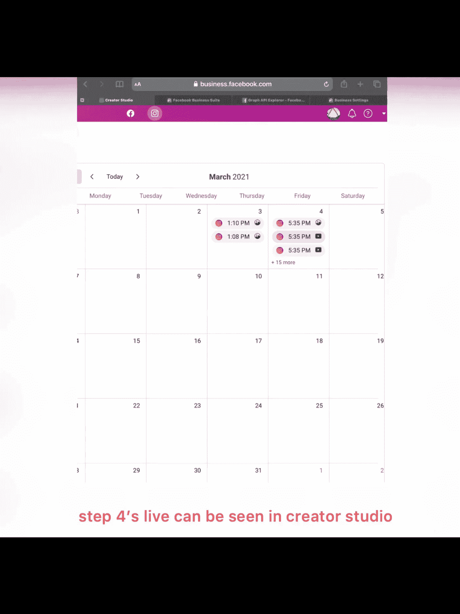
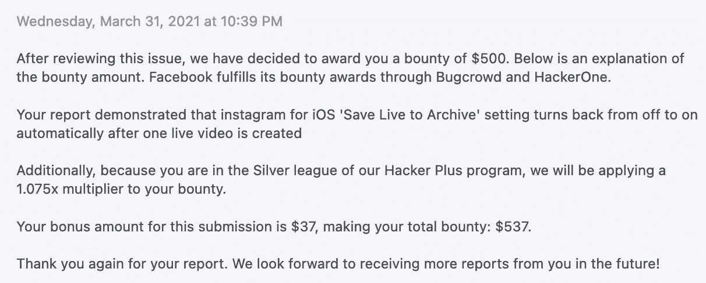

# 报道:脸书怀特哈特项目(2021): Instagram 直播设置错误

> 原文：<https://infosecwriteups.com/writeups-facebook-whitehat-program-2021-instagram-live-setting-bug-500-usd-d2d076b3f8bb?source=collection_archive---------2----------------------->

# 关于我:

 [## 铃木隆-安全研究员- LinkedIn

### 8 年前开始学习信息安全。从那以后，我就迷上了黑客。我对…的好奇心

www.linkedin.com](https://www.linkedin.com/in/takashi-suzuki-whitehacker/)  [## HackerOne 简介-神风特攻队

### facebook，谷歌，mozilla，戴尔，redhat，DJI 名人堂....…

hackerone.com](https://hackerone.com/kamikaze?type=user) 

# 标题

即使 IG 用户之前关闭了存档设置，在 IG 用户结束直播视频后，Instagram live 的存档设置也会自动打开

# 描述:

当用户结束 IG live 并再次开始 Live 时，Instagram 应用程序会打开 Live archive 设置。

这是一个问题，因为其他 FB 页面用户可以在 creator studio 的日历中看到存档的 live。

在 creator studio 的日历中，可以访问 IG 帐户的其他用户(即页面广告商)可以看到 IG 公共内容和存档内容，但不能看到已删除的内容。

如果 IG 用户第二次进入 IG live，而 IG 用户在第一次的 IG live 中关闭了 IG live 的存档设置，IG 用户认为第二次的直播视频也将从 IG 应用程序中删除&结束的直播视频将不会出现在 creator studio 的日历中，其他用户(即页面广告商)可以看到结束的直播视频。

# 如果这个问题是有意的，问题和难题将会出现:

IG 用户是否应该在每次 IG 用户结束 IG live 时关闭 live 的存档设置？如果 IG 用户第二次进入 IG 直播，而 IG 用户忘记检查存档设置，结束的 IG 直播视频将自动保存在 creator studio 的日历中。

为什么 IG app 会在未经用户同意的情况下自动开启 live 的存档设置？IG 用户可能会认为 second live 的存档设置也将被关闭。

# 准备好的器械包:

测试设备:iOS 14.4 和 iPadOS 14.4

测试应用:Instagram iOS 版本 177.0

1 个连接到 FB 业务页面的 IG 创建者/业务帐户(受害者用户)

1 个可以在 FB creator studio 中访问 IG 帐户(即页面广告商)的 FB 帐户(攻击者用户)

# 复制步骤:

1.  受害者 IG 用户从 IG 手机应用关闭 live 的存档设置(设置->隐私->故事->将 Live 保存到存档)

2.受害 IG 用户开始 IG 直播

3.受害 IG 用户结束 IG 直播并删除 IG 直播

4.重复步骤 2 和步骤 3

5.重复步骤 1，你会注意到“保存现场存档”是自动打开的。

6.攻击者 FB 用户转到 creator studio 的日历页面。

# 结果:

即使 IG 用户在步骤 1 中关闭了 IG live 的存档，IG live 视频也会存档，因为存档设置是自动打开的。

# 预期结果:

当 IG 用户结束 IG live 时，未经用户同意，IG 移动应用程序不应打开 IG live 存档设置，因为其他可以在 creator studio 中访问 IG 帐户的 FB 用户可以看到结束的直播视频。

# 时间线:

报道:2021 年 3 月 4 日

审判日期:2021 年 3 月 6 日

固定日期:2021 年 3 月 12 日

奖金发放日期:2021 年 3 月 31 日

