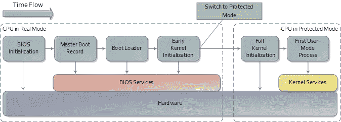
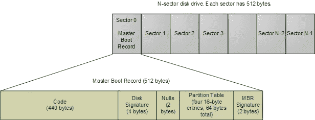
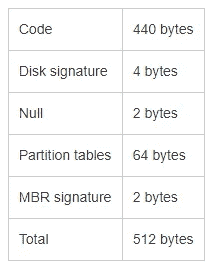
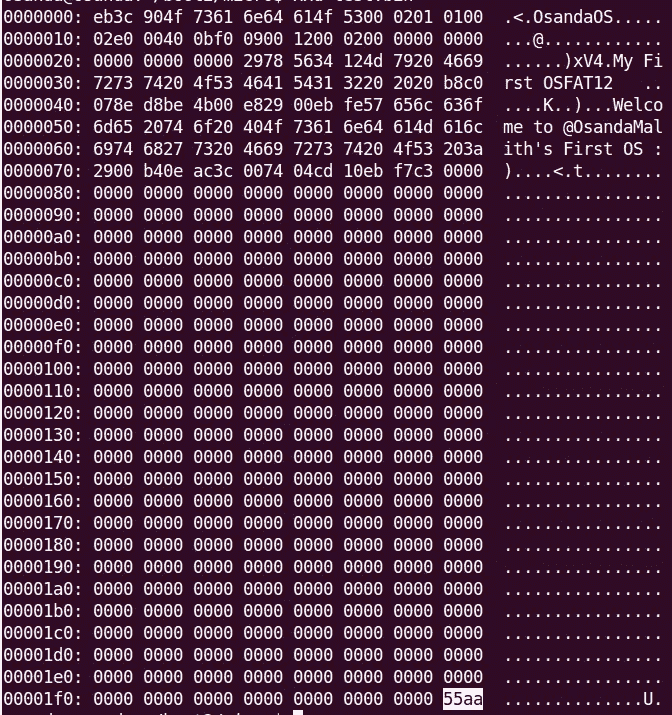
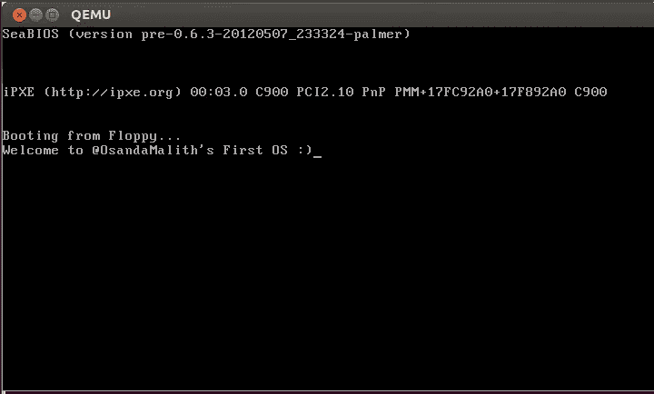
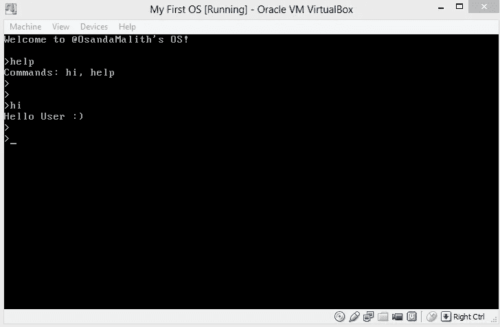
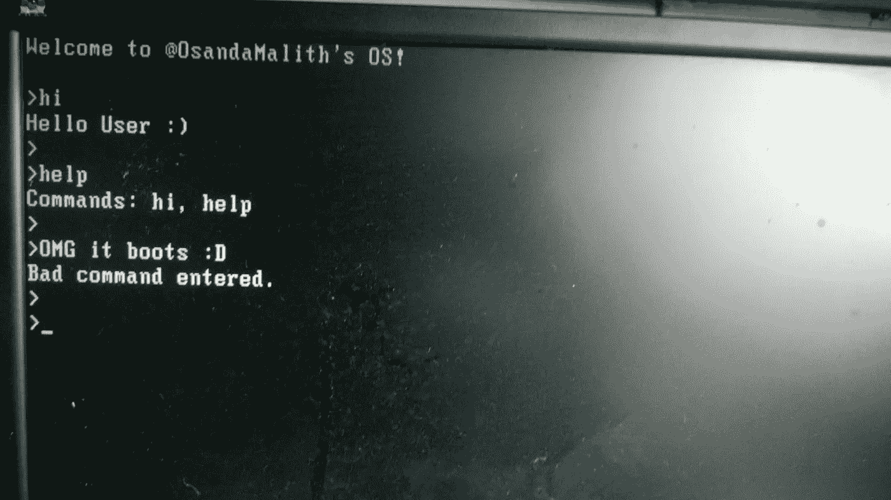
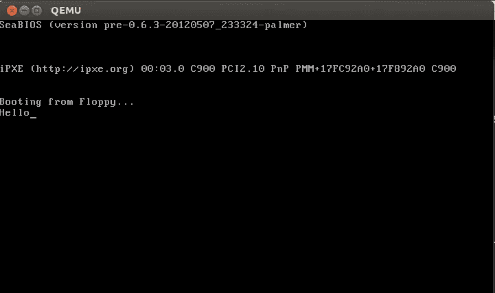

# 编写引导加载程序

> 原文：<https://infosecwriteups.com/writing-a-bootloader-931da062f25b?source=collection_archive---------0----------------------->

# 什么是引导加载程序？

boot loader 是一个特殊的程序，在开机或复位期间，每次计算机初始化可引导设备时都会执行该程序，将内核映像加载到内存中。这个应用程序非常接近硬件和 CPU 的架构。所有 x86 电脑都以实模式启动。在这种模式下，您只有 16 位指令。我们的引导程序运行在实模式下，我们的引导程序是一个 16 位程序。



# 这是如何工作的？

W 当你打开电脑时，BIOS 想要启动一个必须在硬盘、软盘、光盘等地方找到的操作系统。BIOS 搜索操作系统的顺序是用户可配置的。接下来，BIOS 读取可引导磁盘的第一个 512 字节扇区。通常，一个扇区的大小是 512 字节。这就是所谓的主引导记录(MBR)。BIOS 只是将 MBR 的内容加载到内存位置“0x7c00 ”,并跳转到该位置开始执行 MBR 中的任何代码。我们的引导程序大小也应该是 512 字节。



代码 440 字节磁盘签名 4 字节 Null2 字节分区表 64 字节 MBR 签名 2 字节 esTotal512 字节

引导过程是:

*   打开电脑，BIOS 开始运行
*   BIOS 按照用户可配置的引导顺序寻找 MBR。
*   BIOS 从指定的介质将一个 512 字节的引导扇区加载到内存位置“0x7c00 ”,并开始执行它。
*   这 512 个字节然后继续加载操作系统本身或更复杂的引导加载程序。

# BIOS 中断

这些中断帮助操作系统和应用程序调用 BIOS 的功能。这是在引导加载程序之前加载的，在与 I/O 通信时非常有用。由于我们没有操作系统级中断，这是唯一有用的选项。

例如使用 BIOS 中断调用将字符打印到屏幕上。

```
mov ah, 0x0e    ; function number = 0Eh : Display Character
mov al, 'O'     ; AL = code of character to display
int 0x10        ; call INT 10h, BIOS video service
```

这是一个用美国电话电报公司语法编写的简单的引导加载程序。

```
/*
 * Title: A Simple Bootloader in AT&T Assembly
 * Author: Osanda Malith Jayathissa ([@OsandaMalith](http://twitter.com/OsandaMalith))
 * Website: [http://OsandaMalith.wordpress.com](http://OsandaMalith.wordpress.com)
 */ 
 .code16
 .section .text
 .global main
main:/* 
 Disk description table, to make it a valid floppy
 FAT12 file system format
*/
 jmp _start
 .byte 144 #NOP 
 .ascii “OsandaOS” #OEMLabel 
 .word 512 #BytesPerSector 
 .byte 1 #SectorsPerCluster 
 .word 1 #ReservedForBoot 
 .byte 2 #NumberOfFats 
 .word 224 #RootDirEntries (224 * 32 = 7168 = 14 sectors to read) 
 .word 2880 #LogicalSectors 
 .byte 0xf0 #MediumByte 
 .word 9 #SectorsPerFat 
 .word 18 #SectorsPerTrack 
 .word 2 #Sides 
 .long 0 #HiddenSectors 
 .byte 0 #LargeSectors 
 .byte 0 #DriveNo 
 .byte 0x29 #Signature (41 for Floppy)
 .long 0x12345678 #VolumeID
 .ascii “My First OS” #VolumeLabel
 .ascii “FAT12 “ #FileSystem_start:
 movw $0, %ax
 movw %ax, %ss
 movw %ax, %ds
 movw %ax, %es
 movw $string, %si
loop:
 movb $0xe, %ah
 movb (%si), %al
 cmpb $0, %al
 je done
 int $0x10
 addw $1, %si
 jmp loop
done:
 jmp done #infinite loopstring:
 .ascii “Welcome to [@OsandaMalith](http://twitter.com/OsandaMalith)’s First OS :)”
 .byte 0
 .fill 0x1fe — (. — main) ,1,0 #Pad remainder of boot sector with 0s
 .word 0xaa55 #The standard PC boot signature
```

[https://github . com/OsandaMalith/boot loader/blob/master/loader。S](https://github.com/OsandaMalith/bootloader/blob/master/loader.S)
汇编链接代码。我已经明确指定在 0x7c00 加载文本部分，它将计算绝对寻址。

```
as --32 -o loader.o loader.Sld -m elf_i386 loader.o --oformat=binary -o loader.bin  -Ttext 0x7c00
```

在 NASM 使用英特尔语法也是如此。

```
%if 0; 
 * Title: A Simple Bootloader in NASM
 * Author: Osanda Malith Jayathissa ([@OsandaMalith](http://twitter.com/OsandaMalith))
 * Website: [http://OsandaMalith.wordpress.com](http://OsandaMalith.wordpress.com)
%endif;BITS 16jmp short _start ; Jump past disk description section
 nop 

; Disk description table, to make it a valid floppy
OEMLabel db “OsandaOS” ; Disk label
BytesPerSector dw 512 ; Bytes per sector
SectorsPerCluster db 1 ; Sectors per cluster
ReservedForBoot dw 1 ; Reserved sectors for boot record
NumberOfFats db 2 ; Number of copies of the FAT
RootDirEntries dw 224 
LogicalSectors dw 2880 ; Number of logical sectors
MediumByte db 0F0h ; Medium descriptor byte
SectorsPerFat dw 9 ; Sectors per FAT
SectorsPerTrack dw 18 ; Sectors per track (36/cylinder)
Sides dw 2 ; Number of sides/heads
HiddenSectors dd 0 ; Number of hidden sectors
LargeSectors dd 0 ; Number of LBA sectors
DriveNo dw 0 ; Drive No: 0
Signature db 41 ; Drive signature: 41 for floppy
VolumeID dd 12345678h ; Volume ID: any number
VolumeLabel db “My First OS”; Volume Label: any 11 chars
FileSystem db “FAT12 “ ; File system type: don’t change!_start:
 mov ax, 07C0h ; move 0x7c00 into ax
 mov ds, ax ; set data segment to where we’re loadedmov si, string ; Put string position into SI
 call print_string ; Call our string-printing routinejmp $ ; infinite loop!string db “Welcome to [@OsandaMalith](http://twitter.com/OsandaMalith)’s First OS :)”, 0
print_string: 
 mov ah, 0Eh ; int 10h ‘print char’ function
.loop:
 lodsb ; load string byte to al
 cmp al, 0 ; cmp al with 0
 je .done ; if char is zero, ret
 int 10h ; else, print
 jmp .loop
.done:
 ret
 times 510-($-$$) db 0 ; Pad remainder of boot sector with 0s
 dw 0xAA55 ; The standard PC boot signature
```

[https://github . com/OsandaMalith/boot loader/blob/master/loader . nasm](https://github.com/OsandaMalith/bootloader/blob/master/loader.nasm)
以二进制为格式汇编文件。

```
nasm -f bin -o loader.bin loader.nasm
```

如果你使用文件工具，你会看到这是一个合法的 1.4 兆软盘和 32 位引导扇区。

```
$ file loader.bin 
loader.bin: DOS floppy 1440k, x86 hard disk boot sector
```

如果你在十六进制编辑器中打开我们的引导程序，你会看到我们的 512 大小的程序，最后应该会有我们的引导签名 0xaa55。



之后，将二进制文件转换成软盘映像。

```
dd status=noxfer conv=notrunc if= loader.bin of=floppy.flp
```

您还可以使用 UltraISO 等工具将二进制文件转换为 ISO 文件。你可以刻录并在你的电脑上尝试，而不是模仿。使用 Qemu 来测试我们新创建的引导程序🙂

```
qemu-system-i386 -fda floppy.flp
```



你可以开发出这样的东西🙂



# C 中的引导程序

我们可以用 C 使用内联汇编写一个简单的 bootloader。我将展示一个打印“Hello”的简单示例。

```
__asm__(“.code16\n”);
__asm__(“jmpl $0x0000, $main\n”);

void main() {
 __asm__ __volatile__(“movb $’H’ , %al\n”);
 __asm__ __volatile__(“movb $0x0e, %ah\n”);
 __asm__ __volatile__(“int $0x10\n”);

 __asm__ __volatile__(“movb $’e’ , %al\n”);
 __asm__ __volatile__(“movb $0x0e, %ah\n”);
 __asm__ __volatile__(“int $0x10\n”);

 __asm__ __volatile__(“movb $’l’ , %al\n”);
 __asm__ __volatile__(“movb $0x0e, %ah\n”);
 __asm__ __volatile__(“int $0x10\n”);

 __asm__ __volatile__(“movb $’l’ , %al\n”);
 __asm__ __volatile__(“movb $0x0e, %ah\n”);
 __asm__ __volatile__(“int $0x10\n”);

 __asm__ __volatile__(“movb $’o’ , %al\n”);
 __asm__ __volatile__(“movb $0x0e, %ah\n”);
 __asm__ __volatile__(“int $0x10\n”);

} 
```

[https://github . com/OsandaMalith/boot loader/blob/master/loader . c](https://github.com/OsandaMalith/bootloader/blob/master/loader.c)这将是链接器中指定为“test.ld”的链接器脚本

```
 .ENTRY(main);
SECTIONS
{
 . = 0x7C00;
 .text : AT(0x7C00){ *(.text); }
 .sig : AT(0x7DFE) { SHORT(0xaa55); }
}
```

https://github . com/OsandaMalith/boot loader/blob/master/test . LD
然后使用 GCC 编译，我们只生成一个目标文件，并使用指定链接器脚本的链接器手动链接。

```
gcc -m32 -c -Os -march=i686 -ffreestanding -Wall -Werror -o loader.o loader.c
ld -m elf_i386 -static -Ttest.ld -nostdlib — nmagic -o test.elf test.o
objcopy -O binary loader.elf loader.bin
dd status=noxfer conv=notrunc if=loader.bin of=floppy.flp
```

之后，使用 Qemu 引导我们的映像🙂

```
qemu-system-i386 -fda floppy.flp
```



使用 BIOS 中断，你可以编写漂亮的程序到你的电脑的引导区🙂

# 参考

[http://duartes.org/gustavo/blog/post/how-computers-boot-up/](http://duartes.org/gustavo/blog/post/how-computers-boot-up/)
[http://wiki.osdev.org](http://wiki.osdev.org/)
[http://mikeos.sourceforge.net/](http://mikeos.sourceforge.net/)
https://en.wikipedia.org/wiki/BIOS_interrupt_call

*关注* [*Infosec 报道*](https://medium.com/bugbountywriteup) *获取更多此类精彩报道。*

[](https://medium.com/bugbountywriteup) [## 信息安全报道

### 收集了世界上最好的黑客的文章，主题从 bug 奖金和 CTF 到 vulnhub…

medium.com](https://medium.com/bugbountywriteup)