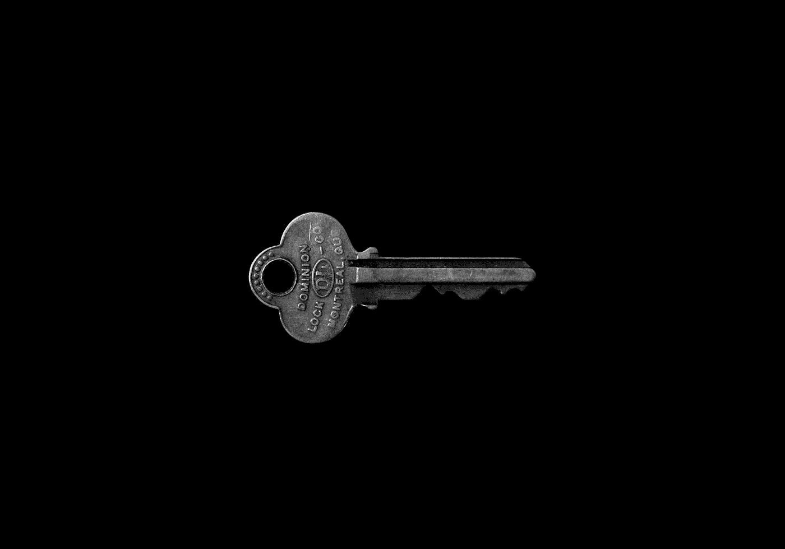
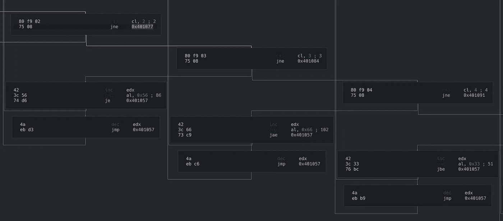
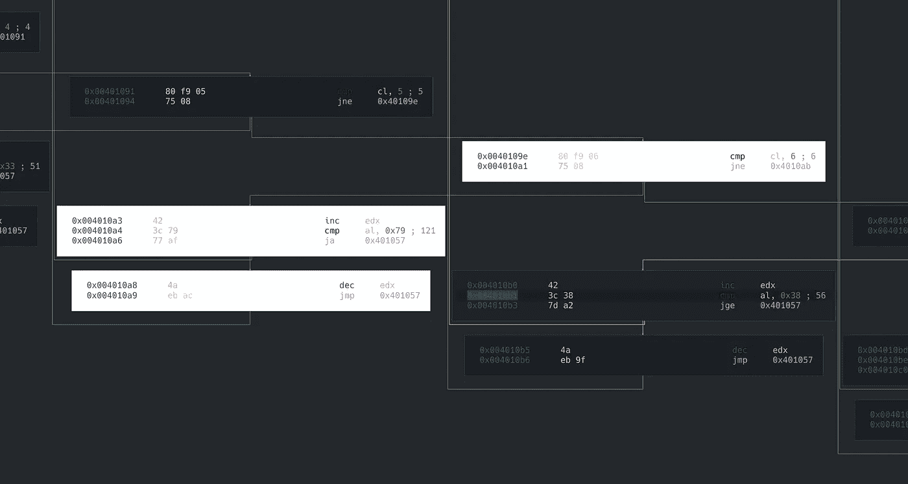
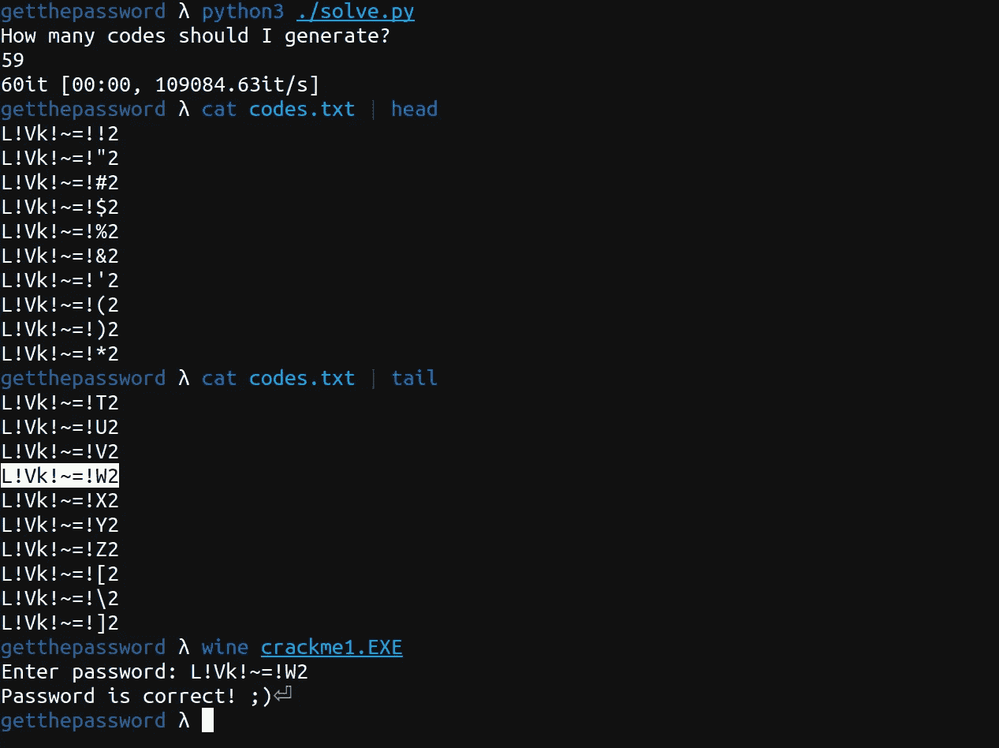

# 使用 Python Itertools 编写 Keygen

> 原文：<https://infosecwriteups.com/writing-a-keygen-using-python-itertools-1944cbb4d07c?source=collection_archive---------0----------------------->



由[马特·阿特兹](https://unsplash.com/@mattartz?utm_source=medium&utm_medium=referral)在 [Unsplash](https://unsplash.com?utm_source=medium&utm_medium=referral) 上拍摄

今天我们要生成一个简单的 keygen 来破解[这个名为“获取密码”的美丽破解程序](https://crackmes.one/crackme/5c9126c033c5d46ecd37c8f4)。野兽在这里:


很酷的图表，不是吗？

在顶部，我们可以看到一个模式，就在这里:



这是怎么回事？嗯，基本上…

`cl`被用作索引，与每次递增的硬编码值(0，1，2)进行比较..9)和`edx`被用于成对的块中，每次递增或递减 1，然后将硬编码值与`al`的内容进行比较，如果满足条件，则返回到算法的开始。

阅读代码后，我们可以得出结论，这些块中的每一个都代表了对密码中每一个字符的单独检查。

这里有一个以白色突出显示的块组:



`edx`被用作“检查计数器”,`ecx`是我们正在检查的密码中字符的索引。如果检查通过，则`edx`递增，否则递减。

在这一系列检查的最后，有一个最终验证，控制是否所有 10 个检查都已成功通过，如果是这样，则显示“密码是正确的:)”消息。


现有的大多数条件都是“开放式的”(*小于或等于*、*大于*等等)，因此我们可以得出结论，因为这不是一个单一解决方案的难题，所以编写一个 keygen 是最好的选择。

使用我们从静态分析中收集的条件列表，我们可以使用一些 python itertools 魔法创建一个 keygen。我们只需要写下我们看到的每一个检查，并为给定的条件集生成所有可能的组合。整体逻辑应该如下所示:

```
password_template = [
    greater_than(0x47),
    lower_than(0x66),
    [0x56],
    greater_than(0x66),
    lower_than(0x33),
    greater_than(0x79),
    greater_than(0x38),
    lower_than(0x4e),
    diff_from(0x52),
    [0x32],
]for p in itertools.product(*password_template):
    print(p)
```

如果你对细节感兴趣，这里有完整脚本的 GitHub 链接:

[](https://github.com/alanvivona/pwnshop/blob/master/src/0x1C-HN1-Crackme1-GetThePassword/solve.py) [## 破解“GetThePassword”的解决方案(keygen)

github.com](https://github.com/alanvivona/pwnshop/blob/master/src/0x1C-HN1-Crackme1-GetThePassword/solve.py) 

使用这个脚本，我们可以轻松地获得一些有趣的有效代码。



答对了。

我希望你喜欢这篇文章，下次再见！

[](https://twitter.com/syscall59) [## 系统调用 59

### Syscall 59 的最新推文(@syscall59)。功能过多的脚本小子。Linux &逆向工程迷。意大利

twitter.com](https://twitter.com/syscall59) 

*关注* [*Infosec 报道*](https://medium.com/bugbountywriteup) *获取更多此类精彩报道。*

[](https://medium.com/bugbountywriteup) [## 信息安全报道

### 收集了世界上最好的黑客的文章，主题从 bug 奖金和 CTF 到 vulnhub…

medium.com](https://medium.com/bugbountywriteup)