# 编写和使用 Python Burp 扩展-添加自定义头字段

> 原文：<https://infosecwriteups.com/writing-and-using-python-burp-extension-adding-a-custom-header-field-770fe1cbabc9?source=collection_archive---------4----------------------->

你在一个 bugbounty 程序中，请求是通过在每个请求的头中添加一个常量值来进行的。我们能做什么？

首先，我们可以在 Burp 中的 Proxy -> Options 选项卡中添加一个新的头，然后在“Match and Replace”字段中按 add 按钮。

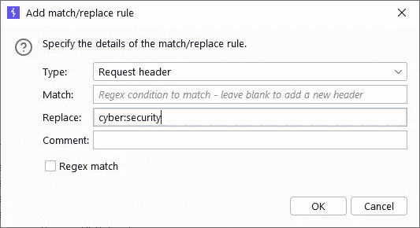

耶尼·库拉尔·埃克莱姆

当我们查看 HTTP 历史记录时，虽然我们看不到请求中的报头，但是我们可以看到我们用 wireshark 添加到 pcap 记录报头中的字段。

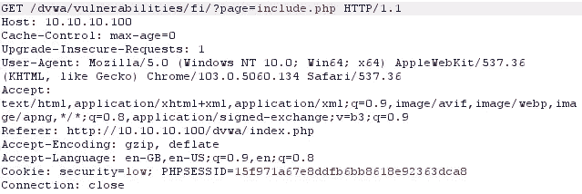

打嗝请求

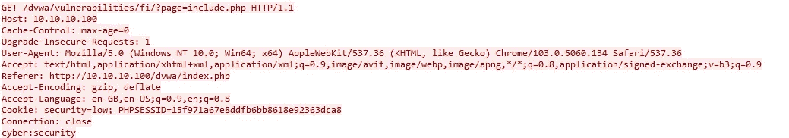

Wireshark 结果

或者第二种方法，这篇文章的主题是写一个打嗝插件。你可以通过下面的链接访问 python 代码，这是一个具有相同功能的插件。

 [## 主 anil-yelken/burp-extensions 处的 burp-extensions/add-header.py

### 此文件包含双向 Unicode 文本，其解释或编译可能与下面显示的不同…

github.com](https://github.com/anil-yelken/burp-extensions/blob/main/add-header.py) 

我们下载 Jython Standalone 来安装 Python Burp 插件。

[https://repo 1 . maven . org/maven 2/org/python/jython-standalone/2 . 7 . 3/jython-standalone-2 . 7 . 3 . jar](https://repo1.maven.org/maven2/org/python/jython-standalone/2.7.3/jython-standalone-2.7.3.jar)

在 Extender -> Options 菜单中，我们使 jar 文件能够显示在 Python 环境字段中。

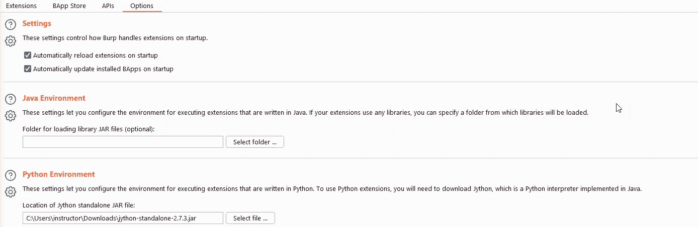

通过单击 Extender -> Extensions 部分中的 Add 按钮，我们确保我们的代码显示在扩展文件字段中。

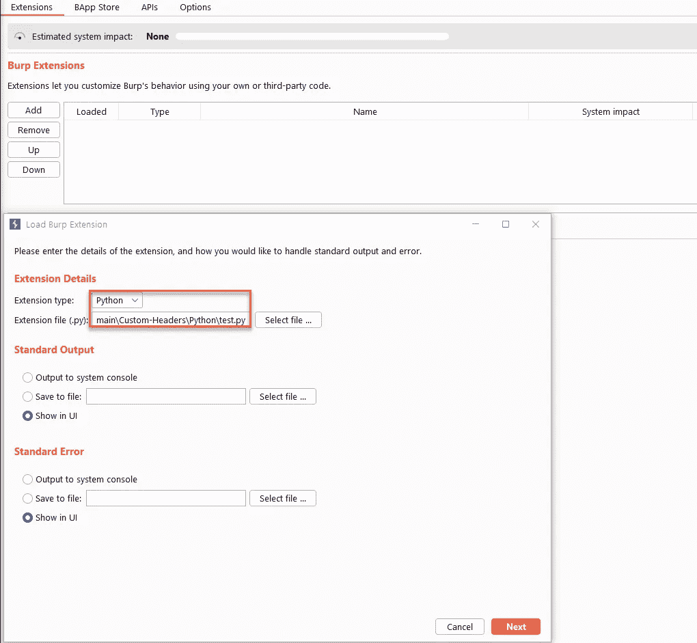

该文件已添加如下。

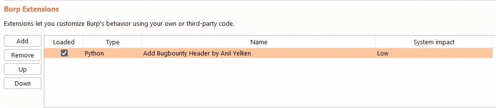

现在，为了在项目中使用这个扩展，让我们转到“项目选项”选项卡，并按下“会话处理规则”部分中的 Add 按钮。

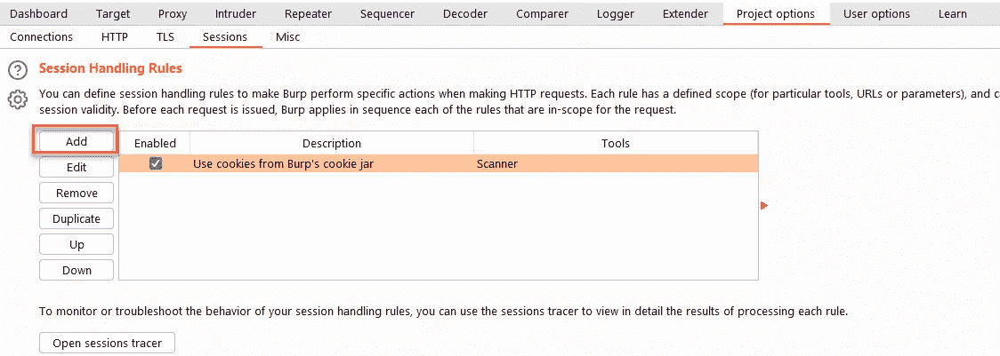

让我们在规则定义中写下“Add Header”并选择“Invoke a Burp Extension”来使用插件。

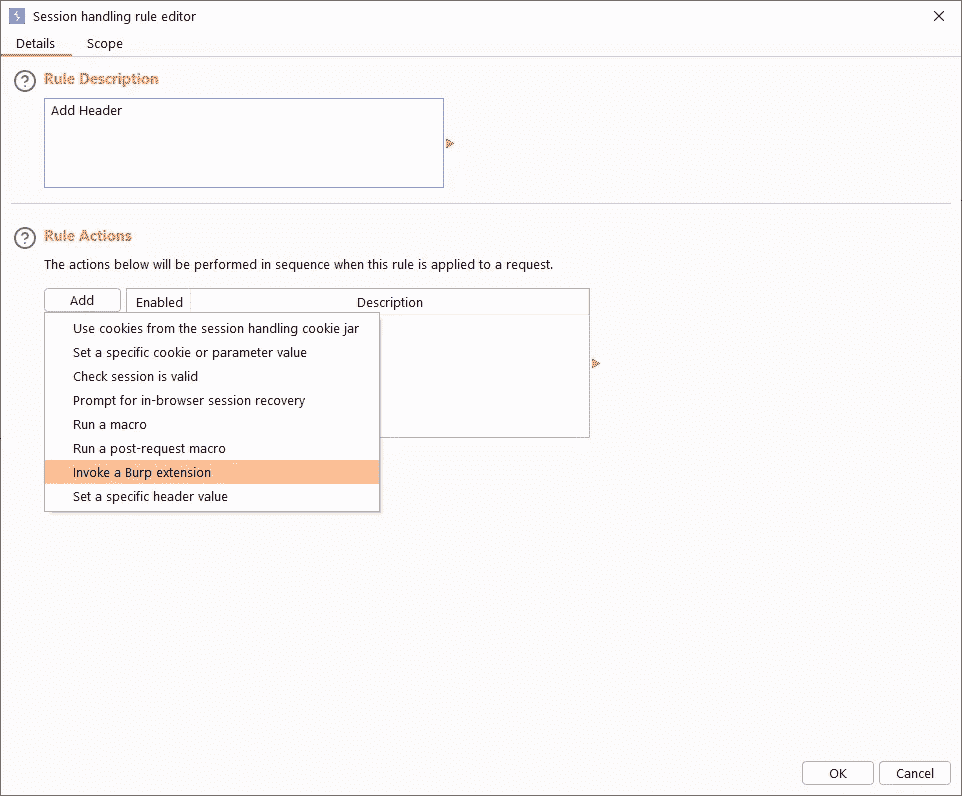

对于扩展处理，我们选择“添加‘Bugbounty’头”选项，这是代码中 getActionName 中指定的表达式。

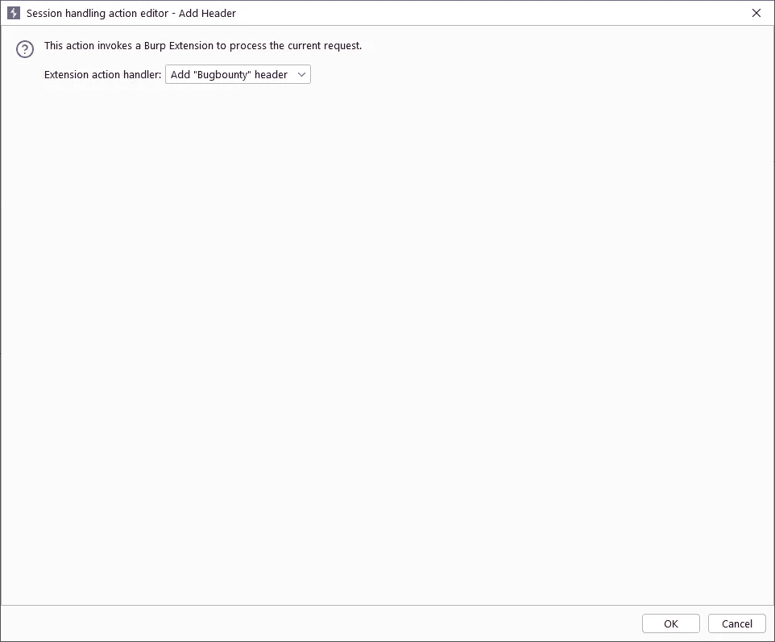

按下 OK 按钮，我们来到“Scope”选项卡。我们如下组织潜望镜选项卡。它会将此标题添加到我们在所有 URL 中选择的 Burp 工具中。

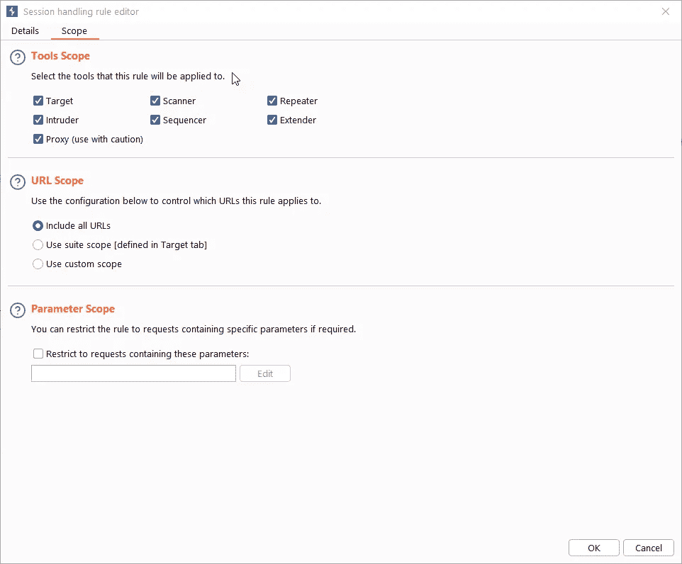

您可以通过单击“打开会话跟踪器”按钮来跟踪请求。

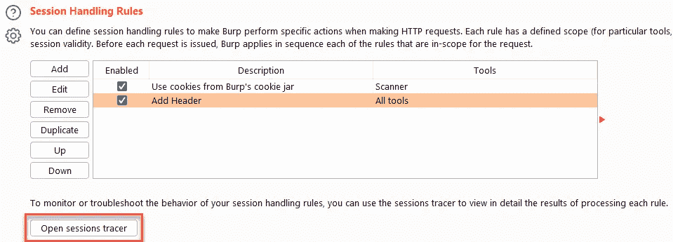

观察到请求中报头字段的变化如下:

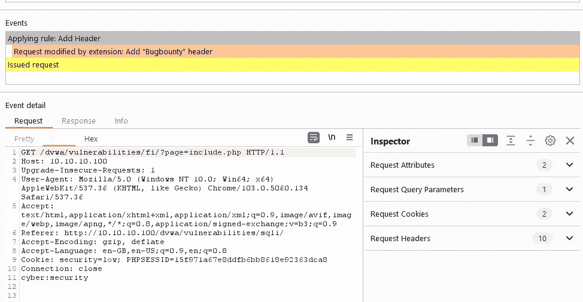

当我们在 Wireshark 中检查相同的流程时，我们可以看到 header 字段。

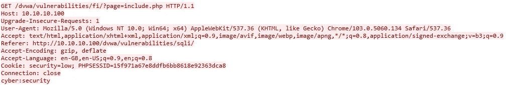

我对内容的误用不负任何责任。

您可以通过下面的链接访问我开发的易受攻击的 web 应用程序:

 [## GitHub-Anil-yelken/Vulnerable-Flask-App:Erlik 2-Vulnerable-Flask-App

### erlik 2-Vulnerable-Flask-App Tested-Kali 2022.1 它是一个易受攻击的 Flask Web App。这是一个创建的实验室环境…

github.com](https://github.com/anil-yelken/Vulnerable-Flask-App)  [## GitHub-Anil-yelken/Vulnerable-Soap-Service:Erlik-Vulnerable Soap Service

### Erlik -易受攻击的 Soap 服务已测试- Kali 2022.1 这是一个易受攻击的 SOAP web 服务。这是一个实验室环境…

github.com](https://github.com/anil-yelken/Vulnerable-Soap-Service) 

## 来自 Infosec 的报道:Infosec 每天都有很多内容，很难跟上。[加入我们的每周简讯](https://weekly.infosecwriteups.com/)以 5 篇文章、4 条线索、3 个视频、2 个 GitHub Repos 和工具以及 1 个工作提醒的形式免费获取所有最新的 Infosec 趋势！