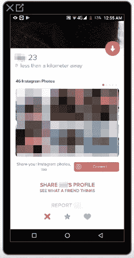

# 我如何在 Tinder 上获得任何人的 Instagram 用户名

> 原文：<https://infosecwriteups.com/wrong-swipe-tinder-29fe1eb0203c?source=collection_archive---------0----------------------->

*注:以下文章发表于 2019 年 7 月 16 日 https://FogMarks.com*

**

*今天的案例研究根本不涉及任何漏洞。是的——你听到了。没有 XSS，没有开放重定向，没有 CSRFs 或 IDORs。没什么。没有。*

*我们只会了解到 Tinder 为了将用户的 Instagram 账户整合到他们的平台上而使用的一个错误的实现。*

*当我和一个朋友开玩笑说，他在 Tinder 上找到匹配的唯一方法是他能找到一个漏洞时，我开始阅读 Tinder 最近遭受的安全漏洞。
因此，AppSecure 找到了一种方法，使用脸书的账户工具包来[接管 Tinder 账户，这很棒，Checkmarx 发现](https://medium.freecodecamp.org/hacking-tinder-accounts-using-facebook-accountkit-d5cc813340d1)[Tinder 上的一些信息正在通过 HTTP](https://www.checkmarx.com/2018/01/23/tinder-someone-may-watching-swipe-2/) 传输，天知道为什么。
但我发现的最有趣的漏洞是 IncludeSecurity 发现的关于[Tinder 用户的位置是如何使用三角测量](http://blog.includesecurity.com/2014/02/how-i-was-able-to-track-location-of-any.html)被泄露的漏洞。
这是一篇有趣的文章，讲述了一种使用非常精确的位置参数来泄露用户位置的创造性方法，该参数会返回给任何发送到服务器的常规请求。基本上 Tinder 免费交了一个漏洞。*

# *我对它的简单感到惊讶*

*在阅读了 IncludeSecurity 的文章后，我惊讶于事情是如此简单。不需要伊多尔，也不需要复杂的 CSRF 或 XSS。信息就在那里，免费的，每个人都可以获取和滥用。*

# *这时候我开始思考*

*我花了几个小时研究 Tinder 的网站和 Android 应用程序。
真的，在 2019 年，特别是在脸书的剑桥分析危机之后，Tinder 在保护自己免受典型的 OWASP 十大漏洞方面做了一些该死的工作。*

> *这也是说在付费平台上，真的很难进行一个质量安全研究的地方和时间。Tinder 上的许多操作都需要一个高级账户，作为高级用户重复这些操作的成本甚至更高。希望自己的平台被安全社区研究的公司应该允许完全免费地访问他们的平台。
> 我知道很多安全公司都有能力资助这项研究，但这对小规模的个人安全研究人员来说是不公平的。想想吧。*

# *我心想一切都结束了*

*那天晚上，我和我的朋友开了个玩笑，在那几个小时的研究中，我找不到任何关于 Tinder 漏洞的有趣线索。我当时(现在也是)工作忙得不可开交，没有时间研究 Tinder。
我不得不发信息给我的朋友，希望他能从全球速卖通给自己弄辆自动刷卡机来匹配。*

**

*信用:[https://odditymall.com/tinda-finger-robot](https://odditymall.com/tinda-finger-robot)*

***然后 IncludeSecurity 的文章在我脑子里蹦了一下**。我心想:“如果 Tinder 在这件事上的逻辑不是非常注重隐私，那么他们还会把哪些本应保密的敏感信息‘公之于众’呢？”*

# *第三方集成是游戏的名称*

*像许多其他社交平台一样，Tinder 与一些非常受欢迎的公司和平台进行了几次整合——Spotify、脸书，甚至还有一些大学。*

*在简单浏览该应用程序的常规 Android API 调用返回的所有响应时，我注意到当用户将他的 Instagram 帐户与 Tinder 连接时，他的 Instagram 照片会显示在他的个人资料页面上。*

**

*点击“共享 X 的个人资料”按钮后，我注意到该个人资料生成了一个唯一的共享标识符，如下所示:
*https://go.tinder.com/~<UNIQUE _ Share _ ID>-<用户名>**

*当我从 Tinder 的网页版访问这个网址时，什么也没发生——我被重定向到了 https://tinder.com 的*

***但是**当我从安卓手机的浏览器访问它时，Tinder 应用程序启动了，并向*https://api.gotinder.com/user/share/~<UNIQUE _ SHARE _ ID>*发起了 GET 请求。
对该请求的响应包含了用户的许多详细信息，**包括他/她的 Instagram 用户名。***

# *结局*

*在我的案例研究历史上，这是第一次我没有什么聪明的东西可以说或教。这个漏洞(当然已经被修补)和 IncludeSecurity 发现的漏洞可以通过简单地检查所有支持的 API 调用的返回数据，并确保非私有信息被移交来容易地防止。*

*最后，我相信 QA 团队已经检查了 API 调用返回的数据，但是出于错误的目的——他们可能只是确保返回的数据正是前端 UI 所期望的。*

*我认为这里最重要的教训是版本发布前的 QA 阶段是不够的，尽管它可能很大很全面。拥有一个 [**红队**](https://en.wikipedia.org/wiki/Red_team) 对于即将发布的产品及其用户的安全至关重要。*

*干杯！*