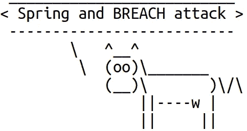

# WS-2016-7107:春天的 CSRF 令牌和缺口攻击

> 原文：<https://infosecwriteups.com/ws-2016-7107-csrf-tokens-in-spring-and-the-breach-attack-4394b10d1b8?source=collection_archive---------2----------------------->

最近，WhiteSource security scanner 开始针对基于 Spring 的应用程序报告 WS-2016-7107。这是 2016 年报道的春安老[问题](https://github.com/spring-projects/spring-security/issues/4001)。不幸的是，在写这篇文章的时候，这个问题还没有解决。但是有一个[拉请求](https://github.com/spring-projects/spring-security/pull/8082)可以解决这个问题。问题是 Spring Security 生成的 CSRF 令牌容易受到[漏洞](http://breachattack.com/)攻击。这一攻击甚至更早——发表于 2013 年。违规攻击类似于犯罪攻击，但违规不需要 TLS 压缩。



成功的攻击有几个条件:

1.  攻击者应该能够在受害者的请求中插入部分选择明文(这通常称为选择明文攻击模型)。
2.  攻击者应该能够观察到来自受害者的加密流量。
3.  应该启用 HTTP 压缩。

TLS 配置无所谓。在基于 Spring 的应用程序中，成功的攻击允许攻击者恢复受害者的 CSRF 令牌。WS-2016-7107 就是这么回事。

这个问题似乎得到了相当多的关注，因为 WhiteSource 针对几乎所有使用 Spring Framework 的应用程序报告了这个问题。看看 GitHub 上原刊[链接白源报道](https://github.com/spring-projects/spring-security/issues/4001)的数量。这只是 GitHub 上使用 WhiteSource 的项目。更糟糕的是，这个问题仍未解决。因此，仅仅通过修改 Spring Security 的版本是不可能在应用程序中解决这个问题的。此外，如果建议的修复被接受，它可能只会在 Spring Security 的下一个主要更新中发布，因为该修复更新了公共 API。

看起来完全消除违规攻击风险的最可靠方法是确保 HTTP 压缩被禁用。好消息是，在最新版本的 Spring Boot 中，HTTP 压缩被默认禁用。除非应用程序将属性`server.compression.enabled`设置为`true`，否则破坏攻击应该是不可能的。当然，最好是在 not:

```
GET /path/to/something
HTTP/1.1 Host: test.server.com
Accept-Encoding: gzip, deflate
```

下面是你如何用`curl`做到这一点:

```
curl -v -H "Accept-Encoding: gzip, deflate" [https://test.server.com/path/to/something](https://test.server.com/path/to/something)
```

如果服务器返回带有支持的压缩方法列表的 Content-Encoding 头，那么 HTTP 压缩是打开的。维基百科有一个这样回应的例子。否则，HTTP 压缩关闭。

如果必须打开 HTTP 压缩，可能还有另一个选项。该应用程序可以实现一个自定义的`CsrfTokenRepository`，该自定义的`CsrfTokenRepository`将未发布的[补丁](https://github.com/spring-projects/spring-security/pull/8082)应用于 Spring 安全。不过我还没有测试过这个选项。

让我们希望这个问题将很快在春季安全中得到解决。

*原载于 2021 年 4 月 14 日*[](https://blog.gypsyengineer.com/en/security/csrf-tokens-in-spring-and-the-breach-attack.html)**。**