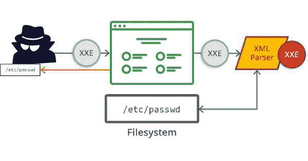

# XML 外部实体

> 原文：<https://infosecwriteups.com/xml-external-entities-9c2f2169430a?source=collection_archive---------1----------------------->

## 作者:[安舒尔·维亚斯](https://www.instagram.com/_ansh_vyas/)



# XML:可扩展标记语言

顾名思义，XML 代表可扩展标记语言。标记语言由一组称为标签的代码组成，用于描述数字文档中的文本。HTML 是网站最流行的标记语言。

# XML 外部实体

XML 外部实体是一种具有定义值的自定义 XML 实体，这些值在声明它们的 DTD 之外加载。从安全的角度来看，外部实体特别有趣，因为它们允许基于文件路径或 URL 的内容来定义实体。XML 外部实体攻击是针对解析 XML 输入的应用程序的攻击。

当使用带有弱配置 XML 处理选项的 XML 解析器来处理包含外部实体引用的 XML 输入时，就会发生这种攻击。XXE 仅用于获取包含“有效”XML 的文件，而不是二进制文件。

# XML 注入

攻击者可以在 web 上使用 XML 外部实体注入(或简称为 XXE)来干扰应用程序对 XML 数据的处理。

## 工作

通过使用标签和数据的树状结构来存储和传输数据，XML 使用了树状结构。XML 文档可以附带指定数据值、权限等的文档类型定义(DTD)。有两种方法可以使用 DTD:可以将它合并到文档本身中，也可以引用外部版本。当文档引用外部 DTD 时，其定义位于声明它们的 DTD 之外的自定义实体被称为 XML 外部实体。

# XML 注入

恶意方有可能通过 XML 外部实体注入(XXE)拦截或更改应用程序与其服务器之间传递的数据。恶意方还可以通过从您的服务器检索文件来执行 SSRF 攻击或发起盲目的 XXE 攻击。

通过使用 XML 元字符，可以修改结果 XML 文档的结构。当用户以不安全的方式将输入插入服务器端 XML 文档或 SOAP 消息时，就会出现 XML 注入漏洞。

# XML 注入攻击的类型

利用本主题中描述的攻击，可以攻击任何解析 XML 输入的应用程序。特别是，攻击者创建应用程序使用的畸形或狡猾的 XML，目的是欺骗 XML 解析器进行一些破坏。一般来说，对有错误或配置错误的 XML 解析器会有两种类型的攻击。

## XML 炸弹

当 XML 解析器崩溃或不能正确处理某些输入数据时，就会发生拒绝服务攻击。

## XXE 披露

解析器可能会无意中泄露敏感信息。以下部分描述了每种类型的攻击是如何发起的。请注意，攻击可以利用完全有效的 XML，也可以利用潜在的格式错误的 XML(除非解析器检测到它并完全拒绝它)。

## XML 炸弹攻击

有许多类型的 XML 炸弹，但它们都被设计成在执行时导致 XML 解析器或处理其输出的应用程序挂起或崩溃。例如，十亿次大笑攻击在 XML 解析期间使用一个短的 XML 文件来增长到大约 3gb 的数据。很容易看出数据大小是如何任意增加的，并且产生的大量数据通常会使任何应用程序崩溃。

## 减轻 XML 炸弹

应用程序可以通过配置 XML 解析器禁用内联实体扩展来避免 XML 炸弹。攻击者不可能在没有内联扩展的情况下增加几何尺寸，这导致这些攻击变得无害。当应用程序需要实体扩展时，或者如果 XML 解析器不提供此配置选项，设置解析器来强制限制扩展实体的大小。

以下示例代码禁用标准中的内联 dtd。NET 4.0 XML 解析器:

```
XmlReaderSettings settings = new XmlReaderSettings();
settings.DtdProcessing = DtdProcessing.Prohibit; XmlReader reader =
XmlReader.Create(stream, settings);
```

在这种配置中，两个 XML 炸弹都不会消耗过多的内存。数据结构将显示来自源 XML 的实体扩展结构，而不是存储千兆字节的数据。为了避免导致拒绝服务，应用程序必须直接构建相关实体的扩展形式，并确保在此过程中进行适当的检查。

# XML 外部实体(XXE)攻击

外部实体是通用 XML 的一个特性，可以用来攻击应用程序。当攻击者提供包含对外部实体的引用的 XML 输入时，XML 解析器将读取引用的数据，并将其处理成结果 XML 文档。XML 外部实体允许从外部 URIs 提取替换值，以便可以访问文件和网络资源。攻击者有可能利用 XML 解析器进程的权限来操纵结果数据，从而泄漏数据。对非常大的数据源的引用也可能导致拒绝服务攻击。

举个例子，假设一个 XML 输入引用/dev/random，一个无限期运行的伪随机字节文件(具体来说，连续读取随机字节会在系统熵池耗尽时阻塞，再次重新供应数据时会重新供应数据)。XML 解析器将从外部实体读取和构造数据，直到文件结束。这将使系统过载到故障点。

```
!ENTITY xxe SYSTEM file:///dev/random>
```

# 减轻 XML 外部实体(XXE)攻击

通过防止外部引用被完全解析，XML 解析器可以防止 XXE 攻击。

中的配置代码。NET 4.0 防止了这种性质的攻击:

```
XmlReaderSettings settings = new XmlReaderSettings();
settings.XmlResolver = null; XmlReader reader =
XmlReader.Create(stream, settings);
PHP uses the default XML parser when processing XML:
libxml_disable_entity_loader(true);
```

在某些情况下，XML 外部实体可能是必要的，甚至是不可或缺的，这使得完全禁用它们不是一个可接受的解决方案。在这些情况下，您可以考虑配置或修改 XML 解析器来实现一个或多个策略:

*   通过强制超时来防止延迟或涉及大量数据的攻击。
*   数据检索仅限于某些类型和数量。
*   您可以阻止 XmlResolver 从本地计算机检索资源。

本地修改的使用提出了一个持续的维护问题，以跟上基础代码的未来版本。此外，修改 XML 解析器将是复杂的，并且会引入新的安全漏洞。

相比之下，任何没有安全配置的 XML 解析器在开发时可能都没有考虑到安全问题，除非进行彻底的检查并付出相当大的努力，否则很难保证安全。最好的方法是使用可配置的 XML 解析器来减轻安全威胁。

还可以通过检查呈现给 XML 解析器的 XML 数据是否有效来要求有效的头，从而防止任意文件被视为 XML。因为当文件格式不正确时，XML 解析器可能会以未知的方式运行，所以这可能是有用的。

# 摘要

当应用程序解析特制的 XML 输入时，它可能会造成损害。XML 炸弹(拒绝服务)和 XXE(信息泄露或拒绝服务)都是众所周知的攻击。一种较好的缓解方法是配置 XML 解析器，禁用或至少安全地限制导致这些问题的 XML 特性。可能会有配置不充分的情况，可能需要修改 XML 解析器，但是这是一个风险更大、劳动强度更大的选择。

## 来自 Infosec 的报道:Infosec 每天都有很多内容，很难跟上。[加入我们的每周简讯](https://weekly.infosecwriteups.com/)以 5 篇文章、4 条线索、3 个视频、2 个 GitHub Repos 和工具以及 1 个工作提醒的形式免费获取所有最新的 Infosec 趋势！