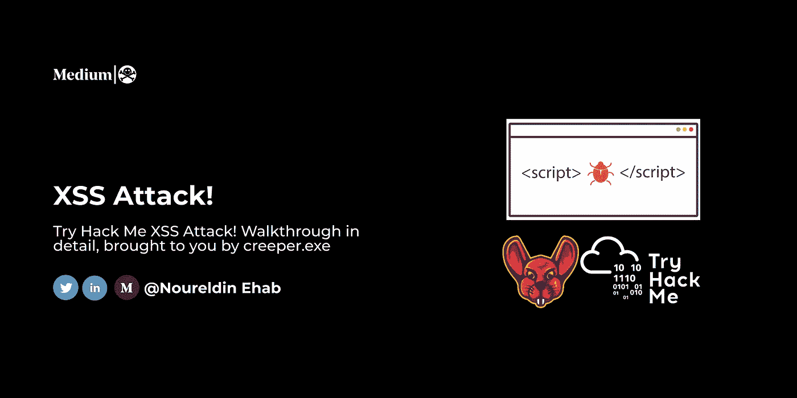
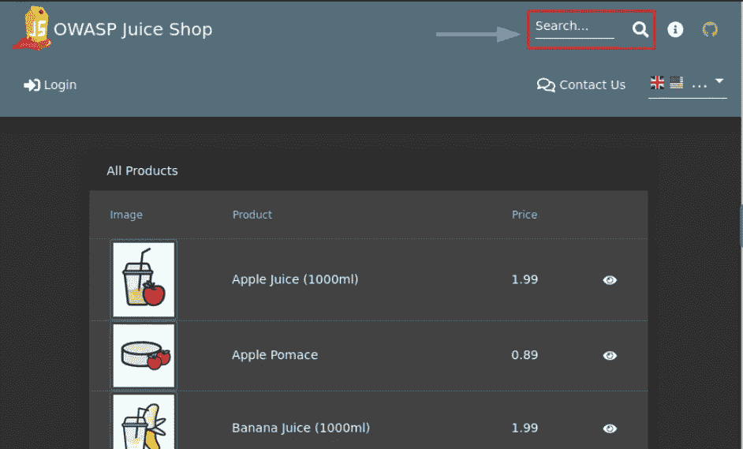
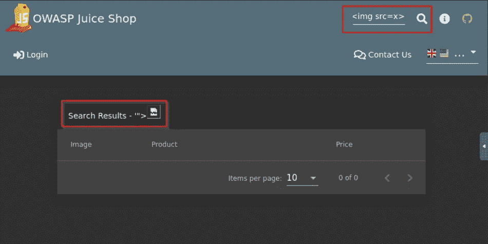
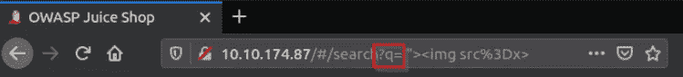

# XSS 进攻！TryHackMe 记录/演练

> 原文：<https://infosecwriteups.com/xss-attack-tryhackme-writeup-walkthrough-2fd20895b17f?source=collection_archive---------1----------------------->



# 介绍

这是一个简单的[房间](https://tryhackme.com/room/xssattack1u)，教我们关于[制作的](https://medium.com/u/c4af1cf135f5?source=post_page-----2fd20895b17f--------------------------------)XSS，随时可以在[推特](https://twitter.com/Nouureldin_Ehab)或 [Linkedin](https://www.linkedin.com/in/noureldin-ehab-a57940190/) 上问我任何问题

注意:要访问 OWASP 十大果汁店，请在浏览器中键入 try hack me machine IP，并确保您已连接到 try hack me 网络

# 任务 1 基本 XSS

在我们做任何事情之前，我们需要使用网站来了解它是如何工作的，用户的行为是什么，以及如何以恶意的方式使用这些无辜的行为。
由于我们正在寻找 XSS 注射，我们需要寻找输入点(搜索字段，评论字段，表单字段，甚至上传功能)

但是等一下，XSS 到底是什么意思？！
根据[burp suite Academy](https://portswigger.net/web-security/cross-site-scripting)**跨站脚本(也称为 XSS)是一个 web 安全漏洞，它允许攻击者破坏用户与易受攻击的应用程序的交互。**

****它是如何工作的？** 跨站脚本的工作原理是操纵易受攻击的网站，使其向用户返回恶意 JavaScript。当恶意代码在受害者的浏览器中执行时，攻击者可以完全破坏他们与应用程序的交互。([博普塞特学院](https://portswigger.net/web-security/cross-site-scripting))**

**现在我们知道了什么是 XSS，让我们寻找输入点**

****

**搜索字段**

**现在我们需要尝试一个基本的有效载荷，看看是否有任何清理(我将使用**' ">**)
**这个有效载荷将允许我们搜索****

*   **JS 注射液
    和"**
*   **HTML 标签属性插入
    '" >**
*   **HTML 注入
    T42【img src = x>**

****

**" >在搜索栏中**

**正如我们看到的，它被反射**

*   **第一次反射发生在哪里？**

```
Search
```

*   ****什么参数导致了反射？****

****

```
q
```

****XSS 攻击有哪些类型？**(根据[博普斯特学院](https://portswigger.net/web-security/cross-site-scripting))**

**XSS 攻击主要有三种类型。这些是:**

*   **[反映了 XSS](https://portswigger.net/web-security/cross-site-scripting#reflected-cross-site-scripting) ，其中恶意脚本来自当前 HTTP 请求。**
*   **[存储了 XSS](https://portswigger.net/web-security/cross-site-scripting#stored-cross-site-scripting) ，这里的恶意脚本来自网站的数据库。**
*   **[基于 DOM 的 XSS](https://portswigger.net/web-security/cross-site-scripting#dom-based-cross-site-scripting) ，其中漏洞存在于客户端代码而非服务器端代码中。**
*   **这是什么类型的 XSS？反射还是储存 XSS？**

```
Reflected
```

*   **这是什么类型的 XSS？基于 DOM 还是基于源代码的 XSS？**

```
Source based
```

**现在我们需要利用它**

**你可以在这个 [Github Repo](https://github.com/swisskyrepo/PayloadsAllTheThings) 上找到有效载荷，但是在明白你为什么要使用它之前，千万不要使用它**

*   ****什么是有效载荷？****

```

```

*   ****当我们看到一个警告弹出窗口时，我们应该停止还是继续测试，看看我们是否不能利用它？****

```
Keep Digging
```

**我们将在下一个问题中知道为什么我们需要继续挖掘**

**我们在寻找什么？
A)窃取 cookie 或页面上的任何数据
B)窃取 cookie、CSRF 令牌
C)窃取 cookie
D)窃取 cookie、CSRF 令牌或页面上的任何数据
E)窃取 CSRF 令牌或页面上的任何数据**

```
D) To steal the cookies, CSRF tokens, or any data on the page
```

*   ****你能找到一个包含以下元素的工作攻击向量吗:** <脚本>标签</脚本>标签
    alert()**

```
<script>alert()</script>
```

**(这是最基本的有效载荷)**

*   ****你能找到一个包含以下元素的工作攻击向量吗:**tag
    confirm()
    onclick 事件处理程序**

```

```

*   ****XSS 发生在什么背景下？** A) JS 注入
    B) CSS 注入
    C) HTML 注入
    D) LDAP 注入**

```
C
```

*   ****这个问题是在什么背景下发生的？** A) JS 上下文
    B)HTML Li
    C)HTML 标签属性插入
    D) CSS 注入
    E) LDAP 注入**

```
B
```

*   **你还能帮我找到 DVWA 的 DOM XSS 章节中易受攻击的参数的名称吗？**

```
Default
```

*   ****DOM Source/DOM Sink？****

```
DOM Sink
```

# **/etc/外卖**

**我了解了多姆·XSS**

# **时事通讯**

**我将分享我的学习之旅，网络安全新闻，新简历和学习资源，以及更多，请随时[订阅](https://www.getrevue.co/profile/Noureldin_Ehab)😊请不要忘记喝水🌊**

# **⭐I 喜欢与不同的人联系，所以如果你想打招呼，我会很高兴见到你！:)**

**[**LinkedIn**](https://www.linkedin.com/in/noureldin-ehab-a57940190/)[**Twitter**](https://twitter.com/Nouureldin_Ehab)**

****Infosec Writeups 正在组织其首次虚拟会议和网络活动。如果你对信息安全感兴趣，这是最酷的地方，有 16 个令人难以置信的演讲者和充满力量的讨论会议。** [**查看更多详情，在此注册。**](https://iwcon.live/)**

**[](https://iwcon.live/) [## IWCon2022 - Infosec 书面报告虚拟会议

### 与世界上最优秀的信息安全专家建立联系。了解网络安全专家如何取得成功。将新技能添加到您的…

iwcon.live](https://iwcon.live/)**