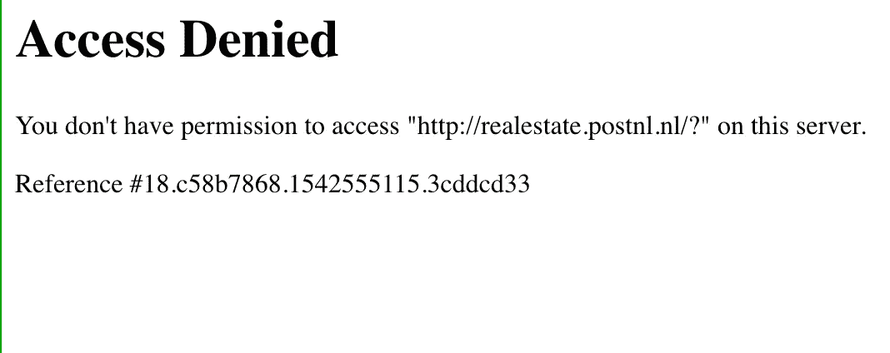
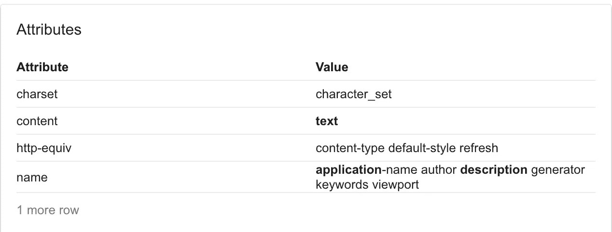
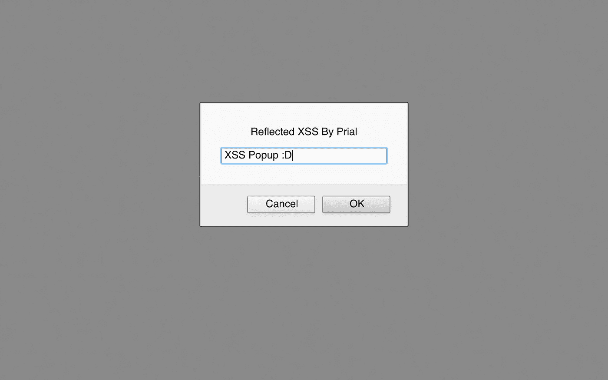
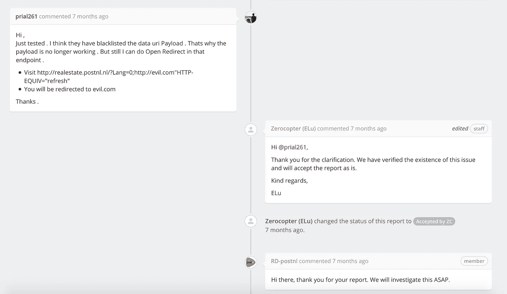
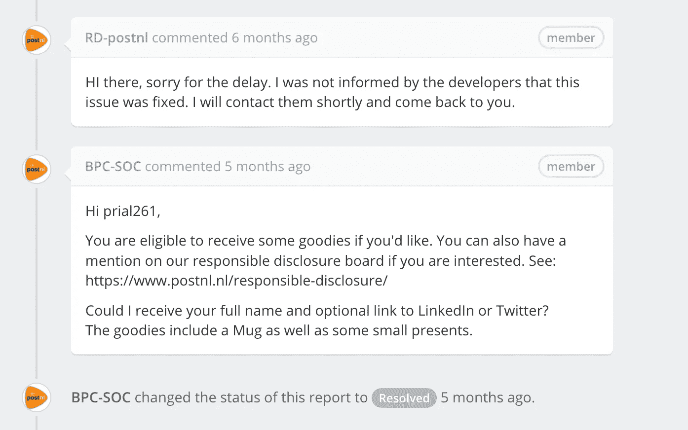

# 在 realestate.postnl.nl 中使用 META 标记绕过 XSS

> 原文：<https://infosecwriteups.com/xss-bypass-using-meta-tag-in-realestate-postnl-nl-32db25db7308?source=collection_archive---------0----------------------->

嗨，读者们，

今天我将写一个我向 [postnl.nl 漏洞奖励计划](https://www.postnl.nl/en/responsible-disclosure/)报告的 XSS 漏洞。

**脆弱的端点:**【http://realestate.postnl.nl/?Lang=】T4

为了测试一个正常的反射 XSS，我在参数 **Lang** 中输入了 **" > < xsstest >** ，在源代码中，它被正确地反映在 META 标记中，如下所示

```
<meta name="language" content=""><xsstest>" />
```

看起来很简单对吗？然后稍微等一下:')。然后我输入**">**，我得到:-



给你个惊喜，黑鬼🥳🥳🥳

我尝试了许多 HTML 标签，在这里我得到了两点

*   不允许任何有效的 HTML 标记。
*   我可以在这里创建任何属性。

所以我谷歌了一下元标签属性，得到了:-



看起来很有趣🤔🤔🤔

http-equiv 属性引起了我的注意。现在，我再次谷歌更多关于它的信息，并了解到:-

META 标签有 **http-equiv** 指令。此指令允许您在 HTML 代码中定义相当于 HTTP 头的内容。 **http-equiv** 指令可以接受 **refresh** 的值，该值可用于将用户重定向到另一个页面。

然后我输入**0；HTTP://evil . com " HTTP-EQUIV = " refresh "**得到的回应是:-

```
<meta name="language" content="0;http://evil.com"HTTP-EQUIV="refresh"" />
```

我被转到了 evil.com。所以我现在打开了重定向。现在我们可以试试 URI·XSS 的数据。于是我输入:-**0；JavaScript:alert(1)" HTTP-EQUIV = " refresh "**响应为:-


这再次被分类为有效负载中使用的关键字 **javascript** 。所以我用了 Base64 编码的有效载荷:-**0；数据:文本/html；base64，phnjcmlwd 5 wcm 9 tchqoiljlzmxly 3 rlzcbyu 1 mgqnkguhjpywwikitwvc 2 nya XB 0 pg = = " HTTP-EQUIV = " refresh "**，响应源为:-

```
<meta name="language" content="0;data:text/html;base64,PHNjcmlwdD5wcm9tcHQoIlJlZmxlY3RlZCBYU1MgQnkgUHJpYWwiKTwvc2NyaXB0Pg=="HTTP-EQUIV="refresh"" />
```

现在当我访问 http://realestate.postnl.nl/?时 lang = 0% 3b data % 3a text % 2 fhtml % 3b base 64% 2 cphnjcmlwd 5 wcm 9 tchqoiljlzmxly 3 rlzcbyu 1 mgqnkguhjpywwikitwvc 2 nya XB 0 pg % 3D % 3D % 22 http-EQUIV % 3D % 22 refresh % 22 我得到了 XSS 弹出窗口。



我向他们的[零直升机报告单](https://app.zerocopter.com/rd/caff4c53-e588-440b-9b07-c54b8e877c83)报了。然后他们通过将**数据列入黑名单部署了一个补丁:text/html；base64** 关键字，就像他们已经将 **JavaScript** 关键字列入黑名单，但当用户访问:-[http://realestate.postnl.nl/?时，我仍然可以打开重定向 lang = 0% 3 bhttp % 3A % 2f % 2 fevil . com % 22 http-EQUIV % 3D % 22 refresh % 22](http://realestate.postnl.nl/?Lang=0%3Bhttp%3A%2f%2fevil.com%22HTTP-EQUIV%3D%22refresh%22)



看起来很酷🙄🙄🙄

他们再次解决了这个问题，把我的名字列在了他们的名人堂页面上，还提出要送一些好东西😍😍😍。



😍😍😍

感谢阅读。

在推特上关注我

如果你有任何疑问，请在[脸书](https://www.facebook.com/prial261)问我