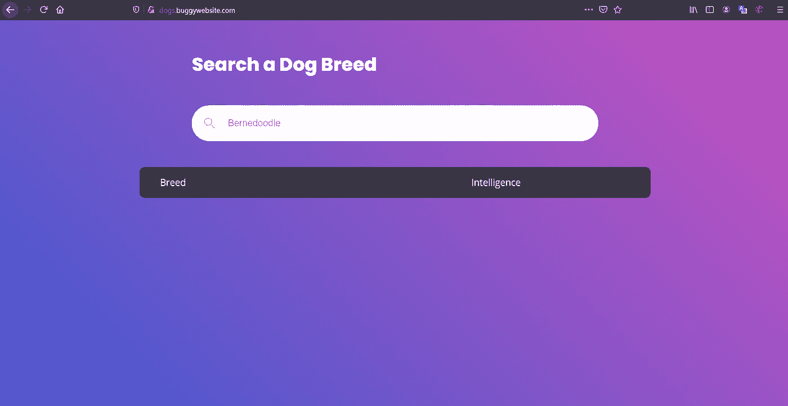
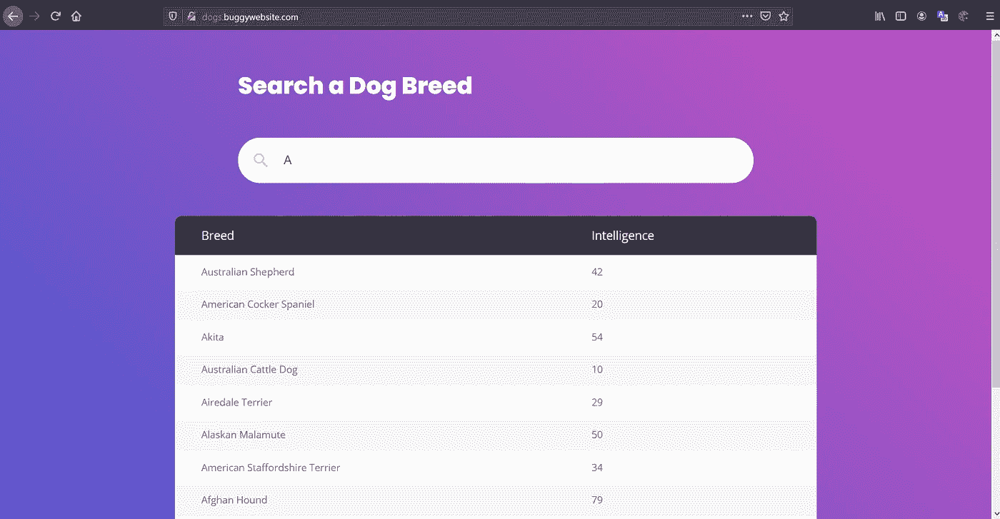
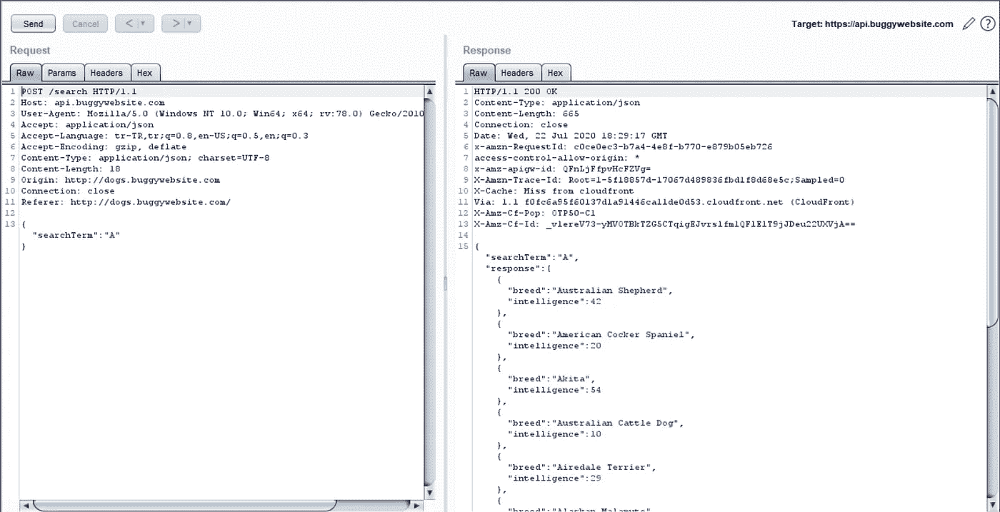
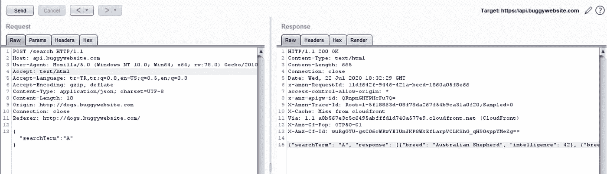
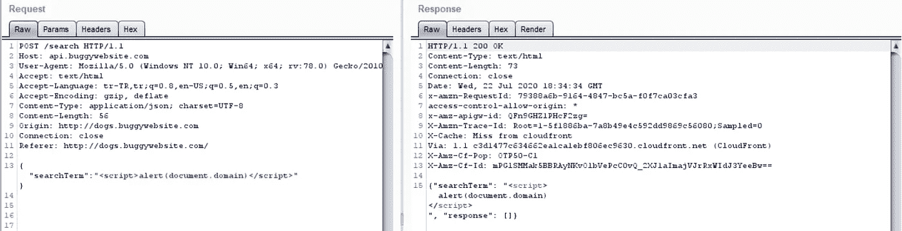
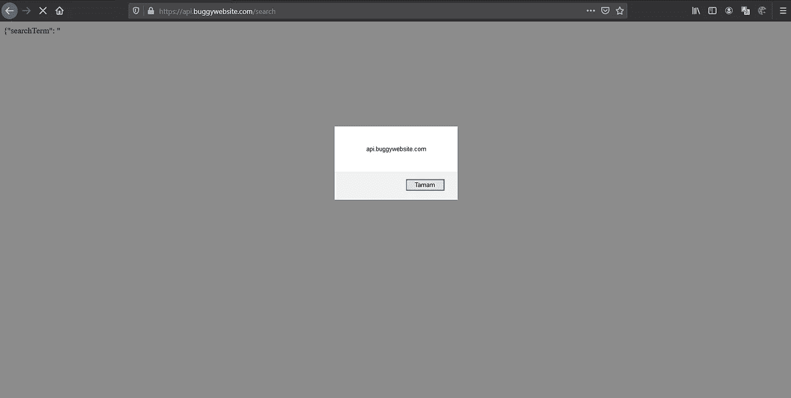

# bugpoc.com 主办的 XSS 挑战赛

> 原文：<https://infosecwriteups.com/xss-challenge-which-hosted-by-bugpoc-com-8afcb7e022de?source=collection_archive---------1----------------------->

你好，

在这篇文章中，我将分享我是如何对我的目标保持警惕的。那是 http://dogs.buggywebsite.com/。

我访问了网站，看到了一个搜索栏。我以为 xss 在那里！

我试着寻找一些东西，这就是为什么我写了 A。上面列出了以“A”开头的狗的品种。回应:

有些东西引起了我的注意。我在 URL 上看不到任何参数。有意思！然后我试着列出子域，也许我可以得到更多的信息等。但我看到它只有两个子域:

*   http://dogs.buggywebsite.com/
*   【http://api.buggywebsite.com/ 

我想在搜索文本时检查请求和响应。我打开打嗝套件，在搜索框里输入“A”。请求和响应:

这是一个普通的 json 响应(内容类型:application/json)。如果我想得到警告，它必须是文本/html！我试图用 text/html(它是 application/json)更改 Accept 头。

并将内容类型成功更改为文本/html。耶！下一步是通过警报获得域名。我尝试了一个简单的有效负载: 

嘣，P1！哈哈:d .成功剥削。我使用[https://bugpoc.com/](https://bugpoc.com/)创建了一个概念验证。

这里是 poc 代码:[https://pastebin.com/7nZvm6Cv](https://pastebin.com/7nZvm6Cv)

我希望你读这篇文章的时候觉得有趣。如果你愿意，你可以关注我的社交账户:

[https://twitter.com/alicanact60](https://twitter.com/alicanact60)

 [## Ali Tütüncü -安全研究员- HackerOne | LinkedIn

### 查看 Ali Tütüncü在全球最大的职业社区 LinkedIn 上的个人资料。阿里有一个工作列在他们的…

www.linkedin.com](https://www.linkedin.com/in/alicanact60/)  [## HackerOne 配置文件- mygf

### 编辑描述

hackerone.com](http://hackerone.com/mygf)  [## 阿里·图图恩库

### https://twitter.com/alicanact60

www.youtube.com](https://www.youtube.com/channel/UCjT54CYoSAa7RK60NCpRueQ) 

你也可以关注 https://bugpoc.com 的推特地址:

[https://twitter.com/bugpoc_official](https://twitter.com/bugpoc_official)