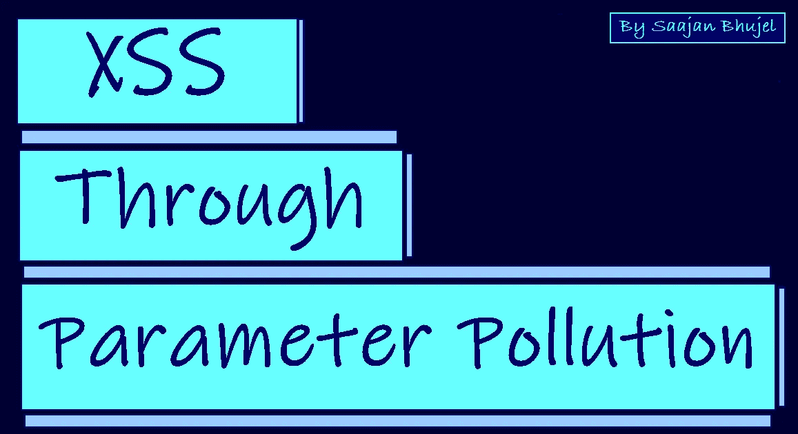
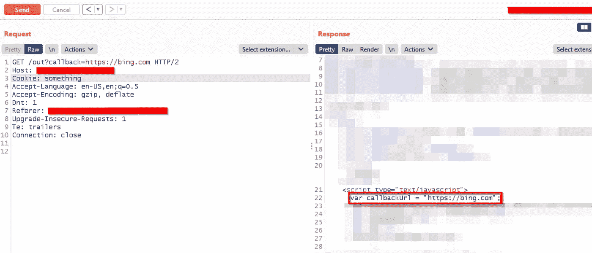
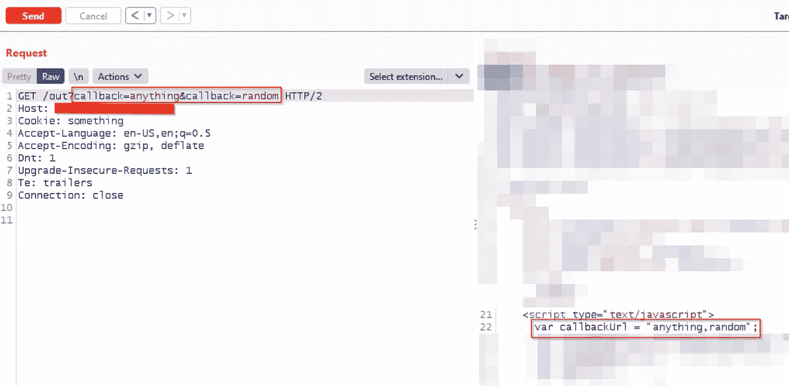
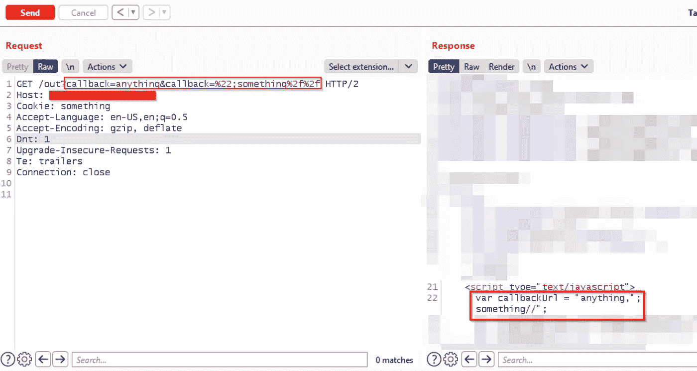
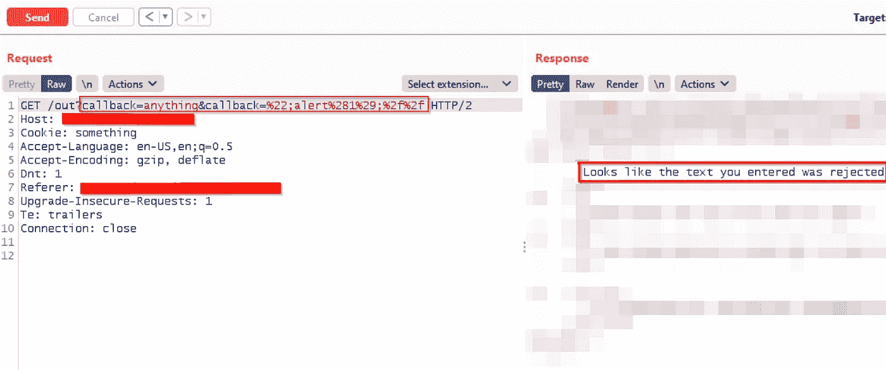
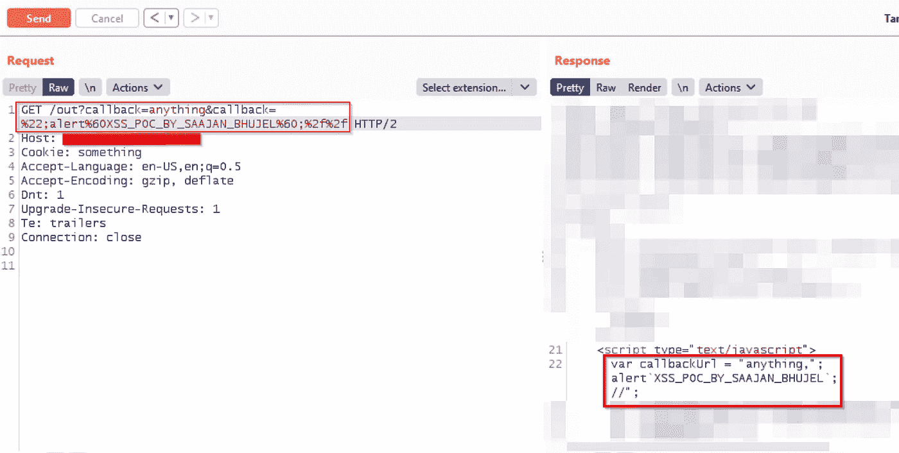
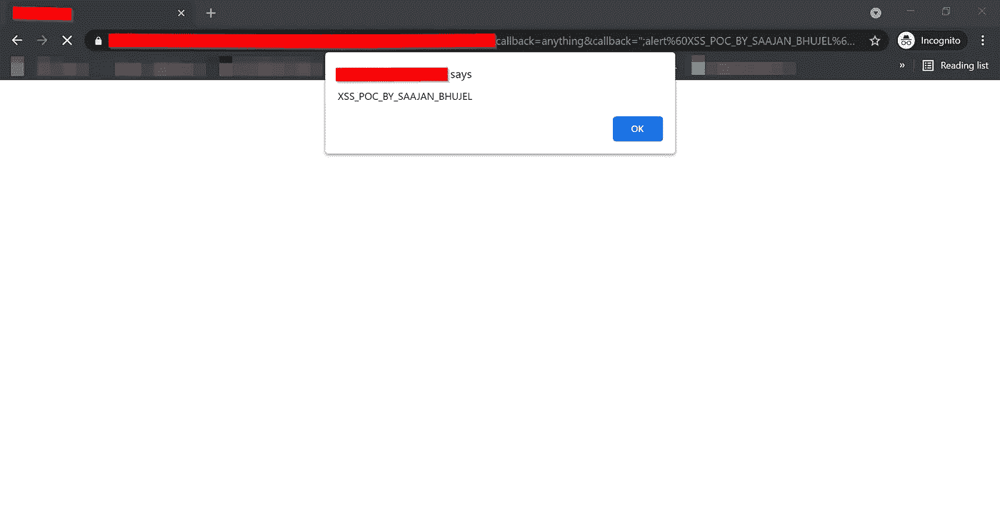

# XSS 通过参数污染

> 原文：<https://infosecwriteups.com/xss-through-parameter-pollution-9a55da150ab2?source=collection_archive---------1----------------------->

大家好，

我是 [**萨扬·布杰尔**](https://twitter.com/saajanbhujel) 。

商学学士(B.Com)的学生，我也是一名昆虫赏金猎人。

这是我的第二篇博客，如果你发现任何拼写错误，请耐心等待几分钟。而且，我也在 **VDP 项目**中发现了这个漏洞。但是在开始这篇博客之前，我想提供一些关于跨站脚本(XSS)和 HTTP 参数污染(HPP)的基本信息。

## 什么是跨站点脚本(XSS)？

跨站点脚本(也称为 XSS)是一个 web 安全漏洞，使得攻击者能够向易受攻击的 web 应用程序中注入恶意代码。

**XSS 攻击主要有三种类型。这些是:**

*   [**反映了 XSS**](https://portswigger.net/web-security/cross-site-scripting#reflected-cross-site-scripting) **:** 恶意脚本来自当前的 HTTP 请求。
*   [**存储的 XSS**](https://portswigger.net/web-security/cross-site-scripting#stored-cross-site-scripting) **:** 恶意脚本来自网站的数据库。
*   [**基于 DOM 的 XSS**](https://portswigger.net/web-security/cross-site-scripting#dom-based-cross-site-scripting) **:** 漏洞存在于客户端代码而非服务器端代码。

## 什么是 HTTP 参数污染(HPP)？

[**HTTP 参数污染**](https://www.acunetix.com/blog/whitepaper-http-parameter-pollution/) 顾名思义，污染 web 应用的 HTTP 参数，以执行或实现与 web 应用预期行为不同的特定恶意任务/攻击。

现在让我们开始写博客吧…

在 Hackerone 和 Bugcrowd 的项目上呆了几天之后。我在这些程序上发现了一些漏洞，比如 CSRF 和商业逻辑缺陷。但是，我所有的报告都有副本。然后，我对自己说，这次去找一些 VDP 的节目。

于是，我开始搜寻 VDP 程序中的一些 bug。经过 2-3 个小时的搜寻，我发现一个域名正在使用 URL 中的**回调**参数将用户重定向到另一个子域。

还有，我不能透露目标的名字。所以，让我们假设目标是**site.com**。这个网址看起来是这样的:

> https://site.com/out?回调=https://subdomain.site.com

而且，如果我打开上面的链接。然后，它会把我重定向到 subdomain.site.com。

所以在看到这个重定向之后，**我试图用 https://bing.com**改变回调参数的值。因为我想确认一下，网站是否在做任何形式的验证。如果该网站正在进行验证或重定向只允许 site.com 的子域，那么该网站可能不容易被打开重定向。而且，如果网站没有进行任何形式的验证，那么该网站就是易受攻击的。

并且，在更改回调参数的值之后。现在，网址是这样的:

> https://site.com/out?callback=https://bing.com

回调参数的值反映在响应中

而且，如果我打开上面的链接。然后，它还会把我重定向到 bing.com。这意味着网站没有进行任何形式的验证，容易被打开重定向。但是，在看到它在博客上的回应后。我想，**也许这也容易受到跨站脚本**的攻击，因为回调参数的值也反映到了响应中。

所以首先，我试图破解代码，因为值反映在**脚本**标签中。对于，break 变量 callbackUrl，我简单的放**any thing % 22；**在**中**回调参数。但是，在发送这个请求后，我得到了一个阻止我的请求的错误。此外，对于其他一些值[如 **'** 、 **"** ]，我也得到同样的错误。

阻止我的请求的错误

**现在，我只有两个选择:**

*   第一种选择是将此问题报告为开放重定向。
*   第二个选择是找到一个获得 XSS 的旁路。

然后，我记得几周前，我在 [**HTTP 参数污染**](https://www.youtube.com/watch?v=QVZBl8yxVX0) 上看了 [**Pwnfunction**](https://www.youtube.com/channel/UCW6MNdOsqv2E9AjQkv9we7A/videos) 的视频。所以，我选择的第二个方案是找到一个获得 XSS 的旁路。此外，我还在 URL 中添加了一个回调参数，用于进行**参数污染攻击**。现在，网址是这样的:

> https://site.com/out?回调=任何东西&回调=随机

两个回调参数的响应

我注意到如果我在 URL 中添加两个相同的参数。然后，我将得到响应中两个参数的值，用逗号分隔。

而且，你也知道，当我使用这些值[如 **'** ， **"** ]时，我得到了一个错误，阻止了我的请求。但是现在，我有两个相同的参数。

因此，我再次尝试中断变量 callbackUrl。但是这一次，我把**% 22；中的东西%2f%2f** 第二个回调参数。添加值后，现在 URL 是这样的:

> https://site.com/out?callback = any & callback = % 22；一些东西%2f%2f

能够中断 callbackUrl 变量

而且，它的工作，我能够打破代码或绕过过滤器。**表示网站没有对第二个回调参数进行任何验证。**

现在这一次，为了得到一个 XSS 警报，我把**% 22；警报% 281% 29；第二个回调参数中的% 2f % 2f**中的**。现在，网址是这样的:**

> https://site.com/out?callback = any & callback = % 22；警报% 281% 29；%2f%2f

再次收到阻塞请求

网站再次阻止了我使用括号的请求。所以，我把括号换成了 URL 编码或者 **` `** 。但是，我还是会出错。因为网站还在对所有参数做一些验证。

然后，我再次使用带有 URL 编码的**`**。最后，我成功绕过了过滤器。最后的 URL 是这样的:

> https://site.com/out?callback = any & callback = % 22；alert % 60 XSS _ POC _ BY _ SAAJAN _ BHUJEL % 60；%2f%2f

绕过过滤器

获得 XSS 警报

现在，我成功地绕过滤波器，通过参数污染执行 XSS。在我的例子中，我能够通过参数污染攻击绕过一些值的过滤器[如 **'** 、 **"** ]。

提示:- 如果你发现你的目标正在对参数进行某种验证检查。然后，尝试添加一个或多个相同的参数。要查看网站响应的任何变化，也许您可以绕过验证检查。

谢谢你阅读这篇博客，我希望你能学到一些东西。

祝你愉快！….

